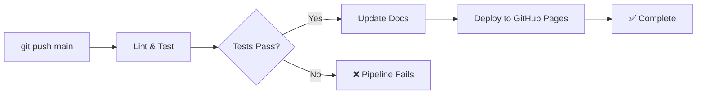

# CI/CD Pipeline Quick Start

## ✅ Pipeline Deployed Successfully

The GitHub Actions CI/CD pipeline has been deployed to this repository. Every commit to `main` now triggers automated testing, documentation updates, and deployment.

## 🚀 What Happens on Each Commit



### Stage 1: Lint & Test (~2 min)
- ✅ Ruff linting (code quality)
- ✅ Python syntax validation
- ✅ Run all examples
- ✅ Validate markdown links

### Stage 2: Update Documentation (~1 min)
- 📊 Calculate repository statistics
- 📝 Update AGENTMAP.md footer
- 🔖 Add CI badge to README.md
- 💾 Auto-commit changes with `[skip ci]`

### Stage 3: Deploy (~2 min)
- 📦 Build static site with MkDocs
- 🚀 Deploy to GitHub Pages
- 🌐 Available at `https://pristley.github.io/ai-architecture-blueprints`

### Stage 4: Notify (<1 min)
- 📋 Generate deployment summary
- ✅ Report pipeline status

## 📊 Monitoring Your Pipeline

### View Pipeline Runs
1. Go to your repository on GitHub
2. Click the **Actions** tab
3. See all workflow runs with status indicators

### Check Latest Run
```bash
# View recent workflow runs
gh run list --limit 5

# Watch the latest run in real-time
gh run watch
```

### Pipeline Status Badge
Added to README.md:
```markdown

```

## 🛠️ Common Operations

### Manual Trigger
Trigger pipeline without pushing code:
```bash
gh workflow run ci-cd.yml
```

Or via GitHub UI: **Actions** → **AI Architecture Blueprints CI/CD** → **Run workflow**

### Skip Pipeline
Push without triggering pipeline:
```bash
git commit -m "docs: Fix typo [skip ci]"
git push
```

### Test Locally
Before pushing, test pipeline components:
```bash
# Lint
pip install ruff
ruff check . --select E,F,W,C,N --ignore E501

# Run examples
python examples_1_2.py
python examples_1_3.py  
python examples_1_4.py

# Update docs
python .github/scripts/update_docs.py

# Build site
pip install mkdocs mkdocs-material
mkdocs serve  # View at http://localhost:8000
```

## 📝 Auto-Documentation Updates

The pipeline automatically updates these files on every commit:

### AGENTMAP.md Footer
```markdown
**Repository Statistics** (auto-generated)

- 📄 Documentation: 4,448 lines across 5 files
- 💻 Examples: 3,777 lines across 3 files
- 📊 Total: 8,225 lines
- 🕒 Last updated: 2026-06-24 04:48 UTC
```

### README.md
- CI/CD status badge below title
- Last updated timestamp in footer

## 🌐 GitHub Pages Setup

Your documentation site will be available at:
**https://pristley.github.io/ai-architecture-blueprints**

If not working, enable GitHub Pages:
1. Go to **Settings** → **Pages**
2. Source: **Deploy from branch**
3. Branch: **gh-pages** / (root)
4. Click **Save**

Wait 2-3 minutes for the first deployment to complete.

## 🔍 Troubleshooting

### Pipeline Fails on First Run
**Symptom**: "Update docs" job fails with permission error  
**Fix**: 
1. Go to **Settings** → **Actions** → **General**
2. Workflow permissions: Select **Read and write permissions**
3. Click **Save**
4. Re-run workflow

### Examples Fail with API Key Error
**Expected Behavior**: Examples gracefully skip tests requiring `OPENAI_API_KEY`  
**No Action Needed**: This is normal for public CI without API keys

### Deployment Not Visible
**Check**:
1. Pipeline completed successfully (green checkmark)
2. GitHub Pages enabled (see above)
3. Wait 2-3 minutes for DNS propagation
4. Check `gh-pages` branch exists

### Infinite Loop (Pipeline Keeps Triggering)
**Cause**: Missing `[skip ci]` in auto-commit message  
**Status**: ✅ Already handled in workflow (line 61 of ci-cd.yml)

## 📖 Full Documentation

See [.github/PIPELINE.md](.github/PIPELINE.md) for complete pipeline documentation.

## 🎯 Next Steps

1. ✅ **Pipeline is now active** - push any commit to trigger it
2. 🌐 **Enable GitHub Pages** if you want the public documentation site
3. 📊 **Monitor first run** - check Actions tab after 5 minutes
4. 🎨 **Customize** - edit `.github/workflows/ci-cd.yml` for your needs
5. 🔔 **Add notifications** - integrate Slack/Discord webhooks

## 💡 Pro Tips

- The pipeline runs on **every push to main** (including merges)
- Pull requests run **lint and test only** (no deployment)
- Use `[skip ci]` for documentation-only changes
- Check pipeline status before merging PRs
- Review auto-generated documentation stats weekly
- The static site updates automatically with each commit

---

**Pipeline Deployed**: 2026-06-24  
**Commit**: c8e1453  
**Status**: ✅ Active and running
