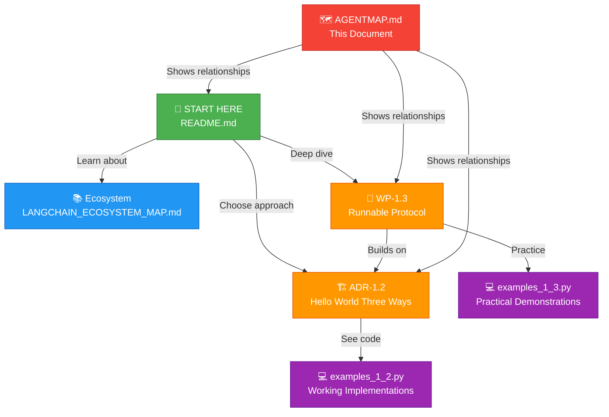

# 🗺️ AI Architecture Blueprints - Agent Map

**Complete Knowledge Graph of the Learning Material**

This document visualizes how all work products, ADRs, and examples are connected and organized.

---

## 📊 Work Product Hierarchy



---

## 📚 Document Overview

### Core Documents

| Document | Type | Purpose | Lines | Status |
|----------|------|---------|-------|--------|
| [README.md](README.md) | 📖 Guide | Project overview and navigation | ~800 | ✅ |
| [LANGCHAIN_ECOSYSTEM_MAP.md](LANGCHAIN_ECOSYSTEM_MAP.md) | 📚 Reference | Complete LangChain stack documentation | ~1200 | ✅ |
| [ADR-1.2-Hello-World-Three-Ways.md](ADR-1.2-Hello-World-Three-Ways.md) | 🏗️ Architecture Decision | Chain abstraction comparison and decision flow | ~500 | ✅ |
| [WP-1.3-The-Runnable-Protocol.md](WP-1.3-The-Runnable-Protocol.md) | 🔬 Deep Dive | Runnable protocol explained in 12 parts | ~1100 | ✅ |

### Code Examples

| Document | Type | Purpose | Lines | Status |
|----------|------|---------|-------|--------|
| [examples_1_2.py](examples_1_2.py) | 💻 Code | 3 chain approaches with advanced patterns | ~900 | ✅ |
| [examples_1_3.py](examples_1_3.py) | 💻 Code | 6 Runnable protocol examples with deep comments | ~1500 | ✅ |

### Meta Documents

| Document | Type | Purpose |
|----------|------|---------|
| [AGENTMAP.md](AGENTMAP.md) | 🗺️ Map | This file - shows relationships and navigation |

---

## 🔗 Document Relationships

### ADR-1.2 Relationships

```
ADR-1.2: "Hello World" Three Ways
│
├─→ Depends on
│   └─ LANGCHAIN_ECOSYSTEM_MAP.md (context about LangChain components)
│
├─→ References
│   └─ README.md (overview)
│
├─→ Provides code examples to
│   └─ examples_1_2.py
│
└─→ Foundation for
    └─ WP-1.3 (teaches what approaches exist, WP-1.3 explains how they work)
```

### WP-1.3 Relationships

```
WP-1.3: The Runnable Protocol
│
├─→ Depends on
│   ├─ ADR-1.2 (understanding which approach to use)
│   └─ LANGCHAIN_ECOSYSTEM_MAP.md (context about components)
│
├─→ References
│   └─ README.md (overview)
│
├─→ Provides code examples to
│   └─ examples_1_3.py
│
└─→ Explains
    └─ How RunnableSequence (from ADR-1.2) actually works
```

### Examples Relationships

```
examples_1_2.py: Implementations of Three Approaches
├─→ Demonstrates
│   ├─ Direct LLM Call (Approach 1)
│   ├─ SimpleSequentialChain (Approach 2)
│   └─ RunnableSequence + LCEL (Approach 3)
│
└─→ Shows patterns like
    ├─ Streaming
    ├─ Batching
    ├─ Callbacks
    └─ Composition

examples_1_3.py: Runnable Protocol Deep Dive
├─→ Demonstrates
│   ├─ invoke() - Synchronous single
│   ├─ batch() - Parallel multiple
│   ├─ stream() - Incremental output
│   ├─ ainvoke() - Asynchronous single
│   ├─ Custom Runnables
│   ├─ DAG Composition
│   ├─ Execution Tracing
│   ├─ Conditional Routing
│   └─ Performance Optimization
│
└─→ Complements
    └─ WP-1.3-The-Runnable-Protocol.md (theory + practice)
```

---

## 🎓 Learning Paths

### Path 1: "Just Show Me What to Do" (2 hours)

```
1. README.md (15 min)
   ↓
2. ADR-1.2-Hello-World-Three-Ways.md (30 min)
   ↓
3. examples_1_2.py (30 min)
   ↓
4. Quick reference and build
```

**Outcome**: Know which chain abstraction to use in production

---

### Path 2: "I Want to Understand" (6 hours)

```
1. README.md (15 min)
   ↓
2. LANGCHAIN_ECOSYSTEM_MAP.md (45 min)
   ↓
3. ADR-1.2-Hello-World-Three-Ways.md (30 min)
   ↓
4. examples_1_2.py (30 min)
   ↓
5. WP-1.3-The-Runnable-Protocol.md (2 hours)
   ↓
6. examples_1_3.py (1 hour)
   ↓
7. Build own custom Runnable (30 min)
```

**Outcome**: Deep understanding of LangChain's core architecture

---

### Path 3: "Production Systems" (4 hours)

```
1. README.md (15 min)
   ↓
2. ADR-1.2 (Quick skim for decision - 15 min)
   ↓
3. LANGCHAIN_ECOSYSTEM_MAP.md (Focus on deployment - 30 min)
   ↓
4. examples_1_2.py (Focus on streaming, batching, callbacks - 1 hour)
   ↓
5. WP-1.3-The-Runnable-Protocol.md (Focus on performance - 1 hour)
   ↓
6. examples_1_3.py (Focus on Example 6: batch performance - 30 min)
   ↓
7. Design and build production system
```

**Outcome**: Ready to build production-grade LLM systems

---

## 📖 Content Map

### Conceptual Layers

```
Layer 1: Foundation (What is LangChain?)
├─ README.md
└─ LANGCHAIN_ECOSYSTEM_MAP.md

Layer 2: Decision (Which pattern to use?)
├─ ADR-1.2-Hello-World-Three-Ways.md
└─ examples_1_2.py

Layer 3: Understanding (How does it work?)
├─ WP-1.3-The-Runnable-Protocol.md
└─ examples_1_3.py

Layer 4: Navigation (How is it all connected?)
└─ AGENTMAP.md (you are here)
```

---

## 🎯 Key Concepts Roadmap

```
                          LANGCHAIN ECOSYSTEM
                                 ↓
                    ┌────────────┴────────────┐
                    ↓                         ↓
            LANGCHAIN-CORE              LANGCHAIN-COMMUNITY
            (Runnables, etc)            (Integrations)
                    ↓                         ↓
            ADR-1.2 DECISION         Chain Selection
            (Which pattern?)              ↓
                    ↓              examples_1_2.py
              3 Approaches         (See them work)
                    ↓
            WP-1.3 DEEP DIVE
            (How they work)
                    ↓
            examples_1_3.py
            (Runnable protocol)
                    ↓
            PRODUCTION PATTERNS
            (Real-world systems)
```

---

## 🔍 Cross-Reference Matrix

### Which document answers...?

| Question | Document | Section |
|----------|----------|---------|
| What is LangChain? | README.md | Core Principles |
| What components exist? | LANGCHAIN_ECOSYSTEM_MAP.md | Complete section |
| Which chain to use? | ADR-1.2 | Decision flow |
| How to implement chains? | examples_1_2.py | All functions |
| What is Runnable protocol? | WP-1.3 | Part 1 |
| When to use invoke/batch/stream/ainvoke? | WP-1.3 + examples_1_3.py | Parts 2 + Example 1 |
| How to build custom Runnable? | WP-1.3 + examples_1_3.py | Part 5 + Example 2 |
| How to compose Runnables? | WP-1.3 + examples_1_3.py | Part 3 + Example 3 |
| How to trace execution? | examples_1_3.py | Example 4 |
| How to route conditionally? | examples_1_3.py | Example 5 |
| Why is batch() important? | examples_1_3.py | Example 6 |
| How to deploy? | LANGCHAIN_ECOSYSTEM_MAP.md | LangServe section |

---

## 📊 Content Density Matrix

```
Conceptual Difficulty vs Code Complexity

                              HIGH CODE
                              DENSITY
                                ↑
                                │
                    examples_1_2.py │ examples_1_3.py
                                │
                 LANGCHAIN_ECOSYSTEM_MAP │
                                │
                         ADR-1.2 │
                                │
                         README  │ WP-1.3
                                │
                    ← LOW ────────┴────── HIGH →
                         CONCEPTUAL
                         DIFFICULTY
```

---

## 🚀 Quick Navigation by Use Case

### "I'm building a chatbot"
1. Start: [README.md](README.md)
2. Understand pattern: [ADR-1.2](ADR-1.2-Hello-World-Three-Ways.md)
3. See examples: [examples_1_2.py](examples_1_2.py)
4. Streaming: [WP-1.3 Part 2](WP-1.3-The-Runnable-Protocol.md#part-2-the-four-execution-modes)
5. Tracing: [examples_1_3.py Example 4](examples_1_3.py)

### "I'm building a data pipeline"
1. Start: [README.md](README.md)
2. Choose pattern: [ADR-1.2](ADR-1.2-Hello-World-Three-Ways.md)
3. Performance: [examples_1_3.py Example 6](examples_1_3.py)
4. Batch processing: [WP-1.3 Part 2](WP-1.3-The-Runnable-Protocol.md)
5. Deploy: [LANGCHAIN_ECOSYSTEM_MAP.md](LANGCHAIN_ECOSYSTEM_MAP.md)

### "I'm building an agent system"
1. Start: [README.md](README.md)
2. Components: [LANGCHAIN_ECOSYSTEM_MAP.md](LANGCHAIN_ECOSYSTEM_MAP.md)
3. Understand Runnables: [WP-1.3](WP-1.3-The-Runnable-Protocol.md)
4. Custom components: [examples_1_3.py Example 2](examples_1_3.py)
5. Routing: [examples_1_3.py Example 5](examples_1_3.py)

### "I want to understand LangChain"
1. Ecosystem: [LANGCHAIN_ECOSYSTEM_MAP.md](LANGCHAIN_ECOSYSTEM_MAP.md)
2. Decisions: [ADR-1.2](ADR-1.2-Hello-World-Three-Ways.md)
3. Examples: [examples_1_2.py](examples_1_2.py)
4. Deep dive: [WP-1.3](WP-1.3-The-Runnable-Protocol.md)
5. Practice: [examples_1_3.py](examples_1_3.py)

---

## 📈 Progression Timeline

```
Week 1: Foundations
├─ Day 1: README.md (overview)
├─ Day 2: LANGCHAIN_ECOSYSTEM_MAP.md (components)
├─ Day 3: ADR-1.2 (patterns)
└─ Day 4: examples_1_2.py (implementations)

Week 2: Deep Understanding
├─ Day 1: WP-1.3 Parts 1-4 (protocol & execution)
├─ Day 2: WP-1.3 Parts 5-8 (implementation & patterns)
├─ Day 3: WP-1.3 Parts 9-12 (production & references)
└─ Day 4: examples_1_3.py (hands-on practice)

Week 3: Mastery
├─ Day 1: Build custom Runnable
├─ Day 2: Design composition architecture
├─ Day 3: Optimize performance (batch, streaming)
└─ Day 4: Production deployment
```

---

## 🔗 Internal Link Map

### From README.md, you can reach:
- 📖 [LANGCHAIN_ECOSYSTEM_MAP.md](LANGCHAIN_ECOSYSTEM_MAP.md) - Full stack documentation
- 📊 [ADR-1.2](ADR-1.2-Hello-World-Three-Ways.md) - Chain abstraction decision
- 💻 [examples_1_2.py](examples_1_2.py) - Working implementations
- 🔬 [WP-1.3](WP-1.3-The-Runnable-Protocol.md) - Runnable protocol deep dive
- 💻 [examples_1_3.py](examples_1_3.py) - Practical demonstrations

### From ADR-1.2, you can reach:
- 📖 [README.md](README.md) - Back to overview
- 📚 [LANGCHAIN_ECOSYSTEM_MAP.md](LANGCHAIN_ECOSYSTEM_MAP.md) - Component reference
- 💻 [examples_1_2.py](examples_1_2.py) - See approaches work
- 🔬 [WP-1.3](WP-1.3-The-Runnable-Protocol.md) - How approaches work underneath

### From WP-1.3, you can reach:
- 📖 [README.md](README.md) - Back to overview
- 🏗️ [ADR-1.2](ADR-1.2-Hello-World-Three-Ways.md) - Prerequisite knowledge
- 💻 [examples_1_3.py](examples_1_3.py) - See concepts in action
- 📚 [LANGCHAIN_ECOSYSTEM_MAP.md](LANGCHAIN_ECOSYSTEM_MAP.md) - Component details

### From examples, you can reach:
- 📖 [README.md](README.md) - Overview
- 🏗️ [ADR-1.2](ADR-1.2-Hello-World-Three-Ways.md) - Context for examples_1_2.py
- 🔬 [WP-1.3](WP-1.3-The-Runnable-Protocol.md) - Theory for examples_1_3.py

---

## 📊 Dependency Graph

```
AGENTMAP.md (shows)
    ↑
    │ references
    │
    ├─────────→ README.md (entry point)
    │               ↓
    │               ├─→ LANGCHAIN_ECOSYSTEM_MAP.md
    │               ├─→ ADR-1.2
    │               └─→ WP-1.3
    │
    ├─────────→ ADR-1.2 (decision)
    │               ├─ depends on: LANGCHAIN_ECOSYSTEM_MAP.md
    │               ├─ provides examples to: examples_1_2.py
    │               └─ foundation for: WP-1.3
    │
    ├─────────→ WP-1.3 (understanding)
    │               ├─ depends on: ADR-1.2
    │               ├─ provides examples to: examples_1_3.py
    │               ├─ references: LANGCHAIN_ECOSYSTEM_MAP.md
    │               └─ explains: How everything works
    │
    ├─────────→ examples_1_2.py (code)
    │               └─ demonstrates: ADR-1.2 approaches
    │
    └─────────→ examples_1_3.py (code)
                    └─ demonstrates: WP-1.3 concepts

LANGCHAIN_ECOSYSTEM_MAP.md (reference)
    ↑
    └─ referenced by all other documents
```

---

## 🎯 Meta-Learning Guide

**This agentmap helps you:**

1. **Understand Context**: See how documents relate to each other
2. **Choose Path**: Pick learning path based on your goals
3. **Find Answers**: Quick lookup for specific topics
4. **Navigate Efficiently**: Jump to relevant sections
5. **Plan Study**: See progression and time estimates
6. **Build Systems**: Understand architecture patterns

**Use this map to:**
- 🔍 Find what you need quickly
- 📚 Plan your learning journey
- 🗺️ Understand the overall architecture
- 🎯 See connections between concepts
- 🚀 Know what to read next

---

## 📝 Document Statistics

| Document | Type | Lines | Sections | Status |
|----------|------|-------|----------|--------|
| README.md | Guide | ~800 | 10 | ✅ Complete |
| LANGCHAIN_ECOSYSTEM_MAP.md | Reference | ~1200 | 15 | ✅ Complete |
| ADR-1.2 | Decision | ~500 | 12 | ✅ Complete |
| WP-1.3 | Deep Dive | ~1100 | 12 | ✅ Complete |
| examples_1_2.py | Code | ~900 | 7 | ✅ Complete |
| examples_1_3.py | Code | ~1500 | 7 | ✅ Complete |
| AGENTMAP.md | Map | ~600 | 15 | ✅ This file |
| **TOTAL** | | **~6500** | | ✅ |

**Estimated Learning Time**: 15-20 hours for complete understanding + hands-on practice

---

## 🔄 Feedback Loop

```
Read Documentation
        ↓
Run Examples
        ↓
Try It Yourself
        ↓
Build Something Real
        ↓
Measure Performance
        ↓
Optimize & Iterate
        ↓
Share Learning
        ↓
Back to Read (deeper understanding)
```

---

## 🎓 Mastery Checklist

### Understanding
- [ ] Know what a Runnable is
- [ ] Understand invoke/batch/stream/ainvoke trade-offs
- [ ] Know how pipes create DAGs
- [ ] Can explain Runnable protocol to others

### Implementation
- [ ] Can choose correct chain abstraction
- [ ] Can build custom Runnable
- [ ] Can compose Runnables
- [ ] Can implement streaming UI
- [ ] Can optimize with batching

### Production
- [ ] Can implement error handling
- [ ] Can trace execution with callbacks
- [ ] Can deploy with LangServe
- [ ] Can monitor with LangSmith
- [ ] Can build agentic systems

---

## 📞 Quick Reference

**Need to know how to...**
- Use Runnables? → [WP-1.3 Part 1](WP-1.3-The-Runnable-Protocol.md)
- Choose chain pattern? → [ADR-1.2 Decision Flow](ADR-1.2-Hello-World-Three-Ways.md)
- Build custom component? → [examples_1_3.py Example 2](examples_1_3.py)
- Stream output? → [WP-1.3 Part 2 (stream)](WP-1.3-The-Runnable-Protocol.md) + [examples_1_3.py Example 1](examples_1_3.py)
- Batch process? → [examples_1_3.py Example 6](examples_1_3.py)
- Debug execution? → [examples_1_3.py Example 4](examples_1_3.py)
- Route conditionally? → [examples_1_3.py Example 5](examples_1_3.py)
- Deploy to production? → [LANGCHAIN_ECOSYSTEM_MAP.md LangServe](LANGCHAIN_ECOSYSTEM_MAP.md)

---

## 🌟 Pro Tips

1. **Don't read sequentially**: Use this map to jump to what you need
2. **Run examples while reading**: Code + explanation = best learning
3. **Start with use case**: Pick your use case path above
4. **Reference, don't memorize**: This is a reference, not memorization material
5. **Build as you learn**: Each section should inspire something to build
6. **Performance matters**: Example 6 (batch performance) is critical for production
7. **Observability is essential**: Callbacks and tracing are not optional
8. **Composition is powerful**: Master it and you can build anything

---

## 🚀 Next Steps

1. **Pick your learning path** above
2. **Start with the first document**
3. **Follow the links as you go**
4. **Run the examples**
5. **Build something real**
6. **Come back here if lost**

---

**Last Updated**: 2024  
**Total Documentation**: ~6,500 lines of guides, examples, and explanations  
**Estimated Mastery Time**: 15-20 hours  
**Status**: ✅ Complete and production-ready  

Happy learning! 🎓
