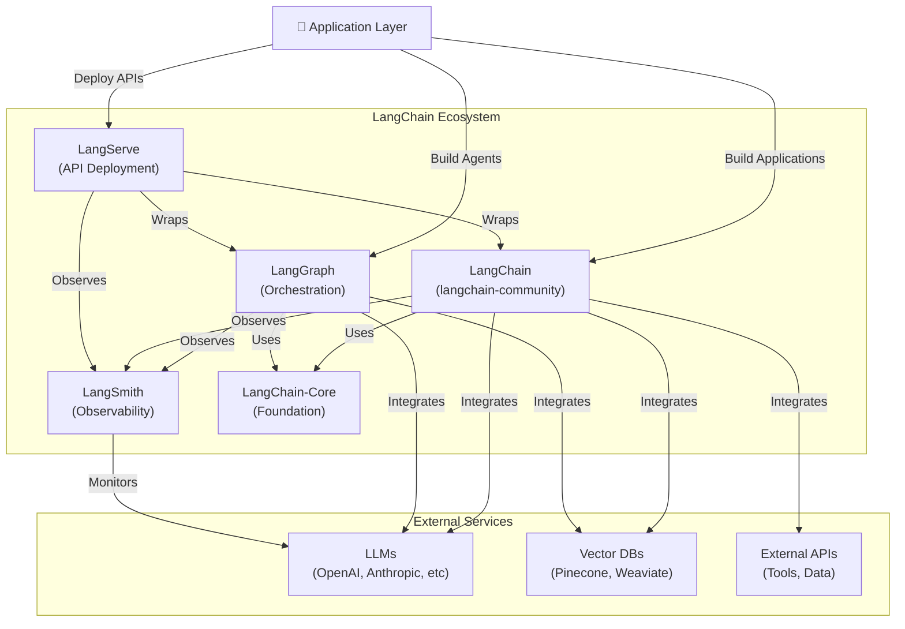
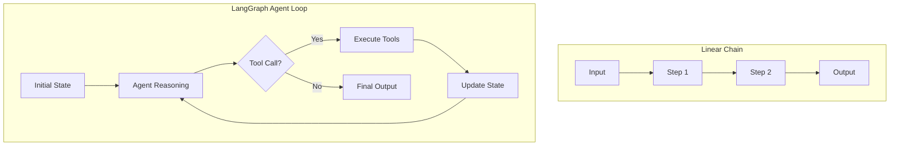
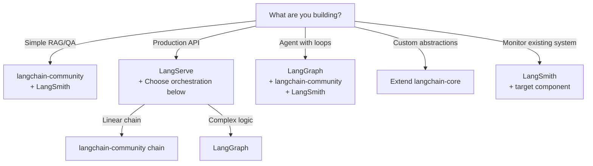

# LangChain Ecosystem Map

A comprehensive guide to the LangChain ecosystem components, their responsibilities, and integration patterns for building production-ready agentic AI systems.

---

## Ecosystem Overview



---

## Component Reference Matrix

| Component | Layer | Core Purpose | Primary Users | Key Focus |
|-----------|-------|--------------|----------------|-----------|
| **langchain-core** | Foundation | Base abstractions & interfaces | Framework developers, library builders | Simplicity, stability, minimal dependencies |
| **langchain-community** | Integration | 200+ integrations & tools | Application developers, LLM engineers | Breadth of integrations, production patterns |
| **LangGraph** | Orchestration | Stateful, cyclic agent/workflow control | AI system architects, agentic AI builders | Determinism, control flow, debugging |
| **LangServe** | Deployment | REST API generation from chains/graphs | DevOps, backend engineers, MLOps | Scalability, standardization, monitoring |
| **LangSmith** | Observability | Tracing, evaluation, monitoring | ML engineers, product teams, data scientists | Debugging, quality assurance, HITL workflows |

---

## Deep Dive: Each Component

### 1. **langchain-core** - The Foundation Layer

#### Responsibility
- Defines core abstractions: `Runnable`, `BaseLanguageModel`, `Tool`, `Embeddings`
- Minimal, stable interfaces that other components build upon
- Zero external dependencies (except core Python libraries)

#### What It Provides
```python
from langchain_core.runnables import Runnable
from langchain_core.language_models import BaseLanguageModel
from langchain_core.tools import BaseTool
from langchain_core.messages import BaseMessage, HumanMessage
from langchain_core.pydantic_v1 import BaseModel
```

#### When to Use
- Building custom language model wrappers
- Creating reusable tool abstractions
- Implementing framework extensions
- Developing internal libraries that other teams use
- When you need maximum stability with minimal breaking changes

#### Design Philosophy
- **Stability-first**: Core abstractions change infrequently
- **Composable**: Everything implements `Runnable` interface
- **Lightweight**: Intentionally minimal to serve as foundation

#### Example Use Case
```python
# Building a custom integration wrapper
from langchain_core.language_models import BaseLanguageModel
from langchain_core.callbacks import CallbackManagerLLMRun

class CustomLLM(BaseLanguageModel):
    """Your proprietary LLM wrapper"""
    def _call(self, prompt: str, **kwargs):
        # Implementation
        pass
```

---

### 2. **langchain-community** - The Integration Hub

#### Responsibility
- Provides 200+ pre-built integrations: LLMs, vector databases, tools, memory stores
- Production-ready patterns for common AI tasks
- Community-contributed and officially-supported integrations

#### What It Provides
```python
# LLMs
from langchain_community.llms import OpenAI, Anthropic, Bedrock

# Vector Stores
from langchain_community.vectorstores import Pinecone, Weaviate, FAISS

# Tools
from langchain_community.tools import DuckDuckGoSearchRun, WikipediaQueryRun

# Memory & Utilities
from langchain_community.chat_message_histories import PostgresChatMessageHistory
from langchain_community.utilities import SerpAPIWrapper
```

#### When to Use
- Building RAG (Retrieval-Augmented Generation) systems
- Integrating with external APIs and services
- Using popular LLMs and vector databases
- Implementing memory/history management
- Standard production patterns (agents, chains, reasoning)

#### Architecture Layers

```
┌─────────────────────────────────────────┐
│   Your Application (Chains, Agents)     │
├─────────────────────────────────────────┤
│   LangChain Community Integrations      │
│   ├─ LLM Wrappers                       │
│   ├─ Vector Store Connectors            │
│   ├─ Tool Implementations                │
│   └─ Utility Functions                  │
├─────────────────────────────────────────┤
│   langchain-core (Interfaces)           │
├─────────────────────────────────────────┤
│   External Services (APIs, DBs, LLMs)   │
└─────────────────────────────────────────┘
```

#### Example Use Case
```python
from langchain_community.vectorstores import Pinecone
from langchain_community.llms import OpenAI
from langchain.chains import RetrievalQA

# RAG chain
vectorstore = Pinecone.from_existing_index("docs", embedding)
llm = OpenAI(temperature=0.7)
qa_chain = RetrievalQA.from_chain_type(
    llm=llm,
    retriever=vectorstore.as_retriever(),
    chain_type="stuff"
)
```

---

### 3. **LangGraph** - The Orchestration Engine

#### Responsibility
- Builds **stateful, cyclic workflows** (unlike linear chains)
- Enables **agent loops** with deterministic, debuggable control flow
- Manages **human-in-the-loop (HITL)** decision points
- Provides **graph persistence** and state management

#### Key Concepts
- **Nodes**: Callable functions/LLMs that process state
- **Edges**: Conditional routing logic between nodes
- **State**: Shared context passed between nodes (thread-safe)
- **Cycles**: Support for feedback loops and reflective reasoning

#### What It Provides
```python
from langgraph.graph import StateGraph, END
from langgraph.checkpoint import MemorySaver, SqliteSaver

# Build agentic workflows with loops
graph = StateGraph(AgentState)
graph.add_node("agent", agent_node)
graph.add_node("tools", tool_node)
graph.add_edge("agent", "tools")
graph.add_conditional_edges(
    "tools",
    should_continue,
    {"continue": "agent", "end": END}
)
```

#### When to Use
- **Agent workflows**: Multi-turn reasoning with tool use
- **Agentic loops**: Agent → Observe → Reason → Act → Loop
- **Conditional logic**: Different paths based on intermediate results
- **HITL systems**: Pause for human approval/input
- **State persistence**: Resume interrupted workflows
- **Multi-agent systems**: Coordination between agents
- **Complex reasoning**: Reflection, planning, verification loops

#### Control Flow Patterns



#### Example Use Case
```python
from langgraph.graph import StateGraph, END
from typing import TypedDict, Annotated
import operator

class AgentState(TypedDict):
    input: str
    messages: Annotated[list, operator.add]
    next_action: str

def should_continue(state):
    return "continue" if state["next_action"] == "tool" else "end"

graph = StateGraph(AgentState)
graph.add_node("agent", agent_node)
graph.add_node("tools", tool_node)
graph.add_edge("agent", "tools")
graph.add_conditional_edges("tools", should_continue)
graph.add_edge("tools", "agent")
graph.set_entry_point("agent")
graph.set_finish_point("end")

app = graph.compile()
result = app.invoke({"input": "What's the weather?"})
```

#### Debugging & Observability
```python
# Built-in visualization
graph.get_graph().draw_mermaid_png()

# Step-by-step execution
for event in app.stream({"input": "..."}, stream_mode="updates"):
    print(event)  # See each node's output
```

---

### 4. **LangServe** - The Deployment Layer

#### Responsibility
- Converts chains/graphs into **production-grade REST APIs**
- Handles serialization, validation, streaming
- Provides async/concurrent request handling
- Enables monitoring and OpenAPI documentation

#### What It Provides
```python
from fastapi import FastAPI
from langserve import add_routes

app = FastAPI()

# Automatically exposes /invoke, /batch, /stream endpoints
add_routes(app, my_chain, path="/my-chain")
add_routes(app, my_graph, path="/my-graph")
```

#### When to Use
- **Production deployment**: Scale chains/graphs via HTTP
- **Microservice architecture**: Expose AI components as services
- **Multi-consumer access**: Multiple applications using one chain
- **Async operations**: Handle long-running computations
- **Monitoring/logging**: Built-in request/response tracking
- **Client libraries**: Auto-generated SDK support

#### Endpoint Features
Each route automatically gets:
- `/invoke`: Single synchronous call
- `/batch`: Multiple requests in one call
- `/stream`: Streaming responses (Server-Sent Events)
- `/config`: Dynamic configuration
- `/openapi.json`: Auto-generated API spec

#### Example Use Case
```python
from fastapi import FastAPI
from langserve import add_routes
from langchain.chains import LLMChain
from langchain.prompts import ChatPromptTemplate
from langchain_community.llms import OpenAI

app = FastAPI(title="AI Services")

prompt = ChatPromptTemplate.from_template("Summarize: {text}")
chain = prompt | OpenAI()

add_routes(app, chain, path="/summarize")

# Usage:
# POST /summarize/invoke {"text": "..."}
# POST /summarize/batch [{"text": "..."}, ...]
# GET /summarize/stream?text=...
```

#### Deployment Architecture
```
┌─────────────────────────────────────┐
│      Client Applications            │
├─────────────────────────────────────┤
│  LangServe (FastAPI + Pydantic)     │
│  ├─ Request Validation              │
│  ├─ Response Serialization          │
│  └─ Streaming & Async Handling      │
├─────────────────────────────────────┤
│  LangGraph / Chain Layer            │
├─────────────────────────────────────┤
│  External Services                  │
└─────────────────────────────────────┘
```

---

### 5. **LangSmith** - The Observability & Evaluation Platform

#### Responsibility
- **Tracing**: Capture every LLM call, tool execution, chain step
- **Debugging**: Inspect execution traces with full context
- **Evaluation**: Run tests and evals on chains/agents
- **Monitoring**: Track performance, latency, costs, errors
- **HITL Workflows**: Review and approve agent outputs before deployment

#### What It Provides
```python
# Automatic tracing (just set env variables)
import os
os.environ["LANGCHAIN_TRACING_V2"] = "true"
os.environ["LANGCHAIN_PROJECT"] = "my-project"

# Explicit evaluation
from langsmith import evaluate

def eval_answer_accuracy(run: Run, example: Example):
    return {"score": 0.95}

results = evaluate(
    chain.invoke,
    data=examples,
    evaluators=[eval_answer_accuracy]
)
```

#### When to Use
- **Development**: Debug chains/agents during building
- **Testing**: Automated evaluation suites
- **Production monitoring**: Track quality over time
- **Cost analysis**: Understand token usage and costs
- **Error analysis**: Identify failure patterns
- **HITL oversight**: Review agent decisions before execution
- **A/B testing**: Compare chain/model performance

#### LangSmith Dashboard Features

| Feature | Purpose | Use Case |
|---------|---------|----------|
| **Traces** | View execution history | Debug unexpected behavior |
| **Evals** | Run test suites | Quality gates before deployment |
| **Annotations** | Mark good/bad runs | Build eval datasets |
| **Datasets** | Curated examples | Benchmark performance |
| **Monitoring** | Live dashboards | Track production metrics |
| **Drafts** | Experimental changes | A/B test safely |

#### Example Use Case
```python
from langsmith import evaluate, examples
from langsmith.evaluation import EvaluatorBase

class RelevanceEvaluator(EvaluatorBase):
    def evaluate_run(self, run, example):
        # Compare run output with expected answer
        score = similarity(run.outputs["output"], example["expected"])
        return {"score": score}

# Run evaluation suite
results = evaluate(
    my_chain.invoke,
    data=examples.load_dataset("qa_examples"),
    evaluators=[RelevanceEvaluator()],
)

print(f"Average score: {results.summary()}")
```

---

## Integration Patterns

### Pattern 1: RAG System with Observability
```
LangChain (langchain-community)
├─ Vector Store Integration (Pinecone)
├─ LLM Integration (OpenAI)
└─ Observability
    └─ LangSmith (trace every retrieval & generation)
```

### Pattern 2: Agentic Workflow with Deployment
```
LangGraph (Agent Logic)
├─ State Management
├─ Tool Integration (from langchain-community)
├─ Decision Logic & Loops
└─ Deployment
    ├─ LangServe (REST API)
    └─ LangSmith (monitoring)
```

### Pattern 3: Multi-Agent Orchestration
```
LangGraph (Master Coordinator)
├─ Agent 1 (Specialized LLM)
├─ Agent 2 (Different Tool Set)
└─ LangSmith
    ├─ Trace inter-agent communication
    ├─ Evaluate coordination quality
    └─ Monitor resource usage
```

### Pattern 4: Production RAG with Human Review
```
LangGraph
├─ Retrieve from Vector Store (langchain-community)
├─ Generate Answer (langchain-community LLM)
├─ Confidence Check
├─ Human Review Node (if confidence low)
└─ LangSmith
    ├─ Trace all decisions
    ├─ Track human feedback
    └─ Retrain eval models
```

---

## Decision Matrix: Which Component?

### Building a Simple Q&A System?
→ **langchain-community** (use chain abstractions)

### Need Production-Grade API?
→ **LangServe** (wrap your chain/graph)

### Building Complex Multi-Step Agent?
→ **LangGraph** (explicit control flow) + **LangServe** (if API needed)

### Debugging Production Issues?
→ **LangSmith** (trace & evaluate)

### Building Framework Extensions?
→ **langchain-core** (define new abstractions)

### Need HITL Approval Workflows?
→ **LangGraph** (pause nodes) + **LangSmith** (review interface)

---

## Component Selection Guide



---

## Dependency Graph

```
User Application
    ↓
    ├─→ LangServe (optional, for API)
    ├─→ LangGraph (if complex workflows)
    └─→ LangChain Community
            ↓
            ├─→ Integrations (200+)
            └─→ langchain-core
                    ↓
                    External Services (LLMs, DBs, APIs)

LangSmith connects to all components (observability layer)
```

---

## Practical Architecture Examples

### Example 1: E-Commerce Recommendation Agent

```
LangGraph
├─ Node: Parse User Query
│  └─ Uses: LLM from langchain-community
├─ Node: Search Products
│  └─ Uses: Vector DB from langchain-community
├─ Node: Generate Recommendations
│  └─ Uses: LLM from langchain-community
├─ Node: Human Approval (HITL)
│  └─ Reviewed in LangSmith dashboard
└─ Deployed via LangServe
   └─ Monitored in LangSmith
```

### Example 2: Research Document Analyzer

```
LangChain + LangSmith
├─ Chain: Load PDF
├─ Chain: Split into chunks
├─ Chain: Generate embeddings
│  └─ Store in Pinecone
├─ Chain: Retrieve relevant sections
├─ Chain: Generate summary (LLM)
└─ All traced in LangSmith
   └─ Evaluate summary quality
```

### Example 3: Customer Support Escalation System

```
LangGraph + LangServe + LangSmith
├─ Initial: Classify intent (LLM)
├─ If low confidence: Add to review queue
│  └─ LangSmith: Human review interface
├─ If high confidence: Generate response
│  └─ Uses tools from langchain-community
├─ All executed via LangServe API
└─ Monitored & evaluated in LangSmith
   └─ Track resolution rate, escalation patterns
```

---

## When NOT to Use Each Component

| Component | Avoid When | Better Alternative |
|-----------|-----------|-------------------|
| **langchain-core** | You just want integrations | Use langchain-community |
| **langchain-community** | You need complete control | Write custom wrappers |
| **LangGraph** | Simple linear chains | Use langchain-community chains |
| **LangServe** | You need custom API logic | Use FastAPI directly, wrap manually |
| **LangSmith** | You have custom observability | Use existing system, optional integration |

---

## Migration Path: Adding Components Over Time

### Phase 1: Prototype
```python
# Just use langchain-community
from langchain.chains import LLMChain
```

### Phase 2: Production
```python
# Add LangSmith for visibility
import os
os.environ["LANGCHAIN_TRACING_V2"] = "true"
```

### Phase 3: Complexity
```python
# Add LangGraph for control flow
from langgraph.graph import StateGraph
```

### Phase 4: Scale
```python
# Add LangServe for API
from langserve import add_routes
```

---

## Resource Links & Documentation

- **langchain-core**: [python.langchain.com/docs/langchain_core](https://python.langchain.com/docs/langchain_core)
- **langchain-community**: [python.langchain.com/docs/integrations](https://python.langchain.com/docs/integrations)
- **LangGraph**: [langchain-ai.github.io/langgraph](https://langchain-ai.github.io/langgraph)
- **LangServe**: [python.langchain.com/docs/langserve](https://python.langchain.com/docs/langserve)
- **LangSmith**: [smith.langchain.com](https://smith.langchain.com)

---

## Key Takeaways

1. **Layered Architecture**: Each component serves a distinct purpose and layer
2. **Start Simple**: Begin with langchain-community, add complexity as needed
3. **Observability First**: Always think about monitoring (LangSmith) early
4. **Explicit Control**: Use LangGraph for complex workflows requiring human oversight
5. **Scale with LangServe**: Once production-ready, expose via REST API
6. **Foundation Stability**: langchain-core enables ecosystem extensibility
