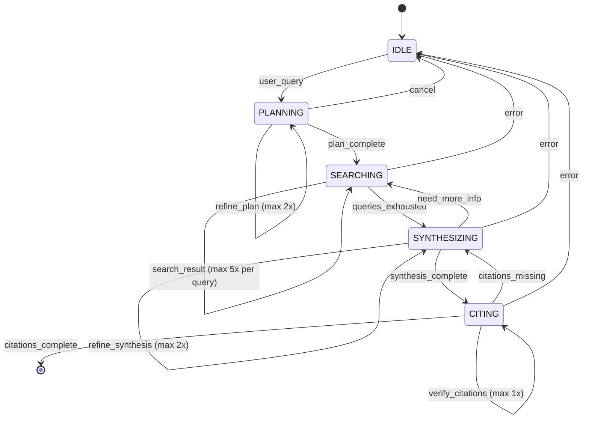

# WP-2.2: State Management in a Single-Agent Loop

## Executive Summary

**The Problem**: When you build an agent that loops (e.g., a research assistant that plans → searches → synthesizes → cites), you need to:
1. Track what phase the agent is in
2. Manage context that changes with each tool call
3. Prevent infinite loops without crushing legitimate reasoning loops

**The Solution**: A **state machine** with:
- Explicit state objects (defined as TypedDict or Pydantic models)
- Typed transitions between states
- Loop detection that tracks visited states + action counts
- Clear semantics for what each state means

**Why This Matters**: 
- Agents without state are chaotic (you don't know what's happening)
- Unmanaged loops waste tokens and hit rate limits
- State makes debugging possible (print state at each step, replay from checkpoints)
- State enables observability (metrics by phase, failure analysis by state)

---

## Part 1: The Problem - Why Agents Need State

### The Chaos Problem

```python
# Without state: What's the agent doing?
def research_agent(query: str):
    for i in range(10):  # Hope this doesn't infinite loop
        result = llm.invoke(f"Research query: {query}")
        if "answer:" in result.lower():
            return result
        # Is it planning? Searching? Lost? No idea.
```

**What could go wrong:**
- ✗ Agent keeps re-planning instead of searching
- ✗ Agent searches the same thing 3 times
- ✗ Agent never reaches synthesis/citation phase
- ✗ No visibility into where the loop happened
- ✗ Same expensive search runs in iteration 1, 2, and 9

### The State Solution

```python
# With explicit state
@dataclass
class ResearchState:
    query: str
    state: Literal["IDLE", "PLANNING", "SEARCHING", "SYNTHESIZING", "CITING"]
    plan: list[str] = field(default_factory=list)
    search_results: dict[str, str] = field(default_factory=dict)
    synthesis: str = ""
    citations: list[dict] = field(default_factory=list)
    step_count: int = 0
    visited_states: list[str] = field(default_factory=list)
    
    def is_infinite_loop(self) -> bool:
        """Detect if we're looping infinitely."""
        # Same state 3+ times in a row = infinite loop
        recent = self.visited_states[-3:]
        return len(recent) == 3 and len(set(recent)) == 1

state = ResearchState(query="What is quantum computing?")
# Now you know exactly where the agent is at each step
```

---

## Part 2: State Machine Architecture

### State Diagram



**Key insights:**
- Each state has specific transition rules (not "go anywhere")
- Self-loops are allowed but limited (e.g., SEARCHING → SEARCHING max 5x)
- Backward transitions exist (CITING → SYNTHESIZING if citations missing)
- Error states reset to IDLE

---

## Part 3: State Object Design

### Option 1: Pydantic Model (Recommended)

```python
from pydantic import BaseModel, Field
from typing import Literal
from datetime import datetime

class ResearchState(BaseModel):
    """Core state object for research assistant agent."""
    
    # Identity
    session_id: str
    query: str
    
    # Current phase
    state: Literal["IDLE", "PLANNING", "SEARCHING", "SYNTHESIZING", "CITING"]
    
    # Phase-specific data (evolve as you progress)
    plan: list[str] = Field(default_factory=list)
    search_queries: list[str] = Field(default_factory=list)
    search_results: dict[str, list[str]] = Field(default_factory=dict)  # query -> [results]
    synthesis: str = ""
    citations: list[dict] = Field(
        default_factory=list,
        description="List of {source, quote, relevance}"
    )
    
    # Loop control
    step_count: int = 0
    state_history: list[str] = Field(default_factory=list)
    search_count_by_query: dict[str, int] = Field(default_factory=dict)
    
    # Execution tracking
    created_at: datetime = Field(default_factory=datetime.utcnow)
    last_action: str = ""
    
    # Limits
    MAX_STEPS = 20
    MAX_SAME_STATE_REPEATS = 3
    MAX_SEARCHES_PER_QUERY = 5
    
    def can_transition(self, target_state: str) -> bool:
        """Check if transition is valid."""
        valid_transitions = {
            "IDLE": ["PLANNING"],
            "PLANNING": ["PLANNING", "SEARCHING", "IDLE"],
            "SEARCHING": ["SEARCHING", "SYNTHESIZING", "IDLE"],
            "SYNTHESIZING": ["SYNTHESIZING", "CITING", "SEARCHING", "IDLE"],
            "CITING": ["CITING", "SYNTHESIZING", "IDLE"],
        }
        return target_state in valid_transitions.get(self.state, [])
    
    def is_in_infinite_loop(self) -> tuple[bool, str]:
        """Detect infinite loops."""
        # Check 1: Step limit exceeded
        if self.step_count > self.MAX_STEPS:
            return True, f"Step limit {self.MAX_STEPS} exceeded"
        
        # Check 2: Same state repeated too many times
        if len(self.state_history) >= self.MAX_SAME_STATE_REPEATS:
            recent = self.state_history[-self.MAX_SAME_STATE_REPEATS:]
            if len(set(recent)) == 1:
                return True, f"State {recent[0]} repeated {self.MAX_SAME_STATE_REPEATS}x"
        
        # Check 3: Searching the same query too many times
        for query, count in self.search_count_by_query.items():
            if count > self.MAX_SEARCHES_PER_QUERY:
                return True, f"Query '{query}' searched {count}x (max {self.MAX_SEARCHES_PER_QUERY})"
        
        return False, ""
    
    def record_action(self, target_state: str, action: str) -> bool:
        """Record state transition. Returns False if transition invalid or would loop."""
        # Validate transition
        if not self.can_transition(target_state):
            return False
        
        # Check for loops
        in_loop, reason = self.is_in_infinite_loop()
        if in_loop:
            print(f"❌ Loop detected: {reason}")
            return False
        
        # Record the transition
        self.state_history.append(self.state)
        self.state = target_state
        self.step_count += 1
        self.last_action = action
        
        return True
```

### Option 2: TypedDict (Simpler, but no validation)

```python
from typing import TypedDict, Literal

class ResearchState(TypedDict):
    session_id: str
    query: str
    state: Literal["IDLE", "PLANNING", "SEARCHING", "SYNTHESIZING", "CITING"]
    plan: list[str]
    search_results: dict[str, list[str]]
    synthesis: str
    citations: list[dict]
    step_count: int
    state_history: list[str]
```

**When to use each:**
- **Pydantic**: Production systems, validation, observability, serialization
- **TypedDict**: Rapid prototyping, LangGraph integration

---

## Part 4: State Transitions with Tool Calls

### Pattern: Tool → State Update → Next Tool

```python
class ResearchAssistant:
    def __init__(self, llm, state: ResearchState):
        self.llm = llm
        self.state = state
    
    # Tool 1: Create plan from query
    def plan_tool(self) -> dict:
        """Generate research plan."""
        if self.state.state != "IDLE":
            return {"error": "Can only plan from IDLE state"}
        
        response = self.llm.invoke(
            f"Create a 3-step research plan for: {self.state.query}"
        )
        self.state.plan = response.split("\n")
        
        # Transition
        self.state.record_action("PLANNING", "created_plan")
        return {"plan": self.state.plan}
    
    # Tool 2: Execute searches
    def search_tool(self, query: str) -> dict:
        """Search for information."""
        if self.state.state != "PLANNING" and self.state.state != "SEARCHING":
            return {"error": f"Cannot search from {self.state.state} state"}
        
        # Track search count
        self.state.search_count_by_query[query] = (
            self.state.search_count_by_query.get(query, 0) + 1
        )
        
        # Execute search (mock)
        results = self._mock_search(query)
        self.state.search_results[query] = results
        
        # Transition
        self.state.record_action("SEARCHING", f"searched: {query}")
        return {"results": results}
    
    # Tool 3: Synthesize findings
    def synthesize_tool(self) -> dict:
        """Combine search results into answer."""
        if self.state.state != "SEARCHING":
            return {"error": "Can only synthesize from SEARCHING state"}
        
        synthesis_prompt = f"""
        Based on these search results:
        {json.dumps(self.state.search_results, indent=2)}
        
        Synthesize a comprehensive answer to: {self.state.query}
        """
        
        self.state.synthesis = self.llm.invoke(synthesis_prompt)
        self.state.record_action("SYNTHESIZING", "synthesis_complete")
        return {"synthesis": self.state.synthesis}
    
    # Tool 4: Add citations
    def cite_tool(self) -> dict:
        """Add citations to synthesis."""
        if self.state.state != "SYNTHESIZING":
            return {"error": "Can only cite from SYNTHESIZING state"}
        
        citation_prompt = f"""
        For this synthesis: {self.state.synthesis}
        
        Using these sources: {json.dumps(self.state.search_results)}
        
        Generate proper citations with [source: url] format.
        """
        
        cited_text = self.llm.invoke(citation_prompt)
        self.state.citations = self._extract_citations(cited_text)
        self.state.record_action("CITING", "citations_added")
        return {"cited_response": cited_text}
    
    def _mock_search(self, query: str) -> list[str]:
        return [f"Result {i} for '{query}'" for i in range(3)]
    
    def _extract_citations(self, text: str) -> list[dict]:
        return [{"text": line} for line in text.split("\n") if "[source:" in line]
```

---

## Part 5: Infinite Loop Prevention

### Strategy 1: State History Tracking

```python
def detect_loop_same_state(state: ResearchState) -> bool:
    """Detect if stuck in one state."""
    if len(state.state_history) < 3:
        return False
    recent = state.state_history[-3:]
    return len(set(recent)) == 1  # All 3 are the same state
```

### Strategy 2: Step Budgets

```python
def enforce_step_limit(state: ResearchState, max_steps: int = 20) -> bool:
    """Fail fast if too many steps."""
    if state.step_count >= max_steps:
        print(f"❌ Exceeded {max_steps} steps. Stopping.")
        return False
    return True
```

### Strategy 3: Action-Specific Limits

```python
def enforce_search_limit(state: ResearchState, query: str, max: int = 5) -> bool:
    """Prevent searching the same thing repeatedly."""
    count = state.search_count_by_query.get(query, 0)
    if count >= max:
        print(f"❌ Already searched '{query}' {count}x (max {max})")
        return False
    return True
```

### Strategy 4: State Transition History Pattern

```python
def detect_loop_pattern(state: ResearchState) -> bool:
    """Detect repeating transition patterns (e.g., A→B→A→B→A)."""
    if len(state.state_history) < 4:
        return False
    
    recent = state.state_history[-4:]
    # Check for alternating pattern
    if recent[0] == recent[2] == recent[4] if len(recent) > 4 else False:
        return True
    
    return False
```

### The Complete Loop Guard

```python
class LoopGuard:
    """Comprehensive loop detection."""
    
    def __init__(self, state: ResearchState):
        self.state = state
        self.checks = [
            self.check_step_limit,
            self.check_same_state_repeat,
            self.check_search_repeats,
            self.check_state_patterns,
        ]
    
    def check_step_limit(self) -> tuple[bool, str]:
        if self.state.step_count > self.state.MAX_STEPS:
            return True, f"Step limit {self.state.MAX_STEPS} exceeded (at {self.state.step_count})"
        return False, ""
    
    def check_same_state_repeat(self) -> tuple[bool, str]:
        if len(self.state.state_history) >= 3:
            recent = self.state.state_history[-3:]
            if len(set(recent)) == 1:
                return True, f"State '{recent[0]}' repeated 3x"
        return False, ""
    
    def check_search_repeats(self) -> tuple[bool, str]:
        for query, count in self.state.search_count_by_query.items():
            if count > self.state.MAX_SEARCHES_PER_QUERY:
                return True, f"Query '{query}' searched {count}x (max {self.state.MAX_SEARCHES_PER_QUERY})"
        return False, ""
    
    def check_state_patterns(self) -> tuple[bool, str]:
        """Detect alternating patterns like A→B→A→B."""
        if len(self.state.state_history) >= 4:
            recent = self.state.state_history[-4:]
            if recent[0] == recent[2] and recent[1] == recent[3]:
                return True, f"Alternating pattern detected: {recent[0]}→{recent[1]}→..."
        return False, ""
    
    def is_looping(self) -> tuple[bool, str]:
        """Run all checks, return first failure."""
        for check in self.checks:
            is_loop, reason = check()
            if is_loop:
                return True, reason
        return False, ""
```

---

## Part 6: The Main Loop

### Loop with State Management

```python
def research_agent_with_state(query: str, llm) -> dict:
    """Main agent loop with state management."""
    
    # Initialize state
    state = ResearchState(
        session_id=str(uuid.uuid4()),
        query=query,
        state="IDLE"
    )
    
    # Initialize assistant and guard
    assistant = ResearchAssistant(llm, state)
    guard = LoopGuard(state)
    
    # Main loop
    while state.step_count < state.MAX_STEPS:
        # Check for loops
        in_loop, reason = guard.is_looping()
        if in_loop:
            print(f"❌ Loop detected: {reason}")
            state.state = "IDLE"
            break
        
        # State machine: Execute action based on current state
        if state.state == "IDLE":
            print(f"📍 State: IDLE → PLANNING")
            result = assistant.plan_tool()
            if "error" in result:
                print(f"❌ {result['error']}")
                break
        
        elif state.state == "PLANNING":
            print(f"📍 State: PLANNING → SEARCHING")
            # Take first unexecuted plan item
            for step in state.plan:
                if step not in state.search_results:
                    result = assistant.search_tool(step)
                    break
            else:
                # All plan items searched, move to synthesis
                state.record_action("SEARCHING", "all_plans_searched")
        
        elif state.state == "SEARCHING":
            if len(state.search_results) >= len(state.plan):
                print(f"📍 State: SEARCHING → SYNTHESIZING")
                state.record_action("SYNTHESIZING", "enough_results")
            else:
                print(f"📍 State: SEARCHING (searching more)")
                # Continue searching
                missing = [s for s in state.plan if s not in state.search_results]
                if missing:
                    assistant.search_tool(missing[0])
        
        elif state.state == "SYNTHESIZING":
            print(f"📍 State: SYNTHESIZING → CITING")
            result = assistant.synthesize_tool()
            if "error" not in result:
                state.record_action("CITING", "synthesis_ready")
        
        elif state.state == "CITING":
            print(f"📍 State: CITING → COMPLETE")
            result = assistant.cite_tool()
            if "error" not in result:
                break
        
        print(f"   Step {state.step_count}: {state.last_action}")
    
    # Return final state
    return {
        "success": state.state == "CITING" and len(state.citations) > 0,
        "response": state.synthesis,
        "citations": state.citations,
        "state_history": state.state_history,
        "steps_taken": state.step_count,
    }
```

---

## Part 7: Integration with LangGraph

### LangGraph Node Pattern

```python
from langgraph.graph import StateGraph
from langgraph.errors import NodeInterrupt

# LangGraph uses the same state pattern!
def plan_node(state: ResearchState) -> ResearchState:
    """Plan node in LangGraph."""
    if not state.can_transition("PLANNING"):
        raise NodeInterrupt("Cannot transition to PLANNING")
    
    state.plan = ["search topic 1", "search topic 2", "search topic 3"]
    state.record_action("PLANNING", "plan_created")
    return state

def search_node(state: ResearchState) -> ResearchState:
    """Search node executes searches."""
    if not state.can_transition("SEARCHING"):
        raise NodeInterrupt("Cannot transition to SEARCHING")
    
    # Execute searches from plan
    for query in state.plan:
        if query not in state.search_results:
            state.search_results[query] = ["result 1", "result 2"]
            break
    
    state.record_action("SEARCHING", "search_executed")
    
    # Check if done searching
    if len(state.search_results) >= len(state.plan):
        state.state = "SYNTHESIZING"
    
    return state

def synthesize_node(state: ResearchState) -> ResearchState:
    """Combine results."""
    if not state.can_transition("SYNTHESIZING"):
        raise NodeInterrupt("Cannot transition to SYNTHESIZING")
    
    state.synthesis = "Combined answer from search results..."
    state.record_action("SYNTHESIZING", "synthesis_done")
    return state

def cite_node(state: ResearchState) -> ResearchState:
    """Add citations."""
    if not state.can_transition("CITING"):
        raise NodeInterrupt("Cannot transition to CITING")
    
    state.citations = [{"source": "Result 1", "quote": "..."}]
    state.record_action("CITING", "citations_added")
    return state

# Build graph
graph_builder = StateGraph(ResearchState)
graph_builder.add_node("plan", plan_node)
graph_builder.add_node("search", search_node)
graph_builder.add_node("synthesize", synthesize_node)
graph_builder.add_node("cite", cite_node)

# Add edges with conditions
graph_builder.add_edge("plan", "search")

# Conditional: If more searches needed, loop back
def should_continue_searching(state: ResearchState) -> str:
    if len(state.search_results) < len(state.plan):
        return "search"  # Continue searching
    return "synthesize"  # Move to synthesis

graph_builder.add_conditional_edges(
    "search",
    should_continue_searching,
    {"search": "search", "synthesize": "synthesize"}
)

graph_builder.add_edge("synthesize", "cite")
graph_builder.set_entry_point("plan")
graph_builder.set_finish_point("cite")

graph = graph_builder.compile()
```

---

## Part 8: Production Patterns

### Pattern 1: State Checkpointing

```python
import json
from pathlib import Path

def checkpoint_state(state: ResearchState, checkpoint_dir: str = ".checkpoints"):
    """Save state for recovery."""
    Path(checkpoint_dir).mkdir(exist_ok=True)
    path = Path(checkpoint_dir) / f"{state.session_id}.json"
    
    # Convert to JSON (Pydantic model.model_dump())
    with open(path, "w") as f:
        json.dump(state.model_dump(), f, default=str)

def restore_state(session_id: str, checkpoint_dir: str = ".checkpoints") -> ResearchState:
    """Restore from checkpoint."""
    path = Path(checkpoint_dir) / f"{session_id}.json"
    with open(path) as f:
        data = json.load(f)
    return ResearchState(**data)
```

### Pattern 2: State Observability

```python
def log_state_transition(state: ResearchState):
    """Structured logging for debugging."""
    print(f"""
    📊 State Snapshot:
       Session: {state.session_id}
       Current: {state.state}
       Step: {state.step_count}/{state.MAX_STEPS}
       History: {' → '.join(state.state_history[-5:])}
       Searches: {state.search_count_by_query}
       Last Action: {state.last_action}
    """)

# In observability system:
import structlog
logger = structlog.get_logger()

def log_with_context(state: ResearchState, message: str):
    logger.info(
        message,
        session_id=state.session_id,
        current_state=state.state,
        step_count=state.step_count,
        state_history=state.state_history,
    )
```

### Pattern 3: State Metrics

```python
from dataclasses import dataclass

@dataclass
class StateMetrics:
    total_steps: int
    steps_by_state: dict[str, int]
    loops_detected: int
    time_per_state: dict[str, float]
    searches_executed: int

def collect_metrics(state: ResearchState) -> StateMetrics:
    """Collect metrics for observability."""
    steps_by_state = {}
    for s in state.state_history:
        steps_by_state[s] = steps_by_state.get(s, 0) + 1
    
    return StateMetrics(
        total_steps=state.step_count,
        steps_by_state=steps_by_state,
        loops_detected=0,  # Track separately
        time_per_state={},  # Would track timing
        searches_executed=sum(state.search_count_by_query.values()),
    )
```

---

## Part 9: Design Decisions

### Decision 1: Use Pydantic vs TypedDict

**Chosen: Pydantic** because:
- ✅ Validation at state transitions
- ✅ Serialization for checkpointing
- ✅ Schema introspection for observability
- ✅ Methods on the model (can_transition, is_in_loop)

TypedDict is fine for prototyping but won't scale to production.

### Decision 2: When to Check for Loops

**Chosen: After each state transition** because:
- ✅ Early exit prevents wasted compute
- ✅ Clear error messages ("loop detected after step 18")
- ✅ Vs. checking at end (wastes tokens)

### Decision 3: How to Handle Backward Transitions

**Chosen: Allow specific backward edges** (e.g., CITING → SYNTHESIZING) because:
- ✅ Sometimes agents need more info mid-way
- ✅ Strict forward-only is too rigid
- ✅ But still prevent arbitrary loops with step counts

### Decision 4: Loop Detection Heuristic

**Chosen: Multiple checks** (step count + state repeats + search repeats) because:
- ✅ No single heuristic catches all loops
- ✅ Different checks catch different problems
- ✅ First-match fails fast

---

## Part 10: Common Pitfalls

### Pitfall 1: Mutable State Without Tracking

❌ Bad:
```python
state = {"current": "IDLE"}
# Function modifies state directly
def search(state):
    state["results"] = [...]
    # But where did it come from? History lost.
```

✅ Good:
```python
state = ResearchState(state="IDLE")
# Method records the change
state.record_action("SEARCHING", "search_executed")
# State history preserved
```

### Pitfall 2: Infinite Loops in "Refine" States

❌ Bad: Agent keeps refining forever
```python
while state.state == "PLANNING":
    result = llm.invoke("Refine the plan...")
    # No exit condition!
```

✅ Good: Limit self-loops
```python
if state.state == "PLANNING":
    refine_count = sum(1 for s in state.state_history if s == "PLANNING")
    if refine_count > MAX_REFINES:
        state.state = "SEARCHING"  # Force forward
```

### Pitfall 3: No Visibility into What State You're In

❌ Bad:
```python
# Agent loops, you don't know why
for i in range(20):
    result = llm.invoke("Do research...")
```

✅ Good:
```python
# Print state at each step
print(f"State: {state.state}, Step: {state.step_count}, History: {state.state_history}")
# Now you can diagnose loops
```

---

## Part 11: Testing State Machines

### Test Suite Structure

```python
def test_valid_transitions():
    """Test that valid transitions are allowed."""
    state = ResearchState(query="test", state="IDLE")
    assert state.can_transition("PLANNING")
    assert not state.can_transition("SEARCHING")  # Can't skip PLANNING

def test_loop_detection_step_limit():
    """Test step limit detection."""
    state = ResearchState(query="test", state="IDLE")
    state.step_count = state.MAX_STEPS + 1
    
    in_loop, reason = state.is_in_infinite_loop()
    assert in_loop
    assert "Step limit" in reason

def test_loop_detection_same_state_repeat():
    """Test same-state repeat detection."""
    state = ResearchState(query="test", state="SEARCHING")
    state.state_history = ["SEARCHING", "SEARCHING", "SEARCHING"]
    
    in_loop, reason = state.is_in_infinite_loop()
    assert in_loop
    assert "repeated" in reason.lower()

def test_loop_detection_search_repeats():
    """Test search repeat detection."""
    state = ResearchState(query="test", state="SEARCHING")
    state.search_count_by_query = {"quantum computing": 6}
    
    in_loop, reason = state.is_in_infinite_loop()
    assert in_loop
    assert "quantum computing" in reason

def test_state_machine_happy_path():
    """Test successful completion."""
    state = ResearchState(query="What is AI?", state="IDLE")
    
    assert state.record_action("PLANNING", "plan_created")
    assert state.state == "PLANNING"
    
    assert state.record_action("SEARCHING", "search_started")
    assert state.state == "SEARCHING"
    
    state.search_results = {"AI": ["result 1"]}
    assert state.record_action("SYNTHESIZING", "synthesis_started")
    
    assert state.record_action("CITING", "citations_added")
    assert state.state == "CITING"
    
    assert state.step_count == 4
```

---

## Part 12: Related Work

### LangGraph
LangGraph implements state machines for agents. This WP provides the foundation understanding. See integration patterns in Part 7.

### AutoGen
Microsoft's AutoGen uses state machines for multi-agent conversations. Similar state tracking, different problem domain (multi-agent vs. single-agent).

### ReAct (Reasoning + Acting)
ReAct (Yao et al., 2022) is the theoretical foundation for action-based loops. This WP shows how to implement it safely with state management.

---

## Part 13: Production Implementation Checklist

- [ ] **Design Phase**
  - [ ] Define all states needed
  - [ ] Draw state transition diagram
  - [ ] Identify backward edges (if needed)

- [ ] **Modeling Phase**
  - [ ] Implement state object (Pydantic)
  - [ ] Add can_transition() validation
  - [ ] Add is_in_infinite_loop() checks
  - [ ] Add record_action() for transition tracking

- [ ] **Loop Prevention**
  - [ ] Implement step limit (default 20)
  - [ ] Implement same-state-repeat detection
  - [ ] Implement action-specific limits (e.g., max searches)
  - [ ] Create LoopGuard class

- [ ] **Integration**
  - [ ] Implement tool functions with state transitions
  - [ ] Implement main loop with guard checks
  - [ ] Test all state transitions
  - [ ] Test loop detection scenarios

- [ ] **Observability**
  - [ ] Add structured logging per state change
  - [ ] Collect metrics (steps by state, etc.)
  - [ ] Implement state checkpointing
  - [ ] Add state inspection endpoints

- [ ] **Testing**
  - [ ] Unit tests for state transitions
  - [ ] Unit tests for loop detection
  - [ ] Integration tests for full workflows
  - [ ] Edge case tests (backwards edges, rapid cycling)

---

## Part 14: Integration Guide

### With WP-1.3 (Runnable Protocol)

State machines work naturally with LangChain Runnables:

```python
from langchain_core.runnables import RunnablePassthrough

# Each state transition is a Runnable
class PlanRunnable(Runnable):
    def invoke(self, state: ResearchState, config=None):
        plan = generate_plan(state.query)
        state.record_action("PLANNING", "plan_created")
        return state

# Compose into a chain
chain = (
    RunnablePassthrough()
    | PlanRunnable()
    | SearchRunnable()
    | SynthesizeRunnable()
    | CiteRunnable()
)
```

### With WP-1.5 (Output Parsing)

Use structured output parsing for state data:

```python
from langchain_core.pydantic_v1 import BaseModel

class CitationOutput(BaseModel):
    source: str
    quote: str
    relevance: float  # 0-1 score

# Parse LLM output into citations
citations = citation_parser.invoke(llm_response)
state.citations.extend(citations)
```

### With WP-1.7 (Tracing)

Log state transitions in LangSmith:

```python
from langsmith import traceable

@traceable
def state_transition(state: ResearchState, target: str):
    logger.info("state_transition", 
        current=state.state,
        target=target,
        step=state.step_count
    )
    state.record_action(target, f"transitioned_to_{target}")
    return state
```

---

## Summary

**State machines are essential for single-agent loops because they:**
1. Provide visibility (know exactly where the agent is)
2. Enable debugging (replay from any state)
3. Prevent chaos (defined transitions, not arbitrary)
4. Stop infinite loops (multiple detection mechanisms)
5. Scale safely (checkpointing, observability)

**Start simple:**
- Define states explicitly
- Use Pydantic for the state object
- Add transition validation
- Implement loop guards
- Test all paths

**Then evolve:**
- Add checkpointing
- Integrate with observability
- Add metrics collection
- Connect to LangGraph or similar frameworks
