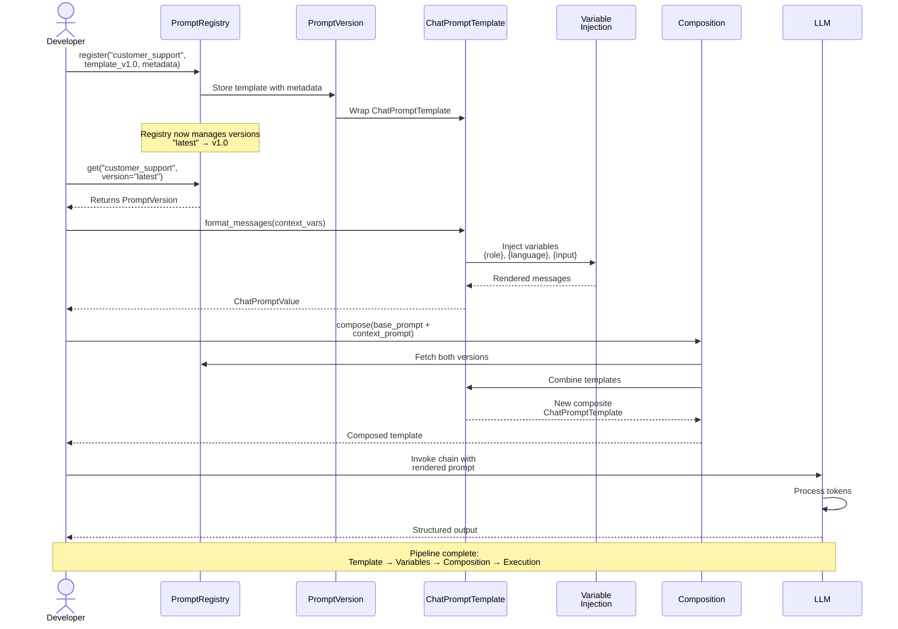

# Prompt Engineering as Code

**Work Product**: 1.4 - Design Pattern: Managing Prompts as a First-Class Engineering Artifact  
**Status**: Complete  
**Date**: 2026  
**Audience**: Engineers building production conversational AI systems  
**Depends on**: WP-1.3 (Runnable Protocol), ADR-1.2 (Chain Abstractions)

---

## Document Navigation

| Part | Topic | Duration | Level |
|------|-------|----------|-------|
| 1 | The Problem with String Prompts | 5 min | All |
| 2 | LangChain Prompt Abstractions | 10 min | Beginner |
| 3 | The PromptRegistry Pattern | 15 min | Intermediate |
| 4 | Versioning Strategy | 10 min | Intermediate |
| 5 | Composition Patterns | 15 min | Advanced |
| 6 | Multi-Turn Conversation Management | 20 min | Advanced |
| 7 | Testing Prompts | 10 min | Intermediate |
| 8 | Production Considerations | 10 min | Advanced |
| 9 | Key Takeaways | 5 min | All |

**Estimated Reading Time**: ~100 minutes  
**Hands-on Practice Time**: See `examples_1_4.py` (~60 minutes)

---

## Executive Summary

Prompts are not strings. They are **executable configuration that encodes business logic**.

A prompt defines:
- What role the model plays
- What constraints apply
- What format output takes
- How to handle edge cases
- What the model may and may not do

When prompts are string literals embedded in code, they are unversioned, untested, impossible to reuse, and invisible to your engineering process. This creates the same category of problems as unmanaged configuration files or hard-coded SQL.

**The pattern in this work product** treats prompts as first-class engineering artifacts: versioned, composable, testable, and deployed with the same rigor as code.

**💡 CORE INSIGHT**: A `PromptRegistry` is a dependency injection container for prompt templates. It decouples prompt management from execution logic.

---

## Part 1: The Problem with String Prompts

### What Goes Wrong

Consider a typical production codebase after six months:

```python
# File: support_bot.py
prompt_v1 = "You are a helpful assistant. Answer: {question}"

# File: agent.py  
SYSTEM_PROMPT = """You are a helpful customer support agent.
Be polite and helpful."""  # ← Who changed this? When? Why?

# File: pipeline.py
chain = ChatPromptTemplate.from_template(
    "You are a helpful assistant. {input}"  # ← Same? Different? No one knows.
)

# File: rag_chain.py
PROMPT = """You are an AI assistant with access to documents.
Use the context to answer: {context}
Question: {question}
"""  # ← Is this v2 or v3? The commit history says v17 edits to "helpful"
```

### Six Symptoms of String Prompt Problems

**1. No Versioning**
- You cannot A/B test prompt v1 vs v2
- You cannot roll back a bad prompt change
- You cannot track which version produced which output
- Experiments overwrite each other

**2. No Reuse**
- The same system prompt is copy-pasted across 12 files
- A bug fix requires 12 separate edits
- Teams drift: each copy evolves independently
- No shared vocabulary or policy

**3. No Composition**
- Base agent behavior hard-coded into every specialization
- Adding a capability means editing every prompt
- Cannot combine `base_assistant` + `code_specialist` cleanly
- Specializations break the base contract

**4. No Type Safety**
- Variables are just string `{placeholders}`
- No validation that `{context}` was actually passed
- Silent failures when a variable is missing
- Wrong variable names discovered at runtime, not at development time

**5. No Testability**
- "Test the prompt" means "run the LLM and see"
- No unit testing for prompt structure
- Cannot verify variable names, message order, or template validity
- Regression testing is manual

**6. Multi-Turn Chaos**
- Conversation history appended as f-strings
- No consistent truncation strategy
- Token budgets managed by hope
- Different chains manage history differently

### The Cost

Each symptom has measurable engineering cost:

| Problem | Impact |
|---------|--------|
| No versioning | Production incidents from untested prompt changes |
| No reuse | N×bugs when shared logic diverges |
| No composition | Architectural coupling between content and structure |
| No type safety | Runtime errors in user-facing paths |
| No testability | Blind spots in CI/CD for the highest-risk component |
| Multi-turn chaos | Memory leaks, token cost overruns, context corruption |

---

## Part 2: LangChain Prompt Abstractions

Before building the registry, understand the building blocks.

### 2.1 ChatPromptTemplate

The primary abstraction for chat-based prompts:

```python
from langchain_core.prompts import ChatPromptTemplate

# Short form: list of (role, content) tuples
prompt = ChatPromptTemplate.from_messages([
    ("system", "You are a {role}. Respond in {language}."),
    ("human", "{input}"),
])

# Inspect the template
print(prompt.input_variables)  # → ['role', 'language', 'input']
print(prompt.messages)          # → [SystemMessagePromptTemplate, HumanMessagePromptTemplate]

# Format without invoking a model
messages = prompt.format_messages(
    role="helpful assistant",
    language="English",
    input="What is LangChain?"
)
# → [SystemMessage(content="You are a helpful assistant. Respond in English."),
#    HumanMessage(content="What is LangChain?")]
```

**Why not `PromptTemplate`?**
`PromptTemplate` is for single-string prompts (completion models). For all chat models (GPT-4, Claude, Gemini), use `ChatPromptTemplate`.

### 2.2 Message Types

```python
from langchain_core.messages import SystemMessage, HumanMessage, AIMessage, ToolMessage

# System: Model identity, constraints, and behavior
system = SystemMessage(content="You are a code reviewer. Always suggest improvements.")

# Human: User turn
human = HumanMessage(content="Review this function...")

# AI: Model turn (for few-shot examples or reconstructed history)
ai = AIMessage(content="I see three issues with this code...")

# Tool: Tool call results (for agent patterns)
tool = ToolMessage(content='{"result": 42}', tool_call_id="call_123")
```

### 2.3 MessagesPlaceholder

The critical abstraction for multi-turn conversations:

```python
from langchain_core.prompts import MessagesPlaceholder

# Creates a slot in the prompt for a list of messages
prompt = ChatPromptTemplate.from_messages([
    ("system", "You are a helpful assistant named {name}."),
    MessagesPlaceholder(variable_name="history"),  # ← conversation goes here
    ("human", "{input}"),
])

# Usage: pass history as a list of messages
messages = prompt.format_messages(
    name="Aria",
    history=[
        HumanMessage(content="What is Python?"),
        AIMessage(content="Python is a programming language..."),
        HumanMessage(content="Is it good for AI?"),
        AIMessage(content="Yes, Python dominates AI development..."),
    ],
    input="What libraries should I learn first?",
)
```

**Why MessagesPlaceholder matters:**
- Injects conversation history at the right position in the message list
- Handles empty history gracefully (optional=True)
- Maintains proper turn order (human, ai, human, ai, ...)
- Enables truncation strategies before injection

### 2.4 Prompt Composition at the Message Level

```python
from langchain_core.prompts import SystemMessagePromptTemplate, HumanMessagePromptTemplate

# Build prompts from typed message templates
system = SystemMessagePromptTemplate.from_template(
    "You are {role} at {company}. Always be professional."
)
human = HumanMessagePromptTemplate.from_template("{input}")

# Compose into a ChatPromptTemplate
combined = ChatPromptTemplate.from_messages([system, human])
```

---

## Part 3: The PromptRegistry Pattern

### 3.1 Architecture Overview

```
┌────────────────────────────────────────────────────────────┐
│                      PromptRegistry                         │
│                                                            │
│  ┌────────────────────────────────────────────────────┐   │
│  │  Registry                                          │   │
│  │  "customer_support" → {"v1.0": PromptVersion,      │   │
│  │                         "v1.1": PromptVersion,     │   │
│  │                         "v2.0": PromptVersion}     │   │
│  │  "code_assistant"   → {"v1.0": PromptVersion,      │   │
│  │                         "latest": → "v1.0"}        │   │
│  └────────────────────────────────────────────────────┘   │
│                                                            │
│  Methods:                                                  │
│  • register(name, template, version, metadata)             │
│  • get(name, version="latest") → ChatPromptTemplate        │
│  • compose(name_a, name_b) → ChatPromptTemplate            │
│  • deprecate(name, version, replacement)                   │
│  • list_prompts() → dict[str, list[str]]                   │
│  • diff(name, v1, v2) → dict                               │
└────────────────────────────────────────────────────────────┘
```

### 3.1a Prompt Pipeline Architecture (Sequence Diagram)

This diagram shows the flow from raw template through versioning, injection, and composition to final LLM execution:



**💡 KEY INSIGHT**: The PromptRegistry decouples template management from execution. Versioning, composition, and injection happen before the LLM sees anything.

### 3.2 Implementation

```python
from dataclasses import dataclass, field
from typing import Optional, Any
from datetime import datetime
from langchain_core.prompts import ChatPromptTemplate, MessagesPlaceholder
import warnings


@dataclass
class PromptMetadata:
    """
    Metadata attached to every prompt version.
    
    This is the "commit message" equivalent for a prompt - it answers:
    - What changed? (description)
    - Why? (changelog)
    - Who owns it? (author)
    - Is it still safe to use? (deprecated)
    """
    version: str
    description: str
    author: str
    created_at: str = field(default_factory=lambda: datetime.now().isoformat())
    deprecated: bool = False
    deprecation_message: Optional[str] = None
    changelog: str = ""
    tags: list[str] = field(default_factory=list)


@dataclass
class PromptVersion:
    """
    A single versioned prompt in the registry.
    
    Wraps a ChatPromptTemplate with metadata for lifecycle management.
    """
    template: ChatPromptTemplate
    metadata: PromptMetadata

    def is_deprecated(self) -> bool:
        return self.metadata.deprecated

    def warn_if_deprecated(self, name: str) -> None:
        if self.is_deprecated():
            msg = self.metadata.deprecation_message or (
                f"Prompt '{name}' v{self.metadata.version} is deprecated. "
                "Please migrate to a newer version."
            )
            warnings.warn(msg, DeprecationWarning, stacklevel=3)


class PromptRegistry:
    """
    Central registry for managing prompt templates as versioned artifacts.

    Design principles:
    - Prompts are registered once, referenced by name and version
    - "latest" is an alias that always resolves to the most recently registered version
    - Deprecated versions still work but emit warnings
    - Composition creates new prompts from registered components

    Usage:
        registry = PromptRegistry()
        registry.register("assistant", my_template, version="v1.0", description="Initial")
        prompt = registry.get("assistant")  # returns v1.0 (latest)
    """

    def __init__(self):
        # name → version_string → PromptVersion
        self._registry: dict[str, dict[str, PromptVersion]] = {}
        # name → most recently registered version string
        self._latest: dict[str, str] = {}

    def register(
        self,
        name: str,
        template: ChatPromptTemplate,
        version: str,
        description: str = "",
        author: str = "",
        changelog: str = "",
        tags: list[str] | None = None,
    ) -> "PromptRegistry":
        """
        Register a prompt template under a name and version.

        Returns self to allow chaining:
            registry.register(...).register(...).register(...)
        """
        if name not in self._registry:
            self._registry[name] = {}

        metadata = PromptMetadata(
            version=version,
            description=description,
            author=author,
            changelog=changelog,
            tags=tags or [],
        )
        self._registry[name][version] = PromptVersion(template=template, metadata=metadata)
        self._latest[name] = version  # last registered = latest
        return self

    def get(self, name: str, version: str = "latest") -> ChatPromptTemplate:
        """
        Retrieve a prompt template by name and version.

        Args:
            name: The registered prompt name.
            version: Specific version string or "latest" (default).

        Raises:
            KeyError: If name or version is not registered.
        """
        if name not in self._registry:
            available = list(self._registry.keys())
            raise KeyError(
                f"Prompt '{name}' not found. Available prompts: {available}"
            )

        if version == "latest":
            version = self._latest[name]

        if version not in self._registry[name]:
            available_versions = list(self._registry[name].keys())
            raise KeyError(
                f"Version '{version}' of prompt '{name}' not found. "
                f"Available versions: {available_versions}"
            )

        prompt_version = self._registry[name][version]
        prompt_version.warn_if_deprecated(name)
        return prompt_version.template

    def compose(
        self,
        *names: str,
        versions: dict[str, str] | None = None,
        with_history: bool = True,
        history_variable: str = "history",
    ) -> ChatPromptTemplate:
        """
        Compose multiple system prompts into a single template.

        Takes the system message content from each named prompt and combines
        them into a single multi-part system message. The result includes
        a MessagesPlaceholder for conversation history and a human turn.

        Args:
            *names: Names of prompts to compose, in order.
            versions: Optional dict of {name: version} for specific versions.
                      Defaults to "latest" for any name not specified.
            with_history: Whether to include MessagesPlaceholder for multi-turn.
            history_variable: The variable name for MessagesPlaceholder.

        Example:
            # Combine base behavior with domain specialization
            composed = registry.compose("base_assistant", "code_specialist")
            # Result: base system + code system + history slot + human turn
        """
        versions = versions or {}
        system_parts: list[str] = []

        for name in names:
            version = versions.get(name, "latest")
            template = self.get(name, version=version)
            system_content = self._extract_system_content(template)
            if system_content:
                system_parts.append(system_content)

        combined_system = "\n\n---\n\n".join(system_parts)

        messages: list[Any] = [("system", combined_system)]
        if with_history:
            messages.append(MessagesPlaceholder(variable_name=history_variable, optional=True))
        messages.append(("human", "{input}"))

        return ChatPromptTemplate.from_messages(messages)

    def deprecate(self, name: str, version: str, message: str = "") -> None:
        """
        Mark a specific version as deprecated.

        Deprecated versions still work but emit DeprecationWarning on use.
        """
        if name not in self._registry or version not in self._registry[name]:
            raise KeyError(f"Prompt '{name}' version '{version}' not found.")

        self._registry[name][version].metadata.deprecated = True
        self._registry[name][version].metadata.deprecation_message = message

    def list_prompts(self) -> dict[str, dict[str, Any]]:
        """
        Return a summary of all registered prompts and their versions.

        Returns:
            Dict mapping name → {"versions": [...], "latest": str, "variables": [...]}
        """
        result = {}
        for name, versions in self._registry.items():
            latest_version = self._latest[name]
            latest_template = self._registry[name][latest_version].template
            result[name] = {
                "versions": [
                    {
                        "version": v,
                        "description": pv.metadata.description,
                        "deprecated": pv.metadata.deprecated,
                        "tags": pv.metadata.tags,
                    }
                    for v, pv in versions.items()
                ],
                "latest": latest_version,
                "input_variables": latest_template.input_variables,
            }
        return result

    def diff(self, name: str, version_a: str, version_b: str) -> dict[str, Any]:
        """
        Compare two versions of a prompt.

        Returns a dict showing what changed between versions:
        - Which system messages changed
        - Which variables were added or removed
        - Metadata differences
        """
        pv_a = self._registry[name][version_a]
        pv_b = self._registry[name][version_b]

        vars_a = set(pv_a.template.input_variables)
        vars_b = set(pv_b.template.input_variables)

        return {
            "added_variables": list(vars_b - vars_a),
            "removed_variables": list(vars_a - vars_b),
            "system_content_a": self._extract_system_content(pv_a.template),
            "system_content_b": self._extract_system_content(pv_b.template),
            "metadata_a": pv_a.metadata,
            "metadata_b": pv_b.metadata,
        }

    def _extract_system_content(self, template: ChatPromptTemplate) -> str:
        """Extract the system message content string from a ChatPromptTemplate."""
        for message in template.messages:
            # Handle SystemMessagePromptTemplate
            if hasattr(message, "role") and message.role == "system":
                return message.prompt.template
            # Handle tuples formatted as ("system", content)
            if hasattr(message, "prompt") and hasattr(message, "additional_kwargs"):
                if "role" not in message.additional_kwargs:
                    return getattr(message.prompt, "template", "")
        return ""
```

### 3.3 Registry Initialization Pattern

In production, initialize the registry once at application startup:

```python
# registry_config.py  ← one file, whole team uses the same prompts

from langchain_core.prompts import ChatPromptTemplate, MessagesPlaceholder
from prompt_registry import PromptRegistry

def build_registry() -> PromptRegistry:
    """
    Build and return the application's prompt registry.
    
    Called once at startup. All chains get prompts from this registry.
    """
    registry = PromptRegistry()

    # ── Base Assistant ────────────────────────────────────────────────
    registry.register(
        name="base_assistant",
        template=ChatPromptTemplate.from_messages([
            ("system", (
                "You are a professional assistant. "
                "Be concise, accurate, and helpful. "
                "If you do not know something, say so clearly."
            )),
            MessagesPlaceholder(variable_name="history", optional=True),
            ("human", "{input}"),
        ]),
        version="v1.0",
        description="Base assistant prompt for all applications",
        author="platform-team",
        tags=["base", "general"],
    )

    # ── Customer Support Specialist ───────────────────────────────────
    registry.register(
        name="customer_support",
        template=ChatPromptTemplate.from_messages([
            ("system", (
                "You are a customer support specialist for {company_name}. "
                "Your goals:\n"
                "1. Resolve the customer's issue completely\n"
                "2. Be empathetic and professional\n"
                "3. Escalate to a human if: issue cannot be resolved, "
                "customer is distressed, or legal/billing concerns arise\n"
                "4. Never make promises about refunds or SLAs without verification\n\n"
                "Tone: Warm, professional, solution-focused."
            )),
            MessagesPlaceholder(variable_name="history", optional=True),
            ("human", "{input}"),
        ]),
        version="v1.0",
        description="Customer support agent - initial version",
        author="cx-team",
        tags=["support", "customer-facing"],
    )

    # v1.1: Added structured escalation decision
    registry.register(
        name="customer_support",
        template=ChatPromptTemplate.from_messages([
            ("system", (
                "You are a customer support specialist for {company_name}.\n\n"
                "## Your Responsibilities\n"
                "- Resolve issues completely on first contact where possible\n"
                "- Be empathetic, professional, and solution-focused\n"
                "- Verify account details before making changes\n\n"
                "## Escalation Protocol\n"
                "Escalate immediately (respond with ESCALATE: <reason>) when:\n"
                "- Customer requests human agent explicitly\n"
                "- Issue involves refunds > $100\n"
                "- Legal, safety, or compliance concerns\n"
                "- Three failed resolution attempts\n\n"
                "## Constraints\n"
                "- Never confirm SLAs or refund amounts you cannot verify\n"
                "- Always confirm understanding before closing the ticket"
            )),
            MessagesPlaceholder(variable_name="history", optional=True),
            ("human", "{input}"),
        ]),
        version="v1.1",
        description="Added structured escalation protocol and constraints",
        author="cx-team",
        changelog="Added explicit escalation triggers, better constraints",
        tags=["support", "customer-facing", "escalation"],
    )

    # ── Code Assistant ─────────────────────────────────────────────────
    registry.register(
        name="code_assistant",
        template=ChatPromptTemplate.from_messages([
            ("system", (
                "You are an expert software engineer specializing in {language}.\n\n"
                "When reviewing or writing code:\n"
                "1. Prioritize correctness, then clarity, then performance\n"
                "2. Explain your reasoning\n"
                "3. Point out edge cases and potential bugs\n"
                "4. Suggest tests for critical paths\n"
                "5. Follow idiomatic {language} conventions\n\n"
                "Always format code in markdown code blocks."
            )),
            MessagesPlaceholder(variable_name="history", optional=True),
            ("human", "{input}"),
        ]),
        version="v1.0",
        description="Code review and assistance for specified language",
        author="engineering-team",
        tags=["code", "technical"],
    )

    # ── RAG Document Q&A ───────────────────────────────────────────────
    registry.register(
        name="rag_qa",
        template=ChatPromptTemplate.from_messages([
            ("system", (
                "You are a document analyst. Answer questions using ONLY the provided context.\n\n"
                "Rules:\n"
                "- If the answer is in the context, answer precisely and cite the source\n"
                "- If the answer is NOT in the context, say: "
                "'This information is not available in the provided documents.'\n"
                "- Never speculate or use external knowledge\n"
                "- Quote relevant passages when helpful\n\n"
                "Context:\n{context}"
            )),
            MessagesPlaceholder(variable_name="history", optional=True),
            ("human", "{input}"),
        ]),
        version="v1.0",
        description="Strict RAG Q&A with citation and hallucination prevention",
        author="data-team",
        tags=["rag", "document-qa"],
    )

    return registry


# Singleton: import and use anywhere in your application
REGISTRY = build_registry()
```

---

## Part 4: Versioning Strategy

### 4.1 Prompt Semantic Versioning

Adopt the same discipline as software versioning:

```
MAJOR.MINOR.PATCH  →  v2.1.3
  │      │     └── Phrasing improvements, typo fixes, word choice
  │      └──────── Behavioral changes: new instructions, tone shifts, constraints
  └─────────────── Breaking changes: different variables, different output format
```

**MAJOR bump required when:**
- Adding or removing required input variables
- Changing the expected output structure
- Completely rewriting the agent persona
- Changing the escalation/refusal contract

**MINOR bump required when:**
- Adding new behavioral rules or constraints
- Changing tone or communication style
- Expanding or contracting the scope of what the model handles
- Adding few-shot examples

**PATCH bump appropriate when:**
- Fixing a typo
- Clarifying ambiguous wording with equivalent meaning
- Minor phrasing improvements

### 4.2 Versioning Lifecycle

```
Registered → Current → Deprecated → Removed
     │            │          │
     │            │          └── Still in registry, emits warnings
     │            └──────────── "latest" alias points here
     └───────────────────────── New version registered
```

**Deprecation policy:**
1. Never remove a version immediately
2. Mark as deprecated with migration instructions
3. Allow one release cycle (or sprint) before removal
4. Old versions still work, but warn at call time

```python
# Deprecate v1.0 in favor of v1.1
registry.deprecate(
    name="customer_support",
    version="v1.0",
    message=(
        "customer_support v1.0 is deprecated. Migrate to v1.1 which adds "
        "structured escalation handling. Update your chain config to use version='v1.1'."
    )
)

# v1.0 still works, but emits DeprecationWarning
old_prompt = registry.get("customer_support", version="v1.0")  # warns!
new_prompt = registry.get("customer_support", version="v1.1")  # clean
```

### 4.3 Changelog as Documentation

Each registration should include a meaningful changelog entry:

```python
registry.register(
    name="customer_support",
    template=v2_template,
    version="v2.0",
    description="Restructured for better escalation and tone consistency",
    changelog=(
        "BREAKING: Added required variable {agent_name} for personalization.\n"
        "Added explicit de-escalation path for upset customers.\n"
        "Removed generic 'be helpful' instruction (replaced with specifics).\n"
        "Aligned with new CX policy document 2026-Q1."
    ),
    author="cx-team",
    tags=["support", "customer-facing", "major-revision"],
)
```

---

## Part 5: Composition Patterns

### 5.1 Why Compose?

Without composition, every specialization starts from scratch:

```python
# BAD: Every specialist repeats the base rules
customer_support_prompt = """
You are a professional assistant.  # ← repeated from base
Be concise, accurate, and helpful. # ← repeated from base
If unsure, say so clearly.         # ← repeated from base

Also: you are a customer support specialist...
"""
```

With composition, specializations only define what's new:

```python
# GOOD: Base defines universal behavior, specialist defines domain behavior
base = registry.get("base_assistant")       # universal rules
specialist = registry.get("customer_support")  # domain-specific rules
combined = registry.compose("base_assistant", "customer_support")
# → universal rules + domain rules, combined into one prompt
```

### 5.2 Composition Modes

**Mode 1: Sequential Composition (default)**

Combines system messages in order. The model sees them as a continuous system context:

```python
# base system + specialist system → single system message
combined = registry.compose("base_assistant", "code_assistant")
```

Result:
```
SYSTEM: "You are a professional assistant. Be concise, accurate...
         
         ---
         
         You are an expert software engineer specializing in {language}..."
HISTORY: [...]
HUMAN: "{input}"
```

**Mode 2: Selective Composition**

Use specific versions for each component:

```python
combined = registry.compose(
    "base_assistant",
    "customer_support",
    versions={
        "base_assistant": "v1.0",
        "customer_support": "v1.1",  # specific version for this deployment
    }
)
```

**Mode 3: Runtime Specialization**

Pick the specialist at runtime based on the request:

```python
def get_agent_prompt(request_type: str) -> ChatPromptTemplate:
    specialists = {
        "billing": "billing_specialist",
        "technical": "technical_support",
        "general": "base_assistant",
    }
    specialist_name = specialists.get(request_type, "base_assistant")
    return registry.compose("base_assistant", specialist_name)
```

### 5.3 Composition with Constraints

Sometimes you need to inject a constraint layer between base and specialist:

```python
# Three-layer composition:
# 1. base: universal behavior
# 2. compliance: legal/policy guardrails
# 3. specialist: domain knowledge
full_prompt = registry.compose(
    "base_assistant",    # layer 1: universal
    "compliance",        # layer 2: guardrails
    "financial_advisor", # layer 3: domain
)
```

---

## Part 6: Multi-Turn Conversation Management

### 6.1 The Anatomy of a Multi-Turn Prompt

```
┌──────────────────────────────────────────────────────────┐
│ SYSTEM MESSAGE                                           │
│ "You are a customer support agent for {company_name}..." │
├──────────────────────────────────────────────────────────┤
│ HISTORY (MessagesPlaceholder)                            │
│ HumanMessage: "I can't log in"                           │
│ AIMessage: "I can help. Can you describe the error?"     │
│ HumanMessage: "It says 'invalid credentials'"            │
│ AIMessage: "Let's try resetting your password..."        │
├──────────────────────────────────────────────────────────┤
│ CURRENT HUMAN MESSAGE                                    │
│ "{input}"  → "I already tried that, still not working"  │
└──────────────────────────────────────────────────────────┘
```

### 6.2 The ConversationAgent

A complete multi-turn agent implementation:

```python
from langchain_core.messages import HumanMessage, AIMessage
from langchain_openai import ChatOpenAI
from langchain_core.output_parsers import StrOutputParser
from typing import Optional


class ConversationAgent:
    """
    A stateful multi-turn conversation agent.

    Architecture:
    - Prompt comes from the registry (versioned, composable)
    - History is stored in-memory (swap for Redis/DB in production)
    - Chain = prompt | model | parser (standard LCEL)
    - Each turn: load history → invoke → update history

    Usage:
        agent = ConversationAgent(
            registry=registry,
            prompt_name="customer_support",
            model="gpt-4o-mini",
        )
        response = agent.chat("I can't log in to my account")
    """

    def __init__(
        self,
        registry: PromptRegistry,
        prompt_name: str,
        model: str = "gpt-4o-mini",
        prompt_version: str = "latest",
        max_history_turns: int = 10,
        **prompt_kwargs: Any,
    ):
        self.registry = registry
        self.prompt_name = prompt_name
        self.prompt_version = prompt_version
        self.max_history_turns = max_history_turns
        self.prompt_kwargs = prompt_kwargs  # Static variables like {company_name}

        # Build the chain
        self.prompt = registry.get(prompt_name, version=prompt_version)
        self.model = ChatOpenAI(model=model)
        self.parser = StrOutputParser()
        self.chain = self.prompt | self.model | self.parser

        # Conversation state
        self.history: list[HumanMessage | AIMessage] = []
        self.turn_count: int = 0

    def chat(self, user_input: str) -> str:
        """
        Send a message and get a response.

        Manages history automatically:
        1. Inject current history into prompt
        2. Invoke the chain with user input
        3. Append both turns to history
        4. Truncate if over max_history_turns
        """
        # Truncate history to stay within token budget
        history_window = self._get_history_window()

        # Build full input including static variables
        chain_input = {
            **self.prompt_kwargs,      # company_name, language, etc.
            "history": history_window,  # MessagesPlaceholder variable
            "input": user_input,        # Current human turn
        }

        response = self.chain.invoke(chain_input)

        # Update history
        self.history.append(HumanMessage(content=user_input))
        self.history.append(AIMessage(content=response))
        self.turn_count += 1

        return response

    def stream_chat(self, user_input: str):
        """
        Stream response tokens as they arrive (lower perceived latency).
        
        Yields each token chunk. History is updated after streaming completes.
        """
        history_window = self._get_history_window()
        chain_input = {
            **self.prompt_kwargs,
            "history": history_window,
            "input": user_input,
        }

        full_response = ""
        for chunk in self.chain.stream(chain_input):
            full_response += chunk
            yield chunk

        # Update history after full response received
        self.history.append(HumanMessage(content=user_input))
        self.history.append(AIMessage(content=full_response))
        self.turn_count += 1

    def reset(self) -> None:
        """Clear conversation history (start new session)."""
        self.history = []
        self.turn_count = 0

    def get_history(self) -> list:
        """Return current conversation history."""
        return list(self.history)

    def _get_history_window(self) -> list:
        """
        Return the history slice to inject into the prompt.

        Strategy: Keep the last N turns (each turn = 2 messages: human + AI).
        This prevents context window overflow while preserving recent context.
        
        For production, consider:
        - Token counting instead of turn counting
        - Summarization of older turns
        - Sliding window with pinned important messages
        """
        max_messages = self.max_history_turns * 2  # 2 messages per turn
        return self.history[-max_messages:]
```

### 6.3 History Management Strategies

**Strategy 1: Fixed Window (shown above)**
Keep the last N turns. Simple, predictable, loses older context:
```python
history[-N * 2:]  # last N human+AI pairs
```

**Strategy 2: Token Budget**
More accurate, requires counting tokens:
```python
from langchain_openai import ChatOpenAI

def truncate_to_tokens(history, max_tokens: int, model="gpt-4o-mini"):
    """Keep the most recent messages that fit within max_tokens."""
    llm = ChatOpenAI(model=model)
    selected = []
    total_tokens = 0
    for message in reversed(history):
        tokens = llm.get_num_tokens(message.content)
        if total_tokens + tokens > max_tokens:
            break
        selected.insert(0, message)
        total_tokens += tokens
    return selected
```

**Strategy 3: Summarize + Recent**
Best for long conversations:
```python
# Older history → summarized
# Recent history → full messages
# Result: compact representation of the full conversation

summary_prompt = registry.get("conversation_summarizer")
old_summary = summarize_old_messages(history[:-10])
recent = history[-10:]

history_for_prompt = [
    SystemMessage(content=f"Previous conversation summary: {old_summary}"),
    *recent,
]
```

**Strategy 4: Pinned Messages**
Preserve critical information regardless of window:
```python
# Some messages must always appear (user preferences, key decisions)
pinned = [m for m in history if m.additional_kwargs.get("pinned")]
recent = history[-N * 2:]
history_for_prompt = pinned + recent  # deduplication handled separately
```

---

## Part 7: Testing Prompts

### 7.1 What to Test

Prompts have two testable layers:

| Layer | What to Test | How |
|-------|-------------|-----|
| **Structure** | Correct message order, variables present, types correct | Unit tests (no LLM) |
| **Behavior** | Model follows instructions correctly | Integration tests (with LLM) |

### 7.2 Unit Testing (No LLM Required)

Test the template structure without any API calls:

```python
import pytest
from langchain_core.prompts import ChatPromptTemplate, MessagesPlaceholder


def test_registry_returns_correct_template():
    registry = build_registry()
    prompt = registry.get("customer_support", version="v1.1")
    assert isinstance(prompt, ChatPromptTemplate)


def test_registry_raises_on_unknown_prompt():
    registry = build_registry()
    with pytest.raises(KeyError, match="Prompt 'nonexistent' not found"):
        registry.get("nonexistent")


def test_prompt_has_required_variables():
    registry = build_registry()
    prompt = registry.get("customer_support")
    assert "input" in prompt.input_variables
    assert "company_name" in prompt.input_variables


def test_prompt_has_history_placeholder():
    registry = build_registry()
    prompt = registry.get("customer_support")
    # History is a MessagesPlaceholder, not an input_variable
    # It appears in the messages list
    message_types = [type(m).__name__ for m in prompt.messages]
    assert "MessagesPlaceholder" in message_types


def test_composed_prompt_includes_all_system_content():
    registry = build_registry()
    combined = registry.compose("base_assistant", "code_assistant")
    messages = combined.format_messages(
        language="Python",
        input="Review my code",
        history=[],
    )
    system_content = messages[0].content
    assert "professional assistant" in system_content      # from base
    assert "expert software engineer" in system_content   # from code_assistant


def test_deprecation_warns():
    registry = build_registry()
    registry.deprecate("customer_support", "v1.0", "Use v1.1")
    with pytest.warns(DeprecationWarning, match="Use v1.1"):
        registry.get("customer_support", version="v1.0")


def test_latest_points_to_most_recently_registered():
    registry = build_registry()
    # After registering v1.0 and v1.1, latest should be v1.1
    latest = registry.get("customer_support")  # defaults to "latest"
    v1_1 = registry.get("customer_support", version="v1.1")
    # Same template object
    assert latest is v1_1


def test_prompt_formats_correctly():
    """Verify the template produces the expected message structure."""
    registry = build_registry()
    prompt = registry.get("customer_support", version="v1.1")

    from langchain_core.messages import HumanMessage, AIMessage
    messages = prompt.format_messages(
        company_name="Acme Corp",
        history=[
            HumanMessage(content="Hello"),
            AIMessage(content="Hi, how can I help?"),
        ],
        input="I have a billing question",
    )

    roles = [m.type for m in messages]
    assert roles[0] == "system"        # system first
    assert roles[-1] == "human"        # human last
    assert "human" in roles            # history injected
    assert "ai" in roles               # history injected
```

### 7.3 Behavioral Testing (With LLM)

For critical behavioral contracts, test with the real model:

```python
import pytest
from langchain_openai import ChatOpenAI

@pytest.mark.integration  # mark to skip in fast CI
def test_agent_escalates_on_explicit_request():
    """Verify the escalation protocol works as specified."""
    registry = build_registry()
    agent = ConversationAgent(
        registry=registry,
        prompt_name="customer_support",
        model="gpt-4o-mini",
        company_name="Test Corp",
    )

    response = agent.chat("I want to speak to a human agent immediately.")
    assert "ESCALATE" in response.upper() or "human" in response.lower()


@pytest.mark.integration
def test_rag_agent_refuses_to_speculate():
    """Verify the RAG agent doesn't hallucinate."""
    registry = build_registry()
    prompt = registry.get("rag_qa")
    model = ChatOpenAI(model="gpt-4o-mini")
    chain = prompt | model

    response = chain.invoke({
        "context": "The product was launched in 2024.",
        "history": [],
        "input": "What is the CEO's name?",  # not in context
    })
    content = response.content.lower()
    assert "not available" in content or "not in" in content or "cannot" in content
```

---

## Part 8: Production Considerations

### 8.1 Registry Loading Strategies

**Option A: Static (Recommended for most cases)**
```python
# Built once at startup, shared across all requests
REGISTRY = build_registry()

# Used in every route/handler
@app.post("/chat")
async def chat(message: ChatMessage):
    prompt = REGISTRY.get("customer_support")
    ...
```

**Option B: Hot Reload (For high-iteration teams)**
```python
import importlib

class HotReloadRegistry:
    """Registry that reloads from config without app restart."""

    def __init__(self, config_module: str):
        self._config_module = config_module
        self._registry = None
        self._load()

    def _load(self):
        module = importlib.import_module(self._config_module)
        importlib.reload(module)
        self._registry = module.build_registry()

    def reload(self):
        """Call this to pick up prompt changes without restarting."""
        self._load()

    def get(self, name: str, version: str = "latest") -> ChatPromptTemplate:
        return self._registry.get(name, version)
```

**Option C: Database-backed (For large teams, A/B testing)**
```python
# Prompts stored in a database with versioning
# Registry loads from DB; admin UI for editing and activation
# Supports per-user or per-request prompt experiments
```

### 8.2 A/B Testing Prompts

The registry enables clean prompt experiments:

```python
import random

class ExperimentalRegistry:
    """Extends PromptRegistry with A/B testing support."""

    def __init__(self, registry: PromptRegistry):
        self._registry = registry
        self._experiments: dict[str, dict] = {}

    def define_experiment(
        self,
        name: str,
        control: tuple[str, str],    # (prompt_name, version)
        treatment: tuple[str, str],  # (prompt_name, version)
        treatment_fraction: float = 0.5,
    ):
        self._experiments[name] = {
            "control": control,
            "treatment": treatment,
            "fraction": treatment_fraction,
        }

    def get_for_experiment(
        self, experiment_name: str, user_id: str
    ) -> tuple[ChatPromptTemplate, str]:
        """
        Returns (template, variant_label).
        
        Consistent hashing ensures same user always gets same variant.
        """
        exp = self._experiments[experiment_name]
        # Deterministic: same user_id always maps to same variant
        bucket = hash(f"{experiment_name}:{user_id}") % 100
        is_treatment = bucket < (exp["fraction"] * 100)

        if is_treatment:
            name, version = exp["treatment"]
            return self._registry.get(name, version), "treatment"
        else:
            name, version = exp["control"]
            return self._registry.get(name, version), "control"
```

### 8.3 Observability for Prompts

Connect prompt versions to your observability stack:

```python
import os

def invoke_with_tracing(
    chain,
    inputs: dict,
    prompt_name: str,
    prompt_version: str,
    user_id: str,
):
    """
    Invoke a chain with full prompt lineage in the trace.
    
    LangSmith will show which prompt version produced which output.
    """
    return chain.invoke(
        inputs,
        config={
            "metadata": {
                "prompt_name": prompt_name,
                "prompt_version": prompt_version,
                "user_id": user_id,
            },
            "tags": [f"prompt:{prompt_name}", f"version:{prompt_version}"],
            "run_name": f"{prompt_name}_v{prompt_version}",
        }
    )
```

---

## Part 9: Key Takeaways

### The Core Pattern

```
String prompt  →  ChatPromptTemplate  →  PromptRegistry  →  ConversationAgent
     ↑                   ↑                     ↑                    ↑
  Unmaintainable    Type-safe template    Version + Compose    Full lifecycle
```

### Five Rules for Prompt Engineering as Code

**Rule 1: Every prompt has a name and a version**
- No anonymous prompts in production
- Always register with description and author
- Versioned like code (`v1.0`, `v1.1`, `v2.0`)

**Rule 2: Variables are the API contract**
- The input variables of a `ChatPromptTemplate` are a public interface
- MAJOR version bump when they change
- Document every variable in the description

**Rule 3: Multi-turn needs MessagesPlaceholder**
- Never concatenate conversation history as strings
- Always use `MessagesPlaceholder` for the history slot
- Implement explicit truncation strategy (not implicit)

**Rule 4: Composition over duplication**
- Extract shared rules into a `base_assistant` prompt
- Specialize by composing, not by copying
- The registry's `compose()` method is the tool for this

**Rule 5: Test structure, then behavior**
- Unit test template structure without calling the LLM
- Integration test behavioral contracts with the real model
- Mark integration tests to run separately from fast unit tests

### What This Enables

| Capability | Without Registry | With Registry |
|------------|-----------------|--------------|
| **A/B Testing** | Edit file, redeploy, compare | `get(name, version="v1.0")` vs `"v1.1"` |
| **Rollback** | Find old git commit, extract string | `get(name, version="v1.0")` |
| **Reuse** | Copy-paste, drift over time | `registry.get(name)` everywhere |
| **Composition** | Manual string concatenation | `registry.compose("base", "specialist")` |
| **Debugging** | "Which prompt ran?" | Metadata in every trace |
| **Testing** | Run LLM to see output | Unit test template structure |
| **Deprecation** | Delete and hope | `registry.deprecate(name, version)` → warnings |

### Connection to Other Work Products

- **ADR-1.2** chose `RunnableSequence + LCEL` as the chain pattern. Prompts from this registry plug directly into those chains.
- **WP-1.3** explained the `Runnable` protocol. `ChatPromptTemplate` IS a `Runnable` — it composes with models and parsers via `|`.
- **Next: WP-1.5** will build a complete multi-agent system that uses this registry, LCEL composition, and the Runnable protocol together.

---

## Quick Reference

```python
# Create registry
from registry_config import REGISTRY

# Get a prompt
prompt = REGISTRY.get("customer_support")           # latest
prompt = REGISTRY.get("customer_support", "v1.0")  # specific version

# Compose prompts
combined = REGISTRY.compose("base_assistant", "code_assistant")

# Multi-turn agent
agent = ConversationAgent(
    registry=REGISTRY,
    prompt_name="customer_support",
    model="gpt-4o-mini",
    company_name="Acme Corp",     # static variable
)
response = agent.chat("I need help with my account")
response = agent.chat("The previous solution didn't work")  # history maintained

# Inspect the registry
info = REGISTRY.list_prompts()
diff = REGISTRY.diff("customer_support", "v1.0", "v1.1")

# Test a prompt structure (no LLM)
prompt.format_messages(company_name="Test", history=[], input="Hi")
```

---

*Part of the AI Architecture Blueprints series. See [AGENTMAP.md](../reference/AGENTMAP.md) for the complete knowledge graph.*
