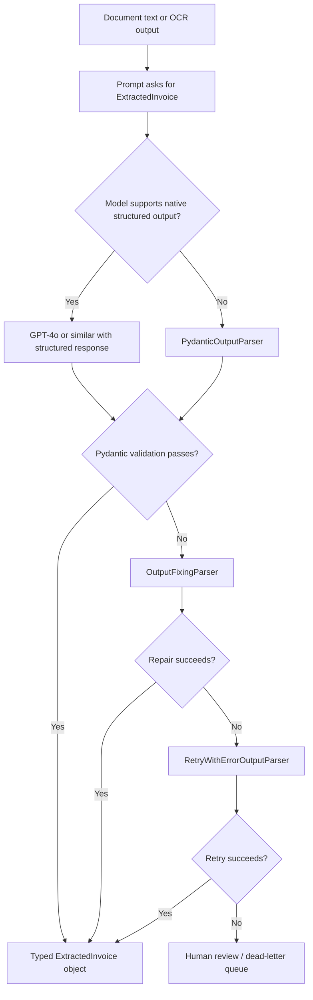
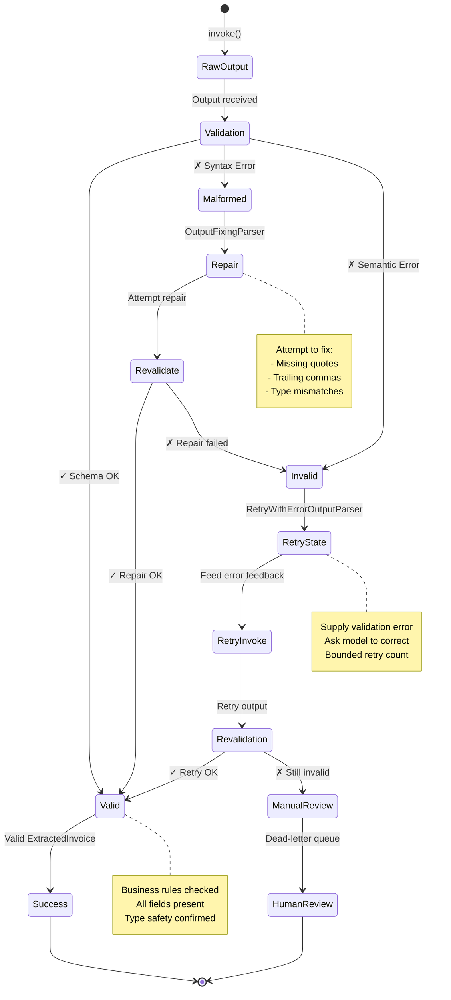

# WP-1.5: Output Parsing for System Integration

**Status**: Recommended
**Date**: 2026-06-24
**Implements**: Work Product 1.5 - Output Parsing for System Integration

## Context

LLMs are useful in production only when their outputs can be consumed by downstream systems without brittle prompt parsing. In practice, that means the model must emit structured data that is predictable enough for validation, expressive enough for the business problem, and recoverable when the model drifts.

This work product defines two things:

1. A strict Pydantic schema for extracted invoice data.
2. A layered recovery strategy that prefers native structured output, then parser repair, then retries with error feedback.

The goal is not just to parse text. The goal is to make the output reliable enough that another system can depend on it without adding ad hoc cleanup code everywhere.

## Decision

Use a typed schema as the contract between the model and the rest of the system.

- Prefer model-native structured output when the provider supports it.
- Validate with Pydantic at the boundary, not later in the pipeline.
- Use `OutputFixingParser` when the output is structurally close but malformed.
- Use `RetryWithErrorOutputParser` when the first pass is valid JSON but semantically wrong or incomplete.
- Escalate unrecoverable cases to a human review queue or dead-letter path instead of guessing.

That ordering keeps the happy path fast and makes recovery explicit.

## Reference Schema

```python
from datetime import date
from decimal import Decimal

from pydantic import BaseModel, ConfigDict, Field, model_validator


class InvoiceLineItem(BaseModel):
    description: str = Field(min_length=1, description="Item or service description")
    quantity: Decimal = Field(gt=0, description="Number of units")
    unit_price: Decimal = Field(ge=0, description="Price per unit")
    amount: Decimal = Field(ge=0, description="Extended line amount")


class ExtractedInvoice(BaseModel):
    model_config = ConfigDict(extra="forbid")

    vendor_name: str = Field(min_length=1, description="Invoice issuer")
    invoice_date: date = Field(description="ISO date parsed from the document")
    invoice_number: str | None = Field(default=None, description="Vendor invoice identifier")
    currency: str = Field(pattern=r"^[A-Z]{3}$", description="ISO 4217 currency code")
    line_items: list[InvoiceLineItem] = Field(min_length=1, description="Itemized charges")
    subtotal: Decimal = Field(ge=0, description="Pre-tax subtotal")
    tax_total: Decimal | None = Field(default=None, ge=0, description="Tax amount, if present")
    total: Decimal = Field(ge=0, description="Final amount due")
    source_document_id: str | None = Field(default=None, description="Upstream document reference")

    @model_validator(mode="after")
    def validate_totals(self):
        line_total = sum(item.amount for item in self.line_items)
        if self.subtotal < line_total:
            raise ValueError("subtotal must be greater than or equal to the sum of line items")
        if self.total < self.subtotal:
            raise ValueError("total must be greater than or equal to subtotal")
        return self
```

This schema is intentionally strict:

- `extra="forbid"` prevents silent field drift.
- `Field(min_length=1)` protects against empty strings that are technically valid but useless.
- `pattern=r"^[A-Z]{3}$"` keeps currency values normalized.
- The model validator catches business-rule mistakes, not just syntax mistakes.

If your real system needs more metadata, add a separate wrapper model for parser metadata rather than weakening the invoice contract.

## Recommended Flow



The important design choice is that each stage has a single job:

1. Native structured output produces the best first pass.
2. `OutputFixingParser` repairs formatting and serialization issues.
3. `RetryWithErrorOutputParser` gives the model its own error context so it can correct missing or invalid fields.
4. Human review handles the cases the model cannot fix safely.

### Reliability & Recovery State Machine

This state machine diagram illustrates the internal state transitions and error handling logic:



**✅ BEST PRACTICE**: Each recovery path has an exit condition. Never retry infinitely. Escalate to human review when automated recovery exhausted.

## Why Native Structured Output Comes First

Models such as GPT-4o can emit structured responses directly. When that is available, it is the most robust option because the model is constrained to the schema before the text ever reaches your application code.

Typical usage in LangChain looks like this:

```python
from langchain_openai import ChatOpenAI

llm = ChatOpenAI(model="gpt-4o", temperature=0)
structured_llm = llm.with_structured_output(ExtractedInvoice)

invoice = structured_llm.invoke(
    "Extract the invoice details from the attached document text."
)
```

Use this when the provider supports it because it reduces post-processing, lowers repair cost, and produces cleaner failure modes.

## What OutputFixingParser Solves

`OutputFixingParser` is useful when the model produced something close to valid structured data but the shape is broken. Common examples are:

- Missing quotes around a string value.
- Trailing commas in JSON.
- A field that should be a number but was emitted as a string.
- A list that was flattened into a sentence.

The parser does not invent new business logic. It is a repair layer for malformed output.

Use it when the first pass is close enough that a small corrective prompt can recover it safely.

## What RetryWithErrorOutputParser Solves

`RetryWithErrorOutputParser` is the better choice when the output is structurally valid but semantically wrong. The parser can feed the model the original instructions plus the validation error, which is useful for cases like:

- `line_items` is empty even though the document clearly contains charges.
- The invoice date is valid text, but not in the requested format.
- The total does not match the subtotal.
- A required field was omitted entirely.

This is the parser you want when the model needs to understand why the first attempt failed, not just how to patch a syntax problem.

## Failure Modes and Recovery

| Failure mode | Example | Recovery |
|--------------|---------|----------|
| Syntax error | Broken JSON, trailing comma | `OutputFixingParser` |
| Schema mismatch | Wrong field type or missing required field | `RetryWithErrorOutputParser` |
| Business-rule violation | Total does not reconcile with line items | Retry, then human review |
| Ambiguous extraction | Multiple candidate vendors or dates | Ask for review or enrich prompt context |
| Provider outage | Model unavailable or rate-limited | Fallback model or queue for later |

That matrix should drive operational behavior. Do not convert every failure into a retry loop. Some failures should stop early and be reviewed.

## Implementation Pattern

The recommended runtime pattern is:

1. Ask the model for structured output using the schema.
2. Validate the result with Pydantic immediately.
3. If validation fails, attempt automatic repair with `OutputFixingParser`.
4. If repair fails, retry with validation errors included using `RetryWithErrorOutputParser`.
5. If the result still fails, mark it for human review and preserve the raw model output for debugging.

This pattern keeps the downstream contract simple: the rest of the system receives either a valid `ExtractedInvoice` or an explicit failure event.

## Operational Best Practices

- Keep the schema narrow. Only include fields the downstream system actually uses.
- Prefer typed primitives over free-form strings wherever possible.
- Make validation rules explicit and local to the model.
- Preserve raw output for observability, but do not pass it downstream as the source of truth.
- Version the schema when the contract changes.
- Measure repair rate and retry rate; if those numbers rise, the prompt or schema needs work.

## When To Use This Pattern

Use this pattern for:

- Invoice extraction.
- Form and document ingestion.
- Ticket normalization.
- Compliance records.
- Any workflow that needs typed data for another service or database.

Do not use this pattern when the output is intentionally creative and no downstream system depends on strict structure.

## Summary

The reliability strategy is simple:

1. Define the contract with Pydantic.
2. Prefer native structured output from the model.
3. Repair small formatting issues with `OutputFixingParser`.
4. Retry with the validation error when the model needs feedback.
5. Escalate anything still invalid.

That gives you a clean boundary between probabilistic generation and deterministic system integration.
