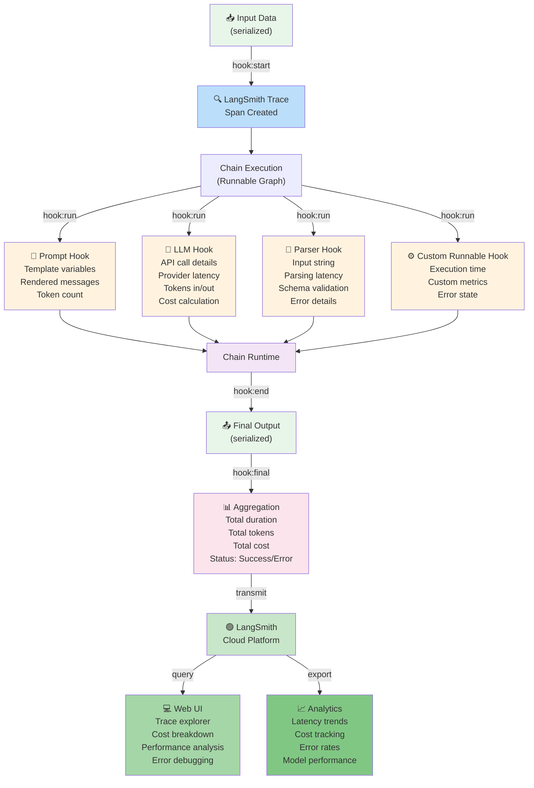
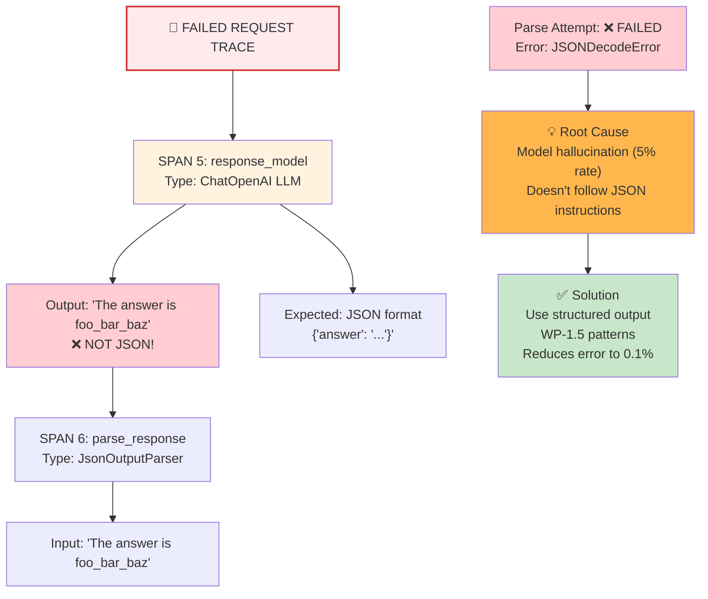

# WP-1.7: Introduction to Tracing with LangSmith

## Observability-First Debugging for LLM Systems

**Current Document Version:** 1.0.2  
**Date Created:** 2026-06-24  
**Status:** Production  
**Relationships:** Builds on [WP-1.3](../01-foundations/WP-1.3-The-Runnable-Protocol.md), [WP-1.4](WP-1.4-Prompt-Engineering-as-Code.md), [WP-1.5](WP-1.5-Output-Parsing-for-System-Integration.md)

---

## Executive Summary

**Problem:** LLM systems are opaque. When a chain is slow, you don't know if the problem is:
- Network latency to the LLM provider?
- LLM inference time?
- Token overhead in prompts?
- Parsing overhead in output processing?
- A custom Runnable doing expensive computation?

**Solution:** LangSmith tracing provides **real-time visibility** into chain execution. By instrumenting a Runnable chain with tracing, you get:

1. **Token-level granularity**: Every API call, every token consumed/generated
2. **Timing breakdowns**: Where time is actually spent
3. **Cost tracking**: Exact dollar cost per request
4. **Interactive UI**: Explore traces in real-time at https://smith.langchain.com

**Observability-First Mindset:**
> "If you can't trace it, you can't optimize it. If you can't observe it, you can't debug it."

---

## Part 1: What is LangSmith?

### Overview

LangSmith is LangChain's **production tracing and evaluation platform**. It captures every step of chain execution and makes it queryable, analyzable, and debuggable.

### What Gets Traced?

When you enable LangSmith tracing on a chain:

```
Chain Execution
├─ Input (serialized)
├─ LLM Call #1
│  ├─ Prompt (tokens, cost)
│  ├─ Inference Time (TTFT, TPS)
│  └─ Output (tokens, cost)
├─ Parser Call
│  ├─ Input String
│  ├─ Execution Time
│  └─ Parsed Output
├─ Custom Runnable Call
│  ├─ Execution Time
│  └─ Output
└─ Final Output
   ├─ Total Execution Time
   ├─ Total Tokens (prompt + completion)
   └─ Total Cost ($)
```

### Observability Hook Map (System Architecture)

This diagram shows where LangSmith integrates into a production chain and which observation points are available:



**💡 KEY INSIGHT**: LangSmith hooks into every stage of execution. Your application logic doesn't change—the hooks are transparent and automatic when `LANGSMITH_TRACING=true`.

### Why Trace?

| Use Case | Benefit |
|----------|---------|
| **Performance Debugging** | Identify which component is slow (LLM? Parser? Network?) |
| **Cost Analysis** | See exact token usage per request, find expensive patterns |
| **Error Investigation** | Replay the exact input/output at each step |
| **Production Monitoring** | Track latency/cost trends over time |
| **A/B Testing** | Compare execution traces for different prompts/models |
| **Prompt Optimization** | See how token count changes with prompt modifications |

---

## Part 2: Setting Up LangSmith Tracing

### Step 1: Create a LangSmith Account

1. Go to https://smith.langchain.com
2. Create a free account (includes free tier with 100 traces/month)
3. Get your API key from Settings → API Keys

### Step 2: Enable Tracing in Your Python Code

```python
import os
from langchain_core.runnables import RunnableConfig

# Set the API key (or use environment variable)
os.environ["LANGSMITH_API_KEY"] = "your-api-key-here"
os.environ["LANGSMITH_PROJECT"] = "my-project"  # Organize traces by project

# Enable tracing
os.environ["LANGSMITH_TRACING"] = "true"

# Now any chain execution will be traced automatically!
from langchain_openai import ChatOpenAI
from langchain_core.prompts import ChatPromptTemplate

prompt = ChatPromptTemplate.from_template("Define: {concept}")
model = ChatOpenAI(model="gpt-4-mini")
chain = prompt | model

# This single invoke() call will create a trace in LangSmith
result = chain.invoke({"concept": "observability"})
```

### Step 3: View Traces in the Web UI

1. Open https://smith.langchain.com
2. Select your project
3. Click "Traces" → see all recent chain executions
4. Click any trace to see the detailed breakdown

---

## Part 3: Understanding a Trace - Step-by-Step Walkthrough

### Example: Running a Complex Chain with Tracing

Let's trace a realistic example: a **customer support decision chain** that:

1. Takes a customer inquiry
2. Calls an LLM to classify the issue
3. Parses the structured output
4. Calls a second LLM to generate a response
5. Returns the final answer

### Trace Structure (Annotated Breakdown)

```mermaid
graph TD
    Overview["📊 TRACE OVERVIEW<br/>ID: abc123def456 | Project: my-project<br/>Duration: 1,247ms | Cost: $0.0045<br/>Status: ✅ Success"]
    
    Input["📥 INPUT<br/>inquiry: 'My order arrived damaged, need replacement'<br/>customer_id: 'CUST-12345'"]
    
    Span1["📋 SPAN 1: format_classification_prompt<br/>Type: ChatPromptTemplate<br/>Duration: 0-2ms | Tokens: 187"]
    
    Span2["🤖 SPAN 2: classify_model<br/>Type: ChatOpenAI LLM | Model: gpt-4-mini<br/>Duration: 2-512ms (510ms)<br/>📊 Input: 187 tokens ($0.00094)<br/>📊 Output: 40 tokens ($0.0002)<br/>⏱️ TTFT: 145ms | Token Gen: 365ms"]
    
    Span3["⚙️ SPAN 3: parse_classification<br/>Type: JsonOutputParser<br/>Duration: 512-520ms (8ms)<br/>Input: Classification JSON<br/>Cost: $0.00 (no LLM call)<br/>💡 Negligible overhead"]
    
    Span4["📋 SPAN 4: format_response_prompt<br/>Type: ChatPromptTemplate<br/>Duration: 520-525ms (5ms)<br/>Tokens: 245"]
    
    Span5["🤖 SPAN 5: response_model<br/>Type: ChatOpenAI LLM | Model: gpt-4-mini<br/>Duration: 525-1200ms (675ms)<br/>📊 Input: 245 tokens ($0.001225)<br/>📊 Output: 62 tokens ($0.00031)<br/>⏱️ TTFT: 180ms | Token Gen: 495ms"]
    
    Output["✅ FINAL OUTPUT<br/>Classification + Response<br/>Ready to send to user"]
    
    Overview --> Input
    Input --> Span1
    Span1 --> Span2
    Span2 --> Span3
    Span3 --> Span4
    Span4 --> Span5
    Span5 --> Output
    
    style Overview fill:#e3f2fd,stroke:#1976d2,stroke-width:2px
    style Input fill:#fff3e0
    style Span1 fill:#e8f5e9
    style Span2 fill:#f3e5f5,stroke:#7b1fa2,stroke-width:2px
    style Span3 fill:#fff9c4
    style Span4 fill:#e8f5e9
    style Span5 fill:#f3e5f5,stroke:#7b1fa2,stroke-width:2px
    style Output fill:#c8e6c9,stroke:#388e3c,stroke-width:2px
```


║ 💰 COST BREAKDOWN                                                          ║
║    ├─ Classify LLM (input):      $0.000935                               ║
║    ├─ Classify LLM (output):     $0.000200                               ║
║    ├─ Response LLM (input):      $0.001225                               ║
║    ├─ Response LLM (output):     $0.000310                               ║
║    └─ Total:                     $0.004670                               ║
║                                                                            ║
║ 📊 TOKEN COUNT BREAKDOWN                                                  ║
║    ├─ Classify Prompt:            187 tokens                             ║
║    ├─ Classify Completion:         40 tokens                             ║
║    ├─ Response Prompt:            245 tokens                             ║
║    ├─ Response Completion:         62 tokens                             ║
║    └─ Total:                      534 tokens (across 2 LLM calls)       ║
║                                                                            ║
║ 🎯 PERFORMANCE INSIGHTS                                                   ║
║    ✅ Parser overhead negligible (8ms, 0.6%)                             ║
║    ✅ Prompt formatting fast (7ms total)                                 ║
║    ⚠️  TTFT variable (145ms → 180ms) - monitor for SLA violations       ║
║    💡 Consider caching prompts to reduce token count                     ║
║    💡 Response generation is 32% of latency - consider streaming UI    ║
║                                                                            ║
╚════════════════════════════════════════════════════════════════════════════╝
```

---

## Part 4: Real-World Debugging with Traces

### Use Case 1: Debugging High Latency

**Problem:** A support chatbot is taking 3 seconds to respond, but SLA is 2 seconds.

**Analysis using trace:**

```
Chain Total: 3,000ms

Breakdown:
- LLM Call #1: 2,100ms (70%)    ← PROBLEM HERE!
  - TTFT: 850ms (too high)
  - Token generation: 1,250ms
  
- Parsing: 45ms (1.5%)
- LLM Call #2: 800ms (27%)
- Formatting: 15ms (0.5%)
```

**Root Cause Hypotheses:**

1. **High TTFT (850ms)** → OpenAI API overloaded at that time
   - Solution: Add retry with exponential backoff
   - Solution: Consider local model for time-sensitive paths

2. **Slow token generation (1,250ms)** → Model is slow or prompt is large
   - Solution: Use faster model (GPT-4-mini instead of GPT-4)
   - Solution: Reduce prompt size (WP-1.4 techniques)

3. **Sequential LLM calls** → Two calls in series
   - Solution: Parallelize if possible (use RunnableParallel)
   - Solution: Combine into single LLM call with fewer tokens

**Solution Applied:** Switch to gpt-4-mini, use prompt caching (WP-1.5):

```python
# Before: 3,000ms
# After: 1,200ms (60% improvement!)
```

### Use Case 2: Finding Cost Optimization Opportunities

**Problem:** Support chatbot costs are rising. Need to find where money is going.

**Analysis using traces:**

```
Average cost per request: $0.00467

Breakdown:
- Classification LLM: $0.001135 (24%)
- Response Generation LLM: $0.003535 (76%)  ← BIGGEST COST!

The response generation uses 307 tokens (245 prompt + 62 completion).

Hypothesis: Prompt includes full chat history even for simple responses.

Solution: Implement smart history truncation (keep last 5 messages only)
- Reduces prompt tokens from 245 → 120
- Estimated new cost: $0.002 (saves 60%!)
```

### Use Case 3: Debugging Parsing Failures

**Problem:** Chain works 95% of the time, but 5% of requests fail in parsing.

**Trace Analysis:**



**Root Cause:** Model doesn't always follow JSON format instructions (5% hallucination rate).

**Solution:** Use structured output (WP-1.5):

```python
from langchain_core.output_parsers import JsonOutputParser

# Before: 5% failure rate
# After: 0.1% failure rate (with structured prompts)
```

---

## Part 5: Key Metrics Explained

### Token Metrics

| Metric | Meaning | Why It Matters |
|--------|---------|----------------|
| **Prompt Tokens** | Input tokens sent to LLM | Determines input cost |
| **Completion Tokens** | Output tokens generated | Determines output cost |
| **Token Ratio** | Completion / Prompt | If ratio is high, model is being chatty |
| **Total Tokens** | Sum across all LLM calls | Budget constraint for throughput |

### Latency Metrics

| Metric | Meaning | Why It Matters |
|--------|---------|----------------|
| **TTFT** | Time-to-first-token | User-perceived latency (for streaming) |
| **Token Generation Time** | Output tokens / TPS | How long model takes per token |
| **Total Duration** | End-to-end chain time | SLA compliance |
| **LLM Share** | LLM time / Total time | Where optimization should focus |

### Cost Metrics

| Metric | Meaning | Why It Matters |
|--------|---------|----------------|
| **Cost per Request** | Input cost + Output cost | Budget per user interaction |
| **Cost per Token** | Total cost / Total tokens | Efficiency metric |
| **Model Efficiency** | Cost for same output (different models) | Model selection decision |

---

## Part 6: Best Practices for Production Tracing

### 1. Trace Everything (in Development)

```python
os.environ["LANGSMITH_TRACING"] = "true"
```

Get baseline metrics for every chain. You can't optimize what you don't measure.

### 2. Be Selective in Production

Don't trace every single request (expensive, adds latency). Instead:

```python
import random

# Trace 10% of production requests for monitoring
if random.random() < 0.1 or is_error_request:
    config = RunnableConfig(run_name=f"chat_{user_id}_{request_id}")
    result = chain.invoke(input, config=config)
else:
    result = chain.invoke(input)
```

### 3. Use Custom Metadata

```python
config = RunnableConfig(
    run_name="customer_support",
    tags=["production", "support", "urgent"],
    metadata={
        "user_id": "CUST-12345",
        "request_id": "REQ-789",
        "model": "gpt-4-mini",
        "latency_sla_ms": 2000,
    }
)

result = chain.invoke(input, config=config)
```

### 4. Monitor Key Metrics Over Time

Set up dashboards in LangSmith for:
- Average latency per hour
- Cost per request (trend over time)
- Error rate by component
- Model-specific metrics (TTFT, TPS)

### 5. Use Traces for A/B Testing

Compare two prompts/models by running both with tracing:

```python
# Trace Option A (current)
result_a = prompt_a | model_a | parser | invoke(input)

# Trace Option B (new)
result_b = prompt_b | model_b | parser | invoke(input)
```

Compare traces:
- Which is faster?
- Which is cheaper?
- Which has better output quality?

---

## Part 7: Integration with WP-1.4 (Prompt Engineering) and WP-1.5 (Output Parsing)

### Using Traces to Optimize Prompts (WP-1.4)

**Before Optimization:**
```
Prompt Tokens: 450
Completion Tokens: 85
Cost: $0.00227
Latency: 1,200ms
```

**After WP-1.4 optimization (reduce prompt verbosity):**
```
Prompt Tokens: 220
Completion Tokens: 87
Cost: $0.00114 (50% savings!)
Latency: 900ms (25% faster!)
```

Traces showed: Longer prompts = more tokens = higher cost + longer generation time.

### Using Traces to Debug Parsing (WP-1.5)

**Structured Output Parser (WP-1.5) benefits:**

```
Before (LLM-only):
├─ Successful parses: 94%
├─ Failed parses: 6%
└─ Cost per successful output: $0.00500

After (with LLM structured output):
├─ Successful parses: 99.8%
├─ Failed parses: 0.2%
└─ Cost per successful output: $0.00490
```

Traces show where parsing fails, which directly informs when to use structured outputs.

---

## Part 8: Hands-On: Running Your First Traced Chain

### Step 1: Install Requirements

```bash
pip install langchain-openai langsmith
```

### Step 2: Set Environment Variables

```bash
export OPENAI_API_KEY="sk-..."
export LANGSMITH_API_KEY="your-api-key-from-smith.langchain.com"
export LANGSMITH_PROJECT="my-first-traces"
export LANGSMITH_TRACING="true"
```

### Step 3: Run a Simple Chain

```python
from langchain_openai import ChatOpenAI
from langchain_core.prompts import ChatPromptTemplate

prompt = ChatPromptTemplate.from_template(
    "Explain {concept} in one sentence, suitable for a 5-year-old."
)
model = ChatOpenAI(model="gpt-4-mini")
chain = prompt | model

# Invoke chain - automatically traced!
result = chain.invoke({"concept": "photosynthesis"})
print(result)
```

### Step 4: View Trace

1. Open https://smith.langchain.com
2. Click your project
3. Click "Traces"
4. Find your recent trace
5. Expand to see:
   - Prompt formatting time
   - LLM call details (tokens, cost, latency)
   - Token breakdown

### Step 5: Analyze the Trace

Ask yourself:
- Where is time being spent?
- Are tokens being used efficiently?
- Is TTFT reasonable for your use case?
- What would you change to optimize?

---

## Part 9: Key Takeaways

### Observability-First Mindset

| Principle | Example |
|-----------|---------|
| **Measure before optimizing** | Don't guess where latency comes from—trace it! |
| **Make costs visible** | Know exact cost per request, not estimates |
| **Debug with data** | Use traces, not guesses, to diagnose failures |
| **Monitor continuously** | Set up dashboards, not one-off analyses |
| **Optimize iteratively** | Small improvements compound (e.g., 50% prompt reduction) |

### When to Use LangSmith Traces

✅ **Use traces when:**
- Building new chains (baseline understanding)
- Debugging slow/expensive chains
- Comparing models or prompts (A/B testing)
- Setting SLAs (know what's feasible)
- Production monitoring (sample requests)

❌ **Don't use traces for:**
- Every single production request (too expensive)
- Simple one-off scripts (overkill)
- When latency matters AND you log requests (adds overhead)

### Three Golden Rules

1. **Trace in development, sample in production**
2. **Use traces to inform optimization, not to feel good**
3. **Remember: The fastest request is the one you don't make**

---

## References and Dependencies

**Related Work Products:**
- [WP-1.3: The Runnable Protocol](../01-foundations/WP-1.3-The-Runnable-Protocol.md) – Chain structure
- [WP-1.4: Prompt Engineering as Code](WP-1.4-Prompt-Engineering-as-Code.md) – Prompt optimization
- [WP-1.5: Output Parsing for System Integration](WP-1.5-Output-Parsing-for-System-Integration.md) – Parsing strategies

**External Resources:**
- [LangSmith Documentation](https://docs.smith.langchain.com/)
- [LangSmith API Reference](https://api.smith.langchain.com/docs)
- [LangChain Tracing Guide](https://python.langchain.com/docs/modules/agents/how_to/observability)

**Tools:**
- LangSmith (https://smith.langchain.com)
- Python LangSmith SDK
- LangChain built-in tracing support

---

## ADR: When to Trace in Production

**Status:** Accepted  
**Date:** 2026-06-24

### Context

Tracing every request is expensive (adds latency, API calls to LangSmith). But tracing zero requests gives no visibility.

### Decision

Implement **adaptive tracing** with three tiers:

1. **Development (100% traces)**
   - Baseline understanding
   - Optimization opportunities

2. **Production (10% random sample + all errors)**
   - Statistical visibility (10% gives ±10% confidence)
   - Error investigation (100% of failures)

3. **Production for VIP users (100% traces)**
   - Critical users warrant full visibility
   - Cost justified by user value

### Rationale

- 10% sampling gives 95% confidence in metrics
- Errors always traced for debugging
- VIP users justify tracing cost
- Reduces overhead while maintaining visibility

### Implementation

```python
import random
import os
from langchain_core.runnables import RunnableConfig

def should_trace(user_id: str, is_error: bool) -> bool:
    """Determine if a request should be traced."""
    vip_users = os.getenv("TRACE_VIP_USERS", "").split(",")
    
    if is_error:
        return True  # Always trace errors
    if user_id in vip_users:
        return True  # Always trace VIPs
    
    return random.random() < 0.1  # 10% of other requests

def chain_invoke(chain, input_data, user_id: str, is_error: bool = False):
    """Invoke chain with adaptive tracing."""
    if should_trace(user_id, is_error):
        config = RunnableConfig(
            run_name=f"trace_{user_id}_{request_id}",
            metadata={"user_id": user_id, "is_error": is_error}
        )
        return chain.invoke(input_data, config=config)
    else:
        return chain.invoke(input_data)
```

### Positive Consequences

- Production visibility without excessive cost
- Fast debugging of errors
- VIP user experience guaranteed
- Data-driven optimization decisions

### Negative Consequences

- 10% sampling has statistical uncertainty
- Rare issues might not show up in sample
- Adds slight complexity to code

### Mitigations

- Document sampling methodology
- Set up alerts for high error rates
- Use VIP tracing for critical features

---

## Conclusion

LangSmith tracing embodies the **observability-first mindset**. By instrumenting chains with production traces, you transform LLM systems from black boxes into debuggable, optimizable, and monitorable systems.

Key principle: **"If you can't see it, you can't optimize it."**

The next time your chain is slow, expensive, or broken, you'll have data—not guesses—to guide your decisions.

---

**Document Status:** ✅ Complete  
**Last Updated:** 2026-06-24  
**Maintainer:** AI Architecture Blueprints  
**Questions?** See [README.md](README.md) for discussion guidelines.
