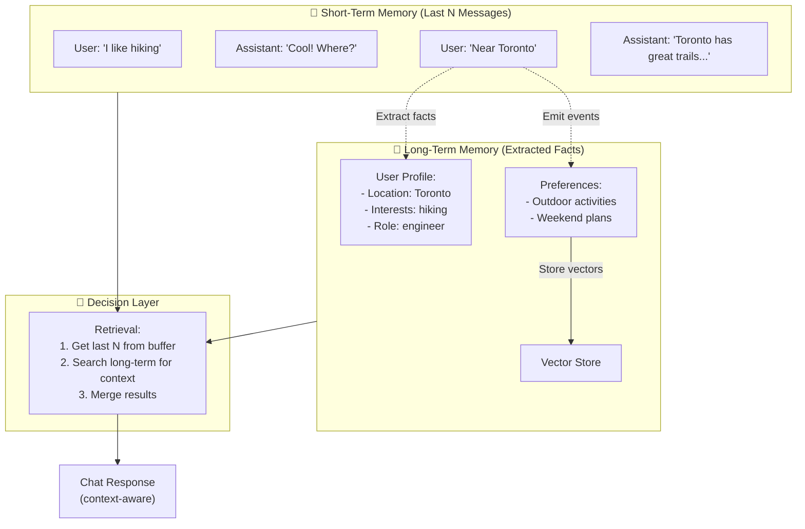
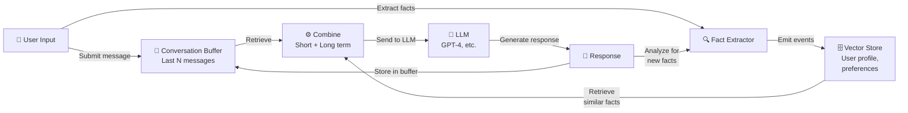
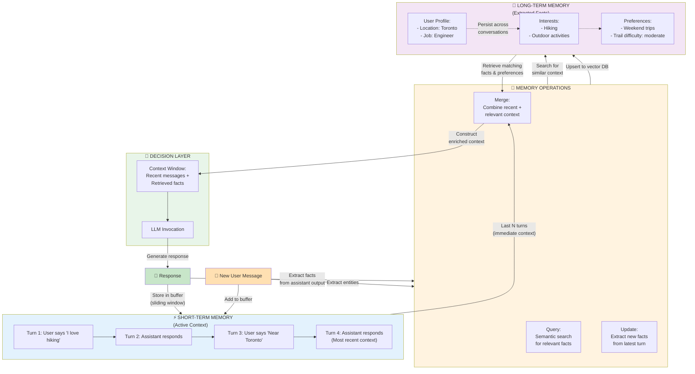
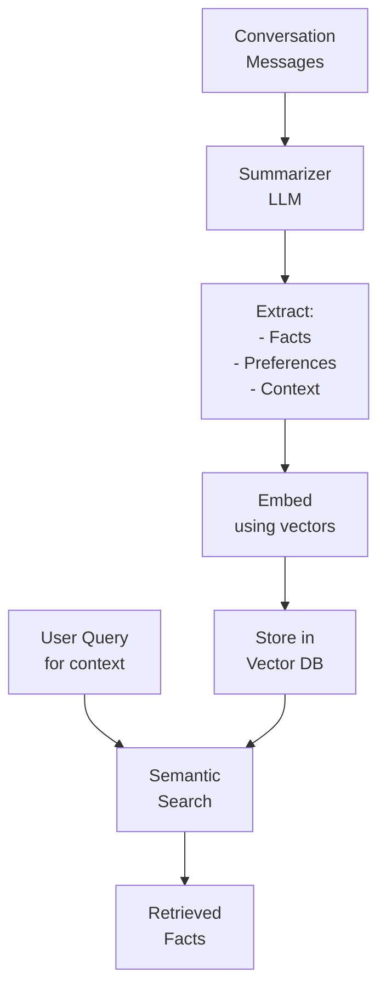

# WP-2.1: Short-Term vs. Long-Term Memory - A Working Model

**Work Product**: 2.1 - Memory Architecture for Stateful Conversations  
**Status**: Complete  
**Date**: 2026-06-25  
**Audience**: Engineers building conversational systems that must scale with conversation length  

---

## 📋 Document Navigation

| Section | Topic | Duration | Level |
|---------|-------|----------|-------|
| 1 | Executive Summary | 5 min | All |
| 2 | The Memory Problem | 10 min | All |
| 3 | Architecture: Dual-Memory Pattern | 15 min | Intermediate |
| 4 | Short-Term Memory: ConversationBufferWindowMemory | 15 min | Intermediate |
| 5 | Long-Term Memory: Vector Store + Summary | 15 min | Advanced |
| 6 | Separation of Concerns | 10 min | Intermediate |
| 7 | Implementation Patterns | 20 min | Advanced |
| 8 | Trade-offs & Decision Matrix | 10 min | Advanced |
| 9 | Next Steps & References | 5 min | All |

**Estimated Total Reading Time**: ~1.5 hours  
**Hands-on Practice Time**: See examples_2_1.py (~2 hours)  

---

## 📌 Key Notation Used in This Document

- **💡 KEY INSIGHT**: The core idea you should remember
- **⚠️ COMMON MISTAKE**: Pitfall to avoid
- **✅ BEST PRACTICE**: Recommended approach
- **🔬 TECHNICAL DETAIL**: Deep implementation info
- **📖 REFERENCE**: Links to more resources
- **💻 CODE EXAMPLE**: Practical code you can run

---

## Executive Summary

Conversational AI systems face a fundamental tension:

**The Problem**: A chatbot trained on `n` messages has context length that grows linearly with `n`. Eventually, the bot exceeds token limits, and the cost per request explodes. Yet discarding history entirely means the bot forgets user preferences, context, and multi-turn reasoning.

**The Solution**: Separate memory into two streams:

1. **Short-Term Memory**: Keep the last `N` messages in `ConversationBufferWindowMemory` to maintain immediate context.
2. **Long-Term Memory**: Extract facts, preferences, and semantic meaning into a vector store with `ConversationSummaryMemory` to capture what matters without token bloat.

**💡 KEY INSIGHT**: Memory architecture is not a detail—it is a scaling lever. The right pattern lets you maintain conversation quality while keeping token counts predictable.

This work product shows:
- **What** the dual-memory pattern is and why it matters
- **How** to implement short-term and long-term memory
- **When** to use buffering vs. summarization vs. vector retrieval
- **Why** separation of concerns makes the system observable and maintainable
- **Where** this pattern fits in the larger system architecture

---

## Part 1: The Memory Problem

### Why Context Matters

In a multi-turn conversation, context determines quality:

```
User: I'm an engineer from Toronto who loves hiking.
Assistant: (remembers: Toronto, engineer, hiking)

...10 turns later...

User: What should I do this weekend?
Assistant: (can recommend hiking trails near Toronto)
```

But remembering everything is expensive:

| Message Count | Tokens Needed | Cost per Request |
|---------------|---------------|------------------|
| 5 | 500 | $0.001 |
| 20 | 2,000 | $0.004 |
| 100 | 10,000 | $0.020 |
| 500 | 50,000 | EXCEEDS LIMIT |

By message 500, we hit the token limit. The conversation dies.

### Three Naive Approaches (and Why They Fail)

**Approach 1: Keep Everything**
```python
# ❌ NAIVE: Store all messages
messages = []
messages.append(user_input)
messages.append(model_output)
# After 50 turns, tokens exceed limit
```
**Problem**: Unbounded growth, exceeds context window.

**Approach 2: Forget Everything**
```python
# ❌ NAIVE: No memory
response = model(user_input)  # No history
# Loss of all context, personality, preferences
```
**Problem**: Each turn is a cold start. No learning.

**Approach 3: Summarize Once**
```python
# ❌ NAIVE: Summarize the entire conversation
summary = llm.summarize(all_messages)
# But which summary? Old context is lost forever
```
**Problem**: Information loss. Can't distinguish between recent and old context.

---

## Part 2: Architecture - The Dual-Memory Pattern

### High-Level Vision



### The Two Memory Streams

#### Stream 1: Short-Term Memory
- **What**: Last `N` messages in a buffer
- **Type**: `ConversationBufferWindowMemory`
- **Size**: Bounded (e.g., 10 messages = ~1,000 tokens)
- **Lifetime**: Current conversation only
- **Purpose**: Immediate context for the current turn

#### Stream 2: Long-Term Memory
- **What**: Extracted facts and semantic meaning
- **Type**: `ConversationSummaryMemory` (summarizes and stores in vector DB)
- **Size**: Unbounded but compressed
- **Lifetime**: Persists across conversations
- **Purpose**: User profile, preferences, discovered facts

### Data Flow Diagram



### Dual-Memory Interaction Model (Complete Cycle)

This diagram shows the complete memory interaction cycle during a single conversation turn:



**💡 KEY INSIGHT**: On each turn:
1. **Short-term** buffers the recent exchange (tokens-bounded)
2. **Long-term** retrieves facts matching the query context (semantically relevant)
3. **Merge** combines both to create the enriched context window
4. **Response** is analyzed to extract new facts for long-term storage

This cycle keeps conversation quality high while maintaining predictable token costs.

---

## Part 3: Short-Term Memory - ConversationBufferWindowMemory

### What It Is

A fixed-size sliding window of messages. Like a video buffer:

```
Turn 1: [A]
Turn 2: [A, B]
Turn 3: [A, B, C]
Turn 4: [B, C, D]  ← A is dropped (window size = 3)
Turn 5: [C, D, E]  ← B is dropped
```

### Why This Pattern

✅ **Tokens are predictable**: Max tokens = `window_size × avg_message_length`  
✅ **Recent context is preserved**: The model sees the last N exchanges  
✅ **Cost is bounded**: Each request costs roughly the same  
✅ **Simple implementation**: Built into LangChain

### Implementation

```python
from langchain.memory import ConversationBufferWindowMemory

short_term_memory = ConversationBufferWindowMemory(
    k=5,  # Keep last 5 messages (buffer window)
    memory_key="history",
    human_prefix="User",
    ai_prefix="Assistant",
    return_messages=True,
)

# Add turns
short_term_memory.save_context(
    inputs={"input": "I love hiking"},
    outputs={"output": "That's great! Where do you hike?"}
)

# Retrieve
history = short_term_memory.load_memory_variables({})
print(history["history"])
# [
#   HumanMessage("I love hiking"),
#   AIMessage("That's great! Where do you hike?")
# ]
```

### Design Decisions

| Decision | Rationale |
|----------|-----------|
| `k=5` (or 10-20) | Balances recency bias with token count. Too small = lost context. Too large = exceeds limits. |
| `return_messages=True` | Returns `Message` objects, not strings. Better for composition. |
| One memory per thread/session | Prevents conversations from interfering with each other. |

---

## Part 4: Long-Term Memory - Vector Store + Summarization

### What It Is

A process that:
1. Reads the conversation
2. Extracts facts: "User is from Toronto, works as an engineer, prefers outdoor activities"
3. Stores these facts in a vector database
4. On each new turn, retrieves similar facts to enrich context

### Why Summarization + Vector Store

- **Summarization alone** is information loss (you forget which context is old vs. new)
- **Vectors alone** are slow (you'd need to embed every message)
- **Combined**: Extract once, query fast, scale to millions of conversations

### The Architecture



### Implementation Pattern

```python
from langchain.memory import ConversationSummaryMemory
from langchain_community.vectorstores import Chroma
from langchain_openai import OpenAIEmbeddings
from langchain_openai import ChatOpenAI

# Step 1: Create the summarizer memory
llm = ChatOpenAI(model="gpt-4")
long_term_memory = ConversationSummaryMemory(
    llm=llm,
    memory_key="long_term_history",
    return_messages=True,
)

# Step 2: Create a vector store for semantic search
embeddings = OpenAIEmbeddings()
vector_store = Chroma(
    collection_name="user_facts",
    embedding_function=embeddings
)

# Step 3: Add context
long_term_memory.save_context(
    inputs={"input": "I'm from Toronto and I'm an engineer"},
    outputs={"output": "Interesting! What kind of engineering?"}
)

# Step 4: Retrieve
summary = long_term_memory.load_memory_variables({})
print(summary["long_term_history"])
# "The user is from Toronto and works as an engineer."
```

### Design Decisions

| Decision | Rationale |
|----------|-----------|
| Use LLM to summarize | Better quality than rule-based extraction |
| Store in vectors | Fast semantic retrieval without iteration |
| Separate from short-term | Prevents confusion about "what's recent" |
| Update on each turn | Captures evolving context without drift |

---

## Part 5: Separation of Concerns

### Why It Matters

A monolithic memory is hard to debug, expensive to query, and difficult to understand:

```python
# ❌ ANTI-PATTERN: Mixed concerns
class MonolithicMemory:
    def __init__(self, messages, summary, vector_db):
        self.everything = messages + summary  # Mixing fresh and old
        self.is_this_recent_or_old = ???  # Ambiguous
        self.search_cost = O(n)  # Slow

# ✅ PATTERN: Separation
class DualMemorySystem:
    def __init__(self):
        self.short_term = ConversationBufferWindowMemory(k=10)
        self.long_term = ConversationSummaryMemory(llm=...)
        self.vector_store = Chroma(...)
    
    def get_context(self, query: str) -> str:
        recent = self.short_term.load_memory_variables({})
        facts = self.vector_store.similarity_search(query, k=3)
        return recent + facts  # Clear composition
```

### The Contract

Each memory has a single responsibility:

| Memory | Input | Output | Guarantees |
|--------|-------|--------|-----------|
| **Short-Term** | Last N messages | Messages | Bounded size, recent only |
| **Long-Term** | Conversation stream | Extracted facts | Semantic meaning, unbounded |

### Observability Benefits

```python
# Easy to debug
print("Short-term:", short_term_memory.load_memory_variables({}))
# → [recent messages]

print("Long-term:", long_term_memory.load_memory_variables({}))
# → "The user is from Toronto, is an engineer, likes hiking..."

print("Vector search:", vector_store.similarity_search("hiking"))
# → [fact1, fact2, fact3]

# Easy to test each in isolation
```

---

## Part 6: Implementation Patterns

### Pattern 1: Initialize Both Memories

```python
from langchain.memory import ConversationBufferWindowMemory, ConversationSummaryMemory
from langchain_openai import ChatOpenAI
from langchain_community.vectorstores import Chroma
from langchain_openai import OpenAIEmbeddings

def setup_dual_memory():
    llm = ChatOpenAI(model="gpt-4")
    
    # Short-term: last 10 messages
    short_term = ConversationBufferWindowMemory(
        k=10,
        memory_key="recent_messages",
        return_messages=True,
    )
    
    # Long-term: summarized facts
    long_term = ConversationSummaryMemory(
        llm=llm,
        memory_key="user_profile",
        return_messages=True,
    )
    
    # Vector store: semantic search
    embeddings = OpenAIEmbeddings()
    vector_store = Chroma(
        collection_name="user_facts",
        embedding_function=embeddings,
    )
    
    return short_term, long_term, vector_store
```

### Pattern 2: Adding a Message to Both Memories

```python
def add_exchange(short_term, long_term, vector_store, user_msg, assistant_msg):
    """Add both user and assistant messages to both memories."""
    
    # Add to short-term (bounded window)
    short_term.save_context(
        inputs={"input": user_msg},
        outputs={"output": assistant_msg}
    )
    
    # Add to long-term (summarized)
    long_term.save_context(
        inputs={"input": user_msg},
        outputs={"output": assistant_msg}
    )
    
    # Extract facts and store in vector DB
    # (See examples_2_1.py for full implementation)
```

### Pattern 3: Retrieving Context for a New Request

```python
def get_context(short_term, long_term, vector_store, user_query):
    """Get both short-term and long-term context for a query."""
    
    # Recent messages
    recent = short_term.load_memory_variables({})["recent_messages"]
    
    # Summarized profile
    profile = long_term.load_memory_variables({})["user_profile"]
    
    # Semantic facts
    facts = vector_store.similarity_search(user_query, k=3)
    
    return {
        "recent": recent,
        "profile": profile,
        "facts": [f.page_content for f in facts]
    }
```

---

## Part 7: Trade-offs & Decision Matrix

### Short-Term vs. Long-Term: When to Use Each

| Scenario | Short-Term | Long-Term | Rationale |
|----------|-----------|----------|-----------|
| **Recent exchanges** | ✅ | ❌ | Immediate context is in the buffer |
| **User preferences** | ❌ | ✅ | Extracted and summarized over time |
| **Multi-turn reasoning** | ✅ | ❌ | Reasoning chain is recent |
| **Cross-session continuity** | ❌ | ✅ | Long-term facts persist |
| **Summarization cost** | ❌ | ✅ | LLM calls for extraction only |
| **Token count** | ✅ | ❌ | Short-term is bounded |

### Tuning Parameters

```python
# SHORT-TERM: Adjust window size
k=5    # Very short: only immediate context
k=10   # Balanced: typical choice
k=20   # Very long: includes full context

# LONG-TERM: Adjust summarization frequency
update_every=1     # Every message (expensive)
update_every=5     # Every 5 messages (balanced)
update_every=10    # Every 10 messages (fast)

# VECTOR SEARCH: Adjust retrieval size
vector_k=1    # Only most similar fact
vector_k=3    # Top 3 facts (typical)
vector_k=10   # Many facts (high recall)
```

### Cost Analysis

| Component | Cost | Frequency |
|-----------|------|-----------|
| **Short-term buffer** | Input/output tokens only | Every turn |
| **Long-term summary** | ~1,000 tokens (LLM call) | Every N messages |
| **Vector search** | Minimal (local or cached) | Every turn |
| **Embedding** | ~50 tokens per fact | Every N messages |

**Example: 100 turns in a conversation**
- Short-term only: 10 messages × 500 tokens = 5,000 tokens
- Long-term additions: 10 LLM calls × 1,000 tokens = 10,000 tokens
- **Total**: ~15,000 tokens for 100-turn conversation (vs. 50,000 with full history)

---

## Part 8: Production Patterns

### Pattern: Monitoring Memory Health

```python
def memory_stats(short_term, long_term):
    """Monitor memory system health."""
    recent = short_term.load_memory_variables({})
    profile = long_term.load_memory_variables({})
    
    stats = {
        "recent_message_count": len(recent.get("recent_messages", [])),
        "profile_length": len(str(profile.get("user_profile", ""))),
        "vector_store_size": vector_store._collection.count(),
    }
    return stats

# In production: log these stats
stats = memory_stats(short_term, long_term)
logger.info(f"Memory stats: {stats}")
```

### Pattern: Clearing Memory on Session Reset

```python
def reset_memory(short_term, long_term, vector_store):
    """Clear short-term but preserve long-term."""
    short_term.chat_memory.clear()  # Clears recent messages
    # Long-term and vector store persist for future sessions
```

### Pattern: Exporting for Analysis

```python
def export_memory_snapshot(short_term, long_term, vector_store):
    """Export memory state for debugging or auditing."""
    return {
        "recent_messages": short_term.load_memory_variables({}),
        "user_profile": long_term.load_memory_variables({}),
        "facts": [f.page_content for f in vector_store.similarity_search("*", k=100)],
        "timestamp": datetime.now().isoformat(),
    }
```

---

## Part 10: Next Steps & References

### Recommended Reading

- [ConversationBufferWindowMemory in LangChain](https://api.python.langchain.com/en/latest/memory/langchain.memory.ConversationBufferWindowMemory.html)
- [ConversationSummaryMemory in LangChain](https://api.python.langchain.com/en/latest/memory/langchain.memory.ConversationSummaryMemory.html)
- [Vector Stores in LangChain](https://api.python.langchain.com/en/latest/vectorstores/langchain_community.vectorstores.base.VectorStore.html)

### Next Work Products in This Series

- **WP-2.2**: Agent Memory - Multi-Agent State Management
- **WP-2.3**: Workflow Orchestration vs. Choreography
- **WP-2.4**: Error Recovery and Fallback Patterns

### Hands-On Exercise

See [examples_2_1.py](examples_2_1.py) for a complete, runnable example of:
- A chatbot with dual-memory architecture
- Short-term message buffering
- Long-term fact extraction and retrieval
- Vector store integration
- End-to-end conversation simulation

---

## Part 11: Implementation Checklist

Use this checklist when implementing the dual-memory pattern in your application:

### Phase 1: Planning
- [ ] Define your conversation lifetime (how long conversations last)
- [ ] Estimate token budget per request (e.g., 2,000 tokens)
- [ ] Decide short-term buffer size `k` (typical: 5-20 messages)
- [ ] Identify what facts to extract for long-term memory
- [ ] Choose a vector store (Chroma, Pinecone, Weaviate, etc.)
- [ ] Plan user profile schema (what to store)

### Phase 2: Implementation
- [ ] Initialize `ConversationBufferWindowMemory` with chosen `k`
- [ ] Initialize `ConversationSummaryMemory` with your LLM
- [ ] Set up vector store connection
- [ ] Implement fact extraction logic (or use LLM-based extraction)
- [ ] Create DualMemory wrapper class
- [ ] Add context retrieval method

### Phase 3: Integration
- [ ] Integrate with your chatbot's `invoke()` method
- [ ] Ensure memory is saved after each turn
- [ ] Test short-term buffer bounding
- [ ] Test long-term accumulation
- [ ] Validate memory separation

### Phase 4: Observability
- [ ] Add memory statistics logging
- [ ] Implement memory inspection endpoint
- [ ] Create dashboard for memory metrics
- [ ] Set up alerts for memory issues

### Phase 5: Optimization
- [ ] Tune `k` value based on quality/cost trade-offs
- [ ] Optimize fact extraction frequency
- [ ] Profile vector search performance
- [ ] Monitor token usage over time

---

## Part 12: Troubleshooting FAQ

### Q: Short-term buffer is filling up too quickly. What should I do?
**A**: Reduce `k` (the buffer size). For example, change from `k=10` to `k=5`. This reduces immediate context but keeps token counts more predictable. Compensate by improving long-term fact extraction.

### Q: The chatbot is forgetting important context between sessions.
**A**: Your long-term memory extraction is insufficient. Check:
1. Are all important facts being tagged?
2. Is the vector store being populated correctly?
3. Try lowering the similarity threshold for retrieval (retrieve more facts).

### Q: Memory lookups are too slow (high latency).
**A**: Vector search is slow. Options:
1. Use a faster vector store (Pinecone is faster than Chroma)
2. Reduce `k` for vector retrieval (retrieve fewer facts)
3. Add caching for frequently accessed profiles
4. Use batch operations when possible

### Q: Token counts are still exploding.
**A**: You may not have short-term memory bounding. Verify:
1. `ConversationBufferWindowMemory` is using the correct `k`
2. Prompts aren't including the entire long-term summary
3. You're retrieving only top-K facts, not all facts

### Q: How do I clear memory when starting a new session?
**A**: Call `short_term_memory.clear()`. Long-term memory persists by design.

```python
def reset_session(bot):
    bot.short_term_memory.clear()
    # Long-term memory stays, but short-term is reset
```

### Q: Can I export memory for analysis?
**A**: Yes, implement an export method:

```python
def export_memory_state(bot):
    return {
        "short_term": bot.short_term_memory.load_memory_variables({}),
        "long_term": bot.long_term_memory.load_memory_variables({}),
        "timestamp": datetime.now().isoformat()
    }
```

---

## Part 13: Related Work & Context

This work product builds on concepts from earlier work products:

- **WP-1.3** (The Runnable Protocol): Understanding memory as composable Runnables
- **WP-1.4** (Prompt Engineering as Code): How to structure prompts with memory context
- **WP-1.5** (Output Parsing): Extracting structured facts from LLM outputs
- **WP-1.7** (Tracing with LangSmith): Observing memory in production

---

## Part 14: Key Takeaways

1. **Separate concerns**: Short-term (buffer) and long-term (summary) serve different purposes
2. **Bound the short-term**: Use a fixed window to keep tokens predictable
3. **Scale the long-term**: Use vectors and summarization to capture unbounded history
4. **Make it observable**: Each memory component should be easy to inspect and test
5. **Measure the impact**: Track memory stats and adjust parameters based on quality/cost
6. **Persist smartly**: Short-term resets per session; long-term persists across sessions

---
