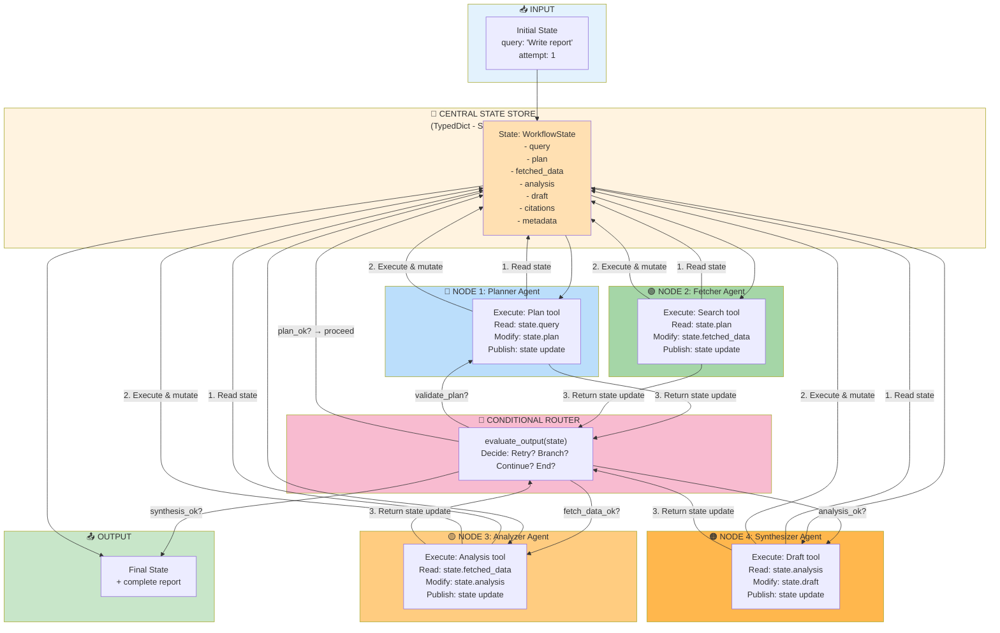

# WP-2.6: Introduction to LangGraph for Stateful Graphs

**Work Product**: Reimplementation of orchestration patterns using LangGraph's StateGraph framework  
**Status**: Complete | Production-Ready  
**Duration**: 2-2.5 hours  
**Prerequisites**: [WP-2.3 Orchestration Pattern](WP-2.3-Orchestration-Pattern.md) | [ADR-2.2 Architecture](ADR-2.2-Orchestration-Centralized-Control.md)

---

## Overview

In [WP-2.3](WP-2.3-Orchestration-Pattern.md), you built a **6-step report orchestrator from scratch**. Every component—state tracking, step routing, retry logic, validation gates, history recording—was manually implemented. The result was robust and educational, but required ~400 lines of boilerplate.

This work product introduces **LangGraph**, a framework purpose-built for exactly this pattern. LangGraph's `StateGraph` abstracts away the infrastructure you built manually, providing:

- **Native state machines**: Declare workflows as nodes + edges, not custom state classes
- **Automatic persistence**: State saved at each step, resumable on failure
- **Declarative routing**: Conditional edges replace if/else routing logic
- **Production features**: Built-in checkpointing, streaming, and observability

This is not "another way to code it from scratch." LangGraph eliminates boilerplate while validating what you learned: **state machines are so fundamental to AI workflows that framework support is essential.**

### Key Takeaways

- **The problem**: Manual orchestration requires significant infrastructure for a common pattern
- **The solution**: LangGraph provides production-grade state machine support out of the box
- **The mapping**: Your manual orchestrator → LangGraph StateGraph (1:1 conceptual match)
- **The benefit**: Faster development, fewer bugs, built-in observability and persistence

---

## Section 1: The Manual Approach and Its Costs

Your WP-2.3 orchestrator works because you explicitly built the state machine infrastructure. Let's quantify the burden.

### State and Routing Boilerplate

Your `ReportOrchestrator` class contains:

```python
# 1. State definition (50 lines)
@dataclass
class OrchestrationState:
    workflow_id: str
    plan: Optional[List[str]]
    fetched_data: Optional[List[Dict]]
    extracted_facts: Optional[List[Dict]]
    draft_report: Optional[str]
    report_with_citations: Optional[str]
    final_report: Optional[str]
    step_history: List[StepExecution]
    # ... 10 more fields for tracking

# 2. Step routing logic (100+ lines)
async def orchestrate(self, task: str) -> str:
    # Manual routing based on step index
    for step_index in range(len(self.steps)):
        step = self.steps[step_index]
        
        if step == StepName.PLANNING:
            result = await self.execute_step(
                step, 
                task, 
                evaluator=evaluate_plan
            )
        elif step == StepName.FETCHING:
            result = await self.execute_step(
                step,
                self.state.plan,
                evaluator=evaluate_fetched_data
            )
        # ... 4 more elif branches

# 3. Retry loop with backoff (50 lines)
for attempt in range(1, max_retries + 1):
    try:
        # Execute tool
        result = await tool(input_data)
        
        # Evaluate
        is_acceptable, reason = evaluator(result)
        if not is_acceptable:
            if attempt < max_retries:
                await asyncio.sleep(0.5 * attempt)  # Backoff
                continue
        # ...
    except Exception as e:
        if attempt < max_retries:
            await asyncio.sleep(0.5 * attempt)
            continue
        raise

# 4. History recording and serialization (50 lines)
def record_step(self, execution: StepExecution) -> None:
    self.step_history.append(execution)
    if execution.status == StepStatus.SUCCESS:
        self.total_steps_completed += 1
    elif execution.status == StepStatus.RETRY:
        self.total_retries += 1
    # ...
    
    if execution.error:
        self.errors.append(f"{execution.step_name}: {execution.error}")
```

### The Cost Summary

| Component | Lines | Purpose |
|-----------|-------|---------|
| State definition | ~50 | Define what orchestration holds |
| Step routing | ~100 | Route to correct step function |
| Retry logic | ~50 | Exponential backoff, attempt tracking |
| History recording | ~50 | Track every step for audit trail |
| Evaluation integration | ~50 | Call evaluators, decide next action |
| **Total** | **~400** | ~60% is state/routing, not domain logic |

### What Happens When Needs Change

Your manual orchestrator works great for the 6-step report flow, but consider these requirements:

1. **Add parallel steps**: "Fetch from 3 sources in parallel, then merge"
   - Manual approach: Refactor to async task groups, redesign state merge logic (~50 new lines)
   - Cost: Architectural change, not just config

2. **Add checkpointing**: "Save state after each step, resume on failure"
   - Manual approach: Implement serialization, database save/load (~100 new lines)
   - Cost: New infrastructure, testing, debugging

3. **Add conditional branches**: "If fetch fails twice, skip to synthesis with empty data"
   - Manual approach: Add branch logic to router (~30 new lines)
   - Cost: Router becomes fragile, harder to reason about

4. **Add human-in-the-loop**: "Pause before synthesis, let human review facts"
   - Manual approach: Implement approval step, state persistence (~80 new lines)
   - Cost: Exponential complexity growth

Each evolution requires careful changes to state management and routing. LangGraph makes these changes declarative, not architectural.

---

## Section 2: LangGraph StateGraph – Native State Machines

**LangGraph** is a framework from LangChain for building stateful, agentic workflows. Its core abstraction is the **StateGraph**: a directed graph where:

- **Nodes** are functions that execute tools and transform state
- **Edges** are transitions between nodes
- **Conditional edges** are smart routing based on evaluation logic
- **State** is automatically managed, persisted, and passed between nodes

### Agent Control Plane: State Flow Across Agents (Mermaid)

This diagram shows how state is passed between multiple agents through the LangGraph control plane:



**Key Mechanisms:**

1. **Shared State Store** – All agents read/write to the same `WorkflowState` object
2. **State Mutations** – Each agent node updates state and returns it
3. **Conditional Routing** – After each node, a router evaluates the state and decides the next step
4. **Automatic Persistence** – State is checkpointed after each node (with `SqliteSaver`)
5. **Typed State Schema** – `TypedDict` ensures all agents agree on state shape

**Advantages Over Manual Approach:**
- ✅ No manual state threading between agents
- ✅ Automatic checkpointing and resumability
- ✅ Graph visualization shows exact control flow
- ✅ Conditional routing is declarative, not procedural
- ✅ State mutations are atomic per node

### Conceptual Mapping

Here's how your manual orchestrator maps 1:1 to LangGraph concepts:

```
Manual Approach               → LangGraph Equivalent
─────────────────────────────────────────────────────────
if step == PLANNING:          → Conditional edges with 
    go to FETCHING                evaluate_plan function
    
for attempt in range(...):    → Built-in node retries
    try_step()                   (retry=N parameter)
    
state.step_history.append()   → Automatic state mutation
                                at each node

Manual state management       → TypedDict state schema
class OrchestrationState      class OrchestrationState
```

### The StateGraph API (Simplified)

```python
from langgraph.graph import StateGraph, START, END
from typing_extensions import TypedDict

# 1. Define state schema
class WorkflowState(TypedDict):
    query: str
    plan: Optional[List[str]]
    fetched_data: Optional[List[Dict]]
    # ... other fields

# 2. Create graph
workflow = StateGraph(WorkflowState)

# 3. Add nodes (functions that execute tools)
workflow.add_node("plan", plan_node)        # Node name, function
workflow.add_node("fetch", fetch_node)
# ...

# 4. Add edges (transitions)
workflow.add_edge(START, "plan")            # Begin with plan
workflow.add_edge("format", END)            # End after format

# 5. Add conditional edges (evaluation-based routing)
workflow.add_conditional_edges(
    "plan",                     # Source node
    evaluate_plan,              # Function returning next node name
    {
        "plan": "plan",         # If eval returns "plan", retry
        "fetch": "fetch",       # If eval returns "fetch", continue
    }
)

# 6. Compile
app = workflow.compile()

# 7. Invoke
result = await app.ainvoke(initial_state)
```

### Why This Matters

By using LangGraph's abstractions, you:

1. **Eliminate boilerplate**: No manual state tracking, routing, or retry logic
2. **Gain persistence**: Checkpointing is automatic (option: add `SqliteSaver`)
3. **Enable new patterns**: Parallel branches, subgraphs, streaming all work naturally
4. **Improve observability**: Graph visualization, execution traces, step-by-step inspection
5. **Focus on logic**: Write node functions (the tools), not infrastructure

---

## Section 3: Reimplementation – 6-Step Report Orchestrator in LangGraph

Let's build the 6-step orchestrator using LangGraph. The result is ~150 lines of code (vs. ~400 manual).

### State Schema

```python
from typing_extensions import TypedDict
from typing import Optional, List, Dict

class OrchestrationState(TypedDict):
    """State for the 6-step report orchestration."""
    query: str
    plan: Optional[List[str]]
    fetched_data: Optional[List[Dict]]
    facts: Optional[List[Dict]]
    synthesis: Optional[str]
    citations: Optional[str]
    report: Optional[str]
    step_history: List[dict]  # Track: {name, duration_ms, success, eval_result}
```

### Node Functions

Each node is a function that:
1. Takes current state
2. Calls a tool
3. Updates state with tool result
4. Returns state delta (dict of changed fields)

```python
async def plan_node(state: OrchestrationState) -> dict:
    """Planning step: break down query into steps."""
    result = await plan_tool(state["query"])
    
    return {
        "plan": result,
        "step_history": state.get("step_history", []) + [
            {"name": "plan", "success": True}
        ]
    }

async def fetch_node(state: OrchestrationState) -> dict:
    """Fetch step: search for information."""
    result = await fetch_tool(state["plan"])
    
    return {
        "fetched_data": result,
        "step_history": state.get("step_history", []) + [
            {"name": "fetch", "success": True}
        ]
    }

async def analyze_node(state: OrchestrationState) -> dict:
    """Analysis step: extract facts."""
    result = await analyze_tool(state["fetched_data"])
    
    return {
        "facts": result,
        "step_history": state.get("step_history", []) + [
            {"name": "analyze", "success": True}
        ]
    }

async def synthesize_node(state: OrchestrationState) -> dict:
    """Synthesis step: write draft report."""
    result = await synthesize_tool(state["facts"])
    
    return {
        "synthesis": result,
        "step_history": state.get("step_history", []) + [
            {"name": "synthesize", "success": True}
        ]
    }

async def cite_node(state: OrchestrationState) -> dict:
    """Citation step: add citations."""
    result = await cite_tool(state["synthesis"])
    
    return {
        "citations": result,
        "step_history": state.get("step_history", []) + [
            {"name": "cite", "success": True}
        ]
    }

async def format_node(state: OrchestrationState) -> dict:
    """Format step: final polish."""
    result = await format_tool(state["citations"])
    
    return {
        "report": result,
        "step_history": state.get("step_history", []) + [
            {"name": "format", "success": True}
        ]
    }
```

### Evaluation Functions (Conditional Edge Routing)

These functions return the next node name based on evaluation logic:

```python
def evaluate_plan(state: OrchestrationState) -> str:
    """Evaluate plan quality. Return next node name."""
    if not state.get("plan") or len(state["plan"]) < 3:
        return "plan"  # Retry planning
    return "fetch"     # Continue to fetch

def evaluate_fetch(state: OrchestrationState) -> str:
    """Evaluate fetch results."""
    if not state.get("fetched_data") or len(state["fetched_data"]) < 8:
        return "fetch"  # Retry fetching
    return "analyze"   # Continue to analyze

def evaluate_analyze(state: OrchestrationState) -> str:
    """Evaluate facts extraction."""
    if not state.get("facts") or len(state["facts"]) < 20:
        return "analyze"  # Retry analysis
    return "synthesize"  # Continue to synthesis

def evaluate_synthesis(state: OrchestrationState) -> str:
    """Evaluate draft report."""
    synthesis = state.get("synthesis", "")
    word_count = len(synthesis.split())
    if word_count < 1000:
        return "synthesize"  # Retry synthesis
    return "cite"          # Continue to citation

def evaluate_cite(state: OrchestrationState) -> str:
    """Evaluate citations."""
    citations = state.get("citations", "")
    citation_count = citations.count("[source:")
    if citation_count < 10:
        return "cite"     # Retry citation
    return "format"       # Continue to format
```

### Building the Graph

```python
from langgraph.graph import StateGraph, START, END

workflow = StateGraph(OrchestrationState)

# Add nodes
workflow.add_node("plan", plan_node)
workflow.add_node("fetch", fetch_node)
workflow.add_node("analyze", analyze_node)
workflow.add_node("synthesize", synthesize_node)
workflow.add_node("cite", cite_node)
workflow.add_node("format", format_node)

# Add edges
workflow.add_edge(START, "plan")  # Start with planning
workflow.add_edge("format", END)  # End after formatting

# Add conditional edges (evaluation gates)
workflow.add_conditional_edges(
    "plan",
    evaluate_plan,
    {"plan": "plan", "fetch": "fetch"}
)

workflow.add_conditional_edges(
    "fetch",
    evaluate_fetch,
    {"fetch": "fetch", "analyze": "analyze"}
)

workflow.add_conditional_edges(
    "analyze",
    evaluate_analyze,
    {"analyze": "analyze", "synthesize": "synthesize"}
)

workflow.add_conditional_edges(
    "synthesize",
    evaluate_synthesis,
    {"synthesize": "synthesize", "cite": "cite"}
)

workflow.add_conditional_edges(
    "cite",
    evaluate_cite,
    {"cite": "cite", "format": "format"}
)

# Compile the graph
app = workflow.compile()
```

### Execution

```python
async def main():
    initial_state = {
        "query": "Write an AI trends report",
        "plan": None,
        "fetched_data": None,
        "facts": None,
        "synthesis": None,
        "citations": None,
        "report": None,
        "step_history": [],
    }
    
    result = await app.ainvoke(initial_state)
    
    print(f"Final report:\n{result['report']}")
    print(f"Execution path: {[s['name'] for s in result['step_history']]}")

# Run
asyncio.run(main())
```

### Graph Visualization

```python
# See the graph structure
print(app.get_graph().draw_ascii())

# Output:
#          ┌─────────────┐
#          │   START     │
#          └──────┬──────┘
#                 │
#          ┌──────┴──────┐
#          │    plan     │
#          └──────┬──────┘
#                 │
#          ┌──────┴──────┐
#          │    fetch    │
#          └──────┬──────┘
#                 │
#          ┌──────┴──────┐
#          │   analyze   │
#          └──────┬──────┘
#                 │
#          ┌──────┴──────┐
#          │  synthesize │
#          └──────┬──────┘
#                 │
#          ┌──────┴──────┐
#          │    cite     │
#          └──────┬──────┘
#                 │
#          ┌──────┴──────┐
#          │    format   │
#          └──────┬──────┘
#                 │
#          ┌──────┴──────┐
#          │     END     │
#          └─────────────┘
```

---

## Section 4: From Manual to Native – What LangGraph Provides

LangGraph eliminates boilerplate but adds powerful capabilities that you had to build manually:

### 1. Automatic State Management

**Manual**: You track state fields on the class and manually update them.

```python
# WP-2.3 approach
self.state.plan = result
self.state.fetched_data = result
self.state.step_history.append(execution)
```

**LangGraph**: State is a dict; nodes return deltas; framework handles merging.

```python
# LangGraph approach
return {"plan": result, "step_history": [...]}  # Framework merges with existing state
```

### 2. Built-In Checkpointing

**Manual**: You'd need to implement serialization and database storage.

```python
# What you'd have to build:
async def save_checkpoint(self, step: str) -> None:
    db.save({
        "workflow_id": self.workflow_id,
        "step": step,
        "state": json.dumps(self.state),
        "timestamp": datetime.now(),
    })

async def resume_from_checkpoint(self, workflow_id: str) -> None:
    state_dict = db.get(workflow_id)
    self.state = OrchestrationState(**state_dict)
```

**LangGraph**: Checkpointing is optional but built-in.

```python
from langgraph.checkpoint.sqlite import SqliteSaver

memory = SqliteSaver()
app = workflow.compile(checkpointer=memory)

# Run with checkpointing
result = await app.ainvoke(
    initial_state,
    config={"configurable": {"thread_id": "run-1"}}
)

# Resume automatically if interrupted
```

### 3. Observability and Tracing

**Manual**: You log to a custom format and have to parse the logs.

```python
logger.info(f"  ⚙️  [{step_name.value}] Attempt {attempt}")
logger.info(f"     ✅ {reason}")
# Parse logs to understand execution
```

**LangGraph**: Built-in graph inspection and tracing.

```python
# Inspect graph structure
nodes = app.get_graph().nodes
edges = app.get_graph().edges

# Stream intermediate results
async for event in app.astream(initial_state):
    print(f"Step: {event}")

# Get execution trace
trace = app.get_graph().draw_ascii()
```

### 4. Conditional Routing (Declarative)

**Manual**: If/else in the router.

```python
# WP-2.3 approach - hardcoded routing
if is_acceptable:
    next_step = StepName.FETCHING
else:
    next_step = StepName.PLANNING  # Retry
```

**LangGraph**: Declarative conditional edges.

```python
# LangGraph approach - configuration, not code
workflow.add_conditional_edges(
    "plan",
    evaluate_plan,  # Returns next node name
    {"plan": "plan", "fetch": "fetch"}
)
```

### 5. Parallel Execution

**Manual**: You'd need to refactor nodes to async task groups.

```python
# Not supported in manual approach
# Would require significant architecture change
```

**LangGraph**: Add parallel nodes naturally.

```python
# LangGraph (not in this example, but possible)
# Add multiple nodes that don't depend on each other
# Execution happens in parallel
```

---

## Section 5: Manual vs. LangGraph – Trade-Off Analysis

| Dimension | Manual Orchestrator | LangGraph |
|-----------|---------------------|-----------|
| **Code complexity** | ~400 lines | ~150 lines |
| **State management** | Manual (class properties) | Built-in (TypedDict, framework handles updates) |
| **Retries** | Custom backoff loop (~50 lines) | Declarative (node retry parameter) |
| **Checkpointing** | None (lose state on crash) | Automatic (resume from checkpoint) |
| **Parallel steps** | Requires async refactor | Native (add_node multiple times) |
| **Conditional branches** | If/else in router (~30 lines) | Conditional edges (declarative) |
| **Observability** | Custom logging | Built-in graph visualization + streaming |
| **Time to production** | 3-4 weeks (build, test, stabilize) | 1-2 weeks (framework handles patterns) |
| **Learning curve** | Understand your custom code | Understand StateGraph concepts |
| **Extensibility** | Each change requires code refactoring | Changes are mostly declarative |

### Cost Calculation

**Manual approach**: ~400 lines of code + testing + debugging + maintenance.

- Time to implement: ~20-30 hours
- Time to stabilize: ~10-15 hours
- Time to extend (e.g., add parallel steps): ~8-10 hours

**LangGraph approach**: ~150 lines of code + learning curve.

- Time to implement: ~3-5 hours
- Time to stabilize: ~1-2 hours (framework handles edge cases)
- Time to extend (add parallel steps): ~30 minutes (declarative)

**Break-even point**: After 2-3 extensions or 1 production incident, LangGraph pays for itself.

---

## Section 6: When to Use LangGraph, When Manual

### Use LangGraph When

✅ **You have 3+ deterministic steps**  
The framework overhead is justified by eliminating boilerplate.

✅ **You need state checkpointing or resumability**  
Built-in checkpointing is a production necessity.

✅ **You want native agent decision-making**  
Agents can control routing using LangGraph agent nodes; your code doesn't route.

✅ **You expect the workflow to evolve**  
Adding branches, parallel steps, or conditions is easy in LangGraph.

✅ **Production deployment is planned**  
LangGraph is designed for production (observability, error handling, checkpointing).

✅ **Your team is learning LangChain ecosystem tools**  
Learning LangGraph pays dividends across multiple projects using LangChain.

### Use Manual Orchestration When

❌ **Workflow is 1-2 steps**  
Writing the glue manually is faster than learning a framework.

❌ **You have custom control logic that doesn't fit conditional edges**  
Pure Python code may be more flexible.

❌ **You're prototyping and state management isn't critical yet**  
Invest in framework after validating the workflow.

❌ **Your team is unfamiliar with graph concepts**  
Ramp-up time may offset productivity gains (temporary).

### Decision Tree

```
Do you have 3+ steps?
├─ No: Use manual (or simple function composition)
└─ Yes:
   Is state management critical?
   ├─ No: Can use either
   └─ Yes: Use LangGraph
   
   Will workflow evolve or branch?
   ├─ No: Either approach works
   └─ Yes: Use LangGraph (easier to extend)
```

---

## Section 7: LangGraph for State Machines – Why It Matters

State machines are **ubiquitous in AI workflows**:

### Examples Where State Machines Apply

1. **Multi-step agents** (this problem): Plan → Execute → Evaluate → Adapt → Retry
2. **Approval workflows**: Draft → Review → Approved/Rejected → Publish
3. **Hierarchical planning**: High-level plan → Low-level tasks → Execution → Monitoring
4. **Error recovery**: Try → Fail → Adapt input → Retry → Succeed
5. **Human-in-the-loop**: Auto → Pause → Human decision → Resume → Complete
6. **RAG pipelines**: Query → Retrieve → Rerank → Generate → Evaluate
7. **Data pipelines**: Extract → Transform → Validate → Load → Archive

In each case, you have:
- **States**: Plan, Review, Draft, etc.
- **Transitions**: Move from one state to next based on conditions
- **Validation gates**: Ensure state is ready for next transition
- **History tracking**: Audit trail of all transitions

### Why Framework Support Is Essential

Consider what happens as complexity grows:

**One-off workflow**: Manual code is fine (~100 lines).

**Two workflows**: You duplicate logic (~200 lines). Start feeling repetitive.

**Three workflows**: You refactor into a base class (~150 lines) + duplicates. Maintenance burden grows.

**Four workflows**: You realize state machines are a first-class pattern. Framework is necessary.

### The "Right Tool for the Job" Philosophy

This is the essence of **right tool for the job**:

- **Naive thinking**: "I can write state machines in Python"
- **Framework thinking**: "State machines are so fundamental that language-level support is essential"
- **LangGraph perspective**: "State machines in AI are so common that framework support is essential"

LangGraph validates this perspective. You understand orchestration deeply from WP-2.3. LangGraph lets you leverage that understanding without reimplementing the infrastructure.

### The Implication for Your Career

After WP-2.6, you'll recognize state machine patterns everywhere in AI:

- When you see a workflow with 4+ sequential steps, you'll think "StateGraph"
- When you see manual retry logic, you'll think "LangGraph can eliminate that"
- When you see custom routing code, you'll think "Conditional edges"

This is the mark of deep understanding: not just knowing *how* to build something, but recognizing when a framework is the right solution.

---

## Conclusion

LangGraph's StateGraph is the "right tool" for orchestrating multi-step AI workflows. It provides:

1. **Eliminating boilerplate**: ~60% of manual code is state/routing infrastructure
2. **Production capabilities**: Checkpointing, observability, error handling out of the box
3. **Natural extensibility**: New steps, branches, and parallel paths are declarative
4. **Team alignment**: Clear, visual workflow definition that teams can reason about

You've learned orchestration principles deeply in WP-2.3. LangGraph lets you apply that knowledge 3-4x faster, with fewer bugs and better observability.

**The next step**: Use LangGraph for any multi-step workflow in your projects. After one production deployment, you'll understand why this framework matters.

---

## References

- [LangGraph Documentation](https://python.langchain.com/docs/langgraph/)
- [StateGraph API Reference](https://python.langchain.com/docs/langgraph/concepts#graphs)
- [Conditional Edges](https://python.langchain.com/docs/langgraph/how-tos/conditional-edges)
- [Checkpointing](https://python.langchain.com/docs/langgraph/how-tos/persistence)
- [WP-2.3: Orchestration Pattern](WP-2.3-Orchestration-Pattern.md)
- [ADR-2.2: Orchestration Architecture](ADR-2.2-Orchestration-Centralized-Control.md)
