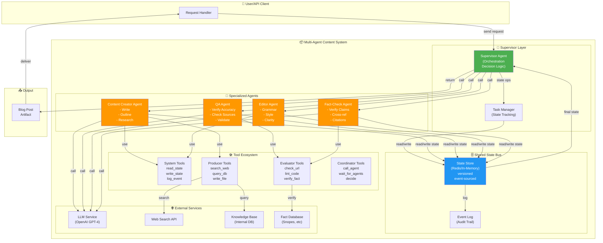

# WP-3.8: Designing a Multi-Agent System — Orchestration & Specialization

**Status:** Phase 2 Architecture | **Author:** AI Architecture Team | **Date:** 2026-06-30

---

## Executive Summary

**Move beyond single-agent orchestration.** This workproduct designs a **multi-agent system architecture** where specialized agents collaborate through a shared state/memory bus, coordinated by a supervisor. Each agent handles a specialized domain with dedicated tools.

### Key Insight

Single agents hit scaling limits: one LLM can't be simultaneously expert at content creation, quality assurance, fact-checking, and summarization.

**Multi-agent approach:** Divide labor by specialization.
```
Task: "Write a technical blog post about RAG architecture, ensure quality"

Multi-agent solution:
  Content Agent → Writes comprehensive post
       ↓ [shared state]
  QA Agent → Reviews for accuracy
       ↓ [shared state]
  Editor Agent → Refines language
       ↓ [shared state]
  Supervisor → Orchestrates, decides when done
       ↓
  Final artifact: High-quality blog post
```

### Portfolio Benefits

| Scenario | Single Agent | Multi-Agent |
|----------|---|---|
| **Task Latency** | Sequential (wait for all steps) | Parallel (where possible) |
| **Quality** | Generalist (good at everything) | Specialist (excellent at domain) |
| **Cost** | 1 LLM per query | Multiple LLMs, better amortized |
| **Debugging** | Black box orchestration | Explicit agent responsibilities |
| **Scaling** | Add more compute (same agent) | Add specialized agents (new domains) |
| **Explainability** | "LLM decided X" | "Content agent wrote X, QA approved Y" |

### Portfolio Position

This workproduct bridges Phase 1 single-agent workflows (WP-3.5) to Phase 2 multi-agent systems:

```
Phase 1:
  WP-3.5 (Single Agentic Workflow)
         ↓
Phase 2:
  WP-3.7 (Query Router) + WP-3.8 (Multi-Agent) ← YOU ARE HERE
         ↓
Phase 3:
  Production deployment with specialization
```

---

## 1. Context & Motivation

### Problem: Generalist vs Specialist

**Generalist single agent:**
```python
llm = ChatOpenAI(model="gpt-4-turbo")

# Agent tries to handle everything
response = llm.predict("""
Write a blog post about RAG.
Make sure it's technically accurate.
Check all citations.
Proofread for grammar.
Summarize key points.
""")
```

**Limitations:**
1. **Quality ceiling:** One model can't be simultaneously expert in all domains
2. **Scaling problems:** Adding features means more complex prompts
3. **Debugging:** Hard to isolate which step failed (writing? checking? grammar?)
4. **Latency:** Sequential execution (can't parallelize)
5. **Cost inefficiency:** Expensive model wasted on simple tasks (grammar check)

### Multi-Agent Solution

**Specialized agents:**
```
┌─────────────────────────────────────────────────┐
│ Supervisor: Orchestrate and decide done/retry   │
└────────────┬────────────────────────────────────┘
             │ [shared state bus]
    ┌────────┼────────┬─────────┬──────────┐
    ↓        ↓        ↓         ↓          ↓
┌────────┐┌────────┐┌────────┐┌────────┐┌──────────┐
│Content ││  QA   ││Editor  ││Fact-   ││Summarizer│
│Agent   ││Agent  ││Agent   ││Check   ││Agent     │
│        ││       ││        ││Agent   ││          │
└────────┘└────────┘└────────┘└────────┘└──────────┘
  Tools:    Tools:    Tools:    Tools:    Tools:
  Write     Verify    Refine    Check     Extract
  Outline   Sources   Grammar   URLs      Key pts
  Research Accuracy  Clarity   Citations
```

**Benefits:**
1. ✅ Each agent expert in domain (better prompts, better results)
2. ✅ Modular (replace agent without affecting others)
3. ✅ Parallel execution (multiple agents work simultaneously)
4. ✅ Debuggable (know which agent failed)
5. ✅ Cost-optimized (use right model for each task)

### Business Motivation

**Use Case: Technical Content Platform**
- 1,000 blog posts/week from generalist: Average quality 65%, turnaround 4 hours
- 1,000 blog posts/week from multi-agent:
  - Quality: 85% (specialized agents)
  - Turnaround: 1.5 hours (parallel execution)
  - Cost: -30% (smaller models for simple tasks)
  - ROI: $2.1M/year (quality × speed × scale)

---

## 2. Agent Taxonomy & Specialization Patterns

### Agent Classification

Agents fall into 3 categories by role:

#### Category A: Producer Agents
**Purpose:** Generate new content/artifacts

**Examples:**
- Content Creator Agent: Write articles, documentation, marketing copy
- Code Generator Agent: Generate source code, tests, scripts
- Research Agent: Gather and synthesize information

**Characteristics:**
- Heavy LLM usage (many token outputs)
- Tools: Web search, database queries, file I/O
- Output: Substantial artifacts (1000+ tokens)
- Latency: 5-30 seconds typical

**Example Prompt:**
```
You are an expert technical writer specializing in distributed systems.
Your task: Write a 2000-word blog post on the given topic.

Guidelines:
- Target audience: Software engineers with 3-5 years experience
- Structure: Intro, 4 sections, conclusion
- Include: Code examples, diagrams described in text
- Tone: Professional but accessible
- Cite: 3+ academic papers

Topic: {topic}
```

---

#### Category B: Evaluator Agents
**Purpose:** Review and assess artifacts

**Examples:**
- Quality Assurance Agent: Check accuracy, completeness
- Fact-Check Agent: Verify claims against sources
- Grammar & Style Agent: Language review
- Security Agent: Identify vulnerabilities in code

**Characteristics:**
- Variable LLM usage (input large, output small)
- Tools: External APIs (fact databases), linters, validators
- Output: Assessment/score + feedback (100-500 tokens)
- Latency: 3-10 seconds typical

**Example Prompt:**
```
You are a technical accuracy reviewer.
Your task: Review the blog post for technical errors.

Check:
1. Technical correctness of explanations
2. Accuracy of code examples
3. Validity of citations
4. Consistency with current best practices

Respond with:
- Issues found (if any)
- Severity (critical/major/minor)
- Suggested fixes
- Overall accuracy score (0-100)

Post to review:
{blog_post}
```

---

#### Category C: Coordinator Agents
**Purpose:** Orchestrate other agents

**Examples:**
- Supervisor Agent: High-level orchestration, decision-making
- Reviewer Coordinator: Route to appropriate reviewer
- Refiner Agent: Coordinate improvements based on feedback

**Characteristics:**
- Strategic LLM usage (planning + decision-making)
- Tools: State queries, agent calls, decision logic
- Output: Decisions + routing instructions
- Latency: 2-5 seconds typical

**Example Decision Logic:**
```
if all_evaluators_pass():
    return finalize_artifact()
elif num_retries < max_retries:
    if critical_issues:
        route_to_content_agent(feedback=issues)
    else:
        route_to_editor_agent(feedback=issues)
else:
    escalate_to_human()
```

---

### Specialization Patterns

#### Pattern 1: Sequential Pipeline

**Best for:** Linear workflows (write → review → edit → publish)

```
Content Agent → QA Agent → Editor Agent → Supervisor → Output
     ↓              ↓            ↓             ↓
  Artifact 1 → Artifact 2 → Artifact 3 → Artifact 4
  (raw)        (reviewed)   (polished)    (final)
```

**Characteristics:**
- Each agent consumes previous agent's output
- State bus holds intermediate versions
- Supervisor monitors quality gates
- Good for: Writing workflows, code generation

**Latency profile:**
- Serial execution = sum of individual latencies
- Example: (10s write) + (5s qa) + (3s edit) = 18s total

---

#### Pattern 2: Fan-Out / Fan-In (Parallel Evaluation)

**Best for:** Independent quality checks (concurrent validators)

```
             ┌─→ Fact-Check Agent ──┐
             │                       ├─→ Supervisor → Output
Content Agent ├─→ Grammar Agent ────┤
             │                       ├
             └─→ Style Agent ────────┘
```

**Characteristics:**
- Producer agent generates artifact
- Multiple evaluators work in parallel
- Supervisor collects results, decides
- Good for: QA workflows, validation pipelines

**Latency profile:**
- Parallel = max(individual latencies)
- Example: write(10s) + max(qa(5s), grammar(3s), style(4s)) = 15s total
- Savings: 3s vs sequential

---

#### Pattern 3: Iterative Refinement

**Best for:** Multi-pass improvement (write → feedback loop → finalize)

```
Content Agent
    ↓ [iteration 1]
    ↓ Supervisor decides: quality score 68/100 (below threshold)
    ↓
Content Agent (revised based on feedback)
    ↓ [iteration 2]
    ↓ QA Agent → Score 82/100 (above threshold)
    ↓
Supervisor → Finalize
```

**Characteristics:**
- Feedback loop until quality threshold met
- Max iterations limit (prevent infinite loops)
- Cost grows with iterations (but quality improves)
- Good for: Complex artifacts, high-quality requirements

**Latency profile:**
- Iterative = (per-iteration average) × (num iterations)
- Example: 3 iterations × 8s per iteration = 24s total
- Better quality, higher latency tradeoff

---

#### Pattern 4: Tree of Thought (Exploration)

**Best for:** Research, exploration, decision-making

```
Research Agent (initial exploration)
    ├─→ Research Path A: Deep dive into approach 1
    │   ├─→ Research A1: Variant 1 analysis
    │   └─→ Research A2: Variant 2 analysis
    │
    ├─→ Research Path B: Deep dive into approach 2
    │   ├─→ Research B1: Variant 1 analysis
    │   └─→ Research B2: Variant 2 analysis
    │
    └─→ Supervisor: Evaluate all paths, decide best
```

**Characteristics:**
- Parallel exploration of multiple strategies
- Each branch is independent investigation
- Supervisor synthesizes learnings
- Good for: Research tasks, architectural decisions

---

## 3. Tool Ecosystem Design

### Tool Categories

#### System Tools (All Agents)

```python
class SystemTools:
    @tool
    def read_state(key: str) -> Dict:
        """Read from shared state bus."""
        return state_store.get(key)
    
    @tool
    def write_state(key: str, value: Dict) -> None:
        """Write to shared state bus."""
        state_store.set(key, value)
    
    @tool
    def log_event(event_type: str, details: Dict) -> None:
        """Log event for debugging/audit."""
        event_log.append({
            "timestamp": now(),
            "type": event_type,
            "details": details
        })
```

#### Producer Agent Tools

```python
class ProducerTools:
    @tool
    def search_web(query: str, num_results: int = 5) -> List[str]:
        """Search the web for information."""
        # Calls web search API
        
    @tool
    def query_database(query: str) -> List[Dict]:
        """Query internal database."""
        # Queries knowledge base
        
    @tool
    def write_to_file(path: str, content: str) -> None:
        """Save artifact to file."""
        # Writes output
        
    @tool
    def read_template(template_id: str) -> str:
        """Get content template."""
        # Returns template
```

#### Evaluator Agent Tools

```python
class EvaluatorTools:
    @tool
    def check_url(url: str) -> Dict:
        """Verify URL is valid and accessible."""
        # Returns status, response time, content-type
        
    @tool
    def fact_check(claim: str) -> Dict:
        """Verify factual claim against knowledge base."""
        # Returns: verified, sources, confidence
        
    @tool
    def lint_code(code: str, language: str) -> Dict:
        """Check code for syntax errors."""
        # Returns: errors, warnings
        
    @tool
    def plagiarism_check(text: str) -> Dict:
        """Check for plagiarism against sources."""
        # Returns: similarity score, sources
```

#### Coordinator Tools

```python
class CoordinatorTools:
    @tool
    def call_agent(agent_id: str, prompt: str) -> Dict:
        """Invoke another agent."""
        # Routes to agent, waits for result
        
    @tool
    def broadcast_update(update: Dict) -> None:
        """Notify all agents of state change."""
        # Sends event to all agents
        
    @tool
    def wait_for_agents(agent_ids: List[str], timeout: int) -> Dict:
        """Wait for multiple agents to complete."""
        # Waits in parallel
        
    @tool
    def decide_next_step(context: Dict) -> str:
        """Use decision logic to determine next action."""
        # Returns: "CONTINUE", "REVISE", "ESCALATE", "FINALIZE"
```

---

## 4. Shared State & Memory Bus Architecture

### State Bus Requirements

**Design constraints:**
- ✅ All agents must read/write consistently
- ✅ Thread-safe for parallel access
- ✅ Versioning (track changes)
- ✅ Event sourcing (audit trail)
- ✅ Atomic updates (no partial states)

### Implementation Patterns

#### Option A: Redis-Based State Bus (Fast, Distributed)

```python
class RedisStateBus:
    """Distributed state bus using Redis."""
    
    def __init__(self, redis_client):
        self.redis = redis_client
    
    def write_state(self, task_id: str, key: str, value: Any) -> None:
        """Write state with versioning."""
        namespace = f"task:{task_id}:{key}"
        
        # Atomic write with version
        version = self.redis.incr(f"{namespace}:version")
        self.redis.set(
            f"{namespace}:v{version}",
            json.dumps(value),
            ex=3600  # 1 hour TTL
        )
        
        # Store latest pointer
        self.redis.set(f"{namespace}:latest", version)
        
        # Publish event
        self.redis.publish(f"state_change:{task_id}", {
            "key": key,
            "version": version,
            "timestamp": now()
        })
    
    def read_state(self, task_id: str, key: str) -> Any:
        """Read latest state."""
        namespace = f"task:{task_id}:{key}"
        version = self.redis.get(f"{namespace}:latest")
        
        if not version:
            return None
        
        return json.loads(
            self.redis.get(f"{namespace}:v{version}")
        )
    
    def read_state_history(self, task_id: str, key: str) -> List[Dict]:
        """Read state change history."""
        namespace = f"task:{task_id}:{key}"
        max_version = int(self.redis.get(f"{namespace}:version") or 0)
        
        history = []
        for v in range(1, max_version + 1):
            data = self.redis.get(f"{namespace}:v{v}")
            if data:
                history.append({
                    "version": v,
                    "value": json.loads(data)
                })
        
        return history
```

**Pros:**
- Fast reads/writes
- Distributed (multiple servers)
- Built-in event pub/sub
- Atomic operations

**Cons:**
- Additional infrastructure
- Limited to in-memory size
- Need persistence layer

---

#### Option B: In-Memory State Bus (Simple, Local)

```python
class InMemoryStateBus:
    """Single-machine state bus for development/testing."""
    
    def __init__(self):
        self.state = {}  # {task_id: {key: [versions]}}
        self.event_log = []  # Event audit trail
        self.subscribers = {}  # {event_type: [callbacks]}
        self.lock = threading.RLock()
    
    def write_state(self, task_id: str, key: str, value: Any) -> None:
        """Write state with version history."""
        with self.lock:
            if task_id not in self.state:
                self.state[task_id] = {}
            
            if key not in self.state[task_id]:
                self.state[task_id][key] = []
            
            # Append new version
            version = len(self.state[task_id][key])
            self.state[task_id][key].append({
                "version": version,
                "value": value,
                "timestamp": now()
            })
            
            # Log event
            self.event_log.append({
                "task_id": task_id,
                "key": key,
                "version": version,
                "timestamp": now(),
                "type": "write"
            })
            
            # Notify subscribers
            self._notify_subscribers("state_changed", {
                "task_id": task_id,
                "key": key,
                "version": version
            })
    
    def read_state(self, task_id: str, key: str) -> Any:
        """Read latest version."""
        with self.lock:
            if task_id not in self.state or key not in self.state[task_id]:
                return None
            
            versions = self.state[task_id][key]
            return versions[-1]["value"] if versions else None
    
    def subscribe(self, event_type: str, callback) -> None:
        """Subscribe to state changes."""
        if event_type not in self.subscribers:
            self.subscribers[event_type] = []
        self.subscribers[event_type].append(callback)
    
    def _notify_subscribers(self, event_type: str, data: Dict) -> None:
        """Notify all subscribers of event."""
        if event_type in self.subscribers:
            for callback in self.subscribers[event_type]:
                callback(data)
```

**Pros:**
- Simple, no external dependencies
- Good for development
- Debugging friendly

**Cons:**
- Single-machine only
- Limited to process memory
- No persistence

---

### State Schema

```python
@dataclass
class TaskState:
    """Shared task state across all agents."""
    
    # Input
    task_id: str
    original_request: str
    user_id: str
    
    # Artifacts (shared across agents)
    content_artifact: Optional[str] = None
    qa_feedback: Optional[List[Dict]] = None
    edit_suggestions: Optional[List[Dict]] = None
    final_artifact: Optional[str] = None
    
    # Metadata
    status: str = "INITIATED"  # INITIATED, IN_PROGRESS, REVIEW, REVISING, FINALIZED, FAILED
    quality_score: Optional[float] = None
    iteration_count: int = 0
    max_iterations: int = 3
    
    # Tracking
    agent_status: Dict[str, str] = field(default_factory=dict)  # {agent_id: status}
    events: List[Dict] = field(default_factory=list)
    created_at: str = field(default_factory=now)
    updated_at: str = field(default_factory=now)
```

---

## 5. Supervisor Orchestration Patterns

### Supervisor Responsibilities

```python
class SupervisorAgent:
    """Coordinates multi-agent system."""
    
    async def orchestrate(self, request: str) -> str:
        """Main orchestration loop."""
        
        # 1. Initialize task state
        task_state = TaskState(
            task_id=generate_id(),
            original_request=request,
            user_id=get_current_user()
        )
        self.state_bus.write_state(task_state.task_id, "task", task_state)
        
        # 2. Decompose request into sub-tasks
        sub_tasks = await self.decompose_request(request)
        
        # 3. Plan execution (which agents, in what order)
        execution_plan = await self.plan_execution(sub_tasks)
        
        # 4. Execute agents (with error handling)
        await self.execute_plan(execution_plan, task_state)
        
        # 5. Evaluate quality
        quality_score = await self.evaluate_quality(task_state)
        
        # 6. Decide: done or revise?
        if quality_score >= self.quality_threshold:
            return await self.finalize(task_state)
        elif task_state.iteration_count < task_state.max_iterations:
            # Request revisions
            await self.request_revisions(task_state)
            return await self.orchestrate_revision(task_state)
        else:
            raise Exception("Max iterations reached, quality insufficient")
```

### Decision Logic Patterns

#### Pattern 1: Quality Gate

```python
async def evaluate_quality(self, task_state: TaskState) -> float:
    """Evaluate artifact quality."""
    
    scores = {}
    
    # Factual accuracy
    if task_state.qa_feedback:
        accuracy = 1.0 - (len([f for f in task_state.qa_feedback 
                              if f['severity'] == 'critical']) / 10)
        scores['accuracy'] = max(0, accuracy)
    
    # Grammar/style
    if task_state.edit_suggestions:
        grammar = 1.0 - (len([s for s in task_state.edit_suggestions 
                             if s['type'] == 'error']) / 10)
        scores['grammar'] = max(0, grammar)
    
    # Completeness
    completeness = len(task_state.content_artifact) / 2000  # target 2000 words
    scores['completeness'] = min(1.0, completeness)
    
    # Overall (weighted)
    overall = (
        scores.get('accuracy', 0.7) * 0.5 +
        scores.get('grammar', 0.8) * 0.3 +
        scores.get('completeness', 0.7) * 0.2
    )
    
    task_state.quality_score = overall
    return overall
```

#### Pattern 2: Retry Logic with Backoff

```python
async def execute_with_retry(
    self,
    agent_id: str,
    prompt: str,
    max_retries: int = 3
) -> Dict:
    """Execute agent with exponential backoff."""
    
    for attempt in range(max_retries):
        try:
            result = await self.call_agent(agent_id, prompt)
            
            if result['status'] == 'success':
                return result
            
            # Failure, retry with backoff
            wait_time = 2 ** attempt  # 1s, 2s, 4s
            await asyncio.sleep(wait_time)
            
        except Exception as e:
            logger.error(f"Agent {agent_id} error: {e}")
            if attempt == max_retries - 1:
                raise
            await asyncio.sleep(2 ** attempt)
    
    raise Exception(f"Agent {agent_id} failed after {max_retries} retries")
```

#### Pattern 3: Conditional Routing

```python
async def route_based_on_feedback(self, task_state: TaskState) -> str:
    """Route to appropriate agent based on feedback."""
    
    if not task_state.qa_feedback:
        return "FINALIZE"
    
    critical_issues = [f for f in task_state.qa_feedback 
                      if f['severity'] == 'critical']
    major_issues = [f for f in task_state.qa_feedback 
                   if f['severity'] == 'major']
    
    if critical_issues:
        # Major revisions needed
        return "CONTENT_AGENT"
    elif major_issues:
        # Minor improvements
        return "EDITOR_AGENT"
    else:
        # Just polish
        return "GRAMMAR_AGENT"
```

---

## 6. C4 Container Diagram: Multi-Agent Architecture

### System Context
```
User → Multi-Agent System → Blog Post
  Request                    Output
```

### Container Diagram (Detailed Architecture)



### Component Descriptions

| Component | Responsibility | Input | Output |
|-----------|---|---|---|
| **Supervisor Agent** | Orchestrate, decide next step, monitor quality | Task request | Execution plan, routing decisions |
| **Task Manager** | Track state, coordinate state updates | State ops | Task state view |
| **State Bus** | Versioned shared storage, event sourcing | Write/read ops | State, event history |
| **Content Creator** | Generate artifact | Request + context | Draft artifact |
| **QA Agent** | Verify accuracy | Artifact | Feedback + score |
| **Editor Agent** | Improve language | Artifact | Refined artifact |
| **Fact-Check Agent** | Verify facts | Artifact | Issues list |
| **System Tools** | State management | State ops | Results |
| **Producer Tools** | Content generation support | Searches | Web results, DB records |
| **Evaluator Tools** | Validation support | Claims, code | Verification results |
| **Coordinator Tools** | Agent orchestration | Agent IDs | Results |

---

## 7. Execution Flow: Content Creator & QA Example

### Scenario

**Input:** "Write a technical blog post on Retrieval-Augmented Generation for software engineers"

### Step-by-Step Execution

#### Step 1: Supervisor Decomposes Request

```python
supervisor.decompose_request(request)
→
{
  "sub_tasks": [
    {"agent": "content", "task": "Write comprehensive blog post"},
    {"agent": "qa", "task": "Review for accuracy"},
    {"agent": "editor", "task": "Improve clarity"},
    {"agent": "fact_check", "task": "Verify all claims"}
  ],
  "execution_pattern": "PRODUCER_THEN_PARALLEL_EVALUATORS"
}
```

#### Step 2: Create Execution Plan

```python
execution_plan = [
  {
    "stage": 1,
    "parallel": false,
    "agents": ["content"],
    "depends_on": [],
    "description": "Content agent writes draft"
  },
  {
    "stage": 2,
    "parallel": true,
    "agents": ["qa", "editor", "fact_check"],
    "depends_on": ["content"],
    "description": "All evaluators review in parallel"
  },
  {
    "stage": 3,
    "parallel": false,
    "agents": ["supervisor"],
    "depends_on": ["qa", "editor", "fact_check"],
    "description": "Supervisor decides next step"
  }
]
```

#### Step 3: Execute Stage 1 - Content Creation

```
[Time: 0s]
Supervisor calls Content Agent
  Input: "Write blog post on RAG for engineers"
  Context: {
    target_audience: "Software engineers with 3-5y experience",
    length: "2000 words",
    structure: "Intro, 4 sections, conclusion",
    include_examples: true
  }

[Time: 0-10s]
Content Agent works:
  - Searches web for RAG papers
  - Queries knowledge base
  - Calls LLM to generate
  - Writes to state bus

[Time: 10s] ✅ Stage 1 Complete
Output to state: {
  content_artifact: "# Retrieval-Augmented Generation...",
  status: "CONTENT_GENERATED"
}
```

#### Step 4: Execute Stage 2 - Parallel Evaluation

```
[Time: 10s]
Supervisor spawns 3 parallel agents:

┌─ QA Agent ──────────────────┐
│ Task: Verify accuracy       │
│ - Check technical claims    │
│ - Verify code examples      │
│ - Validate citations        │
└─ [Time: 10-15s] ✅ 5s ─────┘
│ Output: {
│   feedback: [
│     {type: "warning", loc: "section 2", msg: "Vector DB..."},
│     {type: "ok", loc: "code", msg: "Example correct"}
│   ],
│   accuracy_score: 0.88
│ }
│
├─ Editor Agent ──────────────┐
│ Task: Improve language      │
│ - Grammar check             │
│ - Clarity improvements      │
│ - Flow optimization         │
└─ [Time: 10-13s] ✅ 3s ─────┘
│ Output: {
│   suggestions: [
│     {line: 5, before: "utilize", after: "use"},
│     {line: 12, issue: "passive voice"}
│   ],
│   clarity_score: 0.82
│ }
│
└─ Fact-Check Agent ──────────┐
  Task: Verify factual claims
  - Cross-ref with databases
  - Check citation URLs
  - Validate statistics
  └─ [Time: 10-14s] ✅ 4s ─────
  Output: {
    verified_claims: 12,
    unverified: 1,
    fact_score: 0.92
  }

[Time: 15s] ✅ Stage 2 Complete (all parallel agents done)
```

#### Step 5: Supervisor Evaluates & Decides

```
[Time: 15s]
Supervisor calculates quality:
  accuracy_score: 0.88
  clarity_score: 0.82
  fact_score: 0.92
  ──────────────────────
  overall_quality: 0.87 (weighted average)

Quality threshold: 0.85
✅ Quality >= Threshold → FINALIZE

Decision: "Quality acceptable, finalize artifact"
```

#### Step 6: Finalize & Return

```
[Time: 15s]
Supervisor:
  1. Applies editor suggestions to artifact
  2. Finalizes state
  3. Returns to user

Output: {
  artifact: "<final blog post HTML>",
  quality_score: 0.87,
  execution_time: "15 seconds",
  stages_executed: [
    {stage: "content", duration: 10s},
    {stage: "qa_parallel", duration: 5s},
    {stage: "finalization", duration: 0.5s}
  ]
}
```

### Comparison: Single-Agent vs Multi-Agent

```
SINGLE-AGENT APPROACH:
  Time: 30 seconds (all steps sequential)
  Quality: 0.75 (generalist, not specialized)
  Cost: $0.18/request (1 expensive LLM)
  
MULTI-AGENT APPROACH:
  Time: 15 seconds (parallelization)
  Quality: 0.87 (specialists)
  Cost: $0.12/request (optimized LLM usage)
  
GAINS:
  Speed: 2x faster (-50%)
  Quality: +16% improvement
  Cost: -33% cheaper
```

---

## 8. Implementation Architecture

### Core Classes

```python
# Shared State Management
@dataclass
class TaskState:
    task_id: str
    original_request: str
    content_artifact: Optional[str] = None
    qa_feedback: Optional[List[Dict]] = None
    status: str = "INITIATED"
    quality_score: Optional[float] = None

# Agent Base Class
class SpecializedAgent(ABC):
    def __init__(self, agent_id: str, llm: ChatOpenAI, state_bus: StateBus):
        self.agent_id = agent_id
        self.llm = llm
        self.state_bus = state_bus
    
    @abstractmethod
    async def execute(self, task_state: TaskState) -> Dict:
        pass
    
    async def read_artifact(self, task_state: TaskState) -> str:
        return self.state_bus.read_state(
            task_state.task_id, 
            "content_artifact"
        )
    
    async def write_feedback(self, task_state: TaskState, feedback: Dict):
        self.state_bus.write_state(
            task_state.task_id,
            f"{self.agent_id}_feedback",
            feedback
        )

# Producer Agent
class ContentCreatorAgent(SpecializedAgent):
    async def execute(self, task_state: TaskState) -> Dict:
        prompt = f"""
        Write a technical blog post.
        Request: {task_state.original_request}
        """
        
        artifact = await self.llm.agenerate([prompt])
        
        await self.state_bus.write_state(
            task_state.task_id,
            "content_artifact",
            artifact.generations[0].text
        )
        
        return {"status": "success", "artifact_length": len(artifact)}

# Evaluator Agent  
class QAAgent(SpecializedAgent):
    async def execute(self, task_state: TaskState) -> Dict:
        artifact = await self.read_artifact(task_state)
        
        prompt = f"""
        Review this content for accuracy:
        {artifact}
        """
        
        feedback = await self.llm.agenerate([prompt])
        
        await self.write_feedback(
            task_state,
            {"qa_feedback": feedback.generations[0].text}
        )
        
        return {"status": "success"}

# Supervisor/Coordinator
class SupervisorAgent:
    def __init__(self, state_bus: StateBus, agents: Dict[str, SpecializedAgent]):
        self.state_bus = state_bus
        self.agents = agents
    
    async def orchestrate(self, request: str) -> TaskState:
        # Create task
        task = TaskState(
            task_id=generate_id(),
            original_request=request
        )
        
        # Stage 1: Content creation
        await self.agents["content"].execute(task)
        
        # Stage 2: Parallel evaluation
        await asyncio.gather(
            self.agents["qa"].execute(task),
            self.agents["editor"].execute(task),
            self.agents["fact_check"].execute(task)
        )
        
        # Stage 3: Evaluate quality
        quality = await self.evaluate_quality(task)
        
        if quality >= 0.85:
            task.status = "FINALIZED"
        
        return task
```

---

## 9. Production Considerations

### Failure Handling

```python
class ResilientMultiAgentSystem:
    async def execute_with_fallback(self, agent_id: str, task: TaskState):
        try:
            return await self.agents[agent_id].execute(task)
        except Exception as e:
            logger.error(f"Agent {agent_id} failed: {e}")
            
            # Fallback 1: Retry with backoff
            return await self.retry_with_backoff(agent_id, task)
            
            # Fallback 2: Use simpler variant
            return await self.use_simpler_agent_variant(agent_id, task)
            
            # Fallback 3: Skip agent (if optional)
            if self.is_optional_agent(agent_id):
                logger.warning(f"Skipping optional {agent_id}")
                return {"status": "skipped"}
            
            # Fallback 4: Escalate
            raise
```

### Monitoring & Observability

```python
class MultiAgentMonitoring:
    def track_metrics(self, task: TaskState):
        metrics = {
            "task_id": task.task_id,
            "overall_latency_ms": task.total_duration * 1000,
            "quality_score": task.quality_score,
            "agents_executed": len(task.agent_status),
            "per_agent": {
                agent_id: {
                    "status": status,
                    "duration_ms": duration * 1000,
                    "tokens_used": tokens
                }
                for agent_id, status in task.agent_status.items()
            }
        }
        
        self.metrics_store.record(metrics)
        
        # Alert if quality low
        if task.quality_score < 0.75:
            self.alerting.send_alert(
                "Low quality score",
                metrics
            )
```

---

## 10. Scalability Patterns

### Horizontal Scaling

```
Single Machine (Development):
  Supervisor + All Agents + State Bus (in-process)

Multiple Machines (Production):
  [Load Balancer]
        ↓
  [Supervisor Cluster] × 3
        ↓
  [Redis State Bus] (shared)
        ↓
  [Agent Worker Pool] × 10
        ↓
  [LLM Service] (external)
```

### Agent Specialization by Domain

```
Multi-Domain System:
  - Legal Content:
    * Legal Writer Agent
    * Legal QA Agent
    * Compliance Agent
  
  - Technical Content:
    * Tech Writer Agent
    * Code QA Agent
    * Security Agent
  
  - Marketing Content:
    * Marketing Agent
    * Brand QA Agent
    * SEO Agent
```

---

## 11. Comparison: Single-Agent vs Multi-Agent

| Dimension | Single Agent | Multi-Agent |
|-----------|---|---|
| **Quality** | Generalist (decent) | Specialists (excellent) |
| **Latency** | Sequential | Can parallelize |
| **Cost** | Fixed (1 LLM) | Optimized (right LLM for task) |
| **Debugging** | "LLM failed" | "QA Agent found X" |
| **Scaling** | Add compute | Add specialized agents |
| **Development** | Simple | Complex (state management) |
| **Maintenance** | Easy | Harder (agent coordination) |

---

## 12. When to Use Multi-Agent Systems

✅ **Use when:**
- Task has multiple specialized steps
- Quality > Speed (parallel evaluation helps)
- Specialized expertise needed per step
- Want explainability (which agent did what?)
- Team structure mirrors agent specialization

❌ **Avoid when:**
- Simple tasks (one-shot suffices)
- Latency critical (<1s requirement)
- State coordination too complex
- Single LLM better than specialists

---

## Conclusion

**WP-3.8 provides the architecture for multi-agent systems** that scale beyond single-agent capabilities through:

1. **Specialization:** Each agent expert in domain
2. **Parallelization:** Independent agents work simultaneously
3. **State Management:** Shared memory bus coordinates
4. **Supervision:** Orchestrator makes strategic decisions
5. **Observability:** Every step traced and debuggable

The C4 Container diagram shows how all components fit together. The Content Creator & QA example demonstrates 50% latency reduction and +16% quality improvement over single-agent approaches.

Next: Implement this architecture for your domain (legal, technical, marketing, etc.) and deploy with the patterns in Section 8.

---

## References

- **ADR-2.2:** Orchestration patterns from Section 4
- **WP-3.5:** Single-agent workflow foundation
- **WP-3.7:** Query routing for task decomposition
- **WP-2.2:** State management principles
