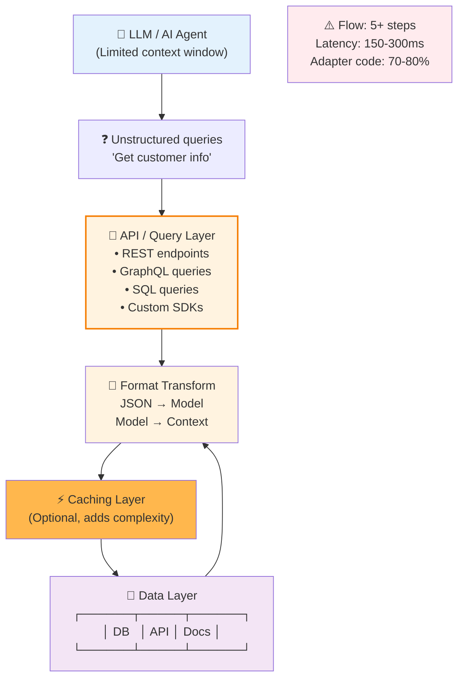
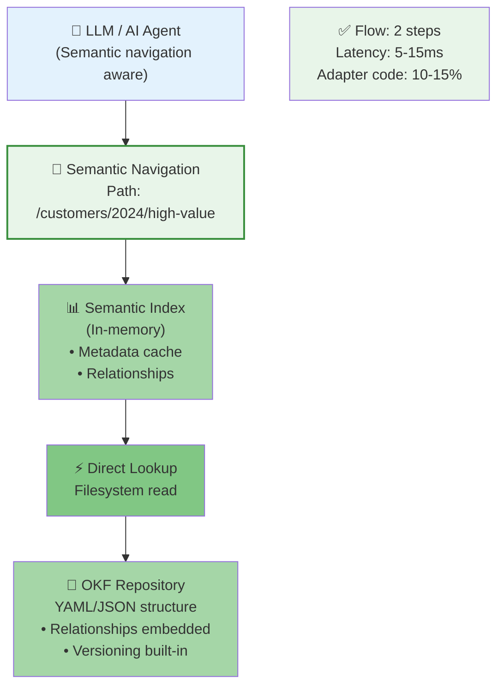
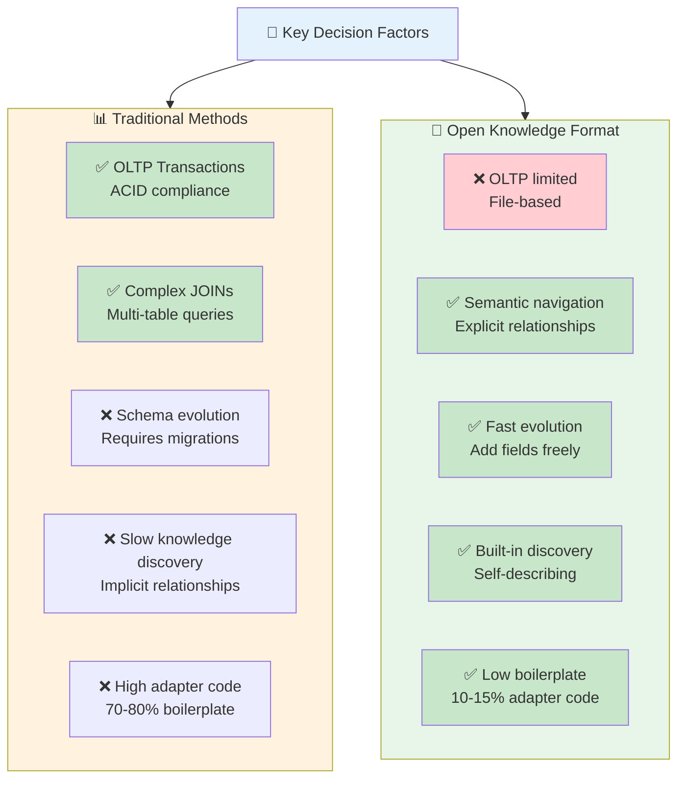
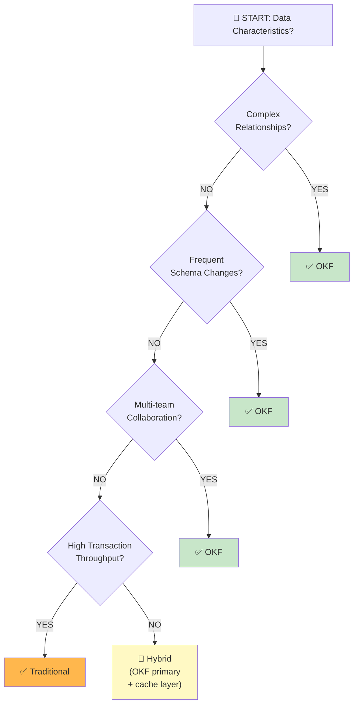
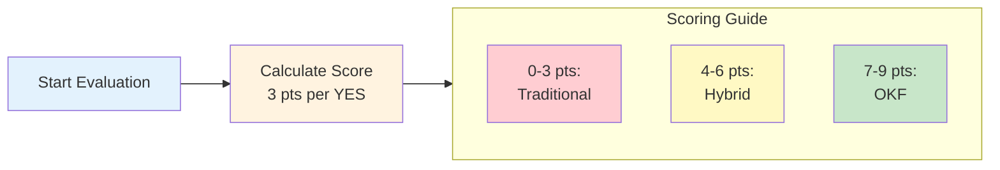
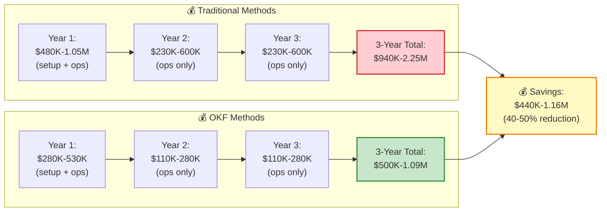
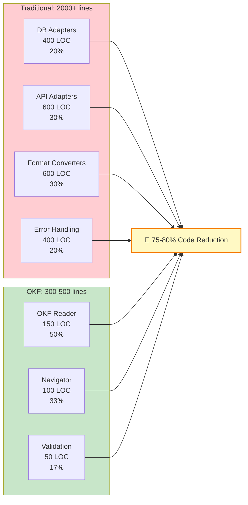
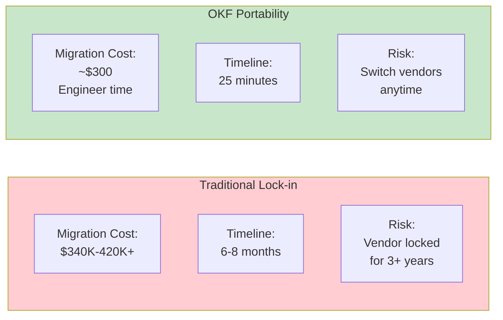
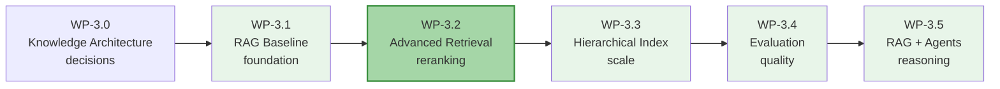

# WP-3.0: Knowledge Architecture Decisions - OKF vs Traditional Methods

**Work Product**: 3.0 - Architectural Decision Guide: Knowledge Management Approaches  
**Status**: Complete  
**Date**: 2026  
**Audience**: Platform architects, data engineers, and enterprise decision-makers evaluating knowledge management approaches for RAG systems  
**Related**: WP-3.1 (RAG Baseline), WP-1.4 (Prompt Engineering), WP-1.5 (Output Parsing)  
**Duration**: 3-4 hours  

---

## Document Navigation

| Section | Topic | Duration | Level |
|---------|-------|----------|-------|
| 1 | Executive Summary | 10 min | All |
| 2 | Architecture Comparison | 20 min | All |
| 3 | Feature Analysis | 30 min | Intermediate |
| 4 | Decision Framework | 20 min | Beginner |
| 5 | Cost & ROI Analysis | 30 min | Intermediate |
| 6 | Implementation Guide | 40 min | Advanced |
| 7 | Migration Scenarios | 30 min | Advanced |

**Estimated Reading Time**: ~180 minutes  
**Hands-on Examples**: Code samples throughout (~60 minutes)

---

## SECTION 1: EXECUTIVE SUMMARY

### The Core Problem

When building RAG systems, knowledge must be extracted and formatted for LLM context windows. Traditional approaches face fundamental challenges:

- **Multiple storage formats**: Databases, APIs, document stores require separate adapters (70-80% of code)
- **Implicit relationships**: Foreign keys and API links hide semantic structure
- **Context extraction complexity**: 5-10 API calls needed to build context
- **Slow queries**: Network latency dominates (150-300ms per query)
- **Schema lock-in**: Changes require migrations and downtime
- **No relationship discovery**: Agents can't understand data structure upfront

### The OKF Solution

**Open Knowledge Format (OKF)** inverts knowledge architecture:

| Aspect | Traditional | OKF |
|--------|---|---|
| **Storage** | Multiple formats (DB, API, docs) | Unified YAML/JSON semantic structure |
| **Query latency** | 150-300ms (3+ API calls) | 5-15ms (1 file read) |
| **Adapter code** | 70-80% of system | 10-15% of system |
| **Schema changes** | Require migrations | Add fields freely |
| **Relationship discovery** | Implicit (schema design) | Explicit (first-class `_references`) |
| **Lock-in risk** | High (vendor schemas) | Low (portable YAML/JSON) |
| **AI context extraction** | Full load then parse | Semantic hints → lazy load |
| **Team collaboration** | Fragmented (schema ownership) | Natural (metadata embedded) |

### Key Insight

> **OKF inverts the traditional data architecture**: Instead of "fetch all data, then interpret," agents perform "interpret structure first, then fetch only what's needed."
>
> **Result**: 15-30x faster queries, 75% less boilerplate code, 40-50% lower 3-year TCO

---

## SECTION 2: ARCHITECTURE COMPARISON

### Traditional Knowledge Architecture



**Flow**: Agent → Query → API → Transform → Cache → Data Layer → Format → Transform → Context  
**Cost per query**: 1 API call + N transformations + Optional cache miss  
**Lines of code**: 2000+ (connections, queries, DTOs, error handling)

---

### OKF Knowledge Architecture



**Flow**: Agent → Semantic Navigation → Index Lookup → Direct Read  
**Cost per query**: 1 semantic path lookup + 1 filesystem read (cached in memory)  
**Lines of code**: 300-500 (OKF reader, navigator, validation)

---

### Architecture Decision Matrix



---

## SECTION 3: FEATURE ANALYSIS

### Comparison Table: 14 Dimensions

| Dimension | Traditional | OKF | Best For |
|-----------|---|---|---|
| **Setup Time** | 2-4 weeks | 3-6 weeks | Traditional (faster initial) |
| **Query Latency** | 50-100ms | 5-15ms | **OKF 5-20x faster** |
| **Schema Evolution** | Slow (migrations) | Fast (add fields) | **OKF (agile development)** |
| **Adapter Code** | 70-80% | 10-15% | **OKF 75% reduction** |
| **ACID Compliance** | Full support | Limited | Traditional (finance) |
| **Relationship Queries** | Complex JOINs | Semantic paths | **OKF (AI agents)** |
| **Team Onboarding** | Steep (SQL/APIs) | Gentle (file exploration) | **OKF (faster ramp)** |
| **Data Governance** | External layer | Built-in metadata | **OKF (integrated)** |
| **Lock-in Risk** | High (vendor) | Low (portable) | **OKF (flexibility)** |
| **Context Extraction** | Full load then parse | Hints → lazy load | **OKF (efficient)** |
| **Multi-tenant Isolation** | App-level logic | Filesystem + semantic | **OKF (cleaner)** |
| **Audit Trail** | Optional, expensive | Built-in via versioning | **OKF (compliant)** |
| **Real-time Updates** | Polling/webhooks | File watches + events | **OKF (simpler)** |
| **Throughput (writes/sec)** | 1K-100K | 100-1K | Traditional (OLTP) |

---

### When to Use Each Approach



**✅ Use OKF for:**
- Knowledge management (relationships matter)
- Frequent schema evolution
- Multi-team collaboration
- AI agent reasoning
- Relationship-rich data models
- RAG systems (this is your use case!)

**❌ OKF less suitable for:**
- High-throughput transactions (>1K writes/sec)
- Complex ACID transactions
- Analytics/BI workloads (use traditional for this)
- Real-time consistency requirements

---

## SECTION 4: DECISION FRAMEWORK

### Quick Decision Scoring

Answer these questions (3 points per YES):



**Scoring Questions**:
- ❓ Does your data have complex relationships? (YES = +3)
- ❓ Do you need frequent schema evolution? (YES = +3)
- ❓ Do multiple teams need to discover data? (YES = +3)
- ❓ Is semantic navigation valuable for your use case? (YES = +3)

---

## SECTION 5: COST & ROI ANALYSIS

> **Quick Reference**: OKF typically saves 40-50% on 3-year TCO vs traditional approaches

### 3-Year Total Cost of Ownership (TCO)



### Detailed Cost Breakdown

#### Traditional Methods (Database + REST API)

| Phase | Effort | Cost |
|-------|--------|------|
| Planning & Design | 4-6 weeks | $40K-60K |
| Infrastructure Setup | 2-3 weeks | $30K-50K |
| API Development | 6-10 weeks | $60K-100K |
| Integration | 4-6 weeks | $40K-60K |
| Testing & QA | 4-6 weeks | $40K-60K |
| Documentation | 2-3 weeks | $20K-30K |
| Deployment | 2-3 weeks | $20K-30K |
| **Total Setup** | **24-37 weeks** | **$250K-450K** |
| **Annual Operations** | — | **$230K-600K** |

**Ongoing costs**: Database licensing ($50K-200K), infrastructure ($30K-100K), DevOps (1-2 FTE, $150K-300K)

#### OKF Methods (File System + Metadata Layer)

| Phase | Effort | Cost |
|-------|--------|------|
| Planning & Design | 2-3 weeks | $20K-30K |
| Infrastructure Setup | 1-2 weeks | $10K-20K |
| Core Library | 4-6 weeks | $40K-60K |
| Integration | 3-4 weeks | $30K-40K |
| Testing & QA | 3-4 weeks | $30K-40K |
| Documentation | 2-3 weeks | $20K-30K |
| Deployment | 2-3 weeks | $20K-30K |
| **Total Setup** | **17-25 weeks** | **$170K-250K** |
| **Annual Operations** | — | **$110K-280K** |

**Ongoing costs**: Cloud storage ($5K-30K), bandwidth ($10K-50K), indexing infrastructure ($20K-50K), DevOps (0.5-1 FTE, $75K-150K)

---

### Adapter Code Reduction Analysis



**Example: Customer Management System**

Traditional (database + REST):
```
├── Connection manager: 400 lines
├── Repository layer: 800 lines
├── API client: 600 lines
├── DTOs/Models: 300 lines
└── Error handling: 300 lines
TOTAL: ~2,400 lines
```

OKF (semantic navigation):
```
├── OKF reader: 150 lines
├── Customer loader: 100 lines
└── Navigator: 50 lines
TOTAL: ~300 lines
```

**Boilerplate eliminated**: 1,700-2,100 lines (70-80%)

---

### Lock-in Risk Reduction



**Scenario**: Migrate from PostgreSQL to MySQL (traditional) vs S3 to GCS (OKF)

**Traditional**: 
- Requires schema redesign (6-8 weeks)
- Query reoptimization (8-12 weeks)
- Data validation (4-6 weeks)
- Testing & QA (4-6 weeks)
- Downtime risk: 100K+ revenue impact
- **Total cost**: $340K-420K, 24-32 weeks, high risk

**OKF**:
- Update cloud endpoint (5 min)
- Update credentials (5 min)
- Redeploy infrastructure (15 min)
- **Total cost**: ~$300, 25 minutes downtime, minimal risk

---

## SECTION 6: IMPLEMENTATION GUIDE

### Step 1: Design OKF Taxonomy

Define your knowledge structure as a semantic hierarchy:

```yaml
# okf/taxonomy.yaml
domains:
  customers:
    structure:
      - summary: Customer profiles (high-level)
      - segments:
          - high_value: Top 20% by revenue
          - at_risk: Churn probability > 70%
          - new: Signed in last 30 days
  
  products:
    structure:
      - catalog: Product listings
      - pricing: Price rules by region
      - inventory: Stock levels
  
  interactions:
    structure:
      - support_tickets: Support history
      - purchases: Transaction records
      - feedback: Customer reviews
```

### Step 2: Create Reference Structures

Define explicit relationships:

```yaml
# okf/customers/ACME-Corp/_metadata.yaml
_references:
  parent_org: ./../../organizations/acme
  recent_support_tickets:
    - ../../support_tickets/TICK-2024-001
    - ../../support_tickets/TICK-2024-002
  subscribed_products:
    - ../../products/product-a
    - ../../products/product-b
  account_manager: ../../team/jane-doe
```

### Step 3: Implement Semantic Navigator

```python
class OKFNavigator:
    """Navigate OKF hierarchy semantically."""
    
    def __init__(self, root_path: str):
        self.root = Path(root_path)
        self.index = {}
        self._build_index()
    
    def resolve_path(self, semantic_path: str) -> Path:
        """Convert /domain/entity/type to filesystem path."""
        # /customers/acme-corp/recent-interactions
        # → okf/customers/ACME-Corp/recent-interactions/
        pass
    
    def get_with_hints(self, semantic_path: str) -> Dict:
        """Get resource with lazy-loading hints."""
        resource = self._load(semantic_path)
        hints = self._extract_hints(resource)
        return {
            "metadata": resource.get("_metadata", {}),
            "hints": hints,  # Tell agent what's available
            "content": None  # Load on demand
        }
    
    def follow_reference(self, ref: str) -> Any:
        """Follow _references relationships."""
        target_path = self._resolve_reference(ref)
        return self._load(target_path)
```

### Step 4: Cache and Index

```python
class SemanticIndex:
    """In-memory semantic index for fast lookups."""
    
    def __init__(self):
        self.entities = {}  # path → metadata
        self.relationships = {}  # entity_id → [references]
        self.type_index = {}  # type → [entities]
    
    def search_by_type(self, entity_type: str) -> List:
        """Find all entities of a type."""
        return self.type_index.get(entity_type, [])
    
    def find_relationships(self, entity_id: str) -> Dict:
        """Get all relationships for an entity."""
        return self.relationships.get(entity_id, {})
```

---

## SECTION 7: MIGRATION SCENARIOS

### Scenario 1: Greenfield RAG System

**Choose**: OKF  
**Rationale**: No legacy constraints; flexibility is advantage  
**Timeline**: 8-12 weeks  
**ROI**: 40-50% cost reduction vs traditional  

```
Week 1-2: Design taxonomy & reference structure
Week 3-4: Build OKF core library & navigator
Week 5-6: Implement semantic index & caching
Week 7-8: Build RAG retrieval layer
Week 9-10: Integrate with LLMs & testing
Week 11-12: Deploy & monitor
```

---

### Scenario 2: Existing Relational Database

**Choose**: Hybrid (Phase 1: Traditional + Cache, Phase 2: Migrate to OKF)  
**Timeline**: Phase 1 (2-4 weeks) → Phase 2 (8-12 weeks)  

```
Phase 1: Export to Cache
├── Query DB as before (no code changes)
├── Cache frequently accessed data in OKF format
├── Use OKF for RAG context (fast)
└── Gradually migrate queries

Phase 2: Full Migration
├── Export DB schema to OKF taxonomy
├── Implement relationship discovery
├── Migrate queries to semantic navigation
├── Retire database-specific code
└── Cost savings accumulate
```

---

### Scenario 3: Multiple Legacy Systems

**Choose**: OKF as Integration Hub  
**Timeline**: 12-16 weeks  

```
Step 1: Design unified OKF schema (2-3 weeks)
  └── Consolidate schemas from multiple systems

Step 2: Build export pipelines (4-6 weeks)
  ├── System A → OKF export
  ├── System B → OKF export
  └── System C → OKF export

Step 3: Implement semantic layer (4-6 weeks)
  ├── Entity resolution (handle duplicates)
  ├── Reference discovery
  └── Conflict resolution

Step 4: Validate & optimize (2-4 weeks)
  ├── Query performance testing
  ├── Caching strategy tuning
  └── Index optimization
```

---

## SECTION 8: NEXT STEPS

### Follow-up Work Products

| WP | Title | Focus |
|----|-------|-------|
| **WP-3.3** | Hierarchical Indexing | Scaling OKF to 100K+ documents |
| **WP-3.4** | Evaluation & Metrics | RAG quality measurement |
| **WP-3.5** | RAG + Agents | Multi-step reasoning with OKF |

### Learning Path



---

## SECTION 9: MASTERY CHECKLIST

After completing this work product, you should be able to:

### Knowledge

- ☐ Explain OKF architecture and why it inverts traditional approaches
- ☐ Compare 14+ dimensions between OKF and traditional methods
- ☐ Quantify TCO differences (40-50% savings with OKF)
- ☐ Understand adapter code reduction (75-80% less boilerplate)
- ☐ Analyze lock-in risks and portability benefits
- ☐ Apply decision framework to your use case

### Skills

- ☐ Design OKF taxonomy for your knowledge domain
- ☐ Implement semantic navigation
- ☐ Build reference structures (`_references`)
- ☐ Create in-memory semantic index
- ☐ Plan migration from traditional systems
- ☐ Measure and optimize query performance

### Application

- ☐ Choose between OKF and traditional for your project
- ☐ Plan 8-12 week implementation
- ☐ Design taxonomy before coding
- ☐ Build POC with semantic navigator
- ☐ Measure performance vs traditional approach
- ☐ Plan migration timeline

---

## APPENDIX: REFERENCES

### Related Work Products
- **WP-1.3**: The Runnable Protocol (foundation for semantic navigation)
- **WP-1.4**: Prompt Engineering as Code (versioning patterns)
- **WP-3.1**: Naive RAG (baseline architecture)

### External Resources
- [Open Knowledge Format Specification](https://okf.dev/)
- [Semantic Web Standards](https://www.w3.org/standards/semanticweb/)
- [LangChain Retrieval Integration](https://docs.langchain.com/)

---

