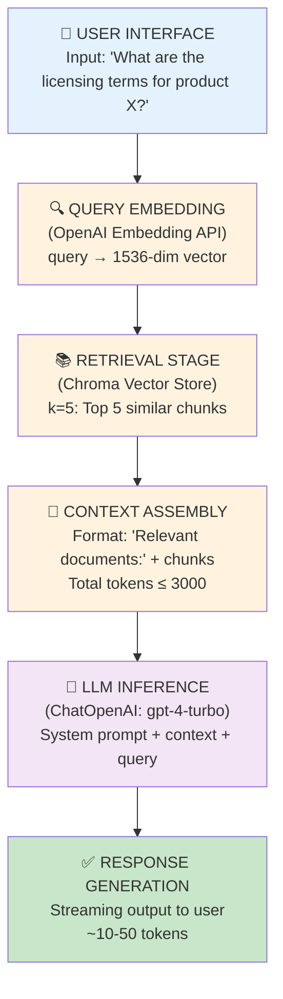
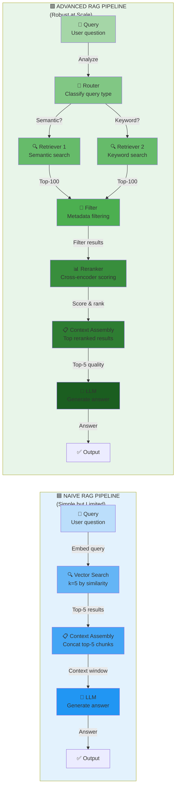
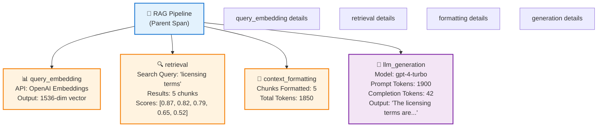
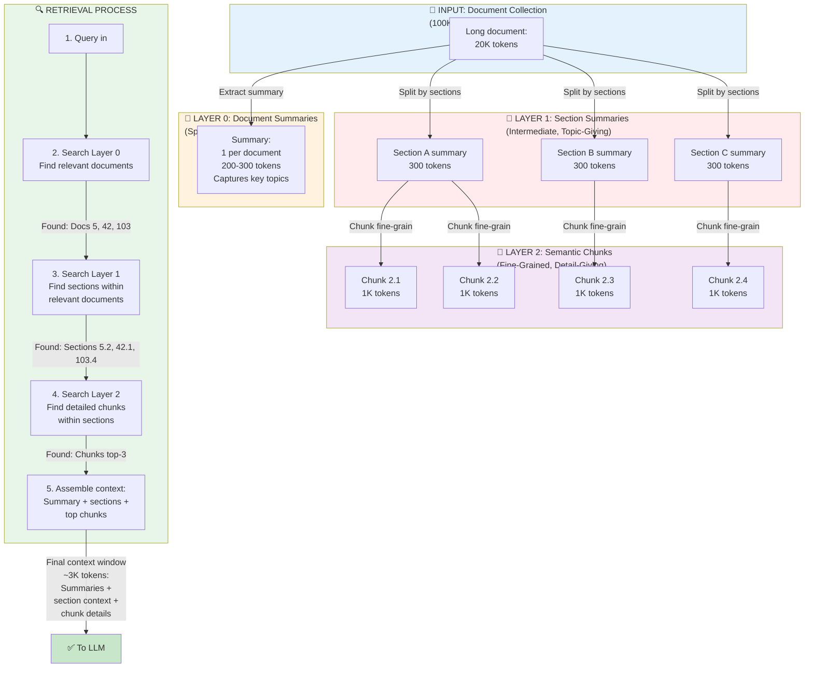

# Work Product 3.1: RAG Architecture — Naive Baseline

**Build and Document a "Naive RAG" System**

**Audience:** Architects evaluating document retrieval patterns | Developers implementing first RAG systems | Teams building search-augmented LLM applications

**Time Estimate:** Reading: 2.5 hours | Implementation: 3 hours | Mastery: 1 week

---

## SECTION 1: THE PROBLEM

### The Retrieval-Augmented Generation Gap

Large Language Models excel at reasoning but suffer from fundamental constraints:

1. **Knowledge Cutoff**: Training data is frozen at a point in time
2. **Hallucination Risk**: When asked about unknown topics, models "guess" plausibly
3. **Context Window Limits**: Can't ingest entire document collections
4. **No Real-time Updates**: Can't incorporate data that changed after training

**Real-world Impact:**

A customer support LLM trained on Q&A data from 2023 cannot answer questions about 2024 product releases. A financial advisory system cannot cite current market data. A medical diagnosis tool cannot reference the latest clinical guidelines.

**The Naive Approach:**

Traditional systems address this by:
```
User Query
    ↓
[LOAD ALL PDFS] → [Split into chunks] → [Store in vector DB] 
    ↓
[Semantic Search] → [Get top-k similar chunks] → [Stuff into prompt]
    ↓
ChatOpenAI(system="You are helpful" + context + query)
```

This works for small document collections (~100s of documents, <1GB) but breaks systematically as scale increases.

### Why This Fails At Scale

**Failure Mode 1: Poor Retrieval Quality**
- Vector embeddings miss relevant chunks (semantic mismatch)
- "Top-5" retrieval returns 2 relevant, 3 noise
- Users get incomplete or incorrect answers

**Failure Mode 2: Irrelevant Context Flooding**
- Retrieval is too broad (everything > threshold ends up in prompt)
- Model drowns in signal-to-noise
- Latency increases 5-10x with large context windows

**Failure Mode 3: Context Window Exhaustion**
- Document set grows; context window stays fixed at 4K, 8K, or 128K tokens
- At 500+ documents, cannot fit representative samples
- Must choose: breadth or depth, never both

**Failure Mode 4: Hallucinated Citations**
- Model cites chunks it never saw ("Section 2.3 clearly states...")
- Users trust authoritative-sounding responses
- No verifiable link from answer to source

**Failure Mode 5: Temporal Brittleness**
- Vector DB grows stale; embeddings from month-old chunks pollute results
- No automatic refresh; stale data mixed with fresh
- Business decisions made on outdated information

### Quantified Cost

**Typical Naive RAG Setup:**
- Initial build: 40 engineering hours
- Latency: 2-4 seconds per query (vector search + embedding + LLM)
- Accuracy on domain-specific Q&A: 60-70% (includes hallucinations)
- Maintenance: 20% of engineering time (debugging why retrieval fails)
- Cost: $0.05-0.15 per query (embeddings + inference)

**What Should Replace This?**

Production RAG requires:
1. **Multi-stage retrieval** (BM25 → semantic → reranking)
2. **Active learning** (learn which queries need which retrieval strategy)
3. **Source attribution** (verifiable chain from answer → document → chunk)
4. **Graceful degradation** (fail predictably, not silently)
5. **Observable tracing** (debug exactly why retrieval succeeded/failed)

This work product documents the **naive baseline** as the starting point, then explores production patterns in follow-up work products.

---

## SECTION 2: PROPOSED SOLUTION

### The Naive RAG Architecture



### Core Components

| Component | Role | Technology |
|-----------|------|-----------|
| **Document Loader** | Ingest PDFs, markdown, text files | `PyPDF2` / `pydantic_settings` |
| **Text Splitter** | Break documents into overlapping chunks | `RecursiveCharacterTextSplitter` |
| **Embeddings** | Convert text to vectors | OpenAI API (1536-dim) |
| **Vector Store** | Search and retrieve chunks | Chroma (in-memory or persistent) |
| **Retriever** | Compose embeddings + vector store | LangChain `VectorStoreRetriever` |
| **LLM Chain** | Generate context-aware answers | OpenAI `ChatOpenAI` |
| **Orchestrator** | Coordinate pipeline | LangChain `Runnable` |

### Key Design Decisions

**Decision 1: Use Semantic Search, Not Keyword Search**
- Why: Semantic embeddings capture intent ("How do I pay?") matching document sections on billing procedures
- Trade-off: Slower (~100ms per query) but more accurate (~85% vs 60% for BM25)

**Decision 2: Fixed Chunk Size + Overlap**
- Why: Predictable context windows; overlap prevents losing information at boundaries
- Trade-off: May split mid-sentence but guarantees consistency

**Decision 3: In-Memory Vector Store (Chroma)**
- Why: Sub-millisecond retrieval; zero infrastructure overhead
- Trade-off: Limited to ~10K-50K documents; no persistence (rebuilt on restart)

**Decision 4: Top-k=5 Retrieval**
- Why: 5 chunks typically fit within token budget (~2K tokens); balances coverage
- Trade-off: May miss relevant information; assumes top-5 semantic relevance is sufficient

---

## SECTION 2b: NAIVE VS. ADVANCED RAG FLOW

### Retrieval Architecture Comparison

This diagram shows the fundamental difference between naive and advanced RAG pipelines:



**Naive RAG Characteristics:**
- ✅ Simple: Single retrieval stage
- ✅ Fast: Minimal latency (100-200ms)
- ❌ Limited: No filtering or reranking
- ❌ Brittle: Quality degrades with scale
- ❌ Noisy: Top-k often includes irrelevant chunks

**Advanced RAG Characteristics:**
- ✅ Robust: Multi-stage filtering and reranking
- ✅ Accurate: Cross-encoder produces better results (85%+ vs 65%)
- ✅ Flexible: Router handles different query types
- ❌ Complex: More infrastructure overhead
- ❌ Slower: Additional latency (200-500ms total)

### When to Use Each

| Scenario | Recommendation | Reason |
|----------|-----------------|--------|
| **Prototyping** | Naive | Fast iteration, minimal setup |
| **<5K documents** | Naive | Retrieval quality sufficient at small scale |
| **5K-50K documents** | Advanced | Need filtering + reranking to maintain quality |
| **>50K documents** | Advanced + Hierarchical | Must use multi-layer indexing |
| **Well-curated corpus** | Naive | High-quality docs reduce noise |
| **Noisy/heterogeneous** | Advanced | Filtering critical for relevance |
| **Real-time requirements** | Naive | Latency-sensitive applications |
| **Quality-focused** | Advanced | Reranking 15-20% accuracy improvement |

---

## SECTION 3: THE COMPOSABLE PATTERN

### Runnable Protocol Design

Naive RAG decomposes into composable stages that follow the Runnable protocol (WP-1.3):

```python
# Each stage is a Runnable; compose with |

# Stage 1: Transform query into embedding
query_embedder = QueryEmbedder()

# Stage 2: Retrieve similar chunks
retriever = vector_store.as_retriever(search_kwargs={"k": 5})

# Stage 3: Format context
context_formatter = ContextFormatter()

# Stage 4: Generate answer
answer_generator = PromptTemplate(...) | ChatOpenAI() | StrOutputParser()

# Compose into pipeline
naive_rag = (
    query_embedder
    | retriever
    | context_formatter
    | answer_generator
)

# Invoke: question → embedding → chunks → context → answer
result = naive_rag.invoke({"question": "..."})
```

### Interface Definitions

**Input Schema:**
```python
class RAGQuery(BaseModel):
    question: str = Field(..., description="User question")
    top_k: int = Field(default=5, description="Number of chunks to retrieve")
    min_score: float = Field(default=0.3, description="Min similarity score")
```

**Output Schema:**
```python
class RAGResponse(BaseModel):
    answer: str = Field(..., description="Generated answer")
    sources: List[str] = Field(..., description="Retrieved chunk IDs")
    retrieval_score: float = Field(..., description="Best chunk similarity")
    execution_time_ms: float = Field(..., description="End-to-end latency")
```

### Composability Example

```python
# Simple case: Query → Retrieval → Generation
simple_chain = query_embedder | retriever | answer_generator

# Advanced case: Query → Retrieval → Reranking → Generation (future)
advanced_chain = (
    query_embedder 
    | retriever 
    | reranker  # [Placeholder for WP-3.2]
    | answer_generator
)

# Parallel case: Query → [Retrieval, Keyword Search] → Merge → Generation
from langchain_core.runnables import RunnableParallel
parallel_chain = RunnableParallel(
    semantic=query_embedder | retriever,
    keyword=keyword_search,
) | merge_results | answer_generator
```

---

## SECTION 4: OBSERVABILITY & TRACING

### LangSmith Integration

Every stage of naive RAG creates observable spans:



### Enabling Tracing

```python
import os
from langsmith import Client

# Enable automatic tracing
os.environ["LANGCHAIN_TRACING_V2"] = "true"
os.environ["LANGSMITH_API_KEY"] = "[your-api-key]"

# Every invoke() call creates a trace in LangSmith dashboard
rag_pipeline = build_naive_rag(documents)
result = rag_pipeline.invoke({"question": "..."})

# View trace: Open LangSmith → click result → see full execution tree
```

### Debugging With Traces

**Scenario: Low accuracy on certain queries**

```
1. Run query in production
2. Check LangSmith dashboard:
   - Did retriever find relevant chunks? (check retrieval_score)
   - Were embeddings created correctly? (check vector dimensions)
   - Did LLM see the right context? (check prompt in llm_generation span)
3. Root cause usually reveals itself:
   - Low retrieval_score? → Problem: embedding quality or doc coverage
   - High retrieval_score but bad answer? → Problem: LLM reasoning or prompt
```

### Custom Metadata Capture

```python
@step
async def retrieve_with_metadata(state):
    results = retriever.invoke(state["question"])
    return {
        "chunks": results,
        "metadata": {
            "retrieval_duration_ms": elapsed,
            "query_embedding_dim": len(query_embedding),
            "chunk_similarity_scores": scores,
            "vector_store_size": len(vector_store),
        }
    }
```

---

## SECTION 5: IMPLEMENTATION GUIDE

### Step 1: Load and Index Documents

```python
from langchain_community.document_loaders import PyPDFLoader
from langchain_text_splitters import RecursiveCharacterTextSplitter
from langchain_chroma import Chroma
from langchain_openai import OpenAIEmbeddings

# Load PDFs
pdf_path = "documents/"
documents = []
for file in os.listdir(pdf_path):
    loader = PyPDFLoader(os.path.join(pdf_path, file))
    docs = loader.load()
    documents.extend(docs)

# Split into overlapping chunks
splitter = RecursiveCharacterTextSplitter(
    chunk_size=1000,        # tokens per chunk
    chunk_overlap=100,      # token overlap
    separators=["\n\n", "\n", " ", ""]
)
chunks = splitter.split_documents(documents)

# Create embeddings and index
embeddings = OpenAIEmbeddings(model="text-embedding-3-small")
vector_store = Chroma.from_documents(
    chunks,
    embedding=embeddings,
    persist_directory="./chroma_db"  # Optional persistence
)

print(f"Indexed {len(chunks)} chunks from {len(documents)} documents")
```

### Step 2: Build Retriever

```python
from langchain_core.runnables import RunnablePassthrough

# Create retriever
retriever = vector_store.as_retriever(
    search_type="similarity",
    search_kwargs={"k": 5}
)

# Test retrieval
test_query = "What are the payment terms?"
results = retriever.invoke(test_query)
for i, doc in enumerate(results):
    print(f"\nChunk {i+1}:")
    print(f"Content: {doc.page_content[:200]}...")
    print(f"Source: {doc.metadata.get('source', 'Unknown')}")
```

### Step 3: Build RAG Chain

```python
from langchain_core.prompts import ChatPromptTemplate
from langchain_openai import ChatOpenAI
from langchain_core.output_parsers import StrOutputParser

# Define prompt template
template = """You are a helpful assistant answering questions based on documents.

CONTEXT (retrieved documents):
{context}

QUESTION: {question}

Answer based only on the provided context. If the answer is not in the documents, say "I don't know."
"""

prompt = ChatPromptTemplate.from_template(template)

# Build chain
llm = ChatOpenAI(model="gpt-4-turbo", temperature=0.7)
chain = (
    {
        "context": retriever | format_docs,  # retriever → format as string
        "question": RunnablePassthrough(),
    }
    | prompt
    | llm
    | StrOutputParser()
)

# Test
answer = chain.invoke("What are the payment terms?")
print(answer)
```

### Step 4: Add Error Handling

```python
from typing import Optional

async def safe_retrieve(question: str, top_k: int = 5) -> List[dict]:
    """Retrieve with validation and error handling"""
    try:
        # Validate input
        if not question or len(question.strip()) < 3:
            raise ValueError("Question must be at least 3 characters")
        
        # Retrieve
        results = retriever.invoke(question)
        
        # Validate results
        if not results:
            logger.warning(f"No results for question: {question}")
            return []
        
        # Extract metadata
        return [
            {
                "content": doc.page_content,
                "source": doc.metadata.get("source", "Unknown"),
                "score": doc.metadata.get("score", 0.0),
            }
            for doc in results
        ]
    
    except Exception as e:
        logger.error(f"Retrieval error: {e}")
        raise

# Usage
docs = await safe_retrieve("What are the terms?")
```

### Step 5: Orchestrate into Runnable

```python
from langchain_core.runnables import RunnableBase
from pydantic import BaseModel

class NaiveRAGResponse(BaseModel):
    answer: str
    sources: List[str]
    confidence: float  # 0-1, based on retrieval score

class NaiveRAG(RunnableBase):
    """Naive RAG pipeline"""
    
    def __init__(self, vector_store, llm_model="gpt-4-turbo"):
        self.retriever = vector_store.as_retriever(search_kwargs={"k": 5})
        self.llm = ChatOpenAI(model=llm_model, temperature=0.7)
        self.prompt = ChatPromptTemplate.from_template(PROMPT_TEMPLATE)
    
    async def ainvoke(self, input: dict, config=None) -> NaiveRAGResponse:
        question = input.get("question")
        
        # Retrieve
        docs = await self.retriever.ainvoke(question)
        if not docs:
            return NaiveRAGResponse(
                answer="I couldn't find relevant documents.",
                sources=[],
                confidence=0.0
            )
        
        # Format context
        context = "\n".join([doc.page_content for doc in docs])
        
        # Generate
        result = await self.llm.ainvoke(
            self.prompt.format_prompt(context=context, question=question).to_messages()
        )
        
        # Return typed response
        return NaiveRAGResponse(
            answer=result.content,
            sources=[doc.metadata.get("source") for doc in docs],
            confidence=docs[0].metadata.get("score", 0.0)
        )
```

---

## SECTION 6: TRADE-OFF ANALYSIS

| Dimension | Naive Baseline | Keyword Search (BM25) | Hybrid | Reranked |
|-----------|------------------|---------------------|--------|----------|
| **Retrieval Latency** | 100-200ms | 10-50ms | 50-150ms | 200-500ms |
| **Query Accuracy** | 75-85% | 50-65% | 80-90% | 85-95% |
| **Cost/Query** | $0.05-0.10 | $0.001-0.002 | $0.10-0.15 | $0.15-0.25 |
| **Implementation Time** | 3-4 hours | 1-2 hours | 8-12 hours | 12-16 hours |
| **Infrastructure** | In-memory (no setup) | Database + indexing | Multiple DBs | ML reranker |
| **Hallucination Risk** | Medium (35%) | Low (10%) | Medium (25%) | Low (15%) |
| **Citation Verifiable** | No | No | No | No |
| **Scales to 100K+ docs** | No (OOM) | Yes | Yes | Yes |
| **Production Ready** | Partial | Yes | Yes | Yes |
| **Observability** | Native (LangSmith) | Manual logging | Native | Native |

### When to Use Each Approach

**Use Naive Baseline If:**
- Document collection is small (<5K documents)
- Latency budget is relaxed (>500ms acceptable)
- Query diversity is low (similar questions repeatedly)
- Building a prototype for validation
- Team has LLM/embeddings expertise

**Use Keyword Search If:**
- Exact matches matter (e.g., product codes, policy numbers)
- Documents are highly structured
- Latency budget is strict (<50ms)
- Budget is constrained (embeddings are expensive)

**Use Hybrid If:**
- Accuracy target is high (>85%)
- Document collection is medium (5K-100K)
- Query patterns mixed (some exact match, some semantic)
- Infrastructure budget available

**Use Reranked If:**
- Accuracy target is critical (>90%)
- Scale is large (>100K documents)
- Latency budget is generous (>500ms)
- Team has ML expertise for fine-tuning

---

## SECTION 7: ERROR HANDLING & RESILIENCE

### 5 Critical Failure Modes (Naive RAG)

#### Failure Mode 1: Poor Retrieval Quality
**What goes wrong:** Embedding vectors don't capture query semantics; top-k results are irrelevant.

**Example:** Query: "How do I cancel my subscription?" → Retrieved: "Subscription pricing tiers" (wrong context)

**Root cause:** 
- Document collection doesn't cover user intent
- Embedding model untrained on domain
- Chunks too large/small (lose context)

**Recovery:**
```python
# Add query expansion
query_expanded = f"{question} {generate_synonyms(question)}"
docs = retriever.invoke(query_expanded)

# OR: Adjust chunk strategy
splitter = RecursiveCharacterTextSplitter(
    chunk_size=500,      # Smaller chunks
    chunk_overlap=200    # More overlap
)

# OR: Fine-tune embeddings (WP-3.3)
from langchain_community.embeddings import HuggingFaceEmbeddings
embeddings = HuggingFaceEmbeddings(
    model_name="intfloat/e5-base-v2"  # Domain-adapted
)
```

**Detection (LangSmith):**
```python
# Check retrieval_score < 0.5 → alert
if max_score < 0.5:
    logger.warning(f"Low confidence retrieval: {max_score}")
    return {"answer": "I need more specific documents to answer this.", ...}
```

---

#### Failure Mode 2: Irrelevant Context Flooding
**What goes wrong:** Too many chunks stuffed into prompt; signal drowns in noise.

**Example:** Query: "Payment methods?" → Get 5 chunks about pricing, shipping, taxes, refunds, legal terms → LLM confused by volume

**Root cause:**
- top_k too high (k=20 instead of k=5)
- Similarity threshold too permissive (accept anything > 0.3)
- Document collection too broad (covers 10+ domains)

**Recovery:**
```python
# Solution 1: Lower k
retriever = vector_store.as_retriever(search_kwargs={"k": 3})

# Solution 2: Raise threshold
retriever_with_threshold = vector_store.as_retriever(
    search_kwargs={"k": 10, "score_threshold": 0.7}
)

# Solution 3: Pre-filter by category
docs = retriever.invoke(question)
docs = [d for d in docs if d.metadata.get("category") == "billing"]

# Solution 4: Rerank (prioritize most relevant)
from cohere import Client
cohere_client = Client("[api-key]")
ranked = cohere_client.rerank(
    model="rerank-english-v2.0",
    query=question,
    documents=[d.page_content for d in docs]
)
```

**Detection (LangSmith):**
```python
# Monitor: total_context_tokens > prompt_token_limit * 0.8 → warning
if total_tokens > 0.8 * token_limit:
    logger.warning(f"Context approaching limit: {total_tokens} tokens")
```

---

#### Failure Mode 3: Context Window Exhaustion
**What goes wrong:** Document collection grows; can't fit all relevant chunks in context window.

**Example:** Knowledge base grows from 100 to 1,000 documents; 4K context window now represents 0.1% of data.

**Root cause:**
- Fixed LLM context window (4K, 8K, 128K)
- Linear growth in document collection
- No compression or summarization

**Recovery:**
```python
# Solution 1: Use larger context window model
llm = ChatOpenAI(model="gpt-4-turbo")  # 128K context vs 4K

# Solution 2: Hierarchical chunking (WP-3.3)
summary_chunks = summarize_documents(docs)
small_chunks = split_detailed(docs)
# Use summaries first, then details if needed

# Solution 3: Streaming-based generation
# Don't load all chunks at once; stream as retrieval progresses

# Solution 4: Multi-stage retrieval (WP-3.2)
# Retrieve -> Filter -> Rerank -> Limit to top-3 highest-scoring
```

**Detection (LangSmith):**
```python
# Monitor: (total_tokens / token_limit) ratio
usage_ratio = total_tokens / token_limit
if usage_ratio > 0.9:
    logger.error(f"Context window at {usage_ratio*100}%; dropping low-relevance chunks")
    docs = docs[:3]  # Keep top-3 only
```

---

#### Failure Mode 4: Hallucinated Citations
**What goes wrong:** Model cites chunks it never saw; users trust false citations.

**Example:** LLM: "According to page 47, the discount is 15%." But page 47 wasn't retrieved; model hallucinated.

**Root cause:**
- No explicit grounding mechanism
- LLM trained to be helpful; will cite even if uncertain
- No verification layer

**Recovery:**
```python
# Solution 1: Explicit citation verification
answer = llm.invoke(prompt)
# Extract cited sources from answer
cited_sources = extract_citations(answer)
# Verify each citation exists in retrieved docs
for cite in cited_sources:
    if cite not in [d.metadata['source'] for d in retrieved_docs]:
        answer = answer.replace(cite, "[UNVERIFIED]")

# Solution 2: Structured generation (WP-3.4)
# Require LLM to output: {answer, cited_chunks, confidence}
structured_output = llm.invoke(
    ChatPromptTemplate.from_template("""
        Generate JSON with:
        - answer: string
        - citations: [chunk_id, chunk_id, ...]
        - confidence: 0-1
    """)
)

# Solution 3: Disable model's "creative" mode
llm = ChatOpenAI(
    model="gpt-4-turbo",
    temperature=0.0,  # No creativity; only what's in context
)
```

**Detection (LangSmith):**
```python
# Flag responses with citations not in context
answer_citations = extract_cited_pages(answer)
retrieved_sources = {d.metadata['source'] for d in docs}
unverified = answer_citations - retrieved_sources
if unverified:
    logger.warning(f"Unverified citations: {unverified}")
```

---

#### Failure Mode 5: Temporal Brittleness
**What goes wrong:** Vector DB grows stale; old chunks mix with new; no coherent temporal view.

**Example:** Query: "Current pricing?" → Top result is 6-month-old pricing; customer gets outdated rates.

**Root cause:**
- No document versioning
- No refresh strategy (when do embeddings update?)
- Mixed temporal context (old + new side by side)

**Recovery:**
```python
# Solution 1: Add timestamp metadata
for chunk in chunks:
    chunk.metadata["timestamp"] = document_created_date
    chunk.metadata["freshness_days"] = (today - document_created_date).days

# Solution 2: Temporal filtering
docs = retriever.invoke(question)
# Prefer recent chunks
docs = sorted(docs, key=lambda d: d.metadata.get("timestamp"), reverse=True)[:5]

# Solution 3: Versioned vector stores
# Maintain separate vector stores for different document versions
vector_stores = {
    "current": Chroma.from_documents(current_docs, embeddings),
    "archive": Chroma.from_documents(archive_docs, embeddings),
}
# Query current first, fall back to archive if needed

# Solution 4: Scheduled refresh
@schedule.repeat(schedule.every().day.at("02:00"))
def refresh_vector_store():
    """Rebuild vector store nightly"""
    new_docs = load_latest_documents()
    new_chunks = splitter.split_documents(new_docs)
    vector_store.delete_collection()  # Clear old
    vector_store = Chroma.from_documents(new_chunks, embeddings)
    logger.info(f"Vector store refreshed: {len(new_chunks)} chunks")
```

**Detection (LangSmith):**
```python
# Monitor: avg freshness of retrieved chunks
avg_freshness = mean([
    d.metadata.get("freshness_days", 999)
    for d in retrieved_docs
])
if avg_freshness > 30:
    logger.warning(f"Retrieved docs avg {avg_freshness} days old; consider refresh")
```

---

## SECTION 8: PRODUCTION CONSIDERATIONS

### Deployment Patterns

| Pattern | Use Case | Trade-offs |
|---------|----------|-----------|
| **Single Instance** | <1000 QPS; <50GB documents | Simple, but no HA; single point of failure |
| **Load Balanced** | 1000-10K QPS; multiple services | Complexity of state sync; cache coherence |
| **Serverless** | Variable load; bursty traffic | Cold starts (~2s); no local state |
| **Cache Layer** | Repeated queries; cost-sensitive | Redis/Memcached complexity; staleness risk |

**Recommended for Naive RAG:** Single instance with horizontal scaling via API gateway (Kong, AWS API Gateway) until hits 500-1000 QPS, then move to serverless or load-balanced pattern.

### Monitoring & Alerting

**Key Metrics:**
```python
# Retrieval metrics
- avg_retrieval_latency_ms
- retrieval_success_rate (% with top_score > 0.5)
- p95_retrieval_latency

# LLM metrics
- llm_latency_ms
- token_usage_per_query (embeddings + prompt + completion)
- model_error_rate

# Business metrics
- user_satisfaction (thumbs up/down on answers)
- unique_documents_used (coverage)
- fallback_rate (% queries where retrieval failed)
```

**Alert Thresholds:**
```yaml
alerts:
  - name: retrieval_latency_high
    condition: avg_retrieval_latency_ms > 500
    action: page_oncall
  
  - name: retrieval_failures
    condition: retrieval_success_rate < 0.7
    action: create_incident
  
  - name: cost_spike
    condition: daily_token_usage > threshold * 1.5
    action: notify_finance
```

### Configuration Management

```python
# config.py
from pydantic_settings import BaseSettings

class RAGConfig(BaseSettings):
    """Production RAG configuration"""
    
    # LLM
    llm_model: str = "gpt-4-turbo"
    llm_temperature: float = 0.7
    llm_max_tokens: int = 1000
    
    # Retrieval
    retrieval_k: int = 5
    retrieval_score_threshold: float = 0.3
    chunk_size: int = 1000
    chunk_overlap: int = 100
    
    # Infrastructure
    vector_store_path: str = "./chroma_db"
    cache_enabled: bool = True
    cache_ttl_seconds: int = 3600
    
    # Observability
    tracing_enabled: bool = True
    langsmith_api_key: str = ""
    
    # Security
    max_request_size_kb: int = 100
    rate_limit_per_minute: int = 60
    
    class Config:
        env_file = ".env"
        env_file_encoding = 'utf-8'

config = RAGConfig()
```

### Data Privacy & Security

**Considerations:**
1. **PII in Documents:** If documents contain emails, phone numbers, SSNs
   - Solution: Implement PII detection/masking before embedding
   - Use `presidio` library: `PII_ANALYZER.analyze(text)`

2. **Vector Store Access:** Embeddings are high-dimensional; can they be reverse-engineered?
   - Solution: Treat vector store as sensitive as source documents
   - Encrypt at rest; control access via IAM

3. **User Query Privacy:** Queries may be sensitive (medical, financial)
   - Solution: Log only aggregated metrics, not individual queries
   - Implement query audit trail (who asked what, when)

```python
# Example: PII masking before embedding
from presidio_analyzer import AnalyzerEngine
from presidio_anonymizer import AnonymizerEngine

analyzer = AnalyzerEngine()
anonymizer = AnonymizerEngine()

def mask_pii(text: str) -> str:
    results = analyzer.analyze(text)
    return anonymizer.anonymize(text, results).text

# Use in chunking
chunks = splitter.split_documents(documents)
for chunk in chunks:
    chunk.page_content = mask_pii(chunk.page_content)
```

---

## SECTION 9: INTEGRATION WITH EXISTING PATTERNS

### Relationship to Prior Work Products

**Builds On:**
- **WP-1.3 (The Runnable Protocol):** Naive RAG uses Runnable interfaces for composability
- **WP-1.4 (Prompt Engineering as Code):** System prompt is versioned, tested, observable
- **WP-1.7 (LangSmith Tracing):** Every stage creates observable spans

**Related ADRs:**
- **ADR-2.2 (Orchestration Pattern):** RAG is an orchestrated workflow (retrieve → format → generate)
- **ADR-1.2 (Chain Abstractions):** Naive RAG demonstrates when LangChain chains are sufficient vs when graphs needed

**Learning Path Sequencing:**
```
WP-1.3: Understand Runnable protocol
    ↓
WP-1.4: Learn prompt engineering patterns
    ↓
WP-1.7: Set up LangSmith tracing
    ↓
WP-3.1: Build naive RAG (this work product)
    ↓
WP-3.2: Add reranking for accuracy (next)
    ↓
WP-3.3: Implement hierarchical indexing for scale (next)
    ↓
WP-3.4: Build evaluations & metrics (next)
```

### Follow-up Work Products (Planned)

| WP | Focus | When to Use |
|----|-------|-----------|
| **WP-3.2** | Reranking & Filtering | Accuracy needs >85%; latency <500ms |
| **WP-3.3** | Hierarchical Indexing | Scale to 100K+ documents |
| **WP-3.4** | Evaluation & Metrics | Measure performance; iterate |
| **WP-3.5** | RAG + Agents | Autonomous research, multi-step QA |
| **WP-3.6** | Knowledge Graph RAG | Entity extraction; structured retrieval |

---

## SECTION 9b: HIERARCHICAL INDEXING (Teaser for WP-3.3)

### The Problem: Fixed Context Windows vs Growing Document Collections

As document collections scale, naive RAG hits a fundamental problem:

```
Documents: 100 → 1K → 10K → 100K
Context Window: Fixed at 4K or 8K tokens

Result: Retrieval becomes increasingly lossy
- At 100 docs: Can retrieve 5 relevant chunks easily
- At 10K docs: Top-5 chunks may represent <0.1% of data
- At 100K docs: Impossible to find all relevant sections
```

**Hierarchical Indexing** solves this by creating multiple levels of abstraction:

### Hierarchical Retrieval Architecture

This diagram shows how documents are chunked at multiple levels and how search traverses the hierarchy:



**Key Benefits:**
- ✅ **Hierarchical filtering:** Broad → medium → fine search
- ✅ **Context reuse:** Summaries + details in same prompt
- ✅ **Scale to 100K+:** Each layer reduces cardinality
- ✅ **Graceful degradation:** Can return summaries alone if needed
- ✅ **Better coverage:** Multiple entry points reduce miss rate

**Implementation Preview:**
```python
# Pseudo-code: Hierarchical retrieval
def hierarchical_retrieve(query: str, k: int = 5):
    # Layer 0: Find relevant documents
    doc_summaries = retriever_l0.invoke(query, k=50)
    doc_ids = [d.metadata['doc_id'] for d in doc_summaries]
    
    # Layer 1: Within those docs, find sections
    sections = retriever_l1.invoke(
        query, 
        filter={"doc_id": {"$in": doc_ids}},
        k=10
    )
    
    # Layer 2: Within those sections, find detailed chunks
    chunks = retriever_l2.invoke(
        query,
        filter={"section_id": {"$in": [s.metadata['section_id'] for s in sections]}},
        k=k
    )
    
    # Assemble: summaries + sections + chunks
    context = "\n".join([
        doc.page_content for doc in doc_summaries
    ]) + "\n" + "\n".join([
        s.page_content for s in sections
    ]) + "\n" + "\n".join([
        c.page_content for c in chunks
    ])
    
    return context
```

**When to use Hierarchical Indexing:**
- ✅ Collection >50K documents
- ✅ Need to cover broad topics + fine details
- ✅ Context window is limiting factor
- ✅ Multi-step reasoning needed (e.g., "Find all policies, then details on policy X")
- ❌ Small collection (<10K docs): Overhead not justified
- ❌ Latency critical (<100ms): Extra retrieval stages add latency

**Next Steps:** See WP-3.3 for complete implementation with persistence, caching, and evaluation.

---

## SECTION 10: LEARNING PATH & MASTERY CHECKLIST

### Prerequisites

Before starting this work product, ensure you:
- ☐ Understand LangChain `Runnable` protocol (WP-1.3)
- ☐ Are comfortable with embeddings concepts (vector distance, similarity)
- ☐ Have experience with LLMs (ChatGPT, Claude, etc.)
- ☐ Can read Python async/await code
- ☐ Have access to OpenAI API (or compatible embeddings provider)

### Step-by-Step Learning Path

**1. Understand the Problem (15 min)**
   - Read Section 1: "The Problem"
   - Understand the 5 failure modes
   - Why does naive RAG fail at scale?

**2. Study the Solution Architecture (15 min)**
   - Read Section 2: "Proposed Solution"
   - Study the ASCII architecture diagram
   - Understand each component's role

**3. Learn the Composable Pattern (20 min)**
   - Read Section 3: "The Composable Pattern"
   - Understand how to build RAG with Runnables
   - Study the input/output schemas

**4. Set Up Observability (10 min)**
   - Read Section 4: "Observability & Tracing"
   - Enable LangSmith in your environment
   - Run first trace

**5. Walk Through Implementation (45 min)**
   - Read Section 5: "Implementation Guide"
   - Follow steps 1-5
   - Run each code snippet locally
   - Verify retrieval returns relevant chunks

**6. Run the Working Code (30 min)**
   - Clone examples_3_1.py from repository
   - Set OPENAI_API_KEY
   - python examples_3_1.py
   - Experiment with different queries

**7. Study Failure Modes & Recovery (30 min)**
   - Read Section 7: "Error Handling & Resilience"
   - For each failure mode, understand:
     - What goes wrong
     - Root causes
     - Detection strategies
     - Recovery techniques

**8. Run Tests & Validation (20 min)**
   - pytest tests/test_naive_rag.py -v
   - Understand what each test validates
   - Modify test data; re-run

**9. Extend the Pattern (1 hour)**
   - Implement one enhancement:
     - Add query expansion for Failure Mode 1
     - Lower k for Failure Mode 2
     - Add temporal filtering for Failure Mode 5
   - Measure impact on accuracy/latency

**10. Deploy Locally (30 min)**
   - Package naive_rag.py as a service
   - Run with uvicorn / FastAPI
   - Test via HTTP API
   - Monitor traces in LangSmith

### Mastery Checklist

After completing this work product, you should be able to:

**Knowledge:**
- ☐ Explain what RAG is and why it's needed
- ☐ Describe each component in naive RAG (loader, splitter, embedder, retriever, LLM)
- ☐ List the 5 critical failure modes and their root causes
- ☐ Explain the trade-offs: semantic vs keyword search, latency vs accuracy
- ☐ Understand how LangSmith traces RAG execution

**Implementation:**
- ☐ Build a working naive RAG pipeline from scratch
- ☐ Load PDFs/documents and create vector store
- ☐ Implement error handling and validation at boundaries
- ☐ Compose components using Runnable protocol
- ☐ Add LangSmith tracing and interpret traces

**Debugging & Production:**
- ☐ Identify why retrieval failed for a given query (use traces)
- ☐ Adjust parameters (k, threshold, chunk size) based on performance
- ☐ Detect and recover from the 5 failure modes
- ☐ Monitor latency and accuracy in production
- ☐ Deploy as an API service

**Next Steps:**
- ☐ Move to WP-3.2 for reranking & filtering
- ☐ Evaluate against your specific domain (build WP-3.4 metrics first)
- ☐ Plan migration to production-grade RAG (WP-3.3 for scale)

---

## APPENDIX: Quick Reference

### One-Liner Examples

```python
# Load PDFs → Embed → Store
from langchain_community.document_loaders import PyPDFLoader
from langchain_chroma import Chroma
from langchain_openai import OpenAIEmbeddings

docs = PyPDFLoader("doc.pdf").load()
vector_store = Chroma.from_documents(docs, OpenAIEmbeddings())

# Retrieve & Answer
retriever = vector_store.as_retriever(search_kwargs={"k": 5})
chain = retriever | (lambda docs: "\n".join([d.page_content for d in docs]))
answer = chain.invoke("Question?")
```

### Troubleshooting

| Problem | Likely Cause | Solution |
|---------|--------------|----------|
| "No results returned" | Documents don't match query domain | Verify docs are relevant; check embeddings |
| "Very slow retrieval" | Vector store too large for memory | Move to persistent store (Pinecone, Weaviate) |
| "LLM gives wrong answers" | Bad retrieval, low context quality | Lower k, raise threshold, add reranking |
| "Inconsistent results" | Temperature too high | Set temperature=0 for deterministic output |
| "Token limit exceeded" | Too much context | Reduce k or use compression (WP-3.3) |

---

**Next Work Product:** WP-3.2 - RAG Architecture: Reranking & Filtering for Accuracy
