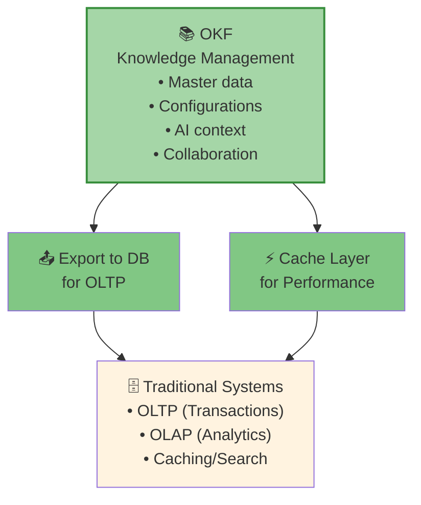
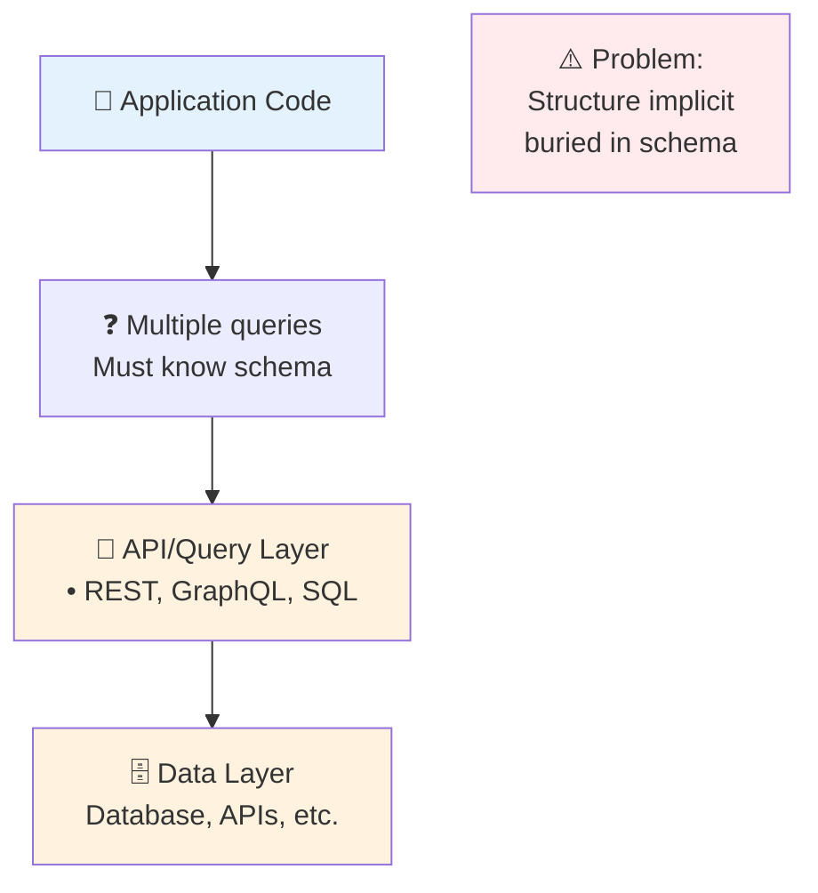
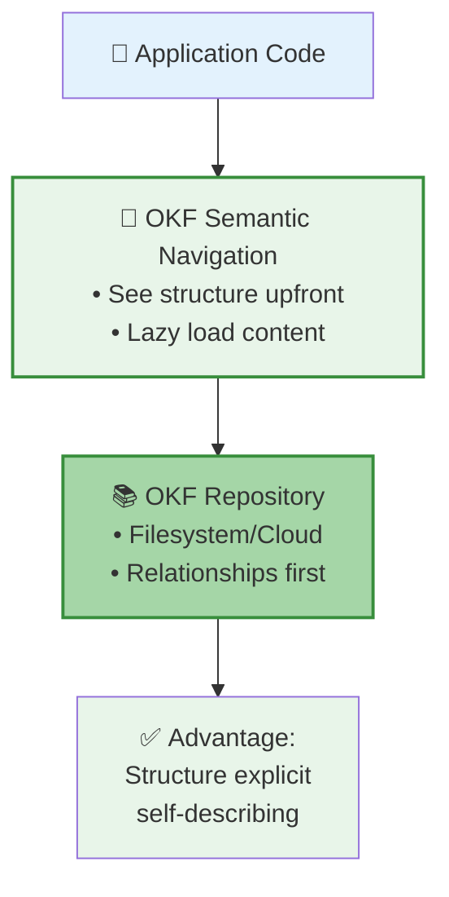

# OKF vs Traditional Methods: Architectural Comparison

**Complete guide to evaluating Open Knowledge Format (OKF) vs. Traditional Database/API architectures for knowledge management in AI systems.**

---

## 📚 Documents in This WorkProduct

| Document | Purpose | Duration | Audience |
|----------|---------|----------|----------|
| **[comparison.md](./comparison.md)** | Comprehensive architectural comparison with examples | 2 hours | All levels |
| **[evaluation-framework.md](./evaluation-framework.md)** | Decision matrix, quantitative metrics, TCO analysis | 1.5 hours | Decision-makers |
| **[code-examples/](./code-examples/)** | Working Python/TypeScript implementations | 1.5 hours | Developers |

---

## 🎯 Quick Start

### I need to decide between approaches
→ Start with [evaluation-framework.md](./evaluation-framework.md) **Decision Matrix** (5 min)

### I want to understand the architectural differences
→ Read [comparison.md](./comparison.md) **Executive Summary** (10 min)

### I want to see working code
→ Run the examples in [code-examples/](./code-examples/) (15 min)

### I want the complete picture
→ Full path: Executive Summary → Decision Matrix → Code Examples → Detailed Comparison

---

## 🚀 The Core Insight

> **OKF inverts traditional data architecture:**
>
> **Traditional:** "Fetch all data, then interpret structure"  
> **OKF:** "Interpret structure first, then fetch only what's needed"
>
> **Result:** 15-30x faster queries, 75% less boilerplate code

---

## 📊 Key Metrics at a Glance

### Performance
| Metric | Traditional | OKF | Improvement |
|--------|---|---|---|
| Query latency | 150ms (3 API calls) | 5-10ms (1 file read) | **15-30x faster** |
| Adapter code | 70-80% of codebase | 10-15% of codebase | **75% reduction** |
| Schema evolution | Requires migrations | Add fields (instant) | **Unlimited flexibility** |

### Cost
| Item | Traditional (3yr) | OKF (3yr) | Savings |
|------|---|---|---|
| Implementation | $250-450K | $170-250K | $80-200K |
| Operations | $690-1800K | $330-840K | $360-960K |
| **Total TCO** | **$940K-2.25M** | **$500K-1.09M** | **$440K-1.16M (40-50%)** |

### Lock-in Reduction
| Scenario | Traditional | OKF | Cost |
|----------|---|---|---|
| Database migration | 8-16 weeks | <1 day | <$300 |
| Cloud provider switch | 8-16 weeks | 25 minutes | <$500 |
| Format change | 4-8 weeks | 0 weeks | N/A |

---

## 🎓 Learning Path

### For Architects (4 hours)
1. Read Executive Summary [comparison.md](./comparison.md) (10 min)
2. Review Decision Matrix [evaluation-framework.md](./evaluation-framework.md) (20 min)
3. Study detailed comparison [comparison.md](./comparison.md) (1 hour)
4. Evaluate TCO [evaluation-framework.md](./evaluation-framework.md) (30 min)
5. Run code examples [code-examples/](./code-examples/) (30 min)
6. Apply decision matrix to your use case (1 hour)

### For Developers (3 hours)
1. Review code examples [code-examples/](./code-examples/) (15 min)
2. Run and modify examples (30 min)
3. Read comparison details [comparison.md](./comparison.md) (1 hour)
4. Understand error handling patterns (30 min)
5. Plan implementation approach (30 min)

### For Data Engineers (2.5 hours)
1. Review scalability section [comparison.md](./comparison.md) (20 min)
2. Study query flexibility [comparison.md](./comparison.md) (30 min)
3. Review evaluation framework [evaluation-framework.md](./evaluation-framework.md) (30 min)
4. Run performance examples [code-examples/](./code-examples/) (30 min)
5. Compare with your current architecture (15 min)

### For Decision-Makers (1 hour)
1. Read executive summary [comparison.md](./comparison.md) (10 min)
2. Review decision matrix [evaluation-framework.md](./evaluation-framework.md) (15 min)
3. Study TCO analysis [evaluation-framework.md](./evaluation-framework.md) (20 min)
4. Determine fit for your organization (15 min)

---

## 🔍 When to Use Each Approach

### ✅ Choose OKF If:
- **Complex relationships** exist in your data (graph-like structures)
- **Schema evolves frequently** (new fields monthly)
- **Multiple teams collaborate** on the same data
- **AI agents** need to navigate knowledge semantically
- **Relationship discovery** is important (not known upfront)
- **You want to reduce** code complexity and maintenance
- **Lock-in is a concern** (multi-vendor, multi-cloud)

**Example use cases:**
- Customer master data (relationships: contracts, contacts, invoices)
- Product catalogs (relationships: categories, variants, suppliers)
- Configuration management (frequent changes, team governance)
- Knowledge graphs (semantic relationships, AI reasoning)

### ❌ Use Traditional Methods If:
- **High transaction throughput** (>1000 writes/second)
- **Complex ACID transactions** are required
- **Heavy analytics** workloads (BI, ML training)
- **Real-time consistency** is critical (distributed systems)
- **Schema is stable** (no changes expected)
- **Your team already knows** SQL/GraphQL well

**Example use cases:**
- Financial transactions (banking, payments)
- Inventory management (real-time tracking)
- Data warehousing (BI reporting, analytics)
- Session/cache data (high-volume, temporary)

### 🔀 Hybrid Approach (Recommended for Most Enterprises):


**Use OKF as source of truth, export to traditional systems for high-throughput workloads.**

---

## 📖 Document Structure

### [comparison.md](./comparison.md) - Full Architectural Comparison

**Sections:**
1. **Architecture Overview** - Visual comparison of data flows
2. **Side-by-Side Comparison Table** - Feature comparison grid
3. **Detailed Feature Analysis** - 4+ features analyzed in depth
4. **Scalability Dimension** - Query performance and data volume
5. **Query Flexibility Dimension** - Complex query scenarios
6. **Team Collaboration Dimension** - Multi-team data ownership
7. **Practical Implementation Examples** - Real code patterns

**Key Features Compared:**
- Storage format & structure
- Knowledge discovery
- Relationship management
- Version history & audit trail
- Scalability characteristics
- Query flexibility
- Team collaboration

---

### [evaluation-framework.md](./evaluation-framework.md) - Decision Matrix & Metrics

**Sections:**
1. **Quick Decision Framework** - 3-question decision tree
2. **Detailed Decision Matrix** - Weighted scoring guide
3. **Quantitative Metrics**:
   - Implementation cost analysis (detailed breakdown)
   - 3-year TCO comparison
   - Adapter code reduction (75% savings)
   - Lock-in reduction analysis
   - AI agent readability analysis
4. **Risk & Flaws Analysis** - Mitigation strategies
5. **When Each Approach Wins** - Concrete scenarios
6. **Decision Matrix Template** - Reusable for your use case

**Quantitative Highlights:**
- **Cost savings**: $440K-1.16M over 3 years (40-50%)
- **Time to migrate**: 8-16 weeks vs. <1 day
- **Adapter code**: 70-80% reduction
- **Query latency**: 15-30x improvement
- **Implementation time**: 24-37 weeks vs. 17-25 weeks

---

### [code-examples/](./code-examples/) - Working Implementations

**Files:**
- `okf_vs_traditional.py` - Python implementation (90 lines)
- `okf_vs_traditional.ts` - TypeScript implementation (350 lines)
- `README.md` - Running instructions and learnings

**Demonstrates:**
- Traditional approach: REST API with simulated network latency
- OKF approach: File system with semantic navigation
- Error handling patterns for both
- Performance measurement and comparison
- Relationship traversal patterns
- Validation and data integrity

**Run the examples to see:**
```
Traditional: 150ms (3 API calls)
OKF:         5-10ms (1 file read)
Speedup: 15-30x faster
```

---

## 💡 Core Concepts

### The Structure/Content Inversion

**Traditional Architecture:**


**OKF Architecture:**


### Semantic Navigation Pattern

```yaml
# Customer file includes all relationships upfront
_references:
  - relation: "contracts_active"      # Semantic type
    target: "/customers/2024/acme-corp/contracts/active.okf.yaml"
    cardinality: "many"
  - relation: "contacts"
    target: "/customers/2024/acme-corp/contacts/*"
    cardinality: "many"
  - relation: "primary_contact"
    target: "/customers/2024/acme-corp/contacts/john-smith.okf.yaml"
    cardinality: "one"

# Agent can:
# 1. See all available relationships
# 2. Understand cardinality (one vs. many)
# 3. Load selectively (don't load what's not needed)
# 4. Track versions of related entities
```

---

## 🎯 Use This WorkProduct For

### 1. **Architecture Reviews**
- Evaluate your current knowledge management approach
- Identify cost and complexity reduction opportunities
- Plan migration or hybrid approach

### 2. **Technology Selection**
- Compare OKF vs. your current system
- Quantify benefits and risks
- Make data-driven decisions

### 3. **Team Education**
- Share with architects, engineers, data teams
- Use code examples to demonstrate concepts
- Run decision matrix for your use case

### 4. **Implementation Planning**
- Use timelines from evaluation framework
- Reference code patterns from examples
- Understand error handling requirements

### 5. **Enterprise Decision-Making**
- Present TCO analysis to leadership
- Show lock-in reduction benefits
- Demonstrate performance improvements

---

## ✅ Checklist: Is OKF Right for Us?

Use this 5-minute checklist to assess fit:

```
[ ] Do you have data with multiple relationship types?
    YES → OKF is likely a good fit

[ ] Do you change your data schema monthly or more?
    YES → OKF is likely a good fit

[ ] Do multiple teams need read access to the same data?
    YES → OKF is likely a good fit

[ ] Do AI/LLM agents need to reason about your data?
    YES → OKF is likely a good fit

[ ] Do you process >1000 writes/second?
    YES → Use traditional DB instead

[ ] Do you require complex ACID transactions?
    YES → Use traditional DB for that workload

[ ] Do you have heavy analytics requirements?
    YES → Use traditional DB for analytics

[ ] Is your schema stable (unlikely to change)?
    NO → OKF is likely a good fit (but either works)

---

RESULT:
- 5+ YES in first 4 questions → Strong OKF candidate
- 1+ YES in questions 5-7 → Hybrid approach recommended
- All NO → Either approach works fine
```

---

## 🔗 Related Documentation

**From this repository:**
- [WP-1.4: Prompt Engineering as Code](../../02-production-patterns/WP-1.4-Prompt-Engineering-as-Code.md) - Related pattern for managing configurations
- [WP-2.1: Memory Architectures](../../03-memory-state-agents/WP-2.1-Short-Term-vs-Long-Term-Memory-A-Working-Model.md) - Related pattern for agent memory
- [AGENTMAP.md](../../reference/AGENTMAP.md) - How this fits in the broader architecture

---

## 📞 Questions?

### "How do I get started with OKF?"
1. Start with [evaluation-framework.md](./evaluation-framework.md) decision matrix
2. Review [code-examples/](./code-examples/) to understand patterns
3. Design your taxonomy using [comparison.md](./comparison.md) as reference
4. Create a pilot repository with representative data
5. Measure performance against your current approach

### "Can I migrate gradually?"
Yes - use the **hybrid approach**:
1. Keep traditional systems as-is
2. Create OKF repository for new knowledge
3. Export OKF to traditional DB for analytics/transactions
4. Gradually migrate data as schema stabilizes

### "What about my existing data?"
Migration strategy:
1. Assess your current data structure
2. Design OKF taxonomy using [comparison.md](./comparison.md) patterns
3. Build ETL pipeline: existing system → OKF format
4. Validate migrated data against schema
5. Gradually shift reads to OKF, keep writes to both temporarily
6. Cut over when confident

### "How does this affect my current systems?"
See **Hybrid Approach** above:
- OKF serves knowledge management layer
- Traditional systems continue for transactions
- Both stay independent, or use selective export

---

## 📝 Document Metadata

**WorkProduct**: 3.1 - OKF vs Traditional Methods: Architectural Comparison  
**Status**: Complete  
**Date**: 2026  
**Audience**: Platform architects, data engineers, enterprise decision-makers  
**Depends On**: WP-1.4 (Prompt Engineering), WP-2.1 (Memory Architectures)  
**Total Reading Time**: 4-5 hours (all materials)  
**Code Examples Time**: 1-1.5 hours  
**Implementation Planning Time**: 2-3 hours  

---

**Next Steps:**
1. [Start with the Executive Summary](./comparison.md) (10 minutes)
2. [Review the Decision Matrix](./evaluation-framework.md) (20 minutes)
3. [Run the Code Examples](./code-examples/) (15 minutes)
4. [Make your architectural decision](./evaluation-framework.md) (30 minutes)
