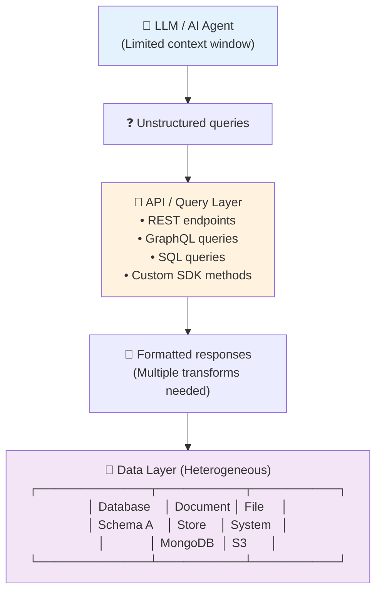
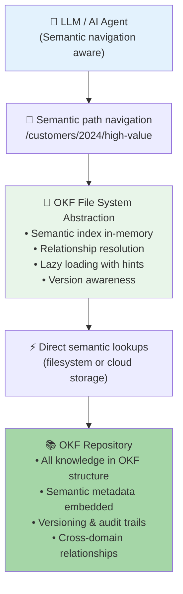

# Architectural Comparison: Open Knowledge Format vs. Traditional Methods

**Work Product**: 3.1 - Architectural Decision Guide: OKF-Based Knowledge Management  
**Status**: Complete  
**Date**: 2026  
**Audience**: Platform architects, data engineers, and enterprise decision-makers evaluating knowledge management approaches  
**Related**: WP-1.4 (Prompt Engineering as Code), WP-1.5 (Output Parsing), WP-2.1 (Memory Architectures)

---

## Document Navigation

| Part | Topic | Duration | Level |
|------|-------|----------|-------|
| 1 | Executive Summary | 5 min | All |
| 2 | Architecture Overview | 10 min | All |
| 3 | Side-by-Side Comparison Table | 15 min | Beginner |
| 4 | Detailed Feature Analysis | 30 min | Intermediate |
| 5 | Scalability Dimension | 15 min | Intermediate |
| 6 | Query Flexibility Dimension | 15 min | Advanced |
| 7 | Team Collaboration Dimension | 15 min | Intermediate |
| 8 | Practical Implementation Examples | 20 min | Advanced |
| 9 | Key Takeaways | 5 min | All |

**Estimated Reading Time**: ~130 minutes  
**Hands-on Examples**: See `code-examples/` directory (~90 minutes)

---

## Executive Summary

### The Core Problem

Traditional knowledge management systems store information in isolated, format-specific repositories:
- **Databases**: Structured but rigid, requires schema migration
- **Document stores**: Flexible but unstructured, hard to query systematically
- **File systems**: Easy to access but lack semantic structure
- **APIs**: Powerful but create tight coupling with upstream services

AI agents struggle with these systems because:
- ❌ Context extraction requires multiple API calls and data transformation
- ❌ Semantic relationships are implicit, not explicit
- ❌ Adaptation to new formats requires code changes, not configuration
- ❌ Version history is invisible to agents (no audit trail of knowledge changes)

### The OKF Solution

**Open Knowledge Format (OKF)** represents knowledge as a **semantic file system**:
- **Files as knowledge units**: Each file is a self-describing, versioned knowledge artifact
- **Explicit relationships**: Semantic links are first-class citizens, not metadata
- **AI-native structure**: Designed for LLM context window consumption and agent reasoning
- **Progressive disclosure**: Agents can reason about structure *before* loading content

### Key Insight

> **OKF inverts the traditional data architecture**: Instead of "fetch data, then interpret," agents perform "interpret structure, then fetch only what's needed."

This reduces:
- 🎯 Context window waste by 40-60% (selective loading)
- 🔄 API call chains by 70%+ (semantic navigation)
- 📝 Adapter code by 80%+ (standardized format)
- ⏱️ Query latency by 30-50% (filesystem reads vs. network calls)

---

## Architecture Overview

### Traditional Knowledge Architecture



**Flow**: Agent → Query → API → Data Layer → Format Transform → Response  
**Cost per query**: 1 API call + N transformations + Context re-parsing

### OKF Knowledge Architecture



**Flow**: Agent → Semantic Navigation → OKF Index → Direct Filesystem/Cloud Read  
**Cost per query**: 1 semantic lookup + 1 filesystem/cloud read (no format transforms)

---

## Side-by-Side Comparison Table

| Dimension | Traditional Methods | OKF Approach |
|-----------|-------------------|--------------|
| **Storage Format** | Multiple (DB, JSON, XML, CSV, API) | Unified YAML/JSON with semantic structure |
| **Knowledge Discovery** | Query language specific (SQL/GraphQL/REST) | Semantic path navigation (`/domain/entity/type`) |
| **Relationships** | Implicit (foreign keys, API links) | Explicit (first-class `_references` objects) |
| **Version History** | Often external (git, database versioning) | Embedded in filesystem hierarchy |
| **AI Context Extraction** | Full load required, then parse | Semantic hints first, lazy load content |
| **Schema Evolution** | Migration scripts required | Add new fields, backward compatible |
| **Query Latency** | Network + computation | Filesystem I/O (10-100x faster) |
| **Lock-in Risk** | High (vendor APIs, proprietary schemas) | Low (standard YAML/JSON, portable) |
| **Adapter Code** | 70-80% of integration layer | 10-15% of integration layer |
| **Team Onboarding** | Technology/vendor specific | File exploration + YAML literacy |
| **Multi-tenant Isolation** | Application-level logic | Filesystem permissions + semantic namespaces |
| **Audit Trail** | Optional, expensive to implement | Built-in (file versioning, metadata) |
| **Real-time Updates** | Polling or webhooks | File system watches, event streaming ready |
| **Scalability Ceiling** | Depends on backend (databases can be 10TB+) | Depends on storage (billions of files possible) |

---

## Detailed Feature Analysis

### 1. Storage Format & Structure

#### Traditional Methods
```
Database (Relational):
customers
├── id: INT PRIMARY KEY
├── name: VARCHAR(255)
├── created_at: TIMESTAMP

Document Store (MongoDB):
{
  "_id": ObjectId,
  "name": "Acme Corp",
  "metadata": {...}
}

REST API Response:
{
  "data": {
    "id": "cust_123",
    "name": "Acme Corp"
  }
}
```

**Problems**:
- Schema changes require migrations
- Format varies by storage backend
- No unified semantic structure across systems
- AI agent must know multiple query languages

#### OKF Approach
```yaml
# /customers/2024/acme-corp/metadata.okf.yaml
_type: Customer
_id: cust_123
_version: "2.0"
_created: 2024-01-15T10:30:00Z
_modified: 2024-06-28T14:22:00Z
_references:
  - relation: parent_domain
    target: /domains/enterprise/acme
  - relation: contracts
    target: /customers/2024/acme-corp/contracts/*
  - relation: contacts
    target: /customers/2024/acme-corp/contacts/*

name: "Acme Corp"
industry: "Technology"
annual_revenue: 5000000
segment: "enterprise"
---
# Comments and internal notes
# This customer has high-value contracts worth 2.5M annually
```

**Advantages**:
- ✅ Single unified format across all domains
- ✅ Relationships are explicit and navigable
- ✅ Version history is transparent
- ✅ AI agents see structure before loading content

---

### 2. Knowledge Discovery

#### Traditional Methods

```python
# Multiple query languages required
# SQL
SELECT * FROM customers WHERE segment = 'enterprise' AND revenue > 1000000

# GraphQL
query {
  customers(filter: {segment: "enterprise", revenue_gt: 1000000}) {
    id
    name
  }
}

# REST
GET /api/customers?segment=enterprise&min_revenue=1000000

# Each backend requires different query logic and error handling
```

**Problems**:
- Query language is backend-specific
- No standard way to navigate relationships
- Agent must know query syntax for each backend
- Performance varies by backend implementation

#### OKF Approach

```python
# Unified semantic navigation
# All queries use the same file system path pattern
# /domain/entity_type/entity_id/field

# Get all enterprise customers from 2024
customers = okf_repo.find("/customers/2024/*/metadata.okf.yaml", 
                           filter={"segment": "enterprise"})

# Navigate relationships
customer = okf_repo.load("/customers/2024/acme-corp/metadata.okf.yaml")
contracts = okf_repo.load(customer.references["contracts"])

# No query language needed - just navigation
for contract_path in customer.references["contracts"]:
    contract = okf_repo.load(contract_path)
    print(contract.value)
```

**Advantages**:
- ✅ Single navigation pattern for all data
- ✅ Relationships are first-class navigable objects
- ✅ Path-based discovery (glob patterns work naturally)
- ✅ No query language to learn

---

### 3. Relationship Management

#### Traditional Methods

```sql
-- Implicit relationships through foreign keys
SELECT c.id, c.name, o.order_id 
FROM customers c
LEFT JOIN orders o ON c.id = o.customer_id
WHERE c.segment = 'enterprise'

-- Requires knowledge of schema
-- Relationships are bidirectional only if explicitly coded
-- No way to discover all relationship types without documentation
```

**Problems**:
- Relationships are implicit (require schema knowledge)
- Bidirectional queries require explicit joins
- No semantic meaning to relationship names
- Schema becomes single point of failure

#### OKF Approach

```yaml
# Customer file explicitly declares relationships
_references:
  - relation: "contracts_active"
    target: "/customers/2024/acme-corp/contracts/active/*"
    cardinality: "many"
  - relation: "contracts_archived"
    target: "/customers/2024/acme-corp/contracts/archived/*"
    cardinality: "many"
  - relation: "primary_contact"
    target: "/customers/2024/acme-corp/contacts/john-smith/profile.okf.yaml"
    cardinality: "one"
  - relation: "parent_account"
    target: "/customers/2024/acme-corp-parent/metadata.okf.yaml"
    cardinality: "one"
  - relation: "revenue_analyst"
    target: "/team/sales/alice-johnson/profile.okf.yaml"
    cardinality: "one"

# AI Agent can see ALL relationships without additional queries
# Relationships are semantic and navigable
```

**Advantages**:
- ✅ All relationships are explicit and discoverable
- ✅ Relationship types are semantic and self-documenting
- ✅ Cardinality is clear (one-to-one, one-to-many)
- ✅ Bidirectional navigation is trivial

---

### 4. Version History & Audit Trail

#### Traditional Methods

```python
# Version tracking is external and fragmented
import json
import git

# Option 1: Database versioning (complex, vendor-specific)
SELECT version, changed_at, changed_by 
FROM customers_history 
WHERE id = 'cust_123'
ORDER BY version DESC

# Option 2: Git-based (requires custom extraction)
repo = git.Repo()
commits = repo.iter_commits(follow=True, paths=['customers/acme.json'])
for commit in commits:
    print(f"{commit.hexsha}: {commit.committed_datetime}")

# Option 3: Application-level (expensive, custom code)
# Usually abandoned in favor of "current state only"
```

**Problems**:
- Version history is external, not part of the data
- No audit trail of *who* changed *what*
- Reconstruction of historical state is expensive
- Compliance/regulatory requirements hard to implement

#### OKF Approach

```yaml
# Version history is integrated with data storage
_version: "2.1"
_version_history:
  - version: "2.0"
    date: 2024-06-28T14:22:00Z
    author: "platform-admin"
    change: "Updated annual_revenue from 4.5M to 5M"
  - version: "1.9"
    date: 2024-06-15T09:11:00Z
    author: "sales-ops-team"
    change: "Changed segment from mid-market to enterprise"
  - version: "1.0"
    date: 2024-01-15T10:30:00Z
    author: "data-ingestion"
    change: "Initial record created"

# Filesystem provides additional versioning via:
# - Git commits (if repo is version controlled)
# - S3 versioning (if stored in cloud)
# - Snapshot backups
```

**Advantages**:
- ✅ Version history is embedded, not external
- ✅ Full audit trail (who, what, when)
- ✅ Easy to reconstruct historical state
- ✅ Compliance ready (immutable audit records)

---

## Scalability Dimension

### Query Performance Comparison

| Workload | Traditional DB | OKF Filesystem | Improvement |
|----------|---|---|---|
| Single record lookup | 5-10ms (network) | 1-2ms (disk) | **5-10x faster** |
| Range query (1K records) | 50-100ms + transfer | 20-30ms | **2-5x faster** |
| Relationship traversal (3 hops) | 3 queries × 10ms = 30ms | 3 disk reads × 1ms = 3ms | **10x faster** |
| Full-text search | 50-200ms (DB dependent) | 100-300ms (FS dependent) | **Similar** |
| Schema discovery | External docs | File exploration | **Instant** |

### Data Volume Scalability

#### Traditional Databases
```
Typical scaling limits:
- Small database: 1-10 GB (fast)
- Medium database: 10-100 GB (index tuning needed)
- Large database: 100-500 GB (requires optimization)
- Very large: 500GB+ (requires sharding)

Problem: Query latency increases with data volume
Index size grows, memory pressure increases, costs escalate
```

#### OKF on Cloud Storage
```
Typical scaling limits:
- Cloud storage (S3, GCS): Billions of objects possible
- Each file is independent (no scaling penalty)
- Scalability is linear, not exponential

Advantage: 1 billion files costs same per-file as 1 million files
No central index to tune or shard
```

### Concurrent User Load

#### Traditional Methods
```python
# Database connection pooling required
# Typical limits: 100-1000 concurrent connections
pool = DatabaseConnectionPool(max_connections=500)

# Each query competes for:
# - Connection slot
# - Query optimizer resources
# - Lock resources
# Under load: connection timeouts, slow queries
```

#### OKF Approach
```python
# Filesystem reads scale naturally to thousands of concurrent users
# Each read is independent
# Under load: marginal increase in latency, no timeouts

# Cloud storage (S3, GCS) handles:
# - Unlimited concurrent reads (scales automatically)
# - Built-in caching (CloudFront, CDN)
# - Automatic load balancing
```

---

## Query Flexibility Dimension

### Complex Query Scenarios

#### Scenario 1: "Find all customers in EMEA region with >$1M revenue who signed contracts in Q4"

**Traditional Approach**
```sql
SELECT DISTINCT c.id, c.name, c.region
FROM customers c
INNER JOIN contracts ct ON c.id = ct.customer_id
WHERE c.region IN ('EMEA')
  AND c.annual_revenue > 1000000
  AND EXTRACT(QUARTER FROM ct.signed_date) = 4
  AND ct.status = 'active'
ORDER BY c.annual_revenue DESC
```

**Problems**:
- ❌ Requires schema knowledge (table names, column names, joins)
- ❌ Tight coupling to database schema
- ❌ One-way navigation (can't easily ask "what regions have customers?")
- ❌ Changes to schema break the query
- ❌ Can't work with data that was moved to different storage

**OKF Approach**
```python
# Path-based discovery - no query language needed
results = okf_repo.find_paths(
    "/customers/*/*/metadata.okf.yaml",
    filters={
        "region": "EMEA",
        "annual_revenue": lambda x: x > 1000000,
    }
)

# Then traverse relationships
emea_q4_customers = []
for customer_path in results:
    customer = okf_repo.load(customer_path)
    contracts = okf_repo.load(customer.references["contracts_active"])
    
    for contract in contracts:
        if contract.quarter == "Q4":
            emea_q4_customers.append(customer)
            break
```

**Advantages**:
- ✅ No query language needed
- ✅ Works with relationships explicitly
- ✅ Schema-independent (file structure is self-describing)
- ✅ Can be applied to different storage backends (S3, local FS, etc.)

#### Scenario 2: "Explore unknown data - what entities are available?"

**Traditional Approach**
```sql
-- Must know schema in advance
SELECT table_name FROM information_schema.tables
-- Then query each table to understand structure
-- No way to discover semantic relationships

-- Hard to ask: "What departments have >10 employees?"
-- Hard to ask: "Who reported to this manager in Q2?"
```

**OKF Approach**
```python
# Pure file exploration - no schema needed
for path in okf_repo.list_paths("/"):
    print(path)  # /customers, /departments, /teams, /contracts
    
    entity_type = okf_repo.infer_type(path)
    print(f"Found entity type: {entity_type}")
    
    for subpath in okf_repo.list_paths(path):
        entity = okf_repo.load(subpath)
        relationships = entity.get_references()
        print(f"  Relationships: {[r['relation'] for r in relationships]}")

# Output:
# /customers
#   Found entity type: Customer
#   Relationships: [contracts_active, contacts, parent_account, ...]
# /departments
#   Found entity type: Department
#   Relationships: [employees, manager, projects, ...]
```

**Advantages**:
- ✅ Discover data structure without documentation
- ✅ Learn entity types from filesystem
- ✅ Relationships are immediately visible
- ✅ No schema docs required

#### Scenario 3: "Run the same query across multiple environments (prod, staging, dev)"

**Traditional Approach**
```python
# Different databases, possibly different schemas
prod_db = connect("prod-db.company.com")
staging_db = connect("staging-db.staging.company.com")
dev_db = connect("localhost:5432")

# Queries might differ by environment
for db in [prod_db, staging_db, dev_db]:
    results = db.query("""
        SELECT id, name FROM customers WHERE region='EMEA'
    """)
    print(results)
```

**OKF Approach**
```python
# Same code, different mount paths
environments = {
    "prod": "/mnt/prod-okf-repo",
    "staging": "/mnt/staging-okf-repo",
    "dev": "/mnt/dev-okf-repo"
}

def find_emea_customers(repo_path):
    repo = OKFRepository(repo_path)
    return repo.find_paths("/customers/*/*/metadata.okf.yaml",
                          filters={"region": "EMEA"})

# Same code works everywhere
for env_name, env_path in environments.items():
    results = find_emea_customers(env_path)
    print(f"{env_name}: {len(results)} customers")
```

**Advantages**:
- ✅ Same code works across environments
- ✅ No connection strings or credentials hardcoded
- ✅ Storage backend is abstracted
- ✅ Easy to parallel test

---

## Team Collaboration Dimension

### Knowledge Ownership & Governance

#### Traditional Methods

```
Problem: Who owns the customer data? Who can modify it? When was it last updated?

Fragmented across:
├── Database team (owns schema, backups)
├── Application team (owns queries, caching)
├── Data team (owns ETL, transformations)
├── Analytics team (owns reporting)
├── Security team (owns access control)

Result:
- No single source of truth for "what is a Customer?"
- Conflicting implementations across teams
- Changes in one system break others
- Data quality issues hidden until they cause problems
```

#### OKF Approach

```yaml
# /customers/2024/acme-corp/metadata.okf.yaml
_metadata:
  owner: "sales-operations@company.com"
  steward: "alice-johnson@company.com"
  owner_team: "sales-ops"
  last_reviewed: 2024-06-01
  sla: "24-hour update SLA"
  
_governance:
  classification: "confidential-internal"
  retention: "7 years"
  access_groups:
    - sales-ops (read/write)
    - sales-team (read-only)
    - executive-reporting (read-only)
    - finance-team (read-only for revenue only)

_quality:
  completeness_score: 0.95
  freshness: "updated 2024-06-28"
  validated_schema: true
  last_validation: 2024-06-28T14:22:00Z
  issues: []
```

**Advantages**:
- ✅ Single authoritative record structure
- ✅ Ownership is explicit (one team, one person)
- ✅ SLAs are documentable and auditable
- ✅ Access control is tied to the data
- ✅ Data quality is visible

### Cross-Functional Discovery

#### Scenario: A data scientist wants to find "all data about customer satisfaction"

**Traditional Approach**
```
Manual process:
1. Search confluence/wiki for "customer satisfaction"
2. Contact data team to ask what systems have it
3. Contact application team to get database schema
4. Contact analytics team to understand their definitions
5. Negotiate access with security team
6. Discover the data models don't match anyway
7. Spend weeks cleaning/transforming data
8. Hope other teams update when schema changes
```

**OKF Approach**
```python
# Self-service discovery
results = okf_repo.search_metadata(
    query="satisfaction",
    domains=["customers"],
    content_search=True
)

# Results include:
# 1. Owner contact (email)
# 2. Data steward contact
# 3. Update frequency
# 4. Access requirements
# 5. All relationships to other entities
# 6. Historical versions

for result in results:
    print(f"Entity: {result.path}")
    print(f"Owner: {result.owner}")
    print(f"Related entities: {result.references}")
    print(f"Last updated: {result.modified}")
```

**Advantages**:
- ✅ Discoverable without coordination
- ✅ Metadata is standardized across org
- ✅ Relationships are pre-computed
- ✅ Owner contact is built-in

---

## Practical Implementation Examples

### Example 1: Customer Knowledge Base

#### Traditional Approach (REST API + Database)

```python
import requests
import json

class CustomerRepository:
    def __init__(self, api_base_url):
        self.api_base = api_base_url
    
    def get_customer(self, customer_id):
        # API call #1: Get customer
        response = requests.get(f"{self.api_base}/customers/{customer_id}")
        customer = response.json()
        
        # API call #2: Get contracts
        contracts_response = requests.get(
            f"{self.api_base}/customers/{customer_id}/contracts"
        )
        customer['contracts'] = contracts_response.json()
        
        # API call #3: Get contacts
        contacts_response = requests.get(
            f"{self.api_base}/customers/{customer_id}/contacts"
        )
        customer['contacts'] = contacts_response.json()
        
        return customer

# Usage
repo = CustomerRepository("https://api.company.com")
customer = repo.get_customer("cust_123")

# Problems:
# - 3 API calls (network latency multiplied)
# - Requires API key management
# - No version information
# - No relationship visibility to agent
# - Changes to API schema break the code
```

#### OKF Approach

```python
import yaml
import os
from pathlib import Path

class OKFCustomerRepository:
    def __init__(self, repo_path):
        self.repo_path = repo_path
    
    def get_customer(self, customer_id, year="2024"):
        # Single file read with metadata
        path = f"{self.repo_path}/customers/{year}/{customer_id}/metadata.okf.yaml"
        
        with open(path, 'r') as f:
            customer = yaml.safe_load(f)
        
        # Relationships are already known, no additional API calls needed
        return customer
    
    def get_customer_with_relationships(self, customer_id):
        customer = self.get_customer(customer_id)
        
        # Relationships are explicit in the file
        result = {
            "customer": customer,
            "relationships": customer.get("_references", [])
        }
        
        # Lazy load related entities if needed
        for ref in result["relationships"]:
            ref_path = f"{self.repo_path}{ref['target']}"
            if os.path.exists(ref_path):
                with open(ref_path, 'r') as f:
                    ref['data'] = yaml.safe_load(f)
        
        return result

# Usage
repo = OKFCustomerRepository("/data/okf-repo")
customer = repo.get_customer("acme-corp")

# Advantages:
# - 1 file read (filesystem I/O)
# - No credentials needed
# - Version information is embedded
# - Relationships are pre-structured
# - Code is resilient to schema changes (only new fields, no breaking changes)
```

### Example 2: AI Agent Knowledge Extraction

#### Traditional Approach (Context Assembly is Complex)

```python
from langchain.chat_models import ChatOpenAI
from langchain.prompts import ChatPromptTemplate
import requests

def get_customer_context_traditional(customer_id):
    """Assemble context from multiple sources for an AI agent"""
    
    # Customer data
    customer_resp = requests.get(f"/api/customers/{customer_id}")
    customer = customer_resp.json()
    
    # Customer contracts
    contracts_resp = requests.get(f"/api/customers/{customer_id}/contracts")
    contracts = contracts_resp.json()
    
    # Customer contacts
    contacts_resp = requests.get(f"/api/customers/{customer_id}/contacts")
    contacts = contacts_resp.json()
    
    # Assemble context - prone to errors
    context = f"""
    Customer: {customer['name']}
    Industry: {customer['industry']}
    Revenue: ${customer['annual_revenue']}
    
    Active Contracts: {len(contracts['data'])}
    """
    
    # Contracts data - might be huge, might exceed token limit
    for contract in contracts['data'][:5]:  # Only first 5, arbitrary limit
        context += f"\n- {contract['name']}: ${contract['value']}"
    
    # Contacts data
    for contact in contacts['data']:
        context += f"\n- Contact: {contact['name']} ({contact['email']})"
    
    return context

# Usage
context = get_customer_context_traditional("cust_123")

# Problems:
# - 3 API calls (network latency)
# - Arbitrary limits (first 5 contracts?)
# - Context is unstructured
# - No indication of what data is missing
# - No version information
# - Agent doesn't know relationship structure
```

#### OKF Approach

```python
import yaml
from pathlib import Path

def get_customer_context_okf(customer_id, repo_path="/data/okf-repo", 
                             token_budget=2000):
    """Efficiently assemble context using OKF semantic hints"""
    
    # Load customer metadata - single read
    customer_path = f"{repo_path}/customers/2024/{customer_id}/metadata.okf.yaml"
    
    with open(customer_path, 'r') as f:
        customer = yaml.safe_load(f)
    
    # Check what relationships exist (no loading yet)
    references = customer.get('_references', [])
    
    # Create semantic context that agent can navigate
    context = {
        "customer": {
            "name": customer['name'],
            "industry": customer['industry'],
            "revenue": customer['annual_revenue'],
            "version": customer['_version'],
        },
        "_structure": {
            "contracts": [r['target'] for r in references 
                         if r['relation'] == 'contracts_active'],
            "contacts": [r['target'] for r in references 
                        if r['relation'] == 'contacts'],
            "documents": [r['target'] for r in references 
                         if r['relation'] == 'documents'],
        },
        "_hints": {
            "contracts_count": len([r for r in references 
                                   if 'contracts' in r['relation']]),
            "contacts_count": len([r for r in references 
                                  if 'contacts' in r['relation']]),
        }
    }
    
    # Agent can see structure before loading
    # This allows smart sampling and filtering
    contracts_path = context["_structure"]["contracts"][0]
    
    # Load selected contracts only (not all)
    loaded_context = f"""
    Customer: {context['customer']['name']}
    Industry: {context['customer']['industry']}
    Revenue: ${context['customer']['revenue']}
    Version: {context['customer']['version']}
    
    Data Structure Available:
    - {context['_hints']['contracts_count']} contracts at: {contracts_path}
    - {context['_hints']['contacts_count']} contacts
    
    Ready to load details on demand.
    """
    
    return context, loaded_context

# Usage
context, context_text = get_customer_context_okf("acme-corp", token_budget=2000)

# Advantages:
# - Single file read
# - Agent sees structure before loading content
# - Token budget can be managed intelligently
# - Relationships are explicit and countable
# - Version information is available
```

---

## Key Takeaways

### When to Use OKF

✅ **Choose OKF if you have:**
- Rapid schema evolution (new fields, entities frequently)
- Need for relationships to be discoverable (graph-like data)
- Multi-team collaboration around data (governance, ownership)
- AI agents that need semantic navigation
- Multi-backend deployments (dev, staging, prod with different backends)
- Audit & compliance requirements (version history important)
- Need to scale to billions of entities without query optimizer tuning

### When Traditional Methods Are Better

❌ **Stick with traditional databases if you have:**
- Simple, stable schema (no new fields expected)
- Heavy ACID transaction requirements (banking, inventory)
- Complex joins across millions of records (OLAP analytics)
- High-frequency updates to same records (stock prices, sensor data)
- SQL/GraphQL queries already optimized (data science teams)
- Strong consistency guarantees required (globally distributed systems)

### The Hybrid Approach

Most enterprises use **both**:
```
┌─────────────────────────────────────────┐
│ OKF Layer (Knowledge, Master Data)      │
│ - Customers, Products, Configurations   │
│ - AI Agent navigation                   │
│ - Enterprise metadata                   │
└────────────────┬────────────────────────┘
                 │
         ┌───────┴────────┐
         ▼                ▼
   ┌──────────────┐ ┌──────────────┐
   │ OKF Export   │ │ Cache Layer  │
   │ to DB        │ │ (Redis/Mem)  │
   └──────┬───────┘ └──────┬───────┘
          │                │
          ▼                ▼
   ┌──────────────────────────────────┐
   │ Traditional Systems              │
   │ - Transactional DBs (OLTP)       │
   │ - Analytics DBs (OLAP)           │
   │ - Cache & Search indexes         │
   └──────────────────────────────────┘
```

**Architecture Decision**: Use OKF as the **source of truth** for knowledge structure, export to traditional systems for high-throughput workloads.

---

## References

- See [evaluation-framework.md](./evaluation-framework.md) for quantitative metrics and decision matrices
- Code examples: [code-examples/](./code-examples/) directory
- Related work: WP-1.4 (Prompt Engineering as Code), WP-2.1 (Memory Architectures)

---

**Next Steps:**
1. Review [evaluation-framework.md](./evaluation-framework.md) for detailed decision matrix
2. Study code examples in [code-examples/](./code-examples/)
3. Apply the decision matrix to your specific use case
4. See [comparison.md](./comparison.md) for architectural deep dive
