# 🗺️ AI Architecture Blueprints - Agent Map

**Complete Knowledge Graph of the Learning Material**

This document visualizes how all work products, ADRs, and examples are connected and organized.

---

## 📊 Work Product Hierarchy

```mermaid
graph TB
    START["🎯 START HERE<br/>README.md"] 
    ECOSYSTEM["📚 Ecosystem<br/>LANGCHAIN_ECOSYSTEM_MAP.md"]
    ADR12["🏗️ ADR-1.2<br/>Hello World Three Ways"]
    EX12["💻 examples_1_2.py<br/>Working Implementations"]
    ADR21["🏗️ ADR-2.1<br/>Choreography: Event-Driven Agility"]
    CHORE["💻 choreography_hive_mind.py<br/>Hive Mind Implementation"]
    TEST_CHORE["🧪 test_choreography_hive_mind.py<br/>Choreography Tests"]
    WP13["🔬 WP-1.3<br/>Runnable Protocol"]
    EX13["💻 examples_1_3.py<br/>Practical Demonstrations"]
    WP14["📋 WP-1.4<br/>Prompt Engineering as Code"]
    EX14["💻 examples_1_4.py<br/>PromptRegistry Demos"]
    WP15["📈 WP-1.5<br/>Output Parsing for System Integration"]
    WP16["🤖 WP-1.6<br/>Choosing an LLM"]
    WP17["🔍 WP-1.7<br/>Tracing with LangSmith"]
    EX17["💻 examples_1_7.py<br/>Tracing Examples"]
    WP21["💾 WP-2.1<br/>Short-Term vs Long-Term Memory"]
    EX21["💻 examples_2_1.py<br/>Dual-Memory Chatbot Examples"]
    WP22["🤖 WP-2.2<br/>State Management in Agent Loop"]
    EX22["💻 examples_2_2.py<br/>State Machine Agent Examples"]
    ADR22["🏗️ ADR-2.2<br/>Orchestration: Centralized Control"]
    WP23["⚙️ WP-2.3<br/>Orchestration Pattern: Controller Agent"]
    CONTROLLER["💻 controller_orchestration_agent.py<br/>Controller Orchestration"]
    TEST_CONTROLLER["🧪 test_controller_orchestration.py<br/>Orchestration Tests"]
    WP24["🐝 WP-2.4<br/>Choreography Pattern: Hive Mind"]
    HIVE["💻 choreography_hive_mind.py<br/>Event-Driven Hive Mind"]
    TEST_HIVE["🧪 test_choreography_hive_mind.py<br/>Choreography Tests"]
    WP26["🔗 WP-2.6<br/>LangGraph for Stateful Graphs"]
    EX26["💻 examples_2_6.py<br/>StateGraph Implementation"]
    TEST26["🧪 test_langgraph_orchestration.py<br/>LangGraph Tests"]
    WP27["🔐 WP-2.7<br/>Checkpointing & Human-in-the-Loop"]
    EX27["💻 examples_2_7.py<br/>Email Approval Workflow"]
    TEST27["🧪 test_langgraph_checkpointing.py<br/>Checkpointing Tests"]
    AGENTMAP["🗺️ AGENTMAP.md<br/>This Document"]
    
    START -->|Learn about| ECOSYSTEM
    START -->|Choose approach| ADR12
    ADR12 -->|See code| EX12
    START -->|Deep dive| WP13
    WP13 -->|Practice| EX13
    WP13 -->|Builds on| ADR12
    WP13 -->|Enables| WP14
    WP14 -->|Enables| WP15
    WP15 -->|Informs| WP16
    WP14 -->|Practice| EX14
    WP14 -->|Builds on| ADR12
    WP16 -->|Optimizes with| WP17
    WP14 -->|Debugs with| WP17
    WP15 -->|Debugs with| WP17
    WP17 -->|See code| EX17
    WP16 -->|Enables| WP21
    WP15 -->|Extracts facts for| WP21
    WP21 -->|See code| EX21
    WP21 -->|Observes with| WP17
    WP22 -->|See code| EX22
    WP22 -->|Prevents loops in| WP17
    WP22 -->|Coordinates multiple| WP15
    ADR21 -->|See code| CHORE
    CHORE -->|Tested by| TEST_CHORE
    ADR21 -->|Foundation for multi-agent| WP22
    ADR22 -->|Foundation for| WP23
    WP23 -->|See code| CONTROLLER
    CONTROLLER -->|Tested by| TEST_CONTROLLER
    ADR22 -->|See code| CONTROLLER
    CONTROLLER -->|Tested by| TEST_CONTROLLER
    ADR22 -->|Contrasts with| ADR21
    ADR22 -->|Uses concepts from| WP22
    WP23 -->|Detailed implementation| ADR22
    WP23 -->|Contrasts with| ADR21
    ADR21 -->|Foundation for| WP24
    WP24 -->|See code| HIVE
    HIVE -->|Tested by| TEST_HIVE
    ADR21 -->|See code| HIVE
    HIVE -->|Tested by| TEST_HIVE
    WP24 -->|Contrasts with| WP23
    ADR22 -->|Framework implementation| WP26
    WP23 -->|Reimplemented in| WP26
    WP26 -->|See code| EX26
    EX26 -->|Tested by| TEST26
    WP26 -->|Extends| WP27
    WP27 -->|See code| EX27
    EX27 -->|Tested by| TEST27
    WP27 -->|Adds guardrails to| ADR22
    AGENTMAP -->|Shows relationships| START
    AGENTMAP -->|Shows relationships| ADR12
    AGENTMAP -->|Shows relationships| ADR21
    AGENTMAP -->|Shows relationships| WP13
    AGENTMAP -->|Shows relationships| WP14
    AGENTMAP -->|Shows relationships| WP15
    AGENTMAP -->|Shows relationships| WP16
    AGENTMAP -->|Shows relationships| WP17
    AGENTMAP -->|Shows relationships| WP21
    AGENTMAP -->|Shows relationships| WP22
    AGENTMAP -->|Shows relationships| WP23
    AGENTMAP -->|Shows relationships| WP24
    AGENTMAP -->|Shows relationships| WP26
    AGENTMAP -->|Shows relationships| WP27
    AGENTMAP -->|Shows relationships| WP30
    AGENTMAP -->|Shows relationships| ADR003
    AGENTMAP -->|Shows relationships| WP41
    AGENTMAP -->|Shows relationships| LEGALINDEX
    
    style START fill:#4CAF50,stroke:#2E7D32,color:#fff
    style ECOSYSTEM fill:#2196F3,stroke:#1565C0,color:#fff
    style ADR12 fill:#FF9800,stroke:#E65100,color:#fff
    style EX12 fill:#9C27B0,stroke:#6A1B9A,color:#fff
    style ADR21 fill:#FF9800,stroke:#E65100,color:#fff
    style CHORE fill:#9C27B0,stroke:#6A1B9A,color:#fff
    style TEST_CHORE fill:#4CAF50,stroke:#2E7D32,color:#fff
    style ADR22 fill:#FF9800,stroke:#E65100,color:#fff
    style CONTROLLER fill:#9C27B0,stroke:#6A1B9A,color:#fff
    style TEST_CONTROLLER fill:#4CAF50,stroke:#2E7D32,color:#fff
    style WP24 fill:#FF9800,stroke:#E65100,color:#fff
    style HIVE fill:#9C27B0,stroke:#6A1B9A,color:#fff
    style TEST_HIVE fill:#4CAF50,stroke:#2E7D32,color:#fff
    style WP13 fill:#FF9800,stroke:#E65100,color:#fff
    style EX13 fill:#9C27B0,stroke:#6A1B9A,color:#fff
    style WP14 fill:#FF9800,stroke:#E65100,color:#fff
    style EX14 fill:#9C27B0,stroke:#6A1B9A,color:#fff
    style WP15 fill:#FF9800,stroke:#E65100,color:#fff
    style WP16 fill:#FF9800,stroke:#E65100,color:#fff
    style WP17 fill:#FF9800,stroke:#E65100,color:#fff
    style EX17 fill:#9C27B0,stroke:#6A1B9A,color:#fff
    style WP21 fill:#FF9800,stroke:#E65100,color:#fff
    style EX21 fill:#9C27B0,stroke:#6A1B9A,color:#fff
    style WP22 fill:#FF9800,stroke:#E65100,color:#fff
    style EX22 fill:#9C27B0,stroke:#6A1B9A,color:#fff
    style WP26 fill:#FF9800,stroke:#E65100,color:#fff
    style EX26 fill:#9C27B0,stroke:#6A1B9A,color:#fff
    style TEST26 fill:#4CAF50,stroke:#2E7D32,color:#fff
    style WP27 fill:#FF9800,stroke:#E65100,color:#fff
    style EX27 fill:#9C27B0,stroke:#6A1B9A,color:#fff
    style TEST27 fill:#4CAF50,stroke:#2E7D32,color:#fff
    style WP30 fill:#FF9800,stroke:#E65100,color:#fff
    style ADR003 fill:#FF9800,stroke:#E65100,color:#fff
    style WP31 fill:#FF9800,stroke:#E65100,color:#fff
    style WP41 fill:#FF9800,stroke:#E65100,color:#fff
    style WP51 fill:#9C27B0,stroke:#6A1B9A,color:#fff
    style LEGALINDEX fill:#2196F3,stroke:#1565C0,color:#fff
    style AGENTMAP fill:#F44336,stroke:#C62828,color:#fff
```



---

## 📚 Document Overview

### Core Documents

| Document | Type | Purpose | Lines | Status |
|----------|------|---------|-------|--------|
| [README.md](README.md) | 📖 Guide | Project overview and navigation | ~800 | ✅ |
| [LANGCHAIN_ECOSYSTEM_MAP.md](LANGCHAIN_ECOSYSTEM_MAP.md) | 📚 Reference | Complete LangChain stack documentation | ~1200 | ✅ |
| [ADR-1.2-Hello-World-Three-Ways.md](../01-foundations/ADR-1.2-Hello-World-Three-Ways.md) | 🏗️ Architecture Decision | Chain abstraction comparison and decision flow | ~500 | ✅ |
| [WP-1.3-The-Runnable-Protocol.md](../01-foundations/WP-1.3-The-Runnable-Protocol.md) | 🔬 Deep Dive | Runnable protocol explained in 12 parts | ~1100 | ✅ |
| [WP-1.4-Prompt-Engineering-as-Code.md](../02-production-patterns/WP-1.4-Prompt-Engineering-as-Code.md) | 📋 Design Pattern | PromptRegistry pattern: versioning, composition, multi-turn | ~900 | ✅ |
| [WP-1.5-Output-Parsing-for-System-Integration.md](../02-production-patterns/WP-1.5-Output-Parsing-for-System-Integration.md) | 📈 Design Pattern | Structured output, parser repair, and retry strategy | ~300 | ✅ |
| [WP-1.6-Choosing-an-LLM-A-Decision-Matrix.md](../02-production-patterns/WP-1.6-Choosing-an-LLM-A-Decision-Matrix.md) | 🤖 Design Pattern | LLM decision matrix and ADR for production model selection | ~220 | ✅ |
| [WP-1.7-Introduction-to-Tracing-with-LangSmith.md](../02-production-patterns/WP-1.7-Introduction-to-Tracing-with-LangSmith.md) | 🔍 Design Pattern | Observability-first debugging with LangSmith traces | ~740 | ✅ |
| [WP-2.1-Short-Term-vs-Long-Term-Memory-A-Working-Model.md](../03-memory-state-agents/WP-2.1-Short-Term-vs-Long-Term-Memory-A-Working-Model.md) | 💾 Design Pattern | Dual-memory architecture for scalable conversational systems | ~600 | ✅ |
| [WP-2.2-State-Management-in-Single-Agent-Loop.md](../03-memory-state-agents/WP-2.2-State-Management-in-Single-Agent-Loop.md) | 🤖 Design Pattern | State machine for agent loops with infinite loop prevention | ~850 | ✅ |
| [ADR-2.2-Orchestration-Centralized-Control.md](../04-multi-agent-architectures/ADR-2.2-Orchestration-Centralized-Control.md) | 🏗️ Architecture Decision | Orchestration vs choreography patterns with decision matrix | ~2600 | ✅ |
| [WP-2.3-Orchestration-Pattern.md](../04-multi-agent-architectures/WP-2.3-Orchestration-Pattern.md) | ⚙️ Design Pattern | Practical orchestration implementation with controller agent | ~1000 | ✅ |
| [WP-2.4-Choreography-Pattern.md](../04-multi-agent-architectures/WP-2.4-Choreography-Pattern.md) | 🐝 Design Pattern | Practical choreography implementation with event-driven Hive Mind | ~1000 | ✅ |
| [WP-2.6-Introduction-to-LangGraph-for-Stateful-Graphs.md](../04-multi-agent-architectures/WP-2.6-Introduction-to-LangGraph-for-Stateful-Graphs.md) | 🔗 Framework Guide | Reimplementation of orchestrator using LangGraph StateGraph for production workflows | ~2000 | ✅ |
| [WP-2.7-Checkpointing-and-Human-in-the-Loop.md](../04-multi-agent-architectures/WP-2.7-Checkpointing-and-Human-in-the-Loop.md) | 🔐 Framework Guide | LangGraph checkpointing for human approval gates and state resumption | ~2500 | ✅ |
| [WP-3.0-Knowledge-Architecture-Decisions.md](../05-capstone-rag-patterns/WP-3.0-Knowledge-Architecture-Decisions.md) | 🏗️ Architecture Decision | OKF vs traditional databases: 40-50% cost savings analysis | ~1500 | ✅ |
| [WP-3.1-RAG-Architecture-Naive-Baseline.md](../05-capstone-rag-patterns/WP-3.1-RAG-Architecture-Naive-Baseline.md) | 📊 Design Pattern | Foundation RAG: vector stores, semantic search, 5 failure modes | ~1200 | ✅ |
| [WP-3.2-Advanced-Retrieval-Reranking-Filtering.md](../05-capstone-rag-patterns/WP-3.2-Advanced-Retrieval-Reranking-Filtering.md) | 📈 Design Pattern | Reranking & filtering for accuracy improvement | ~800 | ✅ |
| [WP-3.3-Hierarchical-Indexing-Scale.md](../05-capstone-rag-patterns/WP-3.3-Hierarchical-Indexing-Scale.md) | 🔗 Design Pattern | Scale to 100K+ documents with hierarchical indexing | ~900 | ✅ |
| [WP-3.4-Evaluation-Metrics.md](../05-capstone-rag-patterns/WP-3.4-Evaluation-Metrics.md) | 📏 Evaluation Guide | Measure and debug RAG performance (recall, precision, F1) | ~600 | ✅ |
| [WP-3.5-Agentic-Workflow.md](../05-capstone-rag-patterns/WP-3.5-Agentic-Workflow.md) | 🤖 Design Pattern | Iterative multi-step search and synthesis with refinement | ~1100 | ✅ |
| [ADR-003-Agentic-RAG-over-Naive-RAG.md](../05-capstone-rag-patterns/ADR-003-Agentic-RAG-over-Naive-RAG.md) | 🏗️ Architecture Decision | When to use agentic RAG vs one-shot retrieval (decision matrix) | ~1000 | ✅ |
| [WP-3.7-Query-Router.md](../05-capstone-rag-patterns/WP-3.7-Query-Router.md) | 🛣️ Design Pattern | Adaptive strategy selection (-36% latency, -28% cost) | ~1000 | ✅ |
| [WP-4.1-Domain-Selection-ADR.md](../06-capstone-legal-contract-analysis/WP-4.1-Domain-Selection-ADR.md) | 🏛️ Architecture Decision | Why legal contracts: measurable, high-impact, requires judgment | ~800 | ✅ |
| [WP-4.2-Task-Decomposition.md](../06-capstone-legal-contract-analysis/WP-4.2-Task-Decomposition.md) | 📋 Design Spec | 7-task pipeline: ingestion, classification, extraction, anomaly, summary, triage, review | ~1200 | ✅ |
| [WP-4.3-Threat-Model-Failure-Analysis.md](../06-capstone-legal-contract-analysis/WP-4.3-Threat-Model-Failure-Analysis.md) | 🛡️ Risk Analysis | Failure modes, attack vectors, mitigation strategies | ~900 | ✅ |
| [WP-4.4-Guardrail-Specification.md](../06-capstone-legal-contract-analysis/WP-4.4-Guardrail-Specification.md) | 🔒 Safety Guide | 10 concrete guardrails: validation, PII, confidence, rate limiting | ~1000 | ✅ |
| [WP-4.5-HITL-Checkpoint-Architecture.md](../06-capstone-legal-contract-analysis/WP-4.5-HITL-Checkpoint-Architecture.md) | 🔐 Design Spec | Human-in-the-loop checkpoint architecture with approval gates | ~900 | ✅ |
| [WP-4.6-HITL-Queue-Notification-Design.md](../06-capstone-legal-contract-analysis/WP-4.6-HITL-Queue-Notification-Design.md) | 📢 Design Spec | Notification queue design (Slack + Email) for human review | ~700 | ✅ |
| [WP-4.7-Evaluation-Criteria-Definition.md](../06-capstone-legal-contract-analysis/WP-4.7-Evaluation-Criteria-Definition.md) | 📊 Evaluation Guide | 6 success metrics: recall, precision, F1, hallucination, latency, cost | ~800 | ✅ |
| [WP-4.8-Ground-Truth-Dataset-Creation.md](../06-capstone-legal-contract-analysis/WP-4.8-Ground-Truth-Dataset-Creation.md) | 📋 Dataset | 45-contract annotated dataset with 13 detected anomalies | ~1100 | ✅ |
| [WP-4.9-Tool-Selection-ADR.md](../06-capstone-legal-contract-analysis/WP-4.9-Tool-Selection-ADR.md) | 🏗️ Architecture Decision | Tool selection: Docling, Qdrant, GPT-4, Tavily, Streamlit | ~600 | ✅ |
| [WP-5.1-PDF-Ingestion-Preprocessing-Tool.md](../06-capstone-legal-contract-analysis/WP-5.1-PDF-Ingestion-Preprocessing-Tool.md) | 💻 Implementation | Task 1: PDF parsing, text extraction, OCR validation | ~600 | ✅ |
| [WP-5.2-Clause-Extraction-Agent-First-Pass.md](../06-capstone-legal-contract-analysis/WP-5.2-Clause-Extraction-Agent-First-Pass.md) | 💻 Implementation | Task 3: Clause extraction with parallel execution | ~700 | ✅ |
| [legal-contract-agent/INDEX.md](../../legal-contract-agent/INDEX.md) | 🗺️ Navigation | Complete project index: 500+ lines with full structure | ~500 | ✅ |
| [legal-contract-agent/QUICKSTART.md](../../legal-contract-agent/QUICKSTART.md) | 🚀 Setup Guide | 5-minute quickstart: venv, dependencies, config, run examples | ~400 | ✅ |

### Code Examples

| Document | Type | Purpose | Lines | Status |
|----------|------|---------|-------|--------|
| [examples_1_2.py](../01-foundations/examples_1_2.py) | 💻 Code | 3 chain approaches with advanced patterns | ~900 | ✅ |
| [examples_1_3.py](../01-foundations/examples_1_3.py) | 💻 Code | 6 Runnable protocol examples with deep comments | ~1500 | ✅ |
| [examples_1_4.py](../02-production-patterns/examples_1_4.py) | 💻 Code | 6 PromptRegistry demos: registry, versioning, composition, testing | ~600 | ✅ |
| [examples_1_7.py](../02-production-patterns/examples_1_7.py) | 💻 Code | 4 LangSmith tracing examples with observability patterns | ~603 | ✅ |
| [examples_2_1.py](../03-memory-state-agents/examples_2_1.py) | 💻 Code | 3 Dual-memory chatbot examples with fact extraction | ~750 | ✅ |
| [examples_2_2.py](../03-memory-state-agents/examples_2_2.py) | 💻 Code | 3 State machine agent examples with loop detection | ~900 | ✅ |
| [choreography_hive_mind.py](../04-multi-agent-architectures/choreography_hive_mind.py) | 💻 Code | Event-driven choreography pattern: EventBus, agents, feedback loops | ~1200 | ✅ |
| [research_assistant_state_machine.py](../03-memory-state-agents/research_assistant_state_machine.py) | 💻 Code | Production state machine for agent loops with comprehensive loop detection | ~600 | ✅ |
| [controller_orchestration_agent.py](../04-multi-agent-architectures/controller_orchestration_agent.py) | 💻 Code | Centralized orchestration controller: 6-step report workflow with evaluators | ~900 | ✅ |
| [examples_2_6.py](../04-multi-agent-architectures/examples_2_6.py) | 💻 Code | LangGraph StateGraph implementation of 6-step orchestrator with conditional edges | ~450 | ✅ |
| [examples_2_7.py](../04-multi-agent-architectures/examples_2_7.py) | 💻 Code | LangGraph email approval workflow with checkpointing, interrupts, and state resumption | ~550 | ✅ |

### Test Examples

| Document | Type | Purpose | Lines | Status |
|----------|------|---------|-------|--------|
| [tests/test_choreography_hive_mind.py](../../tests/test_choreography_hive_mind.py) | 🧪 Tests | Comprehensive choreography pattern tests: events, bus, agents, workflows | ~800 | ✅ |
| [tests/test_research_assistant_state_machine.py](../../tests/test_research_assistant_state_machine.py) | 🧪 Tests | 43 tests for state machine: transitions, loop detection, tools, workflows | ~600 | ✅ |
| [tests/test_controller_orchestration.py](../../tests/test_controller_orchestration.py) | 🧪 Tests | 41 tests for orchestration: step execution, workflows, audit trails | ~600 | ✅ |
| [tests/test_langgraph_orchestration.py](../../tests/test_langgraph_orchestration.py) | 🧪 Tests | Comprehensive LangGraph tests: state, nodes, edges, evaluation, end-to-end | ~500 | ✅ |
| [tests/test_langgraph_checkpointing.py](../../tests/test_langgraph_checkpointing.py) | 🧪 Tests | Comprehensive checkpointing tests: validation, nodes, routing, workflows, persistence | ~700 | ✅ |
| [tests/test_wp_3_*.py](../../tests/) | 🧪 Tests | RAG pattern tests: naive baseline, reranking, hierarchical, agentic, evaluation | ~2000 | ✅ |
| [tests/test_wp_4_*.py](../../tests/) | 🧪 Tests | Capstone design tests: threat model, guardrails, HITL, evaluation | ~1500 | ✅ |
| [tests/test_adr_1_2.py](../../tests/test_adr_1_2.py) | 🧪 Tests | ADR-1.2 validation tests | ~300 | ✅ |
| [tests/test_naive_rag.py](../../tests/test_naive_rag.py) | 🧪 Tests | Naive RAG baseline tests | ~600 | ✅ |

### Meta Documents

| Document | Type | Purpose |
|----------|------|---------|
| [AGENTMAP.md](AGENTMAP.md) | 🗺️ Map | This file - shows relationships and navigation |

---

## 🔗 Document Relationships

### ADR-1.2 Relationships

```
ADR-1.2: "Hello World" Three Ways
│
├─→ Depends on
│   └─ LANGCHAIN_ECOSYSTEM_MAP.md (context about LangChain components)
│
├─→ References
│   └─ README.md (overview)
│
├─→ Provides code examples to
│   └─ examples_1_2.py
│
└─→ Foundation for
    └─ WP-1.3 (teaches what approaches exist, WP-1.3 explains how they work)
```

### WP-1.3 Relationships

```
WP-1.3: The Runnable Protocol
│
├─→ Depends on
│   ├─ ADR-1.2 (understanding which approach to use)
│   └─ LANGCHAIN_ECOSYSTEM_MAP.md (context about components)
│
├─→ References
│   └─ README.md (overview)
│
├─→ Provides code examples to
│   └─ examples_1_3.py
│
└─→ Explains
    └─ How RunnableSequence (from ADR-1.2) actually works
```

### WP-1.4 Relationships

```
WP-1.4: Prompt Engineering as Code
│
├─→ Depends on
│   ├─ WP-1.3 (ChatPromptTemplate IS a Runnable - composition via pipe operator)
│   └─ ADR-1.2 (Prompts plug into LCEL chains - the chosen chain abstraction)
│
├─→ References
│   └─ README.md (overview)
│
├─→ Provides code examples to
│   └─ examples_1_4.py
│
└─→ Introduces patterns for
    ├─ PromptRegistry (versioned prompt management)
    ├─ MessagesPlaceholder (multi-turn conversation)
    ├─ Prompt composition (base + specialist)
    └─ Prompt unit testing (structure validation without LLM)
```

### WP-1.5 Relationships

```
WP-1.5: Output Parsing for System Integration
│
├─→ Depends on
│   ├─ WP-1.3 (structured parsing fits naturally into Runnable pipelines)
│   ├─ WP-1.4 (prompt outputs should be explicit contracts)
│   └─ ADR-1.2 (choose the right chain abstraction before adding parsing)
│
├─→ References
│   └─ README.md (overview)
│
├─→ Provides code examples to
│   └─ downstream invoice extraction and integration pipelines
│
└─→ Introduces patterns for
      ├─ Pydantic schema contracts
      ├─ Native structured model output
      ├─ OutputFixingParser repair
      └─ RetryWithErrorOutputParser retries
```

   ### WP-1.6 Relationships

   ```
   WP-1.6: Choosing an LLM - A Decision Matrix
   │
   ├─→ Depends on
   │   ├─ WP-1.5 (structured outputs and tool reliability are model-selection constraints)
   │   ├─ WP-1.4 (prompt strategy influences model cost and latency)
   │   └─ ADR-1.2 (orchestration architecture changes model requirements)
   │
   ├─→ References
   │   └─ README.md (overview)
   │
   └─→ Introduces patterns for
      ├─ Weighted model decision matrices
      ├─ Sensitivity analysis by workload priority
      ├─ ADR capture for model selection
      └─ Routed multi-model deployment strategy
   ```

   ### WP-1.7 Relationships

```
WP-1.7: Introduction to Tracing with LangSmith
│
├─→ Depends on
│   ├─ WP-1.3 (understanding Runnable chain structure)
│   ├─ WP-1.4 (traces show prompt optimization impact)
│   ├─ WP-1.5 (traces show parser performance and failures)
│   └─ WP-1.6 (traces compare model performance)
│
├─→ Enables optimization of
│   ├─ WP-1.4 (see prompt token impact on cost/latency)
│   ├─ WP-1.5 (debug parsing failures, measure overhead)
│   └─ WP-1.6 (measure real-world model performance)
│
├─→ References
│   ├─ README.md (overview)
│   ├─ LangSmith (https://smith.langchain.com)
│   └─ LangChain Tracing Docs
│
└─→ Introduces patterns for
   ├─ Automatic chain instrumentation
   ├─ Token-level observability
   ├─ Latency breakdown analysis
   ├─ Cost tracking per request
   ├─ A/B testing with trace comparison
   ├─ Adaptive production sampling (10% random + 100% errors)
   └─ ADR for tracing strategy
```

### WP-2.1 Relationships

```
WP-2.1: Short-Term vs. Long-Term Memory
│
├─→ Depends on
│   ├─ WP-1.3 (understanding Runnable composability for memory pipelines)
│   ├─ WP-1.5 (structured fact extraction for long-term storage)
│   ├─ WP-1.6 (choosing models that support streaming for memory operations)
│   └─ WP-1.7 (observing memory health, token usage, and performance)
│
├─→ Enables patterns for
│   ├─ Bounded token usage in multi-turn conversations
│   ├─ Persistent context across sessions
│   ├─ Semantic search over conversation history
│   └─ Production memory scaling
│
├─→ References
│   ├─ README.md (overview)
│   ├─ LANGCHAIN_ECOSYSTEM_MAP.md (vector store options)
│   └─ Production deployment patterns
│
└─→ Introduces patterns for
   ├─ Separation of concerns (short vs. long-term)
   ├─ Token bounding with sliding windows
   ├─ Semantic summarization and extraction
   ├─ Memory health monitoring
   ├─ Session lifecycle management
   ├─ Production vector store integration
   └─ Cost optimization through predictable token usage
```

### Examples Relationships

```
examples_1_2.py: Implementations of Three Approaches
├─→ Demonstrates
│   ├─ Direct LLM Call (Approach 1)
│   ├─ SimpleSequentialChain (Approach 2)
│   └─ RunnableSequence + LCEL (Approach 3)
│
└─→ Shows patterns like
    ├─ Streaming
    ├─ Batching
    ├─ Callbacks
    └─ Composition

examples_1_3.py: Runnable Protocol Deep Dive
├─→ Demonstrates
│   ├─ invoke() - Synchronous single
│   ├─ batch() - Parallel multiple
│   ├─ stream() - Incremental output
│   ├─ ainvoke() - Asynchronous single
│   ├─ Custom Runnables
│   ├─ DAG Composition
│   ├─ Execution Tracing
│   ├─ Conditional Routing
│   └─ Performance Optimization
│
└─→ Complements
    └─ WP-1.3-The-Runnable-Protocol.md (theory + practice)
```

examples_1_4.py: PromptRegistry Demonstrations
├─→ Demonstrates
│   ├─ PromptRegistry (named, versioned prompts)
│   ├─ Prompt composition (base + specialist)
│   ├─ Multi-turn conversations
│   ├─ Prompt unit testing
│   ├─ Chat history management
│   └─ Dynamic routing by prompt version
│
└─→ Shows patterns like
    ├─ Versioning
    ├─ Composition
    ├─ Testing
    └─ Observability
```

examples_1_7.py: LangSmith Tracing Demonstrations
├─→ Demonstrates
│   ├─ Enabling tracing with environment variables
│   ├─ Understanding trace structure and components
│   ├─ Comparing chains using trace metrics
│   ├─ Debugging failures through trace analysis
│   ├─ Token counting and cost calculation
│   └─ Latency breakdown (TTFT, generation time)
│
└─→ Shows patterns like
    ├─ Automatic instrumentation
    ├─ Metric extraction
    ├─ A/B testing with traces
    ├─ Production sampling strategy
    └─ Error debugging
```

examples_2_1.py: Dual-Memory Chatbot Demonstrations
├─→ Demonstrates
│   ├─ Short-term memory with bounded buffer (deque)
│   ├─ Long-term memory with semantic extraction
│   ├─ Dual-memory orchestration (DualMemoryChatbot)
│   ├─ Token usage patterns and cost bounding
│   ├─ Memory health monitoring and statistics
│   └─ Multi-turn conversations with fact extraction
│
└─→ Shows patterns like
    ├─ Separation of concerns
    ├─ Token awareness
    ├─ Semantic understanding
    ├─ Production monitoring
    ├─ Session management
    └─ Cost optimization
```

### WP-2.2 Relationships

```
WP-2.2: State Management in Single-Agent Loop
│
├─→ Depends on
│   ├─ WP-1.3 (understanding Runnable DAG composition for agent tools)
│   ├─ WP-1.5 (validating structured state transitions)
│   ├─ WP-1.6 (choosing models for agent decision-making)
│   └─ WP-1.7 (observing agent execution and debugging loops)
│
├─→ Prevents infinite loops in
│   ├─ Research agents (planning → searching → synthesis → citations)
│   ├─ Routing agents (condition → routing → action → loop back?)
│   ├─ Hierarchical agents (parent → delegated tasks → parent)
│   └─ Multi-step workflows
│
├─→ Coordinates patterns for
│   ├─ Tool calls with state validation
│   ├─ Transition guards (can_transition checks)
│   ├─ Loop detection (multiple mechanisms)
│   └─ State checkpointing (recovery)
│
├─→ References
│   ├─ README.md (overview)
│   ├─ LangGraph (graph-based agent execution)
│   └─ LangSmith (tracing agent execution)
│
└─→ Introduces patterns for
   ├─ Explicit state machines (5+ states)
   ├─ Typed transitions (valid paths only)
   ├─ Multi-mechanism loop detection (step count, repeats, alternating)
   ├─ State history tracking for debugging
   ├─ Tool call orchestration
   ├─ Session lifecycle management
   └─ Production agent observability
```

examples_2_2.py: State Machine Agent Demonstrations
├─→ Demonstrates
│   ├─ ResearchState Pydantic model with validation
│   ├─ State transition validation (can_transition)
│   ├─ Infinite loop detection (4 mechanisms)
│   ├─ LoopGuard class for comprehensive checking
│   ├─ ResearchAssistant with state-aware tools
│   ├─ Main agent loop with state management
│   └─ Happy path workflow (IDLE → PLANNING → SEARCHING → SYNTHESIZING → CITING)
│
└─→ Shows patterns like
    ├─ Pydantic models for state
    ├─ Explicit transitions
    ├─ Step budgets
    ├─ Tool-level state validation
    ├─ Loop detection
    ├─ State inspection for debugging
    └─ Production monitoring
```

### ADR-2.1 Relationships

```
ADR-2.1: Choreography: Event-Driven Agility for Emergent Workflows
│
├─→ Contrasts with
│   ├─ ADR-1.2 (orchestration vs. choreography approaches)
│   └─ WP-2.2 (centralized control vs. distributed agent autonomy)
│
├─→ Depends on
│   ├─ Systems thinking framework (feedback loops, emergent behavior)
│   ├─ Event-driven architecture patterns
│   └─ Asynchronous distributed systems theory
│
├─→ Provides code examples to
│   └─ choreography_hive_mind.py
│
├─→ Introduces patterns for
│   ├─ Event-driven pub/sub architecture
│   ├─ Autonomous agent design (no centralized control)
│   ├─ Feedback loops for system homeostasis
│   ├─ Second-order effects analysis
│   ├─ Eventual consistency vs. strong consistency tradeoffs
│   ├─ Observability through distributed tracing (correlation IDs)
│   ├─ Resilience through decoupling and isolation
│   └─ Emergent workflow composition
│
└─→ Enables multi-agent systems with
    ├─ Independent agent scaling
    ├─ Failure isolation (agent failure doesn't cascade)
    ├─ Dynamic workflow composition
    ├─ Self-organizing adaptation
    └─ Production-ready observability
```

### choreography_hive_mind.py: Event-Driven Hive Mind Implementation

```
choreography_hive_mind.py: Multi-Agent Report Generation via Choreography
│
├─→ Demonstrates
│   ├─ EventBus (pub/sub infrastructure with asyncio)
│   ├─ Event types (Pydantic models for validation)
│   ├─ Agent base class and autonomous behavior
│   ├─ WebSearcher agent (data fetching)
│   ├─ Drafter agent (synthesis with revision feedback)
│   ├─ Critic agent (quality assessment and homeostasis)
│   ├─ Feedback loops (Critic→Drafter→Searcher)
│   ├─ Correlation IDs for distributed tracing
│   └─ Event audit trails for observability
│
├─→ Implements patterns like
│   ├─ Loose coupling (agents interact via events, not direct calls)
│   ├─ Asynchronous event propagation (fire-and-forget semantics)
│   ├─ Error isolation (handler failures don't affect other subscribers)
│   ├─ Bounded feedback loops (max revision limits prevent infinite loops)
│   ├─ Event ordering and sequencing
│   ├─ Workflow state tracking without central orchestrator
│   └─ Distributed tracing with correlation IDs
│
├─→ Runs complete workflow
│   ├─ SearchRequested → DataFetched → ReportSynthesized
│   ├─ ReviewCompleted (approved) OR RevisionRequired (feedback loop)
│   ├─ Revision loop: RevisionRequired → ReportSynthesized → ReviewCompleted
│   └─ ReportFinalized or RevisionAbandoned (max revisions)
│
└─→ Complements
    ├─ ADR-2.1 (theory of choreography patterns)
    ├─ WP-2.2 (agent state management with events)
    └─ tests/test_choreography_hive_mind.py (comprehensive test coverage)
```

### ADR-2.2 Relationships

```
ADR-2.2: Orchestration: Centralized Control for Deterministic Workflows
│
├─→ Contrasts with
│   ├─ ADR-2.1 (choreography: distributed autonomy vs orchestration: centralized control)
│   └─ ADR-1.2 (orchestration as explicit workflow management strategy)
│
├─→ Depends on
│   ├─ WP-2.2 (state management principles for controlling workflow progression)
│   ├─ WP-1.7 (tracing for complete audit trails of orchestration decisions)
│   ├─ WP-1.5 (structured validation of step outputs before proceeding)
│   └─ WP-1.3 (tool composition in deterministic pipelines)
│
├─→ Provides code examples to
│   └─ controller_orchestration_agent.py
│
├─→ Comparison Matrix
│   ├─ Orchestration: predictable, auditable, inflexible, single point of failure
│   ├─ Choreography: adaptable, emergent, complex, distributed
│   └─ Decision matrix on 8 criteria (predictability, flexibility, debugging, scalability, etc)
│
├─→ Design Patterns
│   ├─ Sequential Pipeline (linear workflow progression)
│   ├─ Conditional Branching (controller decides next step)
│   ├─ Retry with Backoff (graceful failure handling)
│   └─ Checkpoint & Restore (workflow recovery)
│
├─→ Production Patterns
│   ├─ Observability/Logging/Tracing (complete audit trail)
│   ├─ Resilience/Circuit Breaker (fault tolerance)
│   └─ Monitoring/Metrics (health tracking)
│
└─→ Introduces patterns for
   ├─ Centralized control (controller orchestrates all transitions)
   ├─ Explicit tool sequencing (no emergent behavior)
   ├─ Evaluation gates (each step validated before next)
   ├─ Complete audit trails (full workflow history)
   ├─ Deterministic execution (same input → same output)
   ├─ Step-specific retry logic (configurable per step)
   └─ State recording with decisions and timings
```

### WP-2.3 Relationships

```
WP-2.3: Orchestration Pattern - The "Controller" Agent
│
├─→ Depends on
│   ├─ ADR-2.2 (architectural foundation and concepts)
│   ├─ WP-2.2 (state management principles used in orchestration)
│   ├─ WP-1.7 (tracing for complete audit trails)
│   ├─ WP-1.5 (structured validation of step outputs)
│   └─ WP-1.3 (tool composition in deterministic pipelines)
│
├─→ Teaches implementation of
│   ├─ Centralized control via Controller base class
│   ├─ Tool registration and sequencing
│   ├─ Evaluation gates for output validation
│   ├─ Retry logic with exponential backoff
│   ├─ State tracking with complete history
│   ├─ Decision tracking (CONTINUE, RETRY, BRANCH, SKIP, ABORT)
│   ├─ Audit trail generation and JSON serialization
│   └─ Extensible design patterns for domain-specific orchestrators
│
├─→ Provides code examples in
│   ├─ controller_orchestration_agent.py (base Controller + ReportOrchestrator)
│   └─ tests/test_controller_orchestration.py (41 comprehensive tests)
│
├─→ Learning outcomes
│   ├─ Understand when orchestration is better than choreography
│   ├─ Design deterministic multi-step workflows
│   ├─ Implement evaluation gates for quality assurance
│   ├─ Handle errors gracefully with retry strategies
│   ├─ Build complete audit trails for observability
│   ├─ Create extensible orchestrators for your domain
│   └─ Test orchestration patterns comprehensively
│
└─→ Contrasts with
    └─ WP-2.4 (choreography pattern - opposite approach)
```

### WP-2.4 Relationships

```
WP-2.4: Choreography Pattern - The "Hive Mind" Agent
│
├─→ Depends on
│   ├─ ADR-2.1 (architectural foundation and event-driven concepts)
│   ├─ WP-2.2 (state management principles used in agent behavior)
│   ├─ WP-1.7 (tracing for distributed workflow tracking)
│   ├─ WP-1.5 (event serialization and validation)
│   └─ WP-1.3 (async patterns for non-blocking agent communication)
│
├─→ Teaches implementation of
│   ├─ Event-driven architecture via EventBus pub/sub
│   ├─ Autonomous agent design with independent behavior
│   ├─ Feedback loops for system self-regulation
│   ├─ Correlation ID tracing across distributed agents
│   ├─ Fire-and-forget messaging semantics
│   ├─ Error isolation and resilience patterns
│   ├─ Eventual consistency handling
│   ├─ Multi-agent workflow orchestration
│   └─ Emergent workflow patterns
│
├─→ Provides code examples in
│   ├─ choreography_hive_mind.py (EventBus + autonomous agents)
│   └─ tests/test_choreography_hive_mind.py (comprehensive choreography tests)
│
├─→ Learning outcomes
│   ├─ Understand when choreography is better than orchestration
│   ├─ Design loosely-coupled multi-agent systems
│   ├─ Implement event-driven architectures with pub/sub
│   ├─ Build autonomous agents with independent decision-making
│   ├─ Create feedback loops for system homeostasis
│   ├─ Trace workflows across distributed agents
│   ├─ Handle eventual consistency and resilience
│   └─ Test choreography patterns comprehensively
│
└─→ Contrasts with
    └─ WP-2.3 (orchestration pattern - centralized approach)
│
├─→ Contrasts with
│   ├─ ADR-2.1 (choreography: distributed vs orchestration: centralized)
│   └─ WP-2.2 (agent loop state management vs workflow orchestration)
│
└─→ Enables use cases like
   ├─ Multi-step report generation with quality gates
   ├─ ETL pipelines with validation at each stage
   ├─ Compliance workflows requiring complete audit trails
   ├─ Reproducible experiments (same input → same output)
   ├─ Debugging tools (clear causality chain)
   └─ Production systems with predictable behavior
```

### controller_orchestration_agent.py: Centralized Orchestration Implementation

```
controller_orchestration_agent.py: Multi-Step Report Generation via Orchestration
│
├─→ Demonstrates
│   ├─ Controller base class (abstract orchestration controller)
│   ├─ Tool registration pattern (register_tool, register_evaluator)
│   ├─ Step execution with evaluation (execute_step with retry logic)
│   ├─ State management (OrchestrationState with complete history)
│   ├─ Evaluation gates (step-specific validators)
│   ├─ Retry logic with exponential backoff (configurable max_retries)
│   ├─ 6-step deterministic workflow (Plan → Fetch → Analyze → Synthesize → Cite → Format)
│   ├─ ReportOrchestrator concrete implementation
│   ├─ Complete audit trail with JSON serialization
│   └─ Decision tracking (CONTINUE, RETRY, BRANCH, SKIP, ABORT)
│
├─→ Implements patterns like
│   ├─ Explicit workflow definition (no implicit state changes)
│   ├─ Sequential execution order (tools called in sequence)
│   ├─ Step validation before progression (evaluation gates)
│   ├─ State history for debugging and replay
│   ├─ Timing instrumentation (duration_seconds per step)
│   ├─ Error collection without halting (continue on step error)
│   ├─ Tool composition (6 tools working in orchestrated sequence)
│   ├─ Async/await support for tool execution
│   └─ Production-ready exception handling
│
├─→ Workflow Steps
│   ├─ PLANNING: Generate explicit 6-step plan (evaluate for ≥3 steps)
│   ├─ FETCHING: Retrieve 9 data sources (evaluate for ≥8 with title+content)
│   ├─ ANALYZING: Extract 22 facts from sources (evaluate for ≥20 facts with source)
│   ├─ SYNTHESIZING: Draft 1190+ word report (evaluate for ≥1000 words, ≥5 paragraphs)
│   ├─ CITING: Add 10+ citations to report (evaluate for [source: ...] patterns)
│   └─ FORMATTING: Polish with References section (evaluate for headers + proper termination)
│
├─→ State Tracking
│   ├─ workflow_id: unique identifier for tracing
│   ├─ step_history: complete list of StepExecution records
│   ├─ total_steps_completed: success count
│   ├─ total_retries: retry count
│   ├─ total_branches: conditional skip count
│   ├─ errors: list of error messages
│   ├─ timing: start_time, end_time for workflow duration
│   └─ report data at each stage: plan, fetched_data, extracted_facts, draft_report, cited_report, final_report
│
├─→ Decision Making
│   ├─ Evaluate step output against validator (evaluator returns bool + reason)
│   ├─ If invalid: retry with exponential backoff (0.5s * attempt) or mark failed
│   ├─ If valid: record step as SUCCESS and proceed to next step
│   ├─ If exception: retry or raise RuntimeError after max_retries exhausted
│   └─ Track decision type (CONTINUE, RETRY, SKIP, ABORT) in audit trail
│
├─→ Runs complete workflow
│   ├─ Orchestrator.orchestrate(task) starts IDLE state
│   ├─ Executes PLANNING → FETCHING → ANALYZING → SYNTHESIZING → CITING → FORMATTING
│   ├─ Each step execution recorded with timing and evaluation
│   ├─ Returns final report (10K+ characters)
│   ├─ Generates audit trail JSON for full observability
│   └─ OR halts gracefully if max_retries exceeded on any step
│
└─→ Complements
    ├─ ADR-2.2 (theory of orchestration patterns)
    ├─ WP-2.2 (state management principles)
    ├─ WP-1.7 (tracing and observability)
    ├─ LangGraph (compatible graph-based orchestration)
    └─ tests/test_controller_orchestration.py (comprehensive test coverage)
```

### WP-2.6: Introduction to LangGraph for Stateful Graphs

```
WP-2.6: LangGraph StateGraph for Stateful Orchestration
│
├─→ Depends on
│   ├─ WP-2.3 (manual orchestration implementation - shows the problem LangGraph solves)
│   ├─ ADR-2.2 (orchestration patterns and concepts)
│   ├─ WP-2.2 (state management principles)
│   └─ LangGraph framework (graph-based workflow orchestration)
│
├─→ Teaches implementation of
│   ├─ StateGraph for declarative workflow definition
│   ├─ Nodes as step functions (transform state and execute tools)
│   ├─ Conditional edges for evaluation-based routing
│   ├─ TypedDict state schema (replaces manual class definition)
│   ├─ Built-in checkpointing for resumable workflows
│   ├─ Automatic state management (no manual tracking)
│   ├─ Graph compilation and execution
│   ├─ Streaming and visualization support
│   └─ Production patterns for multi-step workflows
│
├─→ Key Concepts
│   ├─ StateGraph: declarative workflow as nodes + edges
│   ├─ Nodes: async functions that execute tools and return state deltas
│   ├─ Conditional edges: routing based on evaluation functions
│   ├─ State persistence: automatic saving at each step
│   ├─ Observability: built-in tracing and visualization
│   └─ Composability: combine nodes, add branches/parallelism naturally
│
├─→ Provides code examples in
│   ├─ examples_2_6.py (complete LangGraph orchestrator - 450 lines vs 400 manual)
│   └─ tests/test_langgraph_orchestration.py (comprehensive LangGraph tests)
│
├─→ Learning outcomes
│   ├─ Understand why LangGraph is the "right tool" for multi-step workflows
│   ├─ Recognize boilerplate in manual orchestration
│   ├─ Build StateGraph with conditional edges
│   ├─ Map manual orchestrator concepts to LangGraph primitives
│   ├─ Use built-in features (checkpointing, streaming, visualization)
│   ├─ Extend workflows declaratively without refactoring
│   └─ Make architectural decisions about orchestration at scale
│
├─→ Trade-off Analysis
│   ├─ Manual: ~400 lines, no checkpointing, flexible but complex
│   ├─ LangGraph: ~150 lines, automatic checkpointing, declarative, extensible
│   ├─ Learning curve: understand StateGraph concepts (1-2 hours)
│   ├─ Break-even: after 2 extensions or 1 production incident
│   └─ Long-term: 3-4x faster development, fewer bugs, better observability
│
├─→ When to Use
│   ├─ ✅ 3+ deterministic steps
│   ├─ ✅ Need state checkpointing or resumability
│   ├─ ✅ Expect workflow evolution (adding branches, parallel steps)
│   ├─ ✅ Production deployment is planned
│   ├─ ✅ Team is learning LangChain ecosystem
│   └─ ❌ Workflow is 1-2 steps (overhead not justified)
│       ❌ Custom control logic that doesn't fit conditional edges
│       ❌ Prototyping with immature requirements
│
└─→ Complements
    ├─ WP-2.3 (manual approach - comparison baseline)
    ├─ ADR-2.2 (orchestration architecture patterns)
    ├─ LangGraph docs (API reference and advanced patterns)
    ├─ LangSmith (tracing and observability)
    └─ tests/test_langgraph_orchestration.py (comprehensive test coverage)
```

### examples_2_6.py: LangGraph 6-Step Orchestrator Implementation

```
examples_2_6.py: Complete LangGraph StateGraph Orchestrator
│
├─→ Demonstrates
│   ├─ OrchestrationState TypedDict (replaces manual class definition)
│   ├─ 6 node functions (plan, fetch, analyze, synthesize, cite, format)
│   ├─ Each node executes tool and returns state delta
│   ├─ 5 evaluation functions for conditional edge routing
│   ├─ StateGraph construction (add_node, add_conditional_edges)
│   ├─ Graph compilation and execution (ainvoke)
│   ├─ Graph visualization (draw_ascii)
│   └─ Step history tracking and metrics
│
├─→ Implements patterns like
│   ├─ TypedDict for state schema (declarative)
│   ├─ Async node functions (native async/await)
│   ├─ Conditional edges for evaluation gates
│   ├─ State merging (framework handles deltas)
│   ├─ Automatic state persistence (per-node save points)
│   ├─ Graph introspection (inspect topology)
│   ├─ Streaming support (astream for real-time updates)
│   └─ Observability (execution traces, node timings)
│
├─→ 6-Step Workflow
│   ├─ START → PLAN: Break query into explicit steps
│   ├─ PLAN → (eval) → FETCH or retry PLAN
│   ├─ FETCH → (eval) → ANALYZE or retry FETCH
│   ├─ ANALYZE → (eval) → SYNTHESIZE or retry ANALYZE
│   ├─ SYNTHESIZE → (eval) → CITE or retry SYNTHESIZE
│   ├─ CITE → (eval) → FORMAT or retry CITE
│   ├─ FORMAT → END: Complete workflow
│   └─ Evaluation gates at each step ensure quality
│
├─→ State Management
│   ├─ query: input query
│   ├─ plan: output of planning step (≥3 steps required)
│   ├─ fetched_data: output of fetch step (≥8 sources required)
│   ├─ facts: output of analysis step (≥20 facts required)
│   ├─ synthesis: output of synthesis step (≥1000 words required)
│   ├─ citations: output of citation step (≥10 citations required)
│   ├─ report: final output from format step
│   └─ step_history: list of steps executed with timings
│
├─→ Comparison to WP-2.3
│   ├─ Manual: ~400 lines (state class, router, retry loop, history tracking)
│   ├─ LangGraph: ~150 lines (TypedDict, 6 nodes, 5 evaluations, graph setup)
│   ├─ Code reduction: ~60% less boilerplate
│   ├─ Features gained: checkpointing, streaming, visualization
│   ├─ Complexity: same logic, cleaner organization
│   └─ Extensibility: new steps are declarative (not refactoring)
│
├─→ Runs complete workflow
│   ├─ Create initial state with query
│   ├─ Build and compile graph
│   ├─ Execute with ainvoke()
│   ├─ Display results with step history and metrics
│   ├─ Access intermediate states at any point
│   └─ OR resume from checkpoint if interrupted
│
└─→ Complements
    ├─ WP-2.6 (framework guide and concepts)
    ├─ WP-2.3 (manual approach - comparison baseline)
    ├─ LangGraph docs (StateGraph API reference)
    └─ tests/test_langgraph_orchestration.py (comprehensive tests)
```

### tests/test_choreography_hive_mind.py: Choreography Test Suite

```
tests/test_choreography_hive_mind.py: Comprehensive Choreography Pattern Tests
│
├─→ Test Coverage
│   ├─ EventTypes (validation, serialization, immutability)
│   ├─ EventBus (pub/sub, subscribing, publishing, history)
│   ├─ WebSearcher (data fetching, event publishing)
│   ├─ Drafter (synthesis, revision handling, feedback integration)
│   ├─ Critic (quality assessment, approval logic, feedback generation)
│   ├─ Choreography workflow (happy path, revision loops, multi-query)
│   ├─ Resilience (error isolation, max revision limits)
│   └─ Observability (statistics, event tracking)
│
├─→ Test Categories
│   ├─ Unit Tests
│   │   ├─ Event creation and validation (Pydantic)
│   │   ├─ Event immutability and serialization
│   │   ├─ EventBus pub/sub mechanics
│   │   └─ Individual agent behavior
│   ├─ Integration Tests
│   │   ├─ Multi-agent workflow coordination
│   │   ├─ Feedback loop execution
│   │   ├─ Correlation ID propagation
│   │   └─ Concurrent workflow handling
│   ├─ Resilience Tests
│   │   ├─ Handler error isolation
│   │   └─ Max revision limit enforcement
│   └─ Observability Tests
│       ├─ Statistics tracking
│       └─ Event history recording
│
├─→ Example Test Scenarios
│   ├─ Complete workflow happy path (Search → Draft → Approve)
│   ├─ Workflow with revision loop (Search → Draft → Revise → Approve)
│   ├─ Multiple concurrent workflows
│   ├─ Correlation ID flow through entire workflow
│   └─ Handler failure isolation (error in one subscriber doesn't affect others)
│
└─→ Validates patterns like
    ├─ Agent autonomy (agents react to events independently)
    ├─ Choreography emergence (workflows emerge from agent interactions)
    ├─ Feedback loops (Critic signals drive Drafter re-work)
    ├─ Decoupling benefits (agents don't know each other)
    └─ System resilience (failures remain isolated)
```

### tests/test_controller_orchestration.py: Orchestration Test Suite

```
tests/test_controller_orchestration.py: 41 Comprehensive Orchestration Tests
│
├─→ Test Coverage
│   ├─ Evaluation Functions (13 tests)
│   │   ├─ Plan validation (3 tests): valid, too short, empty, none
│   │   ├─ Fetched data validation (3 tests): valid, insufficient, missing fields
│   │   ├─ Extracted facts validation (3 tests): valid, insufficient, missing fields
│   │   ├─ Draft report validation (2 tests): valid (1000+ words, 5+ paragraphs), too short
│   │   ├─ Cited report validation (2 tests): valid (10+ citations), insufficient
│   │   └─ Formatted report validation (2 tests): valid (headers + termination), missing headers
│   ├─ State Management (5 tests)
│   │   ├─ State initialization (correct defaults)
│   │   ├─ Recording successful steps (increments counters)
│   │   ├─ Recording failed steps (tracks errors)
│   │   ├─ Tracking retries (increments retry count)
│   │   └─ Status string generation (human-readable output)
│   ├─ Tool Execution (6 tests)
│   │   ├─ plan_tool (generates list of 6+ steps)
│   │   ├─ fetch_tool (returns 8+ sources with fields)
│   │   ├─ analyze_tool (extracts 20+ facts)
│   │   ├─ synthesize_tool (generates 1000+ word draft)
│   │   ├─ cite_tool (adds [source: ...] patterns)
│   │   └─ format_tool (adds References section)
│   ├─ Step Execution (3 tests)
│   │   ├─ Successful step execution (result + execution record)
│   │   ├─ Step execution tracked in state (history maintained)
│   │   └─ Evaluation and decision (evaluator returns Decision enum)
│   ├─ Orchestration Workflow (4 tests)
│   │   ├─ Happy path (all 6 steps succeed)
│   │   ├─ Workflow state tracking (complete history recorded)
│   │   ├─ Audit trail generation (JSON serializable)
│   │   └─ Workflow timing (start/end times accurate)
│   ├─ Orchestration Characteristics (4 tests)
│   │   ├─ Deterministic execution (same input → same output)
│   │   ├─ Explicit evaluation (each step validated)
│   │   ├─ Sequential execution (steps in order)
│   │   └─ Complete audit trail (all decisions recorded)
│   ├─ Error Handling (1 test)
│   │   └─ Workflow continues on individual step errors
│   └─ Orchestration vs Choreography (3 tests)
│       ├─ Centralized control (controller decides all transitions)
│       ├─ Explicit workflow definition (workflow known upfront)
│       └─ Predictable output (reproducible results)
│
├─→ Test Categories
│   ├─ Unit Tests (20 tests)
│   │   ├─ Evaluation function behavior
│   │   ├─ State management operations
│   │   ├─ Individual tool execution
│   │   └─ Step execution mechanics
│   ├─ Integration Tests (15 tests)
│   │   ├─ Complete workflow execution
│   │   ├─ Tool orchestration in sequence
│   │   ├─ State tracking across steps
│   │   └─ Decision propagation
│   └─ Pattern Validation (6 tests)
│       ├─ Determinism (reproducibility)
│       ├─ Sequencing (correct order)
│       ├─ Audit trails (complete recording)
│       └─ Pattern comparison (vs choreography)
│
├─→ Example Test Scenarios
│   ├─ Complete workflow happy path (Plan → Fetch → Analyze → Synthesize → Cite → Format)
│   ├─ Step evaluation: valid vs invalid output
│   ├─ State recording: timing, decision, result tracking
│   ├─ Tool execution: independent tool testing
│   ├─ Deterministic verification: multiple runs produce identical output
│   └─ Audit trail: JSON serialization of complete workflow history
│
└─→ Validates patterns like
    ├─ Centralized control (explicit controller orchestration)
    ├─ Evaluation gates (each step validated)
    ├─ Sequential ordering (deterministic workflow)
    ├─ Complete audit trails (full observability)
    ├─ Reproducibility (same input → same output)
    └─ Production readiness (async support, error handling, JSON logging)
```

### research_assistant_state_machine.py: Production State Machine Implementation

```
research_assistant_state_machine.py: Complete Research Agent with State Management
│
├─→ Demonstrates
│   ├─ AgentState enum (IDLE, PLANNING, SEARCHING, SYNTHESIZING, CITING)
│   ├─ ResearchState dataclass with complete state tracking
│   ├─ Explicit state transitions via can_transition()
│   ├─ 5 loop detection mechanisms:
│   │   ├─ Step limit (MAX_STEPS=20)
│   │   ├─ Same state repetition (MAX_SAME_STATE_REPEATS=3)
│   │   ├─ Search query redundancy (MAX_SEARCHES_PER_QUERY=5)
│   │   ├─ Planning cycle limit (MAX_PLANNING_CYCLES=2)
│   │   └─ Synthesizing cycle limit (MAX_SYNTHESIZING_CYCLES=2)
│   ├─ ResearchAssistant class with 4 state-aware tools
│   ├─ State recording with action tracking and error handling
│   └─ Complete workflow loop: IDLE→PLANNING→SEARCHING→SYNTHESIZING→CITING
│
├─→ Implements patterns like
│   ├─ Dataclass-based state with field defaults
│   ├─ Explicit transition rules (no implicit state changes)
│   ├─ State history for debugging and replay
│   ├─ Multiple loop detection heuristics (no single point of failure)
│   ├─ Tool call orchestration with state validation
│   ├─ Session ID tracking for tracing
│   ├─ Error collection without halting execution
│   └─ Production-ready async structure
│
├─→ Tool Integration
│   ├─ plan_tool() - IDLE→PLANNING
│   ├─ search_tool() - PLANNING/SEARCHING→SEARCHING
│   ├─ synthesize_tool() - SEARCHING→SYNTHESIZING
│   └─ cite_tool() - SYNTHESIZING→CITING
│
├─→ Runs complete workflow
│   ├─ Start in IDLE state
│   ├─ Generate research plan (PLANNING)
│   ├─ Execute searches with query tracking (SEARCHING)
│   ├─ Synthesize results into coherent response (SYNTHESIZING)
│   ├─ Add citations with verification (CITING)
│   ├─ Exit with full execution trace
│   └─ OR detect loop and halt gracefully
│
└─→ Complements
    ├─ WP-2.2 (theory of state management in agents)
    ├─ LangGraph (compatible graph-based agent execution)
    ├─ LangSmith (structured logging and observability)
    └─ tests/test_research_assistant_state_machine.py (comprehensive test coverage)
```

### tests/test_research_assistant_state_machine.py: State Machine Test Suite

```
tests/test_research_assistant_state_machine.py: 43 Comprehensive State Machine Tests
│
├─→ Test Coverage
│   ├─ State Transitions (12 tests)
│   │   ├─ IDLE → PLANNING, IDLE invalid transitions
│   │   ├─ PLANNING → SEARCHING, self-refinement
│   │   ├─ SEARCHING → SYNTHESIZING, self-continuation
│   │   ├─ SYNTHESIZING → CITING, self-refinement, back-to-search
│   │   └─ CITING → SYNTHESIZING, verification
│   ├─ Loop Detection (13 tests)
│   │   ├─ Step limit (3 tests): under, at, over limit
│   │   ├─ Same state repetition (4 tests): no repeat, different states, 3x same
│   │   ├─ Search redundancy (4 tests): new searches, at limit, exceeds limit
│   │   └─ Planning/Synthesizing cycles (2 tests): within, exceeds limits
│   ├─ State Recording (3 tests)
│   │   ├─ Valid transition recording
│   │   ├─ Invalid transition rejection
│   │   └─ Looping state rejection
│   ├─ Tool Integration (8 tests)
│   │   ├─ plan_tool: state transition, context validation
│   │   ├─ search_tool: from valid states, duplicate limits, invalid states
│   │   ├─ synthesize_tool: requires results, valid transitions
│   │   └─ cite_tool: from valid states, invalid state rejection
│   ├─ Workflows (2 tests)
│   │   ├─ Happy path (IDLE → PLANNING → SEARCHING → SYNTHESIZING → CITING)
│   │   └─ Error handling (graceful state transitions on errors)
│   └─ Edge Cases (4 tests)
│       ├─ Empty query handling
│       ├─ Very long query handling
│       ├─ Session ID uniqueness
│       └─ Status string generation
│
├─→ Test Categories
│   ├─ Unit Tests (20 tests)
│   │   ├─ State transition validation
│   │   ├─ Loop detection heuristics
│   │   ├─ State history tracking
│   │   └─ Individual tool behavior
│   ├─ Integration Tests (15 tests)
│   │   ├─ Multi-step workflow execution
│   │   ├─ Tool orchestration with state
│   │   ├─ Error handling paths
│   │   └─ Complete research loop
│   └─ Regression Tests (8 tests)
│       ├─ Edge cases (empty, long queries)
│       ├─ Boundary conditions
│       └─ State machine invariants
│
├─→ Example Test Scenarios
│   ├─ Complete workflow happy path (5-step transition)
│   ├─ Loop detection: step limit exceeded
│   ├─ Loop detection: same state repeated 3x
│   ├─ Loop detection: search query repeated >5x
│   ├─ Loop detection: planning cycles exceed limit
│   └─ Tool validation without state change
│
└─→ Validates patterns like
    ├─ Explicit state machines prevent chaos (invalid transitions blocked)
    ├─ Multiple loop detection prevents infinite loops
    ├─ State history enables debugging and replay
    ├─ Tool-level validation ensures correctness
    └─ Production readiness (async support, session tracking, error collection)
```

### tests/test_langgraph_orchestration.py: LangGraph Test Suite

```
tests/test_langgraph_orchestration.py: Comprehensive LangGraph StateGraph Tests
│
├─→ Test Coverage
│   ├─ State Schema (2 tests)
│   │   ├─ State creation and validation (TypedDict)
│   │   └─ State with values (complete field population)
│   ├─ Evaluation Functions (13 tests)
│   │   ├─ evaluate_plan: invalid (none, <3 steps), valid (≥3 steps)
│   │   ├─ evaluate_fetch: invalid (none, <8 sources), valid (≥8 sources)
│   │   ├─ evaluate_analyze: invalid (none, <20 facts), valid (≥20 facts)
│   │   ├─ evaluate_synthesis: invalid (none, too short), valid (≥1000 words)
│   │   └─ evaluate_cite: invalid (none, <10 citations), valid (≥10 citations)
│   ├─ Node Functions (6 tests)
│   │   ├─ plan_node: generates plan, updates state_history
│   │   ├─ fetch_node: retrieves sources, updates state
│   │   ├─ analyze_node: extracts facts, records timing
│   │   ├─ synthesize_node: drafts report, returns delta
│   │   ├─ cite_node: adds citations, validates format
│   │   └─ format_node: polishes report, adds references
│   ├─ Graph Topology (3 tests)
│   │   ├─ Graph has all 6 nodes
│   │   ├─ Graph starts with START→plan
│   │   └─ Graph compiles successfully
│   ├─ End-to-End Workflow (2 tests)
│   │   ├─ Full workflow execution succeeds
│   │   └─ Workflow produces valid report with citations
│   ├─ Step History Tracking (2 tests)
│   │   ├─ Step history is populated
│   │   └─ Step timings are recorded
│   └─ Edge Cases (0 tests - covered by evaluation functions)
│
├─→ Test Categories
│   ├─ Unit Tests (20 tests)
│   │   ├─ State schema validation
│   │   ├─ Evaluation function behavior
│   │   ├─ Individual node execution
│   │   └─ State delta creation
│   ├─ Integration Tests (10 tests)
│   │   ├─ Complete workflow execution
│   │   ├─ State propagation across nodes
│   │   ├─ Conditional routing verification
│   │   └─ History tracking end-to-end
│   └─ Pattern Validation (6 tests)
│       ├─ Graph topology correctness
│       ├─ State transitions
│       ├─ Evaluation-based routing
│       └─ Production readiness
│
├─→ Example Test Scenarios
│   ├─ Complete workflow happy path (6 nodes executing in sequence)
│   ├─ Evaluation routing: valid state → continue, invalid → retry
│   ├─ State merging: each node returns delta, framework merges
│   ├─ Step history: each node records timing and status
│   ├─ Async execution: all nodes run asynchronously
│   └─ End-to-end report generation and validation
│
├─→ Comparison to WP-2.3 Tests
│   ├─ WP-2.3: 41 tests for manual orchestrator
│   ├─ WP-2.6: 30 tests for LangGraph implementation
│   ├─ Fewer tests needed because LangGraph handles infrastructure
│   ├─ Focus on business logic (evaluation functions, node behavior)
│   ├─ Graph topology is declarative (simpler to test)
│   └─ Integration tests are cleaner (framework handles state merging)
│
└─→ Validates patterns like
    ├─ TypedDict state schema replaces manual class
    ├─ Nodes are pure functions (deterministic)
    ├─ Conditional edges replace if/else routing
    ├─ State deltas simplify state management
    ├─ Graph compilation is reliable
    └─ Production readiness (async support, tracing, extensibility)
```

### WP-3.0: Knowledge Architecture Decisions

```
WP-3.0: Knowledge Architecture - OKF vs Traditional Databases
│
├─→ Depends on
│   ├─ WP-2.1 (vector databases for semantic search in long-term memory)
│   ├─ WP-1.7 (observability for cost and latency tracking)
│   └─ Production patterns (reliability, cost considerations)
│
├─→ Teaches decision-making for
│   ├─ Knowledge organization frameworks (OKF) vs traditional databases
│   ├─ Cost analysis (40-50% savings potential)
│   ├─ Scalability trade-offs
│   ├─ Maintenance complexity
│   └─ Production deployment considerations
│
├─→ References
│   ├─ WP-3.1 (naive RAG baseline implementation)
│   ├─ WP-3.2+ (advanced RAG patterns)
│   └─ ADR-003 (agentic vs one-shot decision)
│
├─→ Learning outcomes
│   ├─ Understand OKF architecture benefits and tradeoffs
│   ├─ Make informed decisions about knowledge organization
│   ├─ Analyze costs for different approaches
│   ├─ Design scalable knowledge systems
│   └─ Choose between architectural approaches
│
└─→ Foundation for
    ├─ WP-3.1 (naive baseline uses chosen architecture)
    ├─ WP-3.2+ (advanced patterns build on this foundation)
    └─ WP-4+ (capstone uses selected knowledge architecture)
```

### WP-3.1 & Capstone RAG Patterns

```
WP-3.1: RAG Architecture - Naive Baseline
│
├─→ Depends on
│   ├─ WP-2.1 (semantic search and vector stores)
│   ├─ WP-3.0 (knowledge architecture decisions)
│   └─ WP-1.7 (observability for RAG debugging)
│
├─→ Teaches implementation of
│   ├─ Vector store integration
│   ├─ Semantic search patterns
│   ├─ 5 failure modes in naive RAG
│   ├─ Evaluation methodology
│   └─ Baseline metrics
│
├─→ References
│   ├─ WP-3.2 (reranking addresses failure modes)
│   ├─ WP-3.3 (hierarchical indexing for scale)
│   ├─ WP-3.4 (evaluation metrics)
│   └─ WP-3.5 (agentic workflow builds on baseline)
│
├─→ Progressive Enhancement Path
│   ├─ WP-3.1: Naive baseline (establish baseline metrics)
│   ├─ WP-3.2: Add reranking (+15% accuracy)
│   ├─ WP-3.3: Add hierarchical indexing (100x scale)
│   ├─ WP-3.4: Comprehensive evaluation
│   ├─ WP-3.5: Agentic workflow (+25% quality)
│   ├─ ADR-003: Decision when to use agentic
│   └─ WP-3.7: Query routing (-36% latency, -28% cost)
│
└─→ Foundation for
    ├─ WP-3.2 (improve accuracy on baseline)
    ├─ WP-3.5 (agentic pattern builds on retrieval)
    └─ WP-4.2+ (capstone legal RAG uses these patterns)
```

### ADR-003: Agentic RAG vs Naive

```
ADR-003: Agentic RAG over Naive RAG
│
├─→ Depends on
│   ├─ WP-3.1 (naive baseline - comparison point)
│   ├─ WP-3.5 (agentic workflow implementation)
│   └─ WP-2.2 (state management in agentic systems)
│
├─→ Teaches decision-making for
│   ├─ When naive RAG is sufficient
│   ├─ When agentic patterns add value
│   ├─ Cost/benefit analysis of agentic complexity
│   ├─ Hybrid approaches
│   └─ Deployment considerations
│
├─→ Comparison Matrix
│   ├─ Naive: fast, simple, predictable, limited
│   ├─ Agentic: slower, complex, adaptive, powerful
│   └─ Decision criteria on 6 axes
│
├─→ References
│   ├─ WP-3.1 (naive implementation details)
│   ├─ WP-3.5 (agentic implementation details)
│   ├─ WP-3.7 (query router for hybrid approach)
│   └─ WP-4.2+ (capstone uses agentic patterns)
│
└─→ Learning outcomes
    ├─ Understand when each approach is appropriate
    ├─ Evaluate tradeoffs quantitatively
    ├─ Design hybrid systems
    └─ Make ADR decisions for your domain
```

### WP-4: Capstone - Legal Contract Analysis Domain

```
WP-4.1-4.9: Complete Capstone Design (End-to-End Agentic System)
│
├─→ Brings together ALL portfolio concepts
│   ├─ Foundations (ADR-1.2, WP-1.3-1.7): chain abstractions, observability
│   ├─ Production Patterns: output parsing, LLM selection, tracing
│   ├─ Memory & State (WP-2.1-2.2): state management, loop prevention
│   ├─ Multi-Agent (ADR-2.2, WP-2.3, WP-2.6-2.7): LangGraph orchestration
│   ├─ RAG Patterns (WP-3.0-3.5, ADR-003): agentic retrieval, evaluation
│   └─ Domain: Legal contracts (high impact, measurable, requires judgment)
│
├─→ 9 Design Documents
│   ├─ WP-4.1: Domain selection and justification
│   ├─ WP-4.2: 7-task pipeline decomposition
│   ├─ WP-4.3: Threat model and failure analysis
│   ├─ WP-4.4: 10 concrete guardrails specification
│   ├─ WP-4.5: Human-in-the-loop checkpoint architecture
│   ├─ WP-4.6: Notification queue design (Slack + Email)
│   ├─ WP-4.7: 6 success metrics and evaluation
│   ├─ WP-4.8: 45-contract ground truth dataset
│   ├─ WP-4.9: Tool selection ADR (Docling, Qdrant, GPT-4, etc)
│   └─ WP-5.1-5.2: Implementation guides (PDF ingestion, clause extraction)
│
├─→ 7-Task Pipeline
│   ├─ Task 1: Document Ingestion (Docling) - 1 sec
│   ├─ Task 2: Contract Classification - 3 sec
│   ├─ Task 3: Clause Extraction (parallel) - 5 sec
│   ├─ Task 4: Anomaly Detection (parallel) - 4 sec
│   ├─ Task 5: Summarization - 2 sec
│   ├─ Task 6: Risk Triage - 0.5 sec
│   ├─ Task 7: Human Review (Streamlit UI) - 5-30 min
│   └─ Orchestration: LangGraph StateGraph with checkpointing
│
├─→ Architecture Decisions
│   ├─ 🏛️ Legal contracts as domain (WP-4.1)
│   ├─ ⚙️ LangGraph orchestration (WP-2.6 foundation)
│   ├─ 🛡️ 10 guardrails + HITL (WP-4.4-4.6)
│   ├─ 📊 6 success metrics + evaluation (WP-4.7)
│   ├─ 🗂️ 45-contract ground truth (WP-4.8)
│   └─ 🔧 Tool stack (WP-4.9)
│
├─→ Key Metrics
│   ├─ Clause Extraction Recall: ≥80%
│   ├─ Classification Precision: ≥85%
│   ├─ Risk Flag F1 Score: ≥80%
│   ├─ Hallucination Rate: ≤5%
│   ├─ Latency: ≤30 sec per contract
│   └─ Cost: ≤$0.10 per contract
│
├─→ Implementation Status
│   ├─ ✅ Phase 1: Design & Dataset (Weeks 1-2)
│   ├─ 🔄 Phase 2: Core Implementation (Weeks 3-5)
│   ├─ ⏳ Phase 3: Evaluation & Tuning (Weeks 6-7)
│   └─ ⏳ Phase 4: Production Deployment (Week 8+)
│
├─→ Code Navigation
│   ├─ 📂 [legal-contract-agent/](../../legal-contract-agent/) - Full source
│   ├─ 📖 [INDEX.md](../../legal-contract-agent/INDEX.md) - Project navigation
│   ├─ ⏱️ [QUICKSTART.md](../../legal-contract-agent/QUICKSTART.md) - 5-min setup
│   ├─ 💻 `src/agent/` - LangGraph orchestration
│   ├─ 🔧 `src/tools/` - PDF, extraction, anomaly detection
│   ├─ 🛡️ `src/guardrails/` - Safety implementations
│   ├─ 📊 `src/evaluation/` - Metrics computation
│   ├─ 🎨 `src/ui/` - Streamlit dashboard
│   └─ 🧪 `tests/` - Comprehensive test suite
│
├─→ Design-to-Code Traceability
│   ├─ Docs (WP-4.1-4.9) define what to build
│   ├─ Code (legal-contract-agent/) implements it
│   ├─ Tests (test_wp_4_*.py) validate design
│   ├─ INDEX.md links design docs to code modules
│   ├─ QUICKSTART.md enables rapid onboarding
│   └─ Complete bidirectional references
│
└─→ Complements
    ├─ All portfolio concepts (1.0-3.7)
    ├─ LangGraph (orchestration framework)
    ├─ LangSmith (observability)
    ├─ Production deployment guides
    └─ Full end-to-end capstone system
```

### legal-contract-agent: Implementation & Navigation

```
legal-contract-agent: Complete Agentic System Implementation
│
├─→ Project Index & Quick Start
│   ├─ [INDEX.md](../../legal-contract-agent/INDEX.md) - 500+ lines
│   │   ├─ 📍 Quick navigation to all sections
│   │   ├─ 🏗️ Architecture & design links
│   │   ├─ 💻 Code module descriptions
│   │   ├─ 🚀 Development roadmap (4 phases)
│   │   └─ 📊 Project statistics
│   ├─ [QUICKSTART.md](../../legal-contract-agent/QUICKSTART.md) - 400 lines
│   │   ├─ ⏱️ 5-10 minute setup guide
│   │   ├─ 7-step installation process
│   │   ├─ API key configuration
│   │   ├─ Docker service setup
│   │   ├─ 3 ways to try it out
│   │   └─ Troubleshooting section
│   └─ [README.md](../../legal-contract-agent/README.md)
│       ├─ Project mission and metrics
│       ├─ 7-task pipeline overview
│       ├─ Tech stack description
│       ├─ Quick start instructions
│       └─ Links to INDEX and QUICKSTART
│
├─→ Design Documentation (docs/06-capstone-legal-contract-analysis/)
│   ├─ WP-4.1: Domain selection rationale
│   ├─ WP-4.2: Task decomposition and pipeline
│   ├─ WP-4.3: Threat model and failure modes
│   ├─ WP-4.4: Guardrail specifications
│   ├─ WP-4.5: HITL checkpoint design
│   ├─ WP-4.6: Notification queue design
│   ├─ WP-4.7: Evaluation criteria and metrics
│   ├─ WP-4.8: Ground truth dataset creation
│   ├─ WP-4.9: Tool selection ADR
│   ├─ WP-5.1: PDF ingestion implementation
│   └─ WP-5.2: Clause extraction implementation
│
├─→ Source Code (src/)
│   ├─ agent/ - LangGraph orchestration
│   │   ├─ state.py - Agent state schema
│   │   ├─ graph.py - StateGraph definition
│   │   └─ main.py - Entry point
│   ├─ tools/ - Task implementations
│   │   ├─ pdf_ingestion.py - Task 1
│   │   ├─ clause_extractor.py - Task 3
│   │   └─ ...
│   ├─ guardrails/ - Safety checks
│   ├─ evaluation/ - Metrics computation
│   └─ ui/ - Streamlit dashboard
│
├─→ Data (data/)
│   ├─ contracts/ - Input contracts
│   └─ ground_truth/ - Annotated dataset (45 contracts)
│
├─→ Tests (tests/)
│   ├─ test_wp_4_*.py - Design validation
│   ├─ test_full_pipeline.py - End-to-end tests
│   └─ test_*.py - Component tests
│
├─→ Setup & Config
│   ├─ requirements.txt - Dependencies
│   ├─ setup.py - Package config
│   ├─ docker-compose.yml - Services (Qdrant, PostgreSQL)
│   └─ .env.example - Configuration template
│
├─→ How to Use This Project
│   ├─ 🚀 First time? → QUICKSTART.md (5 min)
│   ├─ 🗺️ Explore structure? → INDEX.md (complete guide)
│   ├─ 📚 Learn architecture? → docs/06-capstone-legal-contract-analysis/
│   ├─ 💻 Understand code? → src/ with INDEX.md mapping
│   ├─ 🧪 Run tests? → pytest tests/ (validates design)
│   └─ 🚀 Deploy? → See Phase 4 in INDEX.md
│
└─→ Complements
    ├─ All portfolio work products (WP-1.0-3.7)
    ├─ All ADRs (ADR-1.2, ADR-2.1-2.2, ADR-003)
    ├─ LangGraph framework (WP-2.6 concepts)
    ├─ LangSmith observability (WP-1.7 concepts)
    └─ Production AI systems best practices
```

---

## 🎓 Learning Paths

### Path 1: "Just Show Me What to Do" (2 hours)

```
1. README.md (15 min)
   ↓
2. ADR-1.2-Hello-World-Three-Ways.md (30 min)
   ↓
3. examples_1_2.py (30 min)
   ↓
4. Quick reference and build
```

**Outcome**: Know which chain abstraction to use in production

---

### Path 4: "Prompt Engineering for Production" (3 hours)

```
1. README.md (15 min)
   ↓
2. ADR-1.2 (know the chosen chain abstraction - 20 min)
   ↓
3. WP-1.4-Prompt-Engineering-as-Code.md (60 min)
   ↓
4. examples_1_4.py (all 6 examples - 45 min)
   ↓
5. Build PromptRegistry for your own project (30 min)
```

**Outcome**: Manage prompts as versioned, composable, testable code artifacts

---

### Path 5: "Typed Output for Production" (3 hours)

```
1. README.md (15 min)
   ↓
2. WP-1.5-Output-Parsing-for-System-Integration.md (45 min)
   ↓
3. Review the Pydantic schema and recovery flow (30 min)
   ↓
4. Apply the pattern to your own extraction task (60 min)
   ↓
5. Add validation metrics and a dead-letter path (30 min)
```

**Outcome**: Turn LLM text into reliable typed data for downstream systems

---

### Path 6: "Model Selection for Production" (2.5 hours)

```
1. README.md (15 min)
   ↓
2. WP-1.6-Choosing-an-LLM-A-Decision-Matrix.md (60 min)
   ↓
3. Review weighted scoring and sensitivity analysis (30 min)
   ↓
4. Apply decision matrix to your use case (45 min)
```

**Outcome**: Make informed model selection decisions with architectural trade-offs and sensitivity analysis

---

### Path 7: "Debug and Optimize with Observability" (2 hours)

```
1. README.md (15 min)
   ↓
2. WP-1.7-Introduction-to-Tracing-with-LangSmith.md (45 min)
   ↓
3. examples_1_7.py (all 4 examples - 45 min)
   ↓
4. Set up LangSmith API key and trace your own chain (15 min)
```

**Outcome**: Use observability to debug failures and optimize cost/latency with real data

---

### Path 2: "I Want to Understand" (6 hours)

```
1. README.md (15 min)
   ↓
2. LANGCHAIN_ECOSYSTEM_MAP.md (45 min)
   ↓
3. ADR-1.2-Hello-World-Three-Ways.md (30 min)
   ↓
4. examples_1_2.py (30 min)
   ↓
5. WP-1.3-The-Runnable-Protocol.md (2 hours)
   ↓
6. examples_1_3.py (1 hour)
   ↓
7. Build own custom Runnable (30 min)
```

**Outcome**: Deep understanding of LangChain's core architecture

---

### Path 3: "Production Systems" (5 hours)

```
1. README.md (15 min)
   ↓
2. ADR-1.2 (Quick skim for decision - 15 min)
   ↓
3. LANGCHAIN_ECOSYSTEM_MAP.md (Focus on deployment - 30 min)
   ↓
4. examples_1_2.py (Focus on streaming, batching, callbacks - 1 hour)
   ↓
5. WP-1.3-The-Runnable-Protocol.md (Focus on performance - 1 hour)
   ↓
6. examples_1_3.py (Focus on Example 6: batch performance - 30 min)
   ↓
7. WP-1.6-Choosing-an-LLM-A-Decision-Matrix.md (Model selection - 45 min)
   ↓
8. Design and build production system
```

**Outcome**: Ready to build production-grade LLM systems with informed model selection

---

### Path 8: "Multi-Agent Choreography for Emergent Workflows" (4 hours)

```
1. README.md (15 min)
   ↓
2. ADR-2.1-Choreography-Event-Driven-Agility-for-Emergent-Workflows.md (1 hour)
   ↓
3. choreography_hive_mind.py (study code structure - 1 hour)
   ↓
4. tests/test_choreography_hive_mind.py (understand test patterns - 45 min)
   ↓
5. Run choreography_hive_mind.py and tests locally (15 min)
   ↓
6. Adapt pattern to your multi-agent use case (45 min)
```

**Outcome**: Build autonomous multi-agent systems with event-driven choreography instead of orchestration

**Prerequisites**: Path 1 (basic understanding) or Path 3 (production systems knowledge)

**Topics Covered**:
- Event-driven architecture vs. orchestration
- Autonomous agent design with pub/sub
- Feedback loops for system homeostasis
- Distributed tracing with correlation IDs
- Resilience through decoupling
- Emergent workflow composition
- Second-order effects analysis

---

### Path 9: "Orchestrated Deterministic Workflows" (3.5 hours)

```
1. README.md (15 min)
   ↓
2. ADR-2.2-Orchestration-Centralized-Control.md (1 hour)
   ↓
3. controller_orchestration_agent.py (study code structure - 1 hour)
   ↓
4. tests/test_controller_orchestration.py (understand test patterns - 45 min)
   ↓
5. Run controller_orchestration_agent.py and tests locally (15 min)
   ↓
6. Adapt pattern to your orchestrated workflow use case (30 min)
```

**Outcome**: Build deterministic, fully-auditable multi-step workflows with centralized control

**Comparison to Path 8 (Choreography)**:
- Orchestration: Centralized control, predictable, inflexible, single point of failure
- Choreography: Distributed autonomy, emergent, adaptive, resilient to cascading failures
- Choose orchestration for: audit trails, reproducibility, strict workflows
- Choose choreography for: adaptability, emergent behavior, decoupled agents

**Prerequisites**: Path 1 (basic understanding) or Path 3 (production systems knowledge)

**Topics Covered**:
- Centralized workflow control vs. distributed autonomy
- Explicit tool sequencing and ordering
- Evaluation gates for output validation
- Complete audit trails with decisions and timings
- Retry logic with exponential backoff
- Orchestration vs choreography decision matrix
- Production patterns (observability, resilience, monitoring)
- State management for deterministic execution

---

## 📖 Content Map

### Conceptual Layers

```
Layer 1: Foundation (What is LangChain?)
├─ README.md
└─ LANGCHAIN_ECOSYSTEM_MAP.md

Layer 2: Decision (Which pattern to use?)
├─ ADR-1.2-Hello-World-Three-Ways.md
└─ examples_1_2.py

Layer 3: Understanding (How does it work?)
├─ WP-1.3-The-Runnable-Protocol.md
└─ examples_1_3.py

Layer 4: Navigation (How is it all connected?)
└─ AGENTMAP.md (you are here)

Layer 5: Model Selection (Which model to use?)
├─ WP-1.6-Choosing-an-LLM-A-Decision-Matrix.md
├─ Weighted scoring framework
└─ Production ADR template
```

---

## 🎯 Key Concepts Roadmap

```
                          LANGCHAIN ECOSYSTEM
                                 ↓
                    ┌────────────┴────────────┐
                    ↓                         ↓
            LANGCHAIN-CORE              LANGCHAIN-COMMUNITY
            (Runnables, etc)            (Integrations)
                    ↓                         ↓
            ADR-1.2 DECISION         Chain Selection
            (Which pattern?)              ↓
                    ↓              examples_1_2.py
              3 Approaches         (See them work)
                    ↓
            WP-1.3 DEEP DIVE
            (How they work)
                    ↓
            examples_1_3.py
            (Runnable protocol)
                    ↓
            PRODUCTION PATTERNS
            (Real-world systems)
```

---

## 🔍 Cross-Reference Matrix

### Which document answers...?

| Question | Document | Section |
|----------|----------|---------|
| What is LangChain? | README.md | Core Principles |
| What components exist? | LANGCHAIN_ECOSYSTEM_MAP.md | Complete section |
| Which chain to use? | ADR-1.2 | Decision flow |
| How to implement chains? | examples_1_2.py | All functions |
| What is Runnable protocol? | WP-1.3 | Part 1 |
| When to use invoke/batch/stream/ainvoke? | WP-1.3 + examples_1_3.py | Parts 2 + Example 1 |
| How to build custom Runnable? | WP-1.3 + examples_1_3.py | Part 5 + Example 2 |
| How to compose Runnables? | WP-1.3 + examples_1_3.py | Part 3 + Example 3 |
| How to trace execution? | examples_1_3.py | Example 4 |
| How to route conditionally? | examples_1_3.py | Example 5 |
| Why is batch() important? | examples_1_3.py | Example 6 |
| How do I parse structured output safely? | WP-1.5 | Schema + recovery strategy |
| How to choose a production model? | WP-1.6 | Decision matrix & scoring |
| How do I compare model trade-offs? | WP-1.6 | Architect axes comparison |
| What is tool-calling reliability? | WP-1.6 | Model evaluation criteria |
| How to do sensitivity analysis? | WP-1.6 | Impact analysis section |
| How to deploy? | LANGCHAIN_ECOSYSTEM_MAP.md | LangServe section |
| What is choreography? | ADR-2.1 | Complete section |
| How do autonomous agents work? | choreography_hive_mind.py | Code walkthrough |
| Why choreography instead of orchestration? | ADR-2.1 | Feedback loops & emergence |
| What is orchestration? | ADR-2.2 | Complete section |
| How do I build deterministic workflows? | ADR-2.2 + controller_orchestration_agent.py | Decision matrix + Implementation |
| How is orchestration different from choreography? | ADR-2.2 | Comparison section |
| Why use orchestration instead of choreography? | ADR-2.2 | Pros/cons matrix |
| How do I evaluate workflow steps? | controller_orchestration_agent.py | Evaluation functions |
| How do I audit orchestrated workflows? | controller_orchestration_agent.py | State tracking + JSON audit trail |

---

## 📊 Content Density Matrix

```
Conceptual Difficulty vs Code Complexity

                              HIGH CODE
                              DENSITY
                                ↑
                                │
                    examples_1_2.py │ examples_1_3.py
                                │
                 LANGCHAIN_ECOSYSTEM_MAP │
                                │
                         ADR-1.2 │
                                │
                         README  │ WP-1.3
                                │
                    ← LOW ────────┴────── HIGH →
                         CONCEPTUAL
                         DIFFICULTY
```

---

## 🚀 Quick Navigation by Use Case

### "I'm building a chatbot"
1. Start: [README.md](README.md)
2. Understand pattern: [ADR-1.2](../01-foundations/ADR-1.2-Hello-World-Three-Ways.md)
3. See examples: [examples_1_2.py](../01-foundations/examples_1_2.py)
4. Streaming: [WP-1.3 The Runnable Protocol](../01-foundations/WP-1.3-The-Runnable-Protocol.md)
5. Tracing: [examples_1_3.py Example 4](../01-foundations/examples_1_3.py)

### "I'm building a data pipeline"
1. Start: [README.md](README.md)
2. Choose pattern: [ADR-1.2](../01-foundations/ADR-1.2-Hello-World-Three-Ways.md)
3. Performance: [examples_1_3.py Example 6](../01-foundations/examples_1_3.py)
4. Batch processing: [WP-1.3 Part 2](../01-foundations/WP-1.3-The-Runnable-Protocol.md)
5. Deploy: [LANGCHAIN_ECOSYSTEM_MAP.md](LANGCHAIN_ECOSYSTEM_MAP.md)

### "I'm building an agent system"
1. Start: [README.md](README.md)
2. Components: [LANGCHAIN_ECOSYSTEM_MAP.md](LANGCHAIN_ECOSYSTEM_MAP.md)
3. Understand Runnables: [WP-1.3](../01-foundations/WP-1.3-The-Runnable-Protocol.md)
4. Custom components: [examples_1_3.py Example 2](../01-foundations/examples_1_3.py)
5. Routing: [examples_1_3.py Example 5](../01-foundations/examples_1_3.py)

### "I need deterministic orchestrated workflows"
1. Overview: [ADR-2.2](../04-multi-agent-architectures/ADR-2.2-Orchestration-Centralized-Control.md)
2. Decision matrix: [ADR-2.2](../04-multi-agent-architectures/ADR-2.2-Orchestration-Centralized-Control.md) (compare to choreography)
3. Implementation: [controller_orchestration_agent.py](../04-multi-agent-architectures/controller_orchestration_agent.py)
4. Test patterns: [tests/test_controller_orchestration.py](../../tests/test_controller_orchestration.py)
5. Deploy: [LangGraph](https://langchain-ai.github.io/langgraph/) for production orchestration

### "I need emergent multi-agent systems"
1. Comparison: [ADR-2.1 vs ADR-2.2](../04-multi-agent-architectures/ADR-2.2-Orchestration-Centralized-Control.md)
2. Choreography pattern: [ADR-2.1](../04-multi-agent-architectures/ADR-2.1-Choreography-Event-Driven-Agility-for-Emergent-Workflows.md)
3. Implementation: [choreography_hive_mind.py](../04-multi-agent-architectures/choreography_hive_mind.py)
4. Test patterns: [tests/test_choreography_hive_mind.py](../../tests/test_choreography_hive_mind.py)
5. Deploy: [LangGraph](https://langchain-ai.github.io/langgraph/) for production choreography

### "I want to understand LangChain"
1. Ecosystem: [LANGCHAIN_ECOSYSTEM_MAP.md](LANGCHAIN_ECOSYSTEM_MAP.md)
2. Decisions: [ADR-1.2](../01-foundations/ADR-1.2-Hello-World-Three-Ways.md)
3. Examples: [examples_1_2.py](../01-foundations/examples_1_2.py)
4. Deep dive: [WP-1.3](../01-foundations/WP-1.3-The-Runnable-Protocol.md)
5. Practice: [examples_1_3.py](../01-foundations/examples_1_3.py)

---

## 📈 Progression Timeline

```
Week 1: Foundations
├─ Day 1: README.md (overview)
├─ Day 2: LANGCHAIN_ECOSYSTEM_MAP.md (components)
├─ Day 3: ADR-1.2 (patterns)
└─ Day 4: examples_1_2.py (implementations)

Week 2: Deep Understanding
├─ Day 1: WP-1.3 Parts 1-4 (protocol & execution)
├─ Day 2: WP-1.3 Parts 5-8 (implementation & patterns)
├─ Day 3: WP-1.3 Parts 9-12 (production & references)
└─ Day 4: examples_1_3.py (hands-on practice)

Week 3: Mastery
├─ Day 1: Build custom Runnable
├─ Day 2: Design composition architecture
├─ Day 3: Optimize performance (batch, streaming)
└─ Day 4: Production deployment

Week 4: Architecture
├─ Day 1: WP-1.6 decision matrix (model selection)
├─ Day 2: Output parsing and validation (WP-1.5)
├─ Day 3: Prompt management strategies (WP-1.4)
└─ Day 4: Full system design with all patterns
```

---

## 🔗 Internal Link Map

### From README.md, you can reach:
- 📖 [LANGCHAIN_ECOSYSTEM_MAP.md](LANGCHAIN_ECOSYSTEM_MAP.md) - Full stack documentation
- 📊 [ADR-1.2](../01-foundations/ADR-1.2-Hello-World-Three-Ways.md) - Chain abstraction decision
- 💻 [examples_1_2.py](../01-foundations/examples_1_2.py) - Working implementations
- 🔬 [WP-1.3](../01-foundations/WP-1.3-The-Runnable-Protocol.md) - Runnable protocol deep dive
- 💻 [examples_1_3.py](../01-foundations/examples_1_3.py) - Practical demonstrations

### From ADR-1.2, you can reach:
- 📖 [README.md](README.md) - Back to overview
- 📚 [LANGCHAIN_ECOSYSTEM_MAP.md](LANGCHAIN_ECOSYSTEM_MAP.md) - Component reference
- 💻 [examples_1_2.py](../01-foundations/examples_1_2.py) - See approaches work
- 🔬 [WP-1.3](../01-foundations/WP-1.3-The-Runnable-Protocol.md) - How approaches work underneath

### From WP-1.3, you can reach:
- 📖 [README.md](README.md) - Back to overview
- 🏗️ [ADR-1.2](../01-foundations/ADR-1.2-Hello-World-Three-Ways.md) - Prerequisite knowledge
- 💻 [examples_1_3.py](../01-foundations/examples_1_3.py) - See concepts in action
- 📚 [LANGCHAIN_ECOSYSTEM_MAP.md](LANGCHAIN_ECOSYSTEM_MAP.md) - Component details

### From examples, you can reach:
- 📖 [README.md](README.md) - Overview
- 🏗️ [ADR-1.2](../01-foundations/ADR-1.2-Hello-World-Three-Ways.md) - Context for examples_1_2.py
- 🔬 [WP-1.3](../01-foundations/WP-1.3-The-Runnable-Protocol.md) - Theory for examples_1_3.py
- 📋 [WP-1.4](../02-production-patterns/WP-1.4-Prompt-Engineering-as-Code.md) - Theory for examples_1_4.py

### From WP-1.6, you can reach:
- 📖 [README.md](README.md) - Back to overview
- 📈 [WP-1.5](../02-production-patterns/WP-1.5-Output-Parsing-for-System-Integration.md) - Output reliability constraints
- 📋 [WP-1.4](../02-production-patterns/WP-1.4-Prompt-Engineering-as-Code.md) - Prompt strategy impact on costs
- 🏗️ [ADR-1.2](../01-foundations/ADR-1.2-Hello-World-Three-Ways.md) - Orchestration architecture effects

---

## 📊 Dependency Graph

```
AGENTMAP.md (shows)
    ↑
    │ references
    │
    ├─────────→ README.md (entry point)
    │               ↓
    │               ├─→ LANGCHAIN_ECOSYSTEM_MAP.md
    │               ├─→ ADR-1.2
    │               └─→ WP-1.3
    │
    ├─────────→ ADR-1.2 (decision)
    │               ├─ depends on: LANGCHAIN_ECOSYSTEM_MAP.md
    │               ├─ provides examples to: examples_1_2.py
    │               └─ foundation for: WP-1.3
    │
    ├─────────→ WP-1.3 (understanding)
    │               ├─ depends on: ADR-1.2
    │               ├─ provides examples to: examples_1_3.py
    │               ├─ references: LANGCHAIN_ECOSYSTEM_MAP.md
    │               └─ explains: How everything works
    │
    ├─────────→ examples_1_2.py (code)
    │               └─ demonstrates: ADR-1.2 approaches
    │
    └─────────→ examples_1_3.py (code)
    │               └─ demonstrates: WP-1.3 concepts
    │
    ├─────────→ WP-1.4 (prompts)
    │               ├─ depends on: ADR-1.2
    │               ├─ references: WP-1.3
    │               └─ provides examples to: examples_1_4.py
    │
    ├─────────→ WP-1.5 (parsing)
    │               ├─ depends on: WP-1.3, WP-1.4
    │               └─ referenced by: WP-1.6
    │
    └─────────→ WP-1.6 (model selection)
                ├─ depends on: WP-1.5, WP-1.4, ADR-1.2
                ├─ provides: Decision framework
                └─ ADR template

LANGCHAIN_ECOSYSTEM_MAP.md (reference)
    ↑
    └─ referenced by all other documents
```

---

## 🎯 Meta-Learning Guide

**This agentmap helps you:**

1. **Understand Context**: See how documents relate to each other
2. **Choose Path**: Pick learning path based on your goals
3. **Find Answers**: Quick lookup for specific topics
4. **Navigate Efficiently**: Jump to relevant sections
5. **Plan Study**: See progression and time estimates
6. **Build Systems**: Understand architecture patterns

**Use this map to:**
- 🔍 Find what you need quickly
- 📚 Plan your learning journey
- 🗺️ Understand the overall architecture
- 🎯 See connections between concepts
- 🚀 Know what to read next

---

## 📝 Document Statistics

| Document | Type | Lines | Sections | Status |
|----------|------|-------|----------|--------|
| README.md | Guide | ~900 | 11 | ✅ Complete |
| LANGCHAIN_ECOSYSTEM_MAP.md | Reference | ~1200 | 15 | ✅ Complete |
| ADR-1.2 | Decision | ~500 | 12 | ✅ Complete |
| WP-1.3 | Deep Dive | ~1100 | 12 | ✅ Complete |
| WP-1.4 | Design Pattern | ~900 | 10 | ✅ Complete |
| WP-1.5 | Design Pattern | ~200 | 8 | ✅ Complete |
| WP-1.6 | Design Pattern | ~220 | 8 | ✅ Complete |
| WP-1.7 | Design Pattern | ~740 | 11 | ✅ Complete |
| examples_1_2.py | Code | ~900 | 7 | ✅ Complete |
| examples_1_3.py | Code | ~1500 | 7 | ✅ Complete |
| examples_1_4.py | Code | ~600 | 6 | ✅ Complete |
| examples_1_7.py | Code | ~603 | 6 | ✅ Complete |
| AGENTMAP.md | Map | ~750 | 18 | ✅ This file |
| **TOTAL** | | **~11,800+** | | ✅ |

**Estimated Learning Time**: 18-24 hours for complete understanding + hands-on practice

---

## 🔄 Feedback Loop

```
Read Documentation
        ↓
Run Examples
        ↓
Try It Yourself
        ↓
Build Something Real
        ↓
Measure Performance
        ↓
Optimize & Iterate
        ↓
Share Learning
        ↓
Back to Read (deeper understanding)
```

---

## 🎓 Mastery Checklist

### Understanding
- [ ] Know what a Runnable is
- [ ] Understand invoke/batch/stream/ainvoke trade-offs
- [ ] Know how pipes create DAGs
- [ ] Can explain Runnable protocol to others

### Implementation
- [ ] Can choose correct chain abstraction
- [ ] Can build custom Runnable
- [ ] Can compose Runnables
- [ ] Can implement streaming UI
- [ ] Can optimize with batching

### Production
- [ ] Can implement error handling
- [ ] Can trace execution with callbacks
- [ ] Can deploy with LangServe
- [ ] Can monitor with LangSmith
- [ ] Can build agentic systems

---

## 📞 Quick Reference

**Need to know how to...**
- Use Runnables? → [WP-1.3 Part 1](../01-foundations/WP-1.3-The-Runnable-Protocol.md)
- Choose chain pattern? → [ADR-1.2 Decision Flow](../01-foundations/ADR-1.2-Hello-World-Three-Ways.md)
- Build custom component? → [examples_1_3.py Example 2](../01-foundations/examples_1_3.py)
- Stream output? → [WP-1.3 Part 2 - stream](../01-foundations/WP-1.3-The-Runnable-Protocol.md) + [examples_1_3.py Example 1](../01-foundations/examples_1_3.py)
- Batch process? → [examples_1_3.py Example 6](../01-foundations/examples_1_3.py)
- Debug execution? → [examples_1_3.py Example 4](../01-foundations/examples_1_3.py)
- Route conditionally? → [examples_1_3.py Example 5](../01-foundations/examples_1_3.py)
- Manage prompts at scale? → [WP-1.4](../02-production-patterns/WP-1.4-Prompt-Engineering-as-Code.md)
- Choose a model? → [WP-1.6](../02-production-patterns/WP-1.6-Choosing-an-LLM-A-Decision-Matrix.md)
- Deploy to production? → [LANGCHAIN_ECOSYSTEM_MAP.md LangServe](LANGCHAIN_ECOSYSTEM_MAP.md)

---

## 🌟 Pro Tips

1. **Don't read sequentially**: Use this map to jump to what you need
2. **Run examples while reading**: Code + explanation = best learning
3. **Start with use case**: Pick your use case path above
4. **Reference, don't memorize**: This is a reference, not memorization material
5. **Build as you learn**: Each section should inspire something to build
6. **Performance matters**: Example 6 (batch performance) is critical for production
7. **Observability is essential**: Callbacks and tracing are not optional
8. **Composition is powerful**: Master it and you can build anything

---

## 🚀 Next Steps

1. **Pick your learning path** above
2. **Start with the first document**
3. **Follow the links as you go**
4. **Run the examples**
5. **Build something real**
6. **Come back here if lost**

---

**Last Updated**: 2026  
**Total Documentation**: ~6,500 lines of guides, examples, and explanations  
**Estimated Mastery Time**: 15-20 hours  
**Status**: ✅ Complete and production-ready  

Happy learning! 🎓

---

**Repository Statistics** (auto-generated)

- 📄 Documentation: 4,725 lines across 6 files
- 💻 Examples: 3,777 lines across 3 files
- 📊 Total: 8,502 lines
- 🕒 Last updated: 2026-06-24 04:48 UTC
